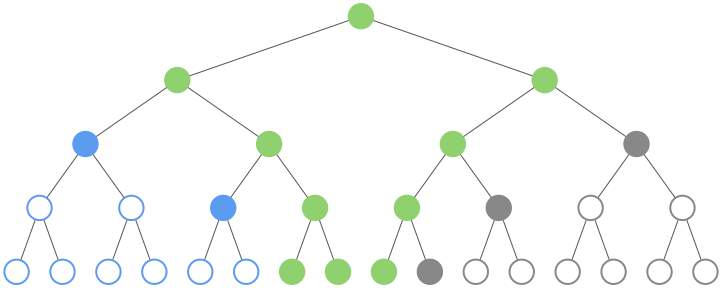

# Table of contents

- [Introduction](#introduction)
  - [Scalability](#scalability)
  - [Productivity](#productivity)
  - [What’s in a machine](#whats-in-a-machine)
    - [Rolling Cartesi Machines and Cartesi
      Rollups](#rolling-cartesi-machines-and-cartesi-rollups)
  - [Documentation](#documentation)
- [The host perspective](#the-host-perspective)
  - [Machine playground](#machine-playground)
  - [Command-line interface](#command-line-interface)
    - [Initialization](#initialization)
    - [Interactive sessions](#interactive-sessions)
    - [Flash drives](#flash-drives)
    - [Persistent flash drives and
      NVRAMs](#persistent-flash-drives-and-nvrams)
    - [Limiting execution](#limiting-execution)
    - [State hashes](#state-hashes)
    - [Persistent Cartesi Machines](#persistent-cartesi-machines)
    - [Running as root](#running-as-root)
    - [Cartesi Machine templates](#cartesi-machine-templates)
    - [State value proofs](#state-value-proofs)
    - [Accessing constants from
      scripts](#accessing-constants-from-scripts)
    - [Remote Cartesi Machines](#remote-cartesi-machines)
    - [Rolling Cartesi Machines](#rolling-cartesi-machines)
    - [Rolling Cartesi Machine
      templates](#rolling-cartesi-machine-templates)
    - [Rolling Cartesi Machines directly from
      storage](#rolling-cartesi-machines-directly-from-storage)
    - [Additional options](#additional-options)
  - [Lua interface](#lua-interface)
    - [Instantiation by configuration](#instantiation-by-configuration)
    - [Default configuration](#default-configuration)
    - [Generating configurations](#generating-configurations)
    - [Additional sample
      configurations](#additional-sample-configurations)
    - [Loading and running machines](#loading-and-running-machines)
    - [Instantiation from persistent
      state](#instantiation-from-persistent-state)
    - [Limiting execution](#limiting-execution-1)
    - [Progress feedback](#progress-feedback)
    - [Cartesi Machine templates](#cartesi-machine-templates-1)
    - [State hashes](#state-hashes-1)
    - [External state access](#external-state-access)
    - [State value proofs](#state-value-proofs-1)
    - [Remote Cartesi Machines](#remote-cartesi-machines-1)
    - [Rolling Cartesi Machines](#rolling-cartesi-machines-1)
    - [Output proofs](#output-proofs)
    - [Rolling Cartesi Machines directly from
      storage](#rolling-cartesi-machines-directly-from-storage-1)
    - [State-transition proofs](#state-transition-proofs)
- [The guest perspective](#the-guest-perspective)
  - [Linux environment](#linux-environment)
    - [Building a custom root
      file-system](#building-a-custom-root-file-system)
    - [Guest “Hello world!”](#guest-hello-world)
    - [Flash drives and NVRAMs](#flash-drives-and-nvrams)
    - [Initialization](#initialization-1)
    - [Communication between guest and
      host](#communication-between-guest-and-host)
  - [System architecture](#system-architecture)
    - [The main processor](#the-main-processor)
    - [The microarchitecture](#the-microarchitecture)
    - [The board](#the-board)
    - [Linux setup](#linux-setup)
- [The blockchain perspective](#the-blockchain-perspective)
  - [Hash-view of state](#hash-view-of-state)
    - [Slicing and splicing](#slicing-and-splicing)
    - [Template instantiation](#template-instantiation)
    - [Result extraction](#result-extraction)
    - [The outputs Merkle tree](#the-outputs-merkle-tree)
    - [Output verification](#output-verification)
  - [Verification game](#verification-game)
    - [Settling a dispute](#settling-a-dispute)
    - [One bisection level](#one-bisection-level)
    - [Verifying the state transition](#verifying-the-state-transition)
    - [Verifying the result](#verifying-the-result)
    - [Running the game](#running-the-game)
  - [Rolling verification game](#rolling-verification-game)
    - [Settling a dispute](#settling-a-dispute-1)
    - [Bisecting over inputs](#bisecting-over-inputs)
    - [Bisecting within an input](#bisecting-within-an-input)
    - [Verifying the disputed
      transition](#verifying-the-disputed-transition)
    - [Verifying an epoch result](#verifying-an-epoch-result)
    - [Running the rolling game](#running-the-rolling-game)

# Introduction

The Cartesi Machine is Cartesi’s solution for verifiable computation. It
was designed to bring mainstream scalability to decentralized
applications and mainstream productivity to their developers.

## Scalability

Applications running exclusively on smart contracts face severe
constraints on the amount of data they can manipulate and on the
complexity of computations they can perform. These limitations manifest
themselves as exorbitant transaction costs and, even if such costs could
somehow be overcome, as extremely long computation times.

In comparison, applications running inside Cartesi Machines can process
practically unlimited amounts of data, and at a pace orders of magnitude
faster. This is possible because Cartesi Machines run off-chain, free of
the overhead imposed by the consensus mechanisms used by blockchains.

In a typical scenario, one of the parties involved in an application
will execute the Cartesi Machine off-chain and report its results to the
blockchain. Different parties do not need to trust each other because
the Cartesi platform includes an automatic dispute mechanism for Cartesi
Machines. All interested parties repeat the computation off-chain and,
if their results do not agree, they enter into a dispute, which the
mechanism guarantees to be always won by an honest party against any
number of dishonest parties.

To enable this dispute mechanism, Cartesi Machines are executed inside a
special emulator that has three unique properties:

- Cartesi Machines are *self contained* — They run in isolation from any
  external influence on the computation;
- Cartesi Machines are *reproducible* — Two parties performing the same
  computation always obtain exactly the same results;
- Cartesi Machines are *transparent* — They expose their entire state
  for external inspection.

From the point of view of the blockchain, the disputes require only a
tiny fraction of the amount of computation performed by the Cartesi
Machine. Dispute resolution thus becomes an ordinary task and dishonest
parties are generally expected to be exposed, which discourages the
posting of incorrect results and further increases the efficiency of the
platform.

Cartesi Machines allow decentralized applications to take advantage of
vastly increased computing capabilities off-chain, while enjoying the
same security guarantees offered by code that runs natively as smart
contracts. This is what Cartesi means by scalability.

## Productivity

Scalability is not the only impediment to widespread blockchain
adoption. Another serious limiting factor is the reduced developer
productivity.

Modern software development involves the combination of dozens of
off-the-shelf software components. Creating these components took the
concerted effort of an active worldwide community over the course of
several decades. They have all been developed and tested using
well-established toolchains (programming languages, compilers, linkers,
profilers, debuggers, etc.), and rely on multiple services provided by
modern operating systems (memory management, multi-tasking, file
systems, networking, etc.).

Smart contracts are developed using ad-hoc toolchains, and run directly
on top of custom virtual machines, without the support of an underlying
operating system. This arrangement deprives developers of the tools of
their trade, severely reduces their expressive power, and consequently
decimates their productivity.

In contrast, Cartesi Machines are based on a proven platform:
[RISC-V](https://riscv.org/). RISC-V was born of research in academia at
UC Berkeley. It is now maintained by its own independent foundation. It
is important to keep in mind that, unlike many of its academic
counterparts, RISC-V is not a toy architecture. It is suitable for
direct native hardware implementation, which is indeed currently
commercialized by a large (and ever-increasing) number of
[vendors](https://en.wikipedia.org/wiki/RISC-V#Implementations). This
means that, in the future, Cartesi will not be limited to emulation or
binary translation off-chain. The RISC-V platform is supported by a
vibrant community of developers. Their efforts have produced an
extensive software infrastructure, most notably ports of the Linux
Operating System and the GNU toolchain.

By moving key parts of their application logic to run inside Cartesi
Machines, but on top of the Linux Operating System, developers are
isolated not only from the limitations and idiosyncrasies of specific
blockchains, but also from irrelevant details of the Cartesi Machine
architecture itself. They regain access to all the tools they have come
to rely on when writing applications.

This is Cartesi’s contribution to empowering application developers to
express their creativity unimpeded, and to boost their productivity.

## What’s in a machine

The key components of a Cartesi Machine are its main processor and a
board. The processor that performs the computations, executing the
traditional fetch-execute loop while maintaining a variety of registers,
implements a generous set of RISC-V extensions. The board defines the
surrounding environment with an assortment of memories (RAM, flash
drives, NVRAMs etc) and a number of devices. Memories and devices are
mapped to the 64-bit physical address space of the Cartesi Machine. The
amount of RAM, as well as the number, length, and position of the flash
drives and NVRAMs in the address space can be chosen according to the
needs of each particular application. The Cartesi Machine emulator is a
program that carefully implements the Cartesi Machine architecture so
that its execution is reproducible in production. During development, a
variety of convenient devices can be added to the Cartesi Machine that
make prototyping more ergonomic. The emulator can be built from the
[`cartesi/machine-emulator`](https://github.com/cartesi/machine-emulator)
repository.

The Cartesi Machine also includes a microarchitecture (uarch) that can
drive the main processor using a much-reduced RISC-V ISA. This is
necessary to enable verifiability in architectures that, due to
computational limitations, cannot emulate a main-processor instruction,
such as blockchains. Running the uarch until it halts, and then
resetting the uarch to its pristine state, is equivalent to executing
one instruction of the main processor. See [the microarchitecture
section](#the-microarchitecture) for details.

The initialization of a Cartesi Machine typically loads the Linux kernel
into RAM, and a Linux root file-system (as a flash drive) from regular
files in the host file-system. The Linux kernel `linux.bin`, is built by
the
[`cartesi/machine-linux-image`](https://github.com/cartesi/machine-linux-image)
repository. After it is done with its own initialization, the Linux
kernel cedes control to the `/usr/sbin/cartesi-init` program in the root
file-system. The root file-system `rootfs.ext2` contains all the data
files and programs that make up the Linux distribution. It is built by
the
[`cartesi/machine-rootfs-image`](https://github.com/cartesi/machine-rootfs-image)
repository. The components of the guest application can reside in the
root file-system itself, or in their own, separate file-systems. The
emulator can be instructed to execute whatever command is necessary to
start the guest application. For a complete description of the Cartesi
Machine architecture and the boot process, see the documentation for
[the guest perspective](#the-guest-perspective).

There are two distinct modes of operation. In the first mode, a Cartesi
Machine is initialized and tasked to run a guest application until the
machine *halts*. Inputs for the guest application can be provided as
additional flash drives with file-systems, or NVRAMs with raw data.
Outputs are only available to the host after the machine halts. Once it
halts, the machine cannot perform any additional computations.

In the second mode of operation, the guest application runs in a loop.
In each iteration, it obtains a request carrying an input, performs any
necessary computations to service the request, and produces a number of
responses. Indeed, this is much like a server in which the guest
application can interact with the outside world. We say that a Cartesi
Machine operating in this mode is a *Rolling Cartesi Machine*.

### Rolling Cartesi Machines and Cartesi Rollups

Rolling Cartesi Machines accept two types of requests: advance-state
requests and inspect-state requests. Advance-state requests can create
persistent changes to the state of the underlying Cartesi Machine. In
contrast, inspect-state requests leave the state unchanged.

Both types of request are serviced by the guest application, which
modifies the state of the Cartesi Machine while doing so. When servicing
an advance-state request, the guest application ultimately either
accepts or rejects it. The resulting modifications are kept only when
the request is accepted, and reverted when it is rejected. State
modifications are always reverted after inspect-state requests are
serviced.

The stringent demands of reproducibility prevent a Cartesi Machine from
communicating *directly* with the outside world. Indeed, if two parties
were to run the same Cartesi Machine and then disagree on the data each
instance independently obtained from a network connection, there would
be no way to settle a dispute between them. Instead, Rolling Cartesi
Machines communicate with the outside world under controlled conditions,
through *Cartesi Rollups*.

In a nutshell, Cartesi Rollups uses the blockchain to maintain a public
record of advance-state requests targeting each Rolling Cartesi Machine.
Both the order and the inputs carried by these requests are recorded and
made available in an indisputable fashion. Since Cartesi Machines are
deterministic, and since the inputs are agreed upon, the state of a
Rolling Cartesi Machine can be advanced in a well-defined way, always
producing the same set of responses, no matter who runs it.

After producing each response to a request, the guest application asks
the machine to *yield* control back to the host. The host extracts the
response and *resumes* the machine. When done with a given input, the
guest application once again asks the machine to yield control back to
the host. At the same time, it notifies the host whether the input was
accepted or rejected. The host then prepares the input for the next
request, and *resumes* either the modified machine or a backup copy, so
the guest application can service the next request in a new iteration of
its loop. Inputs and responses are transferred in special memory ranges
(*CMIO* memory ranges).

Advancing the state of a Rolling Cartesi Machine can produce four types
of response: *vouchers*, *notices*, *reports*, and *exceptions*.
Vouchers allow a Rolling Cartesi Machine to interact back with the
blockchain. A voucher issued by the guest application may, for example,
grant a user the right to withdraw tokens locked into a custodial smart
contract. Notices are used to register noteworthy changes to the state
of the guest application. A notice may be issued, for example,
announcing the demise of a character in a game or some other relevant
state transition. Disputes over the fact that a voucher or notice has
been generated while advancing the state of a Rolling Cartesi Machine
can be settled by Cartesi Rollups. Reports, in contrast, are used to
output any data that is irrelevant to the blockchain. A report may, for
example, provide diagnostic information on the reasons why an input has
been rejected.

*Rejecting an input not only reverts the state, but also cancels all
vouchers and notices emitted while the request was serviced.*

The advance-state requests serviced by a Rolling Cartesi Machine are
grouped into *epochs*. At the end of an epoch, the state of the machine
is finalized, so its state hash becomes known. From the finalized state
one can read the *outputs Merkle root*, a single hash that commits to
every voucher and notice the machine has ever emitted. This hash is the
root of a Merkle tree maintained inside the machine, where each leaf is
the hash of one of the outputs, in the order they are emitted. (The
index of an output is its leaf position.) Given the contents of an
output, and a proof that its hash is the leaf at that index in the tree,
it is therefore possible to verify that the machine has in fact produced
that output. This is how Cartesi Rollups settles disputes over the
vouchers and notices a Rolling Cartesi Machine produces.

Between state advances, it is possible to inspect the state of a Rolling
Cartesi Machine. This works by sending a query for processing inside the
Cartesi Machine. State inspection produces only reports and exceptions.
*All modifications to the state due to servicing queries are reverted
after the responses are collected.*

An exception, which either kind of request may produce, signals an
irrecoverable error encountered by the guest application.

## Documentation

Cartesi Machines can be seen from three different perspectives:

- *The host perspective* — This is the environment right outside the
  Cartesi Machine emulator. It is most relevant to developers setting up
  Cartesi Machines, running them, or manipulating their contents. It
  includes the emulator’s API in all its flavors: C, C++, Lua, JSON-RPC,
  and the command-line interface;
- *The guest perspective* — This is the environment inside the Cartesi
  Machine. It encompasses Cartesi’s particular flavor of the RISC-V
  architecture, as well as the organization of the Linux Operating
  System that runs on top of it. It is most relevant to programmers
  responsible for the application components that run off-chain but must
  be verifiable. The cross-compiling toolchain, and the tools used to
  build the Linux kernel and the Linux root file-systems are also
  important from this perspective, even though they are used in the
  host;
- *The blockchain perspective* — This is the view smart contracts have
  of Cartesi Machines. It consists almost exclusively of the
  manipulation of cryptographic hashes of the state of Cartesi Machines
  and parts thereof. In particular, using only hash operations, the
  blockchain can verify assertions concerning the contents of the state,
  and can obtain the state hash that results from modifications to the
  state. Notably, this includes direct verification by the blockchain of
  RISC-V instructions performed by the uarch, and ZK proofs of batches
  of RISC-V instructions performed by the main processor.

As with every computer, the level of knowledge required to interact with
Cartesi Machines depends on the nature of the application being created.
Simple applications make only modest demands of each kind of developer.
Guest developers code a few scripts invoking pre-installed software
components. Host developers fill out a configuration file specifying the
location of the components needed to build a Cartesi Machine. Blockchain
developers instantiate one of the high-level contracts provided by
Cartesi. At the other extreme are the developers contributing to the
Cartesi ecosystem, who regularly write, build, and deploy custom
software components to run in the guest, or even change the Linux kernel
to support Cartesi-specific devices. Additionally, these developers
programmatically control the creation and execution of Cartesi Machines
in the host, and must also understand and use the hash-based state
manipulation primitives the blockchain needs.

Although Cartesi’s goal is to shield platform users from as much
complexity as possible, there is value in making information available
to the greatest extent possible. To that end, this documentation of
Cartesi Machines aims to provide enough information to cover all three
perspectives, at all depths of understanding.

# The host perspective

Cartesi’s reference off-chain implementation of a Cartesi Machine is
based on software emulation. The emulator is written in C++23 with
well-insulated POSIX dependencies. The
[`cartesi/machine-emulator`](https://github.com/cartesi/machine-emulator)
repository can be used to build and install the Cartesi Machine
emulator. The emulator is implemented by a C++ class that can be
accessed in a variety of different ways.

When linked to a C++ application, the emulator can be controlled
directly via the interface of the `cartesi::machine` class. C
applications can control the emulator in a similar way, by means of a
matching C API defined in the include file `cm.h`. The C API is stable
and complete. It is the basis for the creation of binds in other
programming languages, most notably the Lua programming language. The
emulator can be accessed via a `cartesi` module that exposes a
`cartesi.machine` interface to Lua programs. Additionally, Cartesi
provides a JSON-RPC server that can run a Cartesi Machine instance that
is controlled remotely. The server supports JSON-RPC discovery so client
libraries can be generated automatically. Finally, there is a
command-line utility (written in Lua) that can configure and run Cartesi
Machines for rapid prototyping. The C, C++, Lua APIs as well as the
command-line utility can seamlessly instantiate local emulators or
connect to remote JSON-RPC servers.

The documentation starts from the command-line utility,
`cartesi-machine`. This utility is used for most prototyping tasks. The
documentation then covers the Lua interface of `cartesi.machine`. The C,
C++, and JSON-RPC interfaces closely mirror the Lua interface documented
here, so this document does not cover them separately. The C API is
defined in the `cm.h` header. The JSON-RPC API supports discovery, so
client bindings can be generated from a running server.

## Machine playground

The setup of a new development environment is often a time-consuming
task. This is particularly true in case of cross-development
environments (i.e., when the development happens in a host platform but
software runs in a different target platform). With this in mind, the
Cartesi team provides the `cartesi/machine-emulator-docs` Docker image
for use while reading this documentation. The Docker image enables
immediate experimentation with Cartesi Machines, as well as the
generation of the documentation itself. It comes with a pre-built
emulator and Lua interpreter accessible within the command-line, as well
as a pre-built RAM image and root file-system. It also comes with the
cross-compiler for the RISC-V architecture on which the Cartesi Machine
is based.

To enter the playground, open a terminal, download the Docker image from
Cartesi’s repository, and run it adequately mapping the current user and
group information, as well as making the host’s current directory
available inside the container:

``` bash
docker pull cartesi/machine-emulator-docs:devel
```

``` bash
docker run \
    --hostname playground \
    --name playground \
    --rm \
    -e USER=$(id -u -n) \
    -e GROUP=$(id -g -n) \
    -e UID=$(id -u) \
    -e GID=$(id -g) \
    -v "$(pwd)":/work \
    -w /work \
    -it \
    cartesi/machine-emulator-docs:devel \
    /bin/bash
```

Once inside, you can execute the `cartesi-machine` utility as follows:

``` bash
cartesi-machine --help | head -n 40
```

``` text
Usage:

  /usr/share/lua/5.4/cartesi-machine.lua [options] [command] [arguments]

where options are:
  --help
    display this information.

  --version
    display cartesi machine version information and exit.

  --version-json
    display cartesi machine semantic version and exit.

  --dump-constants
    print the constants of the cartesi Lua module to stdout and exit,
    one <NAME>=<value> shell assignment per line, sorted by name
    (e.g. CARTESI_HTIF_YIELD_MANUAL_REASON_RX_REJECTED=2).
    integer values that do not fit a signed 64-bit integer are printed in
    hexadecimal. string values are printed single-quoted, and constants
    with non-printable contents are omitted.
    intended for shell scripts:
        eval "$(cartesi-machine --dump-constants)"

  --bash-completion
    print a bash completion script for this program to stdout and exit.
    Install with: source <(cartesi-machine --bash-completion)

  --assert-version=<major>.<minor>[.<patch>]
    exit with failure in case the cartesi machine emulator version mismatches

  --remote-spawn
    spawns a remote cartesi machine,
    when --remote-address is specified, it listens on the specified address,
    otherwise it listens on "127.0.0.1:0".

  --remote-address=<ip>:<port>
    use a remote cartesi machine listening to <ip>:<port> instead of
    running a local cartesi machine.

...
```

A final check can also be performed to verify if the contents inside the
container are as expected:

``` bash
sha256sum /usr/share/cartesi-machine/images/linux.bin
```

``` text
5c900060da2db2bfa84cd39cd9cd722988c83c42225f3cac55f2d3157e48f32f  /usr/share/cartesi-machine/images/linux.bin
```

``` bash
sha256sum /usr/share/cartesi-machine/images/rootfs.ext2
```

``` text
25bede19be173430251196bde040c8f797261d8b8d793271fbb666d410336537  /usr/share/cartesi-machine/images/rootfs.ext2
```

Note that, if the hashes of the files you are using do not match the
ones above, then when you attempt to replicate the examples in the
documentation, you will obtain different hashes. Moreover, the cycle
counts and outputs may also differ.

## Command-line interface

In the simplest usage scenario, the `cartesi-machine` command-line
utility can be used to define a Cartesi Machine and run it until it
halts. The command-line utility, however, is very versatile. It was
designed to simplify the most common prototyping tasks.

The simplest invocation takes no arguments

``` bash
cartesi-machine
```

and produces the output

``` text

         .
        / \
      /    \
\---/---\  /----\
 \       X       \
  \----/  \---/---\
       \    / CARTESI
        \ /   MACHINE
         '

Nothing to do.

Halted
Cycles: 46121361
```

The utility instantiates a default Cartesi Machine and runs it until it
halts. The Linux kernel boots, the Cartesi-provided `cartesi-init`
script prints the ASCII-art splash and reports there is nothing to do,
then gracefully halts the machine. This takes many millions of cycles to
complete: time mostly spent initializing the Linux kernel. The utility
regains control from the emulator, and prints the `Halted` message and
the cycle count.

### Initialization

The following command instructs `cartesi-machine` to build a Cartesi
Machine. The machine has 128MiB of RAM, uses `linux.bin` as the RAM
image, and uses `rootfs.ext2` as the root file-system. (`linux.bin` is
generated by
[machine-linux-image](https://github.com/cartesi/machine-linux-image)
and `rootfs.ext2` is generated by
[machine-rootfs-image](https://github.com/cartesi/machine-rootfs-image).
Sample files are available in the `cartesi/machine-emulator-docs` Docker
image, which can be built from the `doc/` directory of the
[machine-emulator](https://github.com/cartesi/machine-emulator)
repository.) Once initialization is complete, the machine executes the
command `ls /bin` and exits.

``` bash
cartesi-machine \
    --quiet \
    --no-init-splash \
    --ram-length=128Mi \
    --ram-image="/usr/share/cartesi-machine/images/linux.bin" \
    --flash-drive="label:root,data_filename:/usr/share/cartesi-machine/images/rootfs.ext2" \
    -- ls /bin
```

The `--quiet` option suppresses the output of `cartesi-machine.lua`
itself, leaving visible only what is produced inside the machine. The
command-line option `--no-init-splash` instructs the utility to skip the
splash, keeping the output focused on the example at hand. The
`--ram-image`, `--ram-length`, and `--flash-drive` command-line options
have the values in the example as default, so these options can be
omitted. To remove these default settings, use the command-line options
`--no-ram-image` and `--no-root-flash-drive`, respectively.

The simplified command-line is

``` bash
cartesi-machine \
    --quiet \
    --no-init-splash \
    -- ls /bin
```

The output is

``` text
'['			   gunzip	      rgrep
 addpart		   gzexe	      rm
 apt			   gzip		      rmdir
 apt-cache		   hardlink	      rollup
 apt-cdrom		   head		      rollup-http-server
 apt-config		   hex		      rollup-init
 apt-get		   hostid	      run-parts
 apt-key		   hostname	      runcon
 apt-mark		   iconv	      savelog
 arch			   id		      script
...
```

It shows the listing of directory `/bin/` inside the root file-system.
The listing was produced by the entrypoint command that follows the `--`
separator in the command line. By a method explained in great detail
later on (see [The guest perspective initialization](#initialization-1))
the entrypoint is picked up by the Cartesi-provided
`/usr/sbin/cartesi-init`, which executes it before gracefully halting
the machine.

> [!NOTE]
>
> In many of the documentation examples, the utilities invoked from the
> command-line executed by a Cartesi Machine are in the default search
> path for executables. (This is set up by the Cartesi-provided
> `/usr/sbin/cartesi-init` script itself.) When in doubt, or when using
> your own executables installed in custom locations, make sure to
> invoke them by using their full paths (e.g., `/bin/ls` or `/bin/sh`
> instead of simply `ls` and `sh`.)

### Interactive sessions

By default, the `cartesi-machine` utility executes the Cartesi Machine
in non-interactive mode. Verifiable computations must always be run in
non-interactive sessions. User interaction with a Cartesi Machine via
the console is, after all, not reproducible. Nevertheless, during
development, it is often convenient to directly interact with the
emulator, as if using a computer console.

The command-line option `-i` (short for `--htif-console-getchar`)
instructs the emulator to monitor the console for input, and to make
this input available to the Linux kernel. Typically, this option will be
used in conjunction with the `--` separator and the command `sh`,
causing the Cartesi-provided `/usr/sbin/cartesi-init` script to drop
into an interactive shell. Interaction with the shell enables the
exploration of the Linux distribution from the inside. Exiting the shell
returns control back to `/usr/sbin/cartesi-init`, which then gracefully
halts the machine.

For example, if an interactive session is started with the following
command

``` bash
cartesi-machine \
    --no-init-splash \
    -i \
    -- sh
```

it drops into the shell. Running the command `ls /bin` causes the
listing of directory `/bin` to appear. Pressing Ctrl+D at the prompt
then causes the shell to exit. The output is

``` text
$ ls /bin
'['			   gunzip	      rgrep
 addpart		   gzexe	      rm
 apt			   gzip		      rmdir
 apt-cache		   hardlink	      rollup
 apt-cdrom		   head		      rollup-http-server
 apt-config		   hex		      rollup-init
 apt-get		   hostid	      run-parts
 apt-key		   hostname	      runcon
 apt-mark		   iconv	      savelog
...
```

> [!NOTE]
>
> When running in interactive mode, not even the final cycle count is
> reproducible. To avoid busy wait for new interactive input, the
> emulator sleeps from one Cartesi Machine timer interrupt to the next,
> skipping Cartesi Machine cycles forward so programs running inside
> stay *roughly* in sync with wall-clock time outside. This dynamic
> balancing act is sure to vary between executions and across different
> computers.

### Flash drives

The command-line option
`--flash-drive=label:<label>,data_filename:<filename>` can be used to
add between 1 and 8 flash drives to the Cartesi Machine. Here, the
string `<label>` is the *label* for the flash drive, and `<filename>`
points to an *image file* with the initial contents of the flash drive.
When the image file contains a valid file-system, the `cartesi-machine`
command-line utility instructs `/usr/sbin/cartesi-init` to mount it at
`/mnt/<label>`.

To enable transparency, Cartesi Machine flash drives are mapped into the
machine’s 64-bit address space. The start and length are set,
respectively, by the `start:<number>` and `length:<number>` parameters
to `--flash-drive`.

When the `length` parameter is omitted, the `cartesi-machine` utility
automatically sets the size of a flash drive to match the size of its
image file. Because RISC-V uses 4KiB pages, image files must have a size
multiple of 4KiB. (The `truncate` utility can be used to pad a file with
zeros so its size is a multiple of 4KiB.)

For convenience, numbers can be specified in decimal or hexadecimal
(e.g., `4096` or `0x1000`) and may include a suffix multiplier (i.e.,
`Ki` to multiply by 2<sup>10</sup>, `Mi` to multiply by 2<sup>20</sup>,
and `Gi` to multiply by 2<sup>30</sup>). They can also use the C
programming language *shift left* notation to multiply by arbitrary
powers of 2 (e.g. `1 << 24` meaning 2<sup>24</sup>).

When the `length` of a drive is specified, the `data_filename` parameter
can be omitted. In that case, the drive starts in a *pristine* state:
i.e., filled with zeros. If, however, both `length` and `data_filename`
are specified, then the `length` must exactly match the size of the
image file referred to by the `data_filename` parameter.

The positioning of memory ranges in the machine’s address space has
implications on certain operations, discussed in detail under [the
blockchain perspective](#hash-view-of-state), that involve the
manipulation of hashes of the Cartesi Machine state. First, memory
ranges cannot overlap with each other. Second, memory ranges must start
at positions that are aligned to their lengths. Finally, the lengths
used to restrict the starts and to detect overlaps are rounded up to the
next power of 2.

When the `start` of a drive is omitted, the emulator automatically
places it following this rule. The first drive is placed past the RAM,
and each remaining drive is placed past the previous one.

The preferred file-system type is `ext2`. This is because `ext2` image
files can be easily created with the `xgenext2fs` command-line utility
(a Cartesi fork of `genext2fs`) and manipulated with `e2ls`, `e2cp`,
`e2rm`, etc. All of these utilities come pre-installed in the
`cartesi/machine-emulator-docs` Docker image (the `e2tools` package also
provides `e2ls`, `e2cp`, and `e2rm` individually for Ubuntu hosts).
Support for `ext4` is also enabled by default in the kernel. (Support
for additional file-systems can be enabled by modifying the
configuration that
[`cartesi/machine-linux-image`](https://github.com/cartesi/machine-linux-image)
uses to produce `linux.bin`.)

For example,

``` bash
mkdir foo
echo "Hello world!" > foo/bar.txt
tar \
    --sort=name \
    --mtime="2022-01-01" \
    --owner=1000 \
    --group=1000 \
    --numeric-owner \
    -cf foo.tar \
    --directory=foo .
xgenext2fs \
    -fzB 4096 \
    -i 4096 \
    -a foo.tar \
    foo.ext2
```

> [!NOTE]
>
> The flags above are the base set used in all `xgenext2fs` examples in
> this documentation. The `-a foo.tar` flag tells `xgenext2fs` to
> populate the image from a `tar` archive rather than from a directory
> tree. The `-f` (faketime) flag zeros the modification times that
> `xgenext2fs` would otherwise read from the inputs. The `-z` flag
> writes a sparse file, leaving unwritten blocks as holes on disk. The
> `-B 4096` flag sets the block size to 4096 bytes. The `-i 4096` flag
> requests one inode per 4096 bytes of data.
>
> The tar detour is what makes the output reproducible. Running
> `xgenext2fs` directly on a directory tree would record modification
> times, user and group IDs, and traverse the directory in an
> unspecified order. The `-f` flag fixes the timestamp problem, but does
> nothing about the rest. The `tar` invocation above pins the file order
> (`--sort=name`), the timestamps (`--mtime`), and the user and group
> IDs (`--owner`, `--group`, `--numeric-owner`). `xgenext2fs` then walks
> the archive in deterministic order and emits a byte-identical
> file-system on every run.

The image can be loaded as a flash drive:

``` bash
cartesi-machine \
    --no-init-splash \
    --flash-drive="label:foo,data_filename:foo.ext2" \
    -- "cat /mnt/foo/bar.txt"
```

Here, a flash drive with label `foo` is initialized with the contents of
an `ext2` file-system in the image file `foo.ext2`. The Cartesi-provided
`/usr/sbin/cartesi-init` mounts this as `/mnt/foo`. The command executed
in the machine simply copies the contents of `/mnt/foo/bar.txt` to the
terminal. The output is

``` text
Hello world!

Halted
Cycles: 62940618
```

### Persistent flash drives and NVRAMs

By default, the emulator does *not* modify the image files associated to
any of its memory ranges (such as the RAM, flash drives, and NVRAMs).
However, since these image files can be very large, the emulator does
not pre-allocate any host memory for them. Instead, it uses the
operating system’s memory mapping capabilities. The operating system
reads to host memory only those pages from the image file that are
actually read by code executing in the guest. (Naturally, when a state
hash is requested, all image files are read from disk in their entirety
and processed. See below.) These image files are mapped to host memory
in a *copy-on-write* fashion. When code running in the guest causes the
emulator to write to a mapped image file, the operating system makes a
copy of the page before modification and replaces the mapping to point
to the fresh copy. The image files are never written to. (The
`--dump-memory-ranges` command-line option can be used to inspect the
modified copies for debugging purposes. See below.)

> [!NOTE]
>
> The entrypoint commands executed by the Cartesi-provided
> `/usr/sbin/cartesi-init` run as the unprivileged user `dapp`. By
> default, every flash drive is mounted with the ownership and
> permissions baked into its image file, which typically means its root
> directory is owned by `root`. As a result, `dapp` can read the drive
> but cannot write to it. To allow writes, pass `user:dapp` to the
> `--flash-drive` command-line option so the emulator changes the owner
> of the drive’s mount point to `dapp` after mounting. The same is true
> of NVRAMs: by default, they are only writeable by `root`.
> Alternatively, the `--user=root` command-line option causes
> `/usr/sbin/cartesi-init` to run commands as `root`, which can write to
> the drive without any ownership changes. For safety, running as `dapp`
> is preferred.

For example, running the machine

``` bash
cartesi-machine \
    --no-init-splash \
    --flash-drive="label:foo,data_filename:foo.ext2,user:dapp" \
    -- "ls /mnt/foo/*.txt && cp /mnt/foo/bar.txt /mnt/foo/baz.txt && ls /mnt/foo/*.txt"
```

produces the output

``` text
/mnt/foo/bar.txt
/mnt/foo/bar.txt  /mnt/foo/baz.txt

Halted
Cycles: 67642816
```

indicating that the file-system was modified, at least from the
perspective of the guest. However, inspecting the `foo.ext2` image file
from outside the emulator shows it is unchanged.

``` bash
e2ls -aln foo.ext2:*.txt
```

``` text
         11  -rw-r--r--  1000  1000       13  1-Jan-1970 00:00 bar.txt
```

This behavior is appropriate when the flash drives will only be used as
inputs. For output flash drives, guest changes to the drives must
reflect on the associated image files. For that purpose, the parameter
`shared` can be passed to command-line option `--flash-drive`, causing
the image files to be mapped to host memory in a *shared* fashion. For
example,

``` bash
cartesi-machine \
    --no-init-splash \
    --flash-drive="label:foo,data_filename:foo.ext2,shared,user:dapp" \
    -- "ls /mnt/foo/*.txt && cp /mnt/foo/bar.txt /mnt/foo/baz.txt && ls /mnt/foo/*.txt"
```

produces exactly the same output as before. However, `e2ls` now shows
the image file `foo.ext2` has indeed been modified.

``` bash
e2ls -aln foo.ext2:*.txt
```

``` text
         11  -rw-r--r--  1000  1000       13  1-Jan-1970 00:00 bar.txt
         12  -rw-r--r--  1001  1001       13  1-Jan-1970 00:00 baz.txt
```

### Limiting execution

The machine’s processor includes a control and status register (CSR),
named `mcycle`, that starts at 0 and is incremented after every
instruction cycle. By default the `cartesi-machine` utility only returns
when the machine halts (or yields manual), as the [introductory
example](#command-line-interface) showed. The maximum cycle can be
specified with the command-line option `--max-mcycle=<number>`.

For example, running

``` bash
cartesi-machine --max-mcycle=41536683
```

produces the output

``` text

         .
        / \
      /    \
\---/---\  /----\
 \       X       \
  \----/  \---/---\
       \    / CARTESI
```

Note the execution was interrupted before the splash screen was even
completed. The ability to limit computation to an arbitrary number of
cycles is fundamental to the verifiability of Cartesi Machines, as is
explained in detail under the [blockchain
perspective](#verification-game).

### State hashes

The `cartesi-machine` utility can also be used to print Cartesi Machine
state hashes. State hashes are Merkle tree root hashes of the entire
64-bit address space of the Cartesi Machine, where the leaves are
aligned 256-bit words. (See [Hash-view of state](#hash-view-of-state)
for an explanation of Merkle trees.) Since Cartesi Machines are
transparent, the contents of this address space encompass the entire
machine state, including all processor CSRs and general-purpose
registers, the contents of RAM, of all flash drives and NVRAMs, and of
all other devices connected to the board, and even the state of the
uarch. State hashes therefore work as cryptographic signatures of the
machine, and implicitly of the computation they are about to execute.

To obtain the state hash right before execution starts, use the
command-line option `--initial-hash`. Conversely, to obtain the state
hash right after execution is done, use the option `--final-hash`. For
example,

``` bash
cartesi-machine \
    --max-mcycle=41536683 \
    --initial-hash \
    --final-hash
```

produces the output

``` text
0: 0x3a93d9cc2e72a352fb3ae0a7cd3ab2120cfa66a293dc2b8294e09bdb134e417b

         .
        / \
      /    \
\---/---\  /----\
 \       X       \
  \----/  \---/---\
       \    / CARTESI
41536683: 0x625a3d25d48306f0ec0d5b444d7bb935b61ca74ec18302954e627ce42ad024a8
```

The initial state hash `3a93d9cc…` is the Merkle tree root hash for the
initial Cartesi Machine state. Since Cartesi Machines are reproducible,
the initial state hash also works as a *promise* on the result of the
entire computation.

In other words, the “final state hash” `625a3d25…` is the “only”
possible outcome for the `--final-hash` at cycle `41536683`, given the
result of the `--initial-hash` operation was `3a93d9cc…`.

> [!NOTE]
>
> The scare quotes around “only” are pedantic. It is true that there are
> a multitude of machine states that produce the same state hash. After
> all, the Keccak-256 state hashes fit in 256-bits, whereas machine
> states can take gigabytes. There are therefore many more possible
> machine states than possible state hashes. By the pigeonhole
> principle, there must be multiple machines with the same hash (i.e.,
> hash collisions). However, given only the state hash, finding a
> Cartesi Machine with that state hash should be virtually impossible.
> Given a Cartesi Machine and its state hash, finding a *second*
> (distinct) Cartesi Machine with the same state hash should also be
> virtually impossible. Even finding two different Cartesi Machines that
> have the same state hash (any hash) should be virtually impossible.
> Cryptographic hash functions, such as Keccak-256, were designed
> *specifically* to have these properties.

Allowing the machine to run until it halts

``` bash
cartesi-machine \
    --initial-hash \
    --final-hash
```

produces instead the output

``` text
0: 0x3a93d9cc2e72a352fb3ae0a7cd3ab2120cfa66a293dc2b8294e09bdb134e417b

         .
        / \
      /    \
\---/---\  /----\
 \       X       \
  \----/  \---/---\
       \    / CARTESI
        \ /   MACHINE
         '

Nothing to do.

Halted
Cycles: 46121361
46121361: 0x37b727e64f5033e4eb16777ad884aa9349367e62b0e63d8af9cae29d5152a698
```

Naturally, the initial state hash is the same as before.

However, the final state hash `37b727e6…` now pertains to cycle
`46121361`, where the machine is halted. This is the “only” possible
state hash for a *halted* machine that started from state hash
`3a93d9cc…`.

### Persistent Cartesi Machines

At any point in their execution, Cartesi Machines can be stored to disk.
A stored machine can later be loaded to continue its execution from
where it left off. To store a machine to a given `<directory>`, use the
command-line option `--store=<directory>`. (In `<directory>`, the `%h`
escape will be replaced by the state hash in hex.) The machine is stored
as it was right before `cartesi-machine` returns to the command line.
For example, to store the machine corresponding to state hash
`625a3d25…`

``` bash
cartesi-machine \
    --max-mcycle=41536683 \
    --store="machine-%8h"
```

This command creates a directory `machine-0x625a3d`, containing a
variety of files that allow the Cartesi Machine emulator to recreate a
machine state. Every image file is copied into the directory, so no
external dependencies remain.

> [!NOTE]
>
> If the machine initialization involved large image files or a
> considerable amount of RAM, this operation may consume significant
> disk space. It will also take the time required by the copying of
> image files into the directory, and by the computation of the state
> hash.

If the directory already exists, the operation will fail. (This prevents
the overwriting of a Cartesi Machine by mistake.) Once created, the
directory can be compressed and transferred to other hosts. To restore
the corresponding Cartesi Machine, use the command-line option
`--load=<directory>`. For example,

``` bash
cartesi-machine \
    --load="machine-0x625a3d" \
    --initial-hash \
    --final-hash
```

produces the output

``` text
Loading machine: please wait
41536683: 0x625a3d25d48306f0ec0d5b444d7bb935b61ca74ec18302954e627ce42ad024a8

        \ /   MACHINE
         '

Nothing to do.

Halted
Cycles: 46121361
46121361: 0x37b727e64f5033e4eb16777ad884aa9349367e62b0e63d8af9cae29d5152a698
```

Note that, other than `--load`, no initialization command-line options
were used. These initializations were used to define the machine before
it was stored: their values are implicitly encoded in the stored state.
The machine continues from where it left off, and reaches the same final
state hash `37b727e6…`, as if it had never been interrupted.

Note also that the initial state hash `625a3d25…` after `--load` matches
the final state hash before `--store`. After all, they are state hashes
concerning the state of the same machine at the same cycle. `--load`
verifies the archive format version recorded in the stored machine, and
the pre-store and post-load state hashes are equal because the same
machine state is restored.

The `cartesi-machine-stored-hash` command-line utility can be used to
extract the state hash from a stored Cartesi Machine. The command

``` bash
cartesi-machine-stored-hash machine-0x625a3d
```

produces the output

``` text
0x625a3d25d48306f0ec0d5b444d7bb935b61ca74ec18302954e627ce42ad024a8
```

A stored machine can also be cloned. The option
`--load=<directory>,clone:<source_directory>` first clones the machine
stored in `<source_directory>` into `<directory>`, then loads the clone.
Cloning is cheap. Read-only backing files are hard-linked, writable ones
use reference links on copy-on-write filesystems, and file sparsity is
preserved. A clone is therefore a natural snapshot. Experiments run on
the clone while the source directory stays untouched.

By default, a loaded machine keeps its state in memory, and the stored
directory is only read. The `sharing:<mode>` key controls how state
modifications reflect on the loaded directory. Mode `none` is the
in-memory default: nothing is changed in disk storage. Mode `config`
operates on-disk only for the memory ranges configured as `shared`. Mode
`all` keeps every backing store up to date with changes made while the
machine runs. When `cartesi-machine` exits, the directory already holds
the machine as it was left, ready to be loaded again, obviating the need
for the store step. When `clone:` is present, the default mode changes
from `none` to `all`, since experimenting on a disposable copy is the
most common reason to clone. Mode `config` requires
`--revert-mode=none`. Mode `all` supports `--revert-mode=stored` and
`--revert-mode=none`.

One caveat remains. Process exit does not guarantee that the
modifications have reached permanent storage. They may still be sitting
in the host page cache, and a badly timed host crash could leave a
partial directory on disk. The `sync` key closes this gap. It flushes
every backing store file, the directory, and its parent to permanent
storage right before `cartesi-machine` exits. Syncing requires a sharing
mode other than `none`, since otherwise there is nothing to sync.

For example, the command

``` bash
cartesi-machine \
    --revert-mode=none \
    --load="cloned-machine,clone:machine-0x625a3d,sharing:all,sync" \
    --final-hash
```

clones the machine stored above into `cloned-machine` and continues its
execution directly on disk, producing

``` text
Loading machine: please wait

Halted
Cycles: 46121361
46121361: 0x37b727e64f5033e4eb16777ad884aa9349367e62b0e63d8af9cae29d5152a698
Syncing machine: please wait
```

No `--store` was given, yet the finished machine is on disk. The command

``` bash
cartesi-machine-stored-hash cloned-machine
cartesi-machine-stored-hash machine-0x625a3d
```

produces the output

``` text
0x37b727e64f5033e4eb16777ad884aa9349367e62b0e63d8af9cae29d5152a698
0x625a3d25d48306f0ec0d5b444d7bb935b61ca74ec18302954e627ce42ad024a8
```

The clone advanced to the final state hash `37b727e6…`, while the source
still holds the machine at the stored state hash `625a3d25…`.

### Running as root

Starting at version 4.0 of `rootfs.ext2`, the Cartesi-provided
`/usr/sbin/cartesi-init` script runs the entrypoint command as
`uid=1001(dapp) gid=1001(dapp) groups=1001(dapp)`. This can be seen by
running:

``` bash
cartesi-machine \
    --quiet \
    --no-init-splash \
    -- id
```

It shows the user and group are indeed `dapp`:

``` text
uid=1001(dapp) gid=1001(dapp) groups=1001(dapp)
```

To instead run your guest application as `root`, pass the `--user=root`
command-line option:

``` bash
cartesi-machine \
    --quiet \
    --no-init-splash \
    --user=root \
    -- id
```

The output now shows the user and group are `root`:

``` text
uid=0(root) gid=0(root) groups=0(root)
```

Running as root is not recommended. To perform setup tasks that require
elevated permissions, use instead the `--append-init` command-line
option:

``` bash
cartesi-machine \
    --quiet \
    --no-init-splash \
    --append-init="echo Before init ends: && id" \
    -- "echo After entrypoint starts: && id"
```

This runs the init part as `root`, but the entrypoint part as `dapp`:

``` text
Before init ends:
uid=0(root) gid=0(root)
After entrypoint starts:
uid=1001(dapp) gid=1001(dapp) groups=1001(dapp)
```

The `--append-init-file=<filename>` command-line option works like
`--append-init`, but appends to init the entire contents of file
`<filename>`.

### Cartesi Machine templates

*Templates* are one of the key uses for Cartesi Machines stored to disk.
Cartesi Machine templates are machines in which the contents of one or
more flash drives or NVRAMs are still unknown. To put it another way,
Cartesi Machine templates behave like functions whose parameters are the
yet-to-be-defined contents of these drives.

As discussed in detail under [the blockchain
perspective](#hash-view-of-state), starting from template hashes, the
hashes of the drives, and a small amount of additional information, it
is possible to obtain the state hash of the *instantiated template*—the
state hash for a Cartesi Machine with drives replaced by their actual
contents. This is how a smart contract can specify a computation to be
performed off-chain over arbitrary input. Starting from the template
hash, and in possession of the drive hashes, it instantiates the
template, generating the initial state hash for the corresponding
Cartesi Machine.

As an example, consider a Cartesi Machine that operates as an
arbitrary-precision arithmetic expression evaluator. The machine will
take the expression in text format from an input NVRAM labeled `input`,
and will copy the output in text format into an output NVRAM labeled
`output` (`shared`, of course, so the output persists after the emulator
is done).

NVRAMs bind directly to a memory-backed UIO device exposed inside the
guest as `/dev/uioN`. Unlike flash drives, they have no file-system
layer and no page cache between the guest and the underlying memory
range, so writes are immediately visible to the emulator and there is no
need to flush a cache before snapshotting. This makes NVRAMs faster than
flash drives for cases where the guest only needs raw access to a region
of bytes.

Because UIO devices do not support ordinary `read()` or `write()`
against the device file, the machine guest utilities include the
`readmmap` and `writemmap` tools to read and write NVRAMs. They resolve
the label, `mmap()` the device, and copy bytes to/from standard input or
standard output. Both also work on flash drives.

The `bc` command-line utility is the perfect tool to evaluate the
arithmetic expressions. The command passed to `cartesi-machine` below
uses `readmmap` to read the contents of the input NVRAM, extracts a
zero-terminated string from it using a tiny Lua script run by the
`lua5.4` interpreter, pipes the result through `bc`, and uses
`writemmap` to copy the result back into the output NVRAM. Here is the
sample playground session

``` bash
truncate -s 4K output.raw
echo "6*2^1024 + 3*2^512" > input.raw
truncate -s 4K input.raw
cartesi-machine \
    --no-init-splash \
    --nvram="label:input,length:1<<12,data_filename:input.raw" \
    --nvram="label:output,length:1<<12,data_filename:output.raw,shared,user:dapp" \
    -- $'readmmap input | lua5.4 -e \'print((string.unpack("z", io.read("a"))))\' | bc | writemmap output'
```

> [!NOTE]
>
> The `$'...'` form here is bash’s ANSI-C-quoted string, used throughout
> the manual for entrypoint commands. It passes the contents to
> `cartesi-machine` as a single argument, leaves host-side variable
> references like `$i` unexpanded (so they reach the guest shell
> verbatim), and accepts `\'` as an escape for a single quote inside the
> string. This last property matters when the entrypoint wraps a
> single-quoted sub-command, such as a `lua5.4 -e '...'` invocation.

Using the `truncate` command-line utility, the session creates a 4KiB
file `output.raw` containing only zeros to serve as the output drive
image. Then, it creates the `input.raw` file for use as the input drive
image containing the expression `6*2^1024 + 3*2^512\n` to be evaluated.
This file is then padded with zeros to 4KiB in size by the `truncate`
utility. The session then invokes the `cartesi-machine` command-line
utility to evaluate the expression. The output of the `cartesi-machine`
command is

``` text

Halted
Cycles: 69015695
```

Once the emulator returns, a tiny Lua script, run by the `lua5.4` Lua
interpreter, prints the contents of the output drive

``` bash
lua5.4 -e 'print((string.unpack("z", io.read("a"))))' < output.raw
```

which reads

``` text
10786158809173895446375831144734148401707861873653839436405804869463\
96054833005778796250863934445216126720683279228360145952738612886499\
73495708458383684478649003115037698421037988831222501494715481595948\
96901677837132352593468675094844090688678579236903861342030923488978\
36036892526733668721977278692363075584
```

This is indeed the result of 6×2<sup>1024</sup>+3×2<sup>512</sup>.

To create the template, simply omit the input and output image
filenames. This will cause the Cartesi Machine to assume both drives are
filled with zeros. Then, limit the computation with `--max-mcycle=0`, to
prevent the Cartesi Machine from running. Finally, use the
`--store="calculator-template"` command-line option to store the Cartesi
Machine template. The `--final-hash` command-line option prints the
resulting template hash.

``` bash
cartesi-machine \
    --no-init-splash \
    --nvram="label:input,length:1<<12" \
    --nvram="label:output,length:1<<12,user:dapp" \
    --max-mcycle=0 \
    --final-hash \
    --store="calculator-template" \
    -- $'readmmap input | lua5.4 -e \'print((string.unpack("z", io.read("a"))))\' | bc | writemmap output'
```

The result is as follows

``` text
0: 0x46d759a867687c1bbbdf76cf18e4da29a611bde77d145549572ec85bfceaf2f7
Storing machine: please wait
```

The directory `calculator-template/` now contains the Cartesi Machine
template. And indeed, running

``` bash
cartesi-machine-stored-hash calculator-template/
```

we can see from the output

``` text
0x46d759a867687c1bbbdf76cf18e4da29a611bde77d145549572ec85bfceaf2f7
```

that the stored template hash is `46d759a8…`.

Templates are typically used by programs that control the emulator with
the C++, Lua, or JSON-RPC interfaces.

The `--replace-memory-range=label:<label>,data_filename:<filename>`
command-line option of the `cartesi-machine` utility can be used to
replace an existing memory range right after a machine is loaded. The
memory range can be identified by `label`, by `start` and `length`, or
both.

This functionality can be used to test templates. For example, the
following command loads the calculator template, and replaces its
pristine input NVRAM with one containing the contents of the `input.raw`
file. Then, it replaces the pristine output NVRAM so the machine saves
results in the file `output.raw`.

``` bash
rm -f output.raw
truncate -s 4K output.raw
echo "6*2^1024 + 3*2^512" > input.raw
truncate -s 4K input.raw
cartesi-machine \
    --no-init-splash \
    --load="calculator-template" \
    --replace-memory-range="label:input,data_filename:input.raw" \
    --replace-memory-range="label:output,data_filename:output.raw,shared"
lua5.4 -e 'print((string.unpack("z", io.read("a"))))' < output.raw
```

The result of running the command is, as expected,

``` text
10786158809173895446375831144734148401707861873653839436405804869463\
96054833005778796250863934445216126720683279228360145952738612886499\
73495708458383684478649003115037698421037988831222501494715481595948\
96901677837132352593468675094844090688678579236903861342030923488978\
36036892526733668721977278692363075584
```

### State value proofs

*State value proofs* are proofs that a given node in the Merkle tree of
the Cartesi Machine state has a given associated hash. Each Merkle tree
node covers a contiguous range of the machine’s 64-bit address space.
The size of a range is always a power of 2 (i.e., the `<log2_size>`
power of 2). Since the leaves have size `32` bytes, the valid values for
`<log2_size>` are `5`…`64`. The range corresponding to each node starts
at an `<address>` that is a multiple of its size.

The `cartesi-machine` command-line utility can generate proofs
concerning the contents of the machine state. To generate a proof
concerning the state as it is before the machine starts running, use the
`--initial-proof=address:<number>,log2_size:<number>[,filename:<filename>]`
or `--initial-proof=label:<label>[,filename:<filename>]`. The label form
of the option searches for a flash drive or NVRAM with that label, from
which it automatically obtains the corresponding `address` and
`log2_size`. For proofs concerning the state after the emulator is done,
use `--final-proof` instead. The proofs are output as Lua tables that
can be loaded with the `require` function. To output JSON objects
instead, add the `format:json` sub-key, as in
`--initial-proof=label:<label>,filename:<filename>,format:json`. When
`format:` is omitted, the format is inferred from the filename extension
(`.json` or `.lua`), defaulting to Lua. In either case, the filename
field is optional. When provided, the proof will be written to the
corresponding file. Otherwise, the contents will be displayed on screen.

For example, to generate a proof that the Cartesi Machine template above
indeed contains a pristine input drive, use the command line

``` bash
cartesi-machine \
    --no-init-splash \
    --load="calculator-template" \
    --max-mcycle=0 \
    --initial-hash \
    --initial-proof="label:input,filename:pristine-input-proof.lua"
```

The output of the command is

``` text
Loading machine: please wait
0: 0x46d759a867687c1bbbdf76cf18e4da29a611bde77d145549572ec85bfceaf2f7
```

In addition, the `pristine-input-proof.lua` file now contains a Lua
table with the requested proof. The value of field `root_hash` is the
expected initial state hash `46d759a8…` seen in the output of the
`cartesi-machine` command. The `target_address` value `0xa0000000` is
the start of the input NVRAM. The `log2_target_size` value `12` refers
to the size of the 4KiB input NVRAM. The `target_hash` value `292c23a9…`
in the proof gives the hash of the input NVRAM.

The hash of the input NVRAM can be also computed externally with the
`cartesi-hash-tree-hash` command-line utility. The utility can produce
the hash of any file with a power-of-2 size. The
`--log2-root-size=<log2_size>` option specifies the size. If an input
file is smaller than the specified size, the utility assumes the missing
data is composed entirely of bytes 0. The utility deals efficiently with
zero paddings of any size because pristine hashes for all power-of-2
sizes can be precomputed. For example, to quickly generate the hash for
a pristine input with 4KiB size, run

``` bash
head -c 0 | cartesi-hash-tree-hash --log2-root-size=12
```

to obtain

``` text
292c23a9aa1d8bea7e2435e555a4a60e379a5a35f3f452bae60121073fb6eead
```

As expected, the hash values match.

The `sibling_hashes` array contains the hashes of the siblings to all
nodes in the path from the root all the way down to the target node
(excluding the root, which has no sibling). In a process explained in
the [blockchain perspective](#hash-view-of-state), using the `address`
field, the `target_hash` hash, and the `sibling_hashes` array, it is
possible to go up the tree computing the hashes along the path, until
the root hash is produced. If the root hash obtained by this process
matches the expected root hash, the proof is valid. Otherwise, something
is amiss.

To compute the hash for the desired `input.raw` file with contents
`6*2^1024 + 3*2^512\n`, padded with zeros, run

``` bash
echo "6*2^1024 + 3*2^512" | cartesi-hash-tree-hash --log2-root-size=12
```

to obtain

``` text
d5ea32c164644e70ea918e4d868458bcbf038c764f551c5b0baa2dd8ac26fbea
```

The initial state hash for the instantiated template can be seen with
the `cartesi-machine` command-line

``` bash
echo "6*2^1024 + 3*2^512" > input.raw
truncate -s 4K input.raw
cartesi-machine \
    --no-init-splash \
    --load="calculator-template" \
    --replace-memory-range="label:input,data_filename:input.raw" \
    --initial-hash \
    --initial-proof="label:input,filename:input-proof.lua" \
    --max-mcycle=0
```

This produces the output

``` text
Loading machine: please wait
0: 0x91cc81445bf6a5b1de8d2646d8d1dee557aebf9237151f6dc5de79294cfefae3
```

In addition, the `input-proof.lua` file now contains a Lua table with
the requested proof, which is produced after the input NVRAM has been
replaced. The `target_hash` value `d5ea32c1…` reflects the hash computed
for the input. The `root_hash` value `91cc8144…` differs from
`46d759a8…` obtained for the template, as expected, and matches the
final hash printed by the utility. Moreover, the `sibling_hashes`
entries in the template Cartesi Machine and in the instantiated Cartesi
Machine remain the same, reflecting the fact that there were no other
changes in the machine’s initial state.

Using a process similar to the proof verification described above, it is
possible to go up the Merkle tree for the template using the
`sibling_hashes` array in the proof, but starting from the hash
`d5ea32c1…` of the desired `input.raw` image rather than hash
`292c23a9…` of the template’s pristine NVRAM. The result would be the
same root hash as that of the instantiated template.

Another useful proof is the one for the *output* drive, once the machine
is halted. To obtain this proof, run

``` bash
truncate -s 4K output.raw
echo "6*2^1024 + 3*2^512" > input.raw
truncate -s 4K input.raw
cartesi-machine \
    --no-init-splash \
    --load="calculator-template" \
    --replace-memory-range="label:input,data_filename:input.raw" \
    --replace-memory-range="label:output,data_filename:output.raw,shared" \
    --final-hash \
    --final-proof="label:output,filename:output-proof.lua"
```

This produces the output

``` text
Loading machine: please wait

Halted
Cycles: 69015695
69015695: 0x87c38bf4035a3c6cd3965319375c49ae1eba86b9776eed608aa2bfc1fdca1644
```

The `root_hash` field in the proof `87c38bf4…` matches the final state
hash output by the `cartesi-machine` command-line utility. The
`target_hash` field `1beb375b…` is the hash of the `output.raw` NVRAM.
To compute it independently, use the `cartesi-hash-tree-hash`
command-line utility

``` bash
cartesi-hash-tree-hash --log2-root-size=12 < output.raw
```

``` text
1beb375bfd349ab9612a7a969f05c4f104d85471e5ec5754d96ceb5b9083ce1e
```

The `cartesi-machine` command-line utility accepts an arbitrary number
of `--initial-proof` and `--final-proof` parameters. They are computed
one-by-one, and either printed or stored in the specified files, as
requested.

To read more about proofs, refer to [the blockchain
perspective](#hash-view-of-state).

### Accessing constants from scripts

Shell scripts that drive `cartesi-machine` often need values that are
defined by the emulator, such as address-range boundaries, break
reasons, or yield reason codes. The `--dump-constants` option prints
every constant of the `cartesi` Lua module as a shell assignment and
exits

``` bash
cartesi-machine --dump-constants
```

to produce

``` text
CARTESI_AR_CLINT_LENGTH=786432
CARTESI_AR_CLINT_START=33554432
CARTESI_AR_CMIO_RX_BUFFER_LOG2_SIZE=21
CARTESI_AR_CMIO_RX_BUFFER_START=1610612736
CARTESI_AR_CMIO_TX_BUFFER_LOG2_SIZE=21
...
CARTESI_VERSION_LABEL=''
CARTESI_VERSION_MAJOR=0
CARTESI_VERSION_MINOR=21
CARTESI_VERSION_NUM=21000
CARTESI_VERSION_PATCH=0
```

Integers that do not fit a signed 64-bit value are printed in
hexadecimal, which shell arithmetic accepts, and strings are quoted. A
script imports all of them at once with
`eval "$(cartesi-machine --dump-constants)"`.

### Remote Cartesi Machines

The `cartesi-machine` command-line utility, as used until now, has
always instantiated its own local Cartesi Machine. However, it can also
be used to control a remote Cartesi Machine. Remote Cartesi Machines are
managed by the `cartesi-jsonrpc-machine` server. The server exposes a
JSON-RPC interface through which the `cartesi-machine` command-line
utility (or any other software) can control the machine remotely.

To avoid confusion, it is best to run the server and client in separate
shells in the playground container. Leaving the existing shell for the
client, open a separate shell for the server (For example, by running
`docker exec -it playground /bin/bash`), then run

``` bash
cartesi-jsonrpc-machine \
    --server-address=127.0.0.1:8080
```

The `--server-address=<address>` command-line option specifies the
address and port the server will listen to.

> [!NOTE]
>
> In this case, since we selected `127.0.0.1:8080`, the client must run
> in the same container in order to communicate with the server. To be
> accessible from outside the container, the `--server-address` option
> would have to refer to an address and port that were *exposed* by the
> container.

To instruct the `cartesi-machine` command-line utility to connect with
the server, add the command-line option `--remote-address=<address>` to
specify the remote server to connect to. The option `--remote-shutdown`
causes the server to be shut down by the client when the client exits.
(Otherwise, the server will remain available for the next client.) The
option `--remote-health-check` causes the client to connect to the
server, confirm it is responsive, and exit without instantiating a
machine. All other options work as before. Keep in mind that any image
files referred to by an option passed to the command-line utility
`cartesi-machine` must be accessible to the `cartesi-jsonrpc-machine`
server (and not necessarily to the client). Additionally, terminal
output for the Cartesi Machine instantiated by the server will appear in
the remote shell where the server was run (not the client’s shell).
Terminal input, when enabled, must also happen via the remote shell.

With this in mind, running the command in the client shell

``` bash
while ! cartesi-machine \
    --remote-address=127.0.0.1:8080 \
    --remote-health-check 2>/dev/null; do sleep 1; done
cartesi-machine \
    --remote-address=127.0.0.1:8080 \
    --remote-shutdown
```

produces the following output on the client shell

``` text
Connected to JSONRPC remote cartesi machine at '127.0.0.1:8080'

Halted
Cycles: 46121361
Shutdown JSONRPC remote cartesi machine at '127.0.0.1:8080'
```

and the following output on the server shell

``` text

         .
        / \
      /    \
\---/---\  /----\
 \       X       \
  \----/  \---/---\
       \    / CARTESI
        \ /   MACHINE
         '

Nothing to do.
```

The client first connects to the remote address and prints the
connection status. It then asks the server to instantiate a machine (by
sending the configuration over) and run it. The machine that runs in the
server prints out the splash screen, boots Linux, and cedes control to
the Cartesi-provided `/usr/sbin/cartesi-init` script. The
`/usr/sbin/cartesi-init` script figures out there is nothing to do and
halts the machine. The client detects the machine is halted and shuts
down the server, as requested, printing the final message.

When it is desirable to leave the server running and preserve the
instantiated machine, omit the `--remote-shutdown` command-line option
and add the `--no-remote-destroy`. For example, assuming the remote
server has just been run:

``` bash
cartesi-jsonrpc-machine \
    --server-address=127.0.0.1:8081
```

use the `cartesi-machine` command-line utility to instantiate and run a
Cartesi Machine for 2^20 cycles:

``` bash
while ! cartesi-machine \
    --remote-address=127.0.0.1:8081 \
    --remote-health-check 2>/dev/null; do sleep 1; done
cartesi-machine \
    --remote-address=127.0.0.1:8081 \
    --no-remote-destroy \
    --max-mcycle=1Mi \
    -- echo "Still here!"
```

The client shell shows:

``` text
Connected to JSONRPC remote cartesi machine at '127.0.0.1:8081'
Left alive JSONRPC remote cartesi machine at '127.0.0.1:8081'
```

To continue execution of the same Cartesi Machine until it halts, rather
than instantiating a new one, use the `cartesi-machine` command-line
utility with the option `--no-remote-create`:

``` bash
cartesi-machine \
    --remote-address=127.0.0.1:8081 \
    --remote-shutdown \
    --no-remote-create
```

The client shell now shows:

``` text
Connected to JSONRPC remote cartesi machine at '127.0.0.1:8081'

Halted
Cycles: 56197611
Shutdown JSONRPC remote cartesi machine at '127.0.0.1:8081'
```

The server shell shows the execution of both sessions:

``` text

         .
        / \
      /    \
\---/---\  /----\
 \       X       \
  \----/  \---/---\
       \    / CARTESI
        \ /   MACHINE
         '

Still here!
```

Remote Cartesi Machines have one ability that local Cartesi Machines
lack: they can be *forked*, producing a copy that runs forward
independently in a child server while the original is preserved in the
parent. Inspect-state requests and rejected advance-state requests
require that changes to the state of the Rolling Cartesi Machine be
reverted. One way to implement this is for the host to run the inspect
or advance against a fork, then discard it.

### Rolling Cartesi Machines

Applications involving Rolling Cartesi Machines are not designed to
interact with the `cartesi-machine` command-line utility. Instead, they
rely on a variety of software components that allow a front-end to post
to the blockchain requests to advance the state of the server. The
Cartesi Node polls the blockchain for advance-state requests posted by
others so a local copy of the server can be kept in sync. It also allows
a front-end to inspect the state of the server.

Nevertheless, in debugging or prototyping tasks, the `cartesi-machine`
command-line utility can simulate the external environment that a guest
application (running inside a Rolling Cartesi Machine) would encounter
in production. To use this functionality, the developer creates a
sequence of advance-state requests as numbered files, or a single
inspect-state request as a file, and instructs the `cartesi-machine`
command-line utility to feed them to the guest application. As each
request is processed, the utility stores the responses as separate
files.

An advance-state request is a single ABI-encoded
`EvmAdvance(uint256 chainId, address appContract, address msgSender, uint256 blockNumber, uint256 blockTimestamp, uint256 prevRandao, uint256 index, bytes payload)`
calldata blob carrying the fields important for the operation of Cartesi
Rollups. Recall that, as responses, the guest application can issue
*vouchers*, *notices*, *reports*, and *exceptions*. In contrast, an
inspect-state request carries only a *query* and, as response, produces
only reports and exceptions. The query in an inspect-state request
consists of an application-specific payload.

Guest applications running inside Rolling Cartesi Machines do not access
the network or the file-system directly. They communicate with the host
through a Cartesi-specific mechanism, detailed under [Communication
between guest and host](#communication-between-guest-and-host) in the
guest perspective.

In a nutshell, the process is as follows. To obtain the next request,
the guest application *yields* control back to the host (in our case,
the `cartesi-machine` command-line utility). The host writes the next
request where the guest can read it and resumes the machine, so the
guest application can process it. When the guest application emits an
output (a voucher, notice, report, or exception), it again yields
control to the host so it can collect the output (in our case, saving it
to a file or printing it to the terminal) before resuming the machine.

To help debugging applications, developers can obtain from Cartesi
Rollups, as files, the inputs associated to each advance-state request,
so the sequence can be replayed locally in the command line. When
prototyping, developers can create their own files simulating requests
that test the behavior of their guest application under customized
conditions.

#### Encoding requests

The `cartesi-rollup-data.lua` command-line utility, available in the
`cartesi/machine-emulator-docs` Docker image, can encode advance-state
requests and inspect-state queries to files, and decode vouchers,
notices, reports, exceptions, and delegate-call vouchers from files. Its
`--utf8-payload` option represents payloads as JSON UTF-8 strings, with
JSON escaping for quotes, backslashes, and control characters. Non-ASCII
characters can appear directly or as JSON `\u` escapes; both decode to
their UTF-8 byte representation. Use the default 0x-prefixed hex or
`--base64-payload` instead when payloads contain arbitrary binary data
rather than text. The calculator we will run treats the payload of each
advance-state request as an arbitrary-precision arithmetic expression
and emits the result as a notice. The following commands encode six such
requests as `input-0.bin` through `input-5.bin`, sharing their common
structure through a small `encode_input` shell function, and one
inspect-state query as `query.bin`:

``` bash
encode_input() {
  cartesi-rollup-data.lua --utf8-payload encode advance <<EOF
{
  "chain_id": 0,
  "app_contract": "0x0000000000000000000000000000000000000000",
  "msg_sender": "$(printf '0x%040d' "$1")",
  "block_number": 0,
  "block_timestamp": 0,
  "prev_randao": "0x0000000000000000000000000000000000000000000000000000000000000000",
  "index": $1,
  "payload": "$2\n"
}
EOF
}
encode_input 0 '6*2^1024 + 3*2^512' > input-0.bin
encode_input 1 'invalid input' > input-1.bin
encode_input 2 '2^2048' > input-2.bin
encode_input 3 '(2^256 - 1) * (2^256 - 1)' > input-3.bin
encode_input 4 'scale=80; sqrt(2)' > input-4.bin
encode_input 5 'scale=100; 355/113' > input-5.bin
cartesi-rollup-data.lua --utf8-payload encode inspect > query.bin <<EOF
{
  "payload": "scale=70; (1+sqrt(5))/2\n"
}
EOF
```

Listing the files created with `ls *.bin`, we see

``` text
input-0.bin
input-1.bin
input-2.bin
input-3.bin
input-4.bin
input-5.bin
query.bin
```

The six numbered files are advance-state requests, and `query.bin` is an
inspect-state query.

#### A simple calculator guest application

We will run an arbitrary-precision arithmetic expression evaluator that
outputs, as notices, the result of the computation it receives as the
payload of each advance-state request. We will rely on the `bc`
command-line utility to perform the computations. To interact with the
`/dev/cmio` Linux device (i.e., to obtain the advance-state request
inputs and to generate the notices), we will use the `/usr/bin/rollup`
command-line utility.

The `rollup` command-line utility supports the commands `accept`,
`reject`, `voucher`, `notice`, `report`, and `exception`. It uses JSON
objects as inputs and outputs. The `accept` and `reject` commands accept
or reject the previous request and output the next request. For
advance-state requests, the output is in the format

``` js
{
  "request_type": "advance_state",
  "data": {
    "chain_id": <number>,
    "app_contract": <address>,
    "msg_sender": <address>,
    "block_number": <number>,
    "block_timestamp": <number>,
    "prev_randao": <hex-uint256>,
    "index": <number>,
    "payload": <hex-data>
  }
}
```

Appropriately, the `notice` command generates a notice. The input format
is as follows

``` js
{
  "payload": <hex-data>
}
```

and the output gives the index of the just-output notice as follows

``` js
{
  "index": <number>
}
```

The `report` command takes the same input format as `notice`. However,
since reports are not verifiable, there is no associated index to print
out.

Shell scripts become surprisingly powerful with the help of the `rollup`
and `jq` command-line utilities. A `bc`-based arbitrary precision
application, for example, might look like this:

``` bash
#!/bin/bash
set -o pipefail

declare -A emit=([advance_state]=notice [inspect_state]=report)
reqfile=$(mktemp /tmp/calc.XXXXXX)
status="accept"
while :
do
  rollup --utf8-payload "$status" > "$reqfile"
  request_type=$(jq -j .request_type < "$reqfile")
  status="reject"
  jq -jr '.data.payload' < "$reqfile" | \
      bc | \
        grep . | \
          tr -d '\\\n' | \
            jq -Rs '{ payload: . }' | \
              rollup --utf8-payload "${emit[$request_type]}" > /dev/null && \
                  status="accept"
done
rm "$reqfile"
```

The loop in the `calc.sh` script calls `rollup accept` or
`rollup reject` (shortcuts for `rollup finish`) to accept or reject the
previous request and obtain the next one. It uses `jq` to read the
`request_type` field, which selects the output verb: an advance-state
request emits the result as a notice, and an inspect-state request emits
it as a report. Both kinds of request carry the expression at
`.data.payload`, which `jq` extracts before passing it to `bc`. The `bc`
utility outputs the result split into lines terminated by `\`.
Unfortunately, `bc` does not exit with an error when it detects one.
Instead, it prints a message to the error stream and exits successfully.
The `grep .` exits with an error in that case, because the output stream
of `bc` will be empty. Otherwise, `grep .` simply passes the output
through unchanged. In that case, the `tr` utility joins the lines back
together. The joined result is read by `jq`, which assembles the proper
JSON object with a `"payload"` field that is passed to `rollup notice`
or `rollup report`, the verb chosen by the request type.

To run `calc.sh`, first create a file-system with the program:

``` bash
mkdir calc
cp calc.sh calc
chmod +x calc/calc.sh
tar \
    --sort=name \
    --mtime="2022-01-01" \
    --owner=1000 \
    --group=1000 \
    --numeric-owner \
    -cf calc.tar \
    --directory=calc .
xgenext2fs \
    -fzB 4096 \
    -i 4096 \
    -a calc.tar \
    calc.ext2
```

Running a Rolling Cartesi Machine in the command line requires using the
`cartesi-jsonrpc-machine` server in combination with the
`cartesi-machine` client. The server provides the fork functionality the
client uses to roll the machine state back when an input to an
advance-state request is rejected, or after an inspect-state request.
With the encoded inputs and `calc.ext2` in the working directory, run
the remote server with the command

``` bash
cartesi-jsonrpc-machine \
    --server-address=127.0.0.1:8082
```

We will run the inputs in two separate epochs against this server, kept
alive between runs. From a different shell into the same container, run
the client to process the first epoch

``` bash
while ! cartesi-machine \
    --remote-address=127.0.0.1:8082 \
    --remote-health-check 2>/dev/null; do sleep 1; done
cartesi-machine \
    --no-init-splash \
    --remote-address=127.0.0.1:8082 \
    --no-remote-destroy \
    --flash-drive=label:calc,data_filename:calc.ext2,user:dapp \
    --cmio-advance-state=input_index_begin:0,input_index_end:3,print_input_state_hashes \
    --final-hash=epoch-0-state-hash.bin \
    -- /mnt/calc/calc.sh
```

This run instantiates the machine from the `calc.ext2` flash drive and
advances inputs 0 to 2. Passing `--no-remote-destroy` and omitting
`--remote-shutdown` leaves both the server and the machine it holds
alive for the next epoch.

The client shell shows

``` text
Connected to JSONRPC remote cartesi machine at '127.0.0.1:8082'

Manual yield rx-accepted (1) (0x000020 data)
Cycles: 71346427

Before input 0
71346427: 0xf4aa4e6eef120137147529999c537a4d5ef609454f87cb4d6eabaf7738084528
71346427: 0x3d1f288f482c10b7e1eabc4c353cd30ceda1592b6c4f02a9ec9f7e5e680dc50e

Automatic yield tx-output (2) (0x000184 data)
Cycles: 114676283

Manual yield rx-accepted (1) (0x000020 data)
Cycles: 122043816
Storing output-0-input-0.bin
Storing input-0-outputs-merkle-root.bin
Storing input-0-outputs-merkle-root-proof.lua

Before input 1
122043816: 0x876e4d7ba87ceeee608465bede3e2f64794f42f9482adbaa6503eacbad25f02e
122043816: 0xdb920e459dedd0e1b9b2dbfc3e6422da15e4bdc1ba5ccba4ec7d8a4743607189

Automatic yield tx-output (2) (0x000044 data)
Cycles: 162634510

Manual yield rx-rejected (2) (0x000000 data)
Cycles: 167687664
Storing rejected-output-1-input-1.bin

Before input 2
122043816: 0x876e4d7ba87ceeee608465bede3e2f64794f42f9482adbaa6503eacbad25f02e
122043816: 0x5f85ca82f5cbd7273a6ab8f779ee268f2b1def466498332923d1d796557c3497

Automatic yield tx-output (2) (0x0002c4 data)
Cycles: 164679073

Manual yield rx-accepted (1) (0x000020 data)
Cycles: 171271795
Storing output-1-input-2.bin
Storing input-2-outputs-merkle-root.bin
Storing input-2-outputs-merkle-root-proof.lua
Storing output-0-input-0-proof.lua
Storing output-1-input-2-proof.lua
Left alive JSONRPC remote cartesi machine at '127.0.0.1:8082'
```

The client starts by printing information about the remote server it
connected to. It then runs the machine in a loop, occasionally
transferring information in and out. The first
`manual yield rx-accepted`, at cycle `71346427`, is the point at which
the calculator attempted to obtain its first request.

Upon receiving control back, the client prints input index 0 and the
state hash `f4aa4e6e…`. It loads `input-0.bin` as the next request,
prints the modified state hash `3d1f288f…`, and resumes the machine. The
calculator evaluates `6*2^1024 + 3*2^512` and emits the result as a
notice. That emission is an `automatic yield tx-output` at cycle
`114676283`, which returns control to the client. The client collects
the emitted output and stores it as `output-0-input-0.bin`. The
`manual yield rx-accepted` at cycle `122043816` signals that input index
0 was accepted. At this point the client also stores the outputs Merkle
root the guest reported, as `input-0-outputs-merkle-root.bin`, and
double-checks it against its own local computation of the same hash.
This hash commits to every output the machine has emitted so far.

The client then loads input index 1 and resumes the machine. The payload
`invalid input` is not an expression that `bc` understands, so the
calculator rejects the request. An empty notice is still emitted just
before the rejection. Shell pipelines run concurrently, so
`rollup notice` has already run by the time `bc`’s failure is detected.
Rejection discards all outputs, such as this notice. For debugging
purposes, the client saves the notice contents as
`rejected-output-1-input-1.bin`. The resulting
`manual yield rx-rejected` at cycle `167687664` rolls the machine state
back to what it was before the input was processed. The state hash
before input 2, `876e4d7b…`, is identical to the hash after input 0 was
accepted, which confirms the rejected input left no trace.

Input index 2, with payload `2^2048`, is accepted like the first, so the
client stores `output-1-input-2.bin` and
`input-2-outputs-merkle-root.bin`. On each accept the client also writes
the proof that the outputs Merkle root occupied the machine’s CMIO tx
buffer, as `input-0-outputs-merkle-root-proof.lua` and
`input-2-outputs-merkle-root-proof.lua`. The two output proofs for this
epoch, `output-0-input-0-proof.lua` and `output-1-input-2-proof.lua`,
are written at the end, once all of the epoch’s outputs are known. Each
proves that one of the epoch’s outputs belongs to the tree the final
outputs Merkle root commits to. The `--final-hash` option saves the
machine state hash at the end of the epoch, as `epoch-0-state-hash.bin`,
the state a dispute over this epoch would settle on.

Now run the client to process the second epoch in the same server

``` bash
cartesi-machine \
    --no-init-splash \
    --remote-address=127.0.0.1:8082 \
    --no-remote-create \
    --remote-shutdown \
    --cmio-advance-state=input_index_begin:3,input_index_end:6,last_output_proof:output-1-input-2-proof.lua,print_input_state_hashes \
    --cmio-inspect-state=query:query.bin,print_query_state_hashes
```

The command-line option `--no-remote-create` reuses the machine where
the first epoch left off. The outputs Merkle tree inside the machine
keeps growing across the epoch boundary on its own. The
`last_output_proof:output-1-input-2-proof.lua` option is there for the
`cartesi-machine` command-line-utility alone, which uses the first
epoch’s last output proof to rebuild its own copy of the outputs Merkle
tree as it stood at the end of that epoch. With this copy, the outputs
Merkle root `cartesi-machine` computes for each accepted input matches
the one produced inside the emulator, which is what the default
`check_outputs_merkle_root` verifies. The copy also lets
`cartesi-machine` emit correct proofs, at the right global output
indices, for the outputs it collects during this epoch. The three inputs
evaluate `(2^256 - 1) * (2^256 - 1)`, `sqrt(2)` to 80 decimal places,
and `355/113` to 100 decimal places. Arbitrary-precision results like
these are awkward to compute on the blockchain, whose native arithmetic
works on fixed-width 256-bit integers and has no fractions. Their
outputs continue the global output index, becoming outputs 2, 3, and 4.
The run passes `--remote-shutdown` to stop the server once the epoch is
done.

The client shell now shows

``` text
Connected to JSONRPC remote cartesi machine at '127.0.0.1:8082'

Manual yield rx-accepted (1) (0x000020 data)
Cycles: 171271795

Before input 3
171271795: 0x4d44a7273937e8957df7c90289f77e2e97b975d421be35b24a9987281e0747dc
171271795: 0x5c3af0ad9402e6e122ec75d9ea9648a8fc432dfbd1060f9b28340f71853d0d26

Automatic yield tx-output (2) (0x0000e4 data)
Cycles: 212114783

Manual yield rx-accepted (1) (0x000020 data)
Cycles: 219218926
Storing output-2-input-3.bin
Storing input-3-outputs-merkle-root.bin
Storing input-3-outputs-merkle-root-proof.lua

Before input 4
219218926: 0xca5c485cfa6d945abca2ef777baaeb61c5611fa858647fcea6a468c0891460ff
219218926: 0x55720cf03b3b0ae225b370595b56990c3755101360a315f2c3c29d8c2c236128

Automatic yield tx-output (2) (0x0000a4 data)
Cycles: 260942983

Manual yield rx-accepted (1) (0x000020 data)
Cycles: 267395680
Storing output-3-input-4.bin
Storing input-4-outputs-merkle-root.bin
Storing input-4-outputs-merkle-root-proof.lua

Before input 5
267395680: 0x9a2d9a6a5f529e1d5118be0b9e738f61e27d322081ec2a923032889e3f0e3463
267395680: 0x1ff5c2e5c965a55b027185e4a64d1454074dc77b3ab2ec48712d3b21c9c011a0

Automatic yield tx-output (2) (0x0000c4 data)
Cycles: 308091475

Manual yield rx-accepted (1) (0x000020 data)
Cycles: 315201332
Storing output-4-input-5.bin
Storing input-5-outputs-merkle-root.bin
Storing input-5-outputs-merkle-root-proof.lua
Storing output-2-input-3-proof.lua
Storing output-3-input-4-proof.lua
Storing output-4-input-5-proof.lua

Before query
315201332: 0x906a19b895192a14a97607e35add158613fb6ef981660312b7d7ca097ef5e5a6
315201332: 0x716ddd57cb5710bb1f3e6abe17377a17946b30b37f6e0710081c45bf182919aa

Automatic yield tx-report (4) (0x000048 data)
Cycles: 356803117
Storing query-report-0.bin

Manual yield rx-accepted (1) (0x000020 data)
Cycles: 363152372

After query
Shutdown JSONRPC remote cartesi machine at '127.0.0.1:8082'
```

After the second epoch’s advances, the same run sends the inspect-state
query from `query.bin`. The calculator evaluates
`scale=70; (1+sqrt(5))/2`, the golden ratio, and returns it as a report
rather than a notice. An inspect-state request cannot emit verifiable
outputs such as notices or vouchers, because any change its processing
makes to the machine state is reverted afterward. The client saves the
report as `query-report-0.bin`.

The hash operations behind the output proofs are explained later, under
[The outputs Merkle tree](#the-outputs-merkle-tree) in the Blockchain
perspective.

The server shell shows only the error message output by `bc` and
`rollup`. In production, these error messages should have been captured
and output as a report, rather than being allowed to leak into the
console.

``` text
(standard_in) 1: syntax error
```

#### Decoding responses

The `cartesi-rollup-data.lua` command-line utility can also decode the
binary records produced by the guest application.

For example, to see the value of `sqrt(2)` computed in the second epoch,
decode its notice with the command

``` bash
cartesi-rollup-data.lua --utf8-payload decode notice < output-3-input-4.bin | \
    jq -jr .payload | \
    fold -w 68
```

to produce

``` text
1.414213562373095048801688724209698078569671875376948073176679737990
73247846210703
```

This is `sqrt(2)` to 80 decimal places.

The inspect-state report is decoded the same way, with `decode report`

``` bash
cartesi-rollup-data.lua --utf8-payload decode report < query-report-0.bin | \
    jq -jr .payload | \
    fold -w 68
```

to produce

``` text
1.618033988749894848204586834365638117720309179805762862135448622705
2604
```

This is the golden ratio to 70 decimal places.

Vouchers, exceptions, and delegate-call vouchers are also supported by
`cartesi-rollup-data.lua decode`. A voucher carries a *destination*, a
*value*, and a *payload*. Payloads use the encoding selected on the
command line, 0x-prefixed hex by default.

### Rolling Cartesi Machine templates

A Rolling Cartesi Machine template is a machine that has been configured
to support Cartesi Rollups, is running a guest application in a
request-processing loop, is ready to process the next request, and has
been stored.

A template is the genesis of a Cartesi Rollups application. Its state
hash is what a freshly deployed application looks like to the
blockchain, and the stored template is the artifact distributed to
anyone who wants to run the application in their own Cartesi Node.

We store the calculator from the previous section as a template with the
command

``` bash
cartesi-machine \
    --no-init-splash \
    --assert-rolling-template \
    --flash-drive=label:calc,data_filename:calc.ext2,user:dapp \
    --store="rolling-calculator-template" \
    --final-hash \
    -- /mnt/calc/calc.sh
```

The `--assert-rolling-template` option makes `cartesi-machine` exit with
a status-code reporting failure if the generated machine is not a
Rolling Cartesi Machine template, which helps catch errors. The result
is as follows

``` text

Manual yield rx-accepted (1) (0x000020 data)
Cycles: 71346427
71346427: 0xf4aa4e6eef120137147529999c537a4d5ef609454f87cb4d6eabaf7738084528
Storing machine: please wait
```

The machine execution stops when the first call to `rollup finish`
yields, and the machine at that state is stored in directory
`"rolling-calculator-template"`. The `--final-hash` option prints the
state hash of the stored machine, the genesis state hash that identifies
this application to the blockchain.

> [!NOTE]
>
> In production, if the guest application finds an irrecoverable error
> during initialization, it should abort with an exception. In that
> case, the `cartesi-machine` command-line utility will detect the
> exception, print it to the console, and exit with a status-code
> reporting failure.

To run the application, load the template into a server and feed it the
same inputs. With the encoded inputs and the stored template in the
working directory, run the remote server with the command

``` bash
cartesi-jsonrpc-machine \
    --server-address=127.0.0.1:8083
```

From a different shell into the same container, run the client

``` bash
while ! cartesi-machine \
    --remote-address=127.0.0.1:8083 \
    --remote-health-check 2>/dev/null; do sleep 1; done
cartesi-machine \
    --no-init-splash \
    --remote-address=127.0.0.1:8083 \
    --remote-shutdown \
    --cmio-advance-state=input_index_begin:0,input_index_end:6,output_proof:,print_input_state_hashes \
    --load="rolling-calculator-template"
```

This loads the machine from the stored template and advances all six
inputs. Abbreviated, the client shell shows

``` text
Connected to JSONRPC remote cartesi machine at '127.0.0.1:8083'
Loading machine: please wait

Manual yield rx-accepted (1) (0x000020 data)
Cycles: 71346427

Before input 0
71346427: 0xf4aa4e6eef120137147529999c537a4d5ef609454f87cb4d6eabaf7738084528
71346427: 0x3d1f288f482c10b7e1eabc4c353cd30ceda1592b6c4f02a9ec9f7e5e680dc50e

Automatic yield tx-output (2) (0x000184 data)
Cycles: 114676283

Manual yield rx-accepted (1) (0x000020 data)
Cycles: 122043816
Storing output-0-input-0.bin
...
Cycles: 308091475

Manual yield rx-accepted (1) (0x000020 data)
Cycles: 315201332
Storing output-4-input-5.bin
Storing input-5-outputs-merkle-root.bin
Storing input-5-outputs-merkle-root-proof.lua
Shutdown JSONRPC remote cartesi machine at '127.0.0.1:8083'
```

The outputs and their hashes are identical to those produced in the
previous section, because the template captured exactly the same genesis
state.

### Rolling Cartesi Machines directly from storage

The epoch runs above use a JSON-RPC server to snapshot the machine
before each input and restore the snapshot when an input is rejected.
The `--revert-mode` option selects how `cartesi-machine` implements
these snapshots. Its default value, `fork`, uses a remote server fork.
Mode `stored` instead clones the directory of a machine loaded with
`sharing:all` or created with `--create`. With a remote server, stored
directory names refer to its filesystem. Mode `none` disables snapshots
and never reverts rejected inputs or inspect-state queries.

Stored mode performs the whole epoch in one invocation without a server

``` bash
cartesi-machine \
    --revert-mode=stored \
    --load="machine,clone:rolling-calculator-template,sharing:all" \
    --cmio-advance-state=input_index_begin:0,input_index_end:6,output_proof:,print_input_state_hashes \
    --final-hash=final-hash.bin
```

Before modifying an input boundary, the command syncs `machine`, clones
it to `machine.revert`, and syncs the clone. An accepted input syncs
`machine` before removing the snapshot. A rejected input or
inspect-state query discards `machine`, durably renames the snapshot
back to it, and reloads it. Stored-machine operations never overwrite an
existing directory, so the initial clone check fails without touching
`machine.revert` if it already exists.

The output files, rejected output, outputs Merkle roots, and root
state-value proofs are byte-for-byte identical to those of the
server-backed epoch runs. Output proofs are disabled by passing an empty
`output_proof` filename pattern because this example does not use them.
Loading `machine` after the command exits reproduces `final-hash.bin`,
confirming that the accepted final state is durable. An abbreviated log
shows the six inputs advancing in the same invocation

``` text
Loading machine: please wait

Manual yield rx-accepted (1) (0x000020 data)
Cycles: 71346427

Before input 0
71346427: 0xf4aa4e6eef120137147529999c537a4d5ef609454f87cb4d6eabaf7738084528
71346427: 0x3d1f288f482c10b7e1eabc4c353cd30ceda1592b6c4f02a9ec9f7e5e680dc50e

Automatic yield tx-output (2) (0x000184 data)
Cycles: 114676283

Manual yield rx-accepted (1) (0x000020 data)
Cycles: 122043816
Storing output-0-input-0.bin
Storing input-0-outputs-merkle-root.bin
...
Automatic yield tx-output (2) (0x0000c4 data)
Cycles: 308091475

Manual yield rx-accepted (1) (0x000020 data)
Cycles: 315201332
Storing output-4-input-5.bin
Storing input-5-outputs-merkle-root.bin
Storing input-5-outputs-merkle-root-proof.lua
```

### Additional options

> [!WARNING]
>
> This is an advanced section, not needed by regular users of the
> Cartesi platform.

A guest application can inform the host of its progress by using the
Cartesi-specific `/dev/cmio` Linux device. Within the guest, the device
can be controlled from the shell with the `/usr/bin/yield` utility,
pre-installed in the root file-system `rootfs.ext2`. The progress
feedback is accessed via the `automatic progress <permil>` command-line
option.

For example, during the execution of the loop,

``` bash
cartesi-machine \
    --no-init-splash \
    -- $'for i in $(seq 0 5 1000); do yield automatic progress $i; done'
```

the `cartesi-machine` utility receives control back from the emulator at
every iteration, when the guest executes the `yield` utility. (The
directory `/usr/bin/`, where `yield` resides, is in the default `PATH`.)

By default, the emulator honors automatic yield requests from the guest.
Passing `--no-htif-yield-automatic` makes `cartesi-machine` ignore them,
but be careful since doing so would *also* prevent Rolling Cartesi
Machines from generating outputs. Each time `cartesi-machine` receives
control due to a yield, it prints a progress message (shown at 44%
below) and resumes the emulator so it can continue working.

``` text
Progress:  44.00
```

This feature is most useful when the emulator is controlled
programmatically, via its Lua, C++, or JSON-RPC interfaces, where
Cartesi Machines typically run disconnected from the console. In these
situations, the progress device can be used to drive a dynamic user
interface element that reassures users progress is being made during
long, silent computations. Its handling by `cartesi-machine`, which does
have access to the console, is simply to help with prototyping and
debugging.

The protocols followed by the `yield` utility to interact with the
`/dev/cmio` driver and by the driver itself to communicate with the HTIF
device are explained in detail under the [guest
perspective](#system-architecture). In particular, the section explains
the *manual* yield commands needed for proper operation of Cartesi
Rollups.

The command-line option `--append-bootargs=<string>` can be used to
append any `<string>` to the kernel command-line. A detailed description
of all kernel command-line parameters is beyond the scope of this
document. Please refer to the appropriate [section of the kernel
documentation](https://www.kernel.org/doc/html/v6.5/admin-guide/kernel-parameters.html).

For example, to prevent clutter in the console, the `cartesi-machine`
utility automatically adds the `quiet` option to the kernel
command-line, disabling most log messages. To override this setting and
see more of the log messages output to console, use the `loglevel=<n>`
parameter.

``` bash
cartesi-machine \
    --quiet \
    --no-init-splash \
    --append-bootargs="loglevel=8"
```

The output is

``` text
[    0.000000] OF: reserved mem: 0x0000000080000000..0x000000008007ffff (512 KiB) nomap non-reusable fw_resv@80000000
[    0.000000] Zone ranges:
[    0.000000]   DMA32    [mem 0x0000000080000000-0x0000000087ffffff]
[    0.000000]   Normal   empty
[    0.000000] Movable zone start for each node
[    0.000000] Early memory node ranges
[    0.000000]   node   0: [mem 0x0000000080000000-0x000000008007ffff]
[    0.000000]   node   0: [mem 0x0000000080080000-0x0000000087ffffff]
[    0.000000] Initmem setup node 0 [mem 0x0000000080000000-0x0000000087ffffff]
[    0.000000] riscv: base ISA extensions acdfim
[    0.000000] riscv: ELF capabilities acdfim
[    0.000000] pcpu-alloc: s0 r0 d32768 u32768 alloc=1*32768
[    0.000000] pcpu-alloc: [0] 0 
[    0.000000] Kernel command line: quiet earlycon=sbi console=hvc0 uio_pdrv_genirq.of_id=generic-uio root=/dev/pmem0 rw init=/usr/sbin/cartesi-init loglevel=8
[    0.000000] Dentry cache hash table entries: 16384 (order: 5, 131072 bytes, linear)
[    0.000000] Inode-cache hash table entries: 8192 (order: 4, 65536 bytes, linear)
[    0.000000] Built 1 zonelists, mobility grouping on.  Total pages: 32256
[    0.000000] mem auto-init: stack:all(zero), heap alloc:on, heap free:off
[    0.000000] Memory: 111868K/131072K available (5969K kernel code, 4774K rwdata, 2048K rodata, 2105K init, 342K bss, 19204K reserved, 0K cma-reserved)
[    0.000000] SLUB: HWalign=64, Order=0-3, MinObjects=0, CPUs=1, Nodes=1
[    0.000000] NR_IRQS: 64, nr_irqs: 64, preallocated irqs: 0
[    0.000000] riscv-intc: 64 local interrupts mapped
[    0.000000] plic: plic@40100000: mapped 31 interrupts with 1 handlers for 2 contexts.
[    0.000000] clocksource: riscv_clocksource: mask: 0xffffffffffffffff max_cycles: 0x1d854df40, max_idle_ns: 225687143485440 ns
[    0.000000] sched_clock: 64 bits at 16kHz, resolution 64000ns, wraps every 140737488352000ns
[    0.001024] Console: colour dummy device 80x25
[    0.001216] printk: console [hvc0] enabled
[    0.001216] printk: console [hvc0] enabled
[    0.001536] printk: bootconsole [sbi0] disabled
[    0.001536] printk: bootconsole [sbi0] disabled
[    0.001920] Calibrating delay loop (skipped), value calculated using timer frequency.. 0.03 BogoMIPS (lpj=156)
[    0.002304] pid_max: default: 32768 minimum: 301
[    0.002944] Mount-cache hash table entries: 512 (order: 0, 4096 bytes, linear)
[    0.003200] Mountpoint-cache hash table entries: 512 (order: 0, 4096 bytes, linear)
[    0.006720] RCU Tasks Trace: Setting shift to 0 and lim to 1 rcu_task_cb_adjust=1.
[    0.007168] ASID allocator disabled (0 bits)
[    0.008256] devtmpfs: initialized
[    0.012608] clocksource: jiffies: mask: 0xffffffff max_cycles: 0xffffffff, max_idle_ns: 19112604462750000 ns
[    0.012992] futex hash table entries: 256 (order: 0, 6144 bytes, linear)
[    0.014272] NET: Registered PF_NETLINK/PF_ROUTE protocol family
[    0.015552] DMA: preallocated 128 KiB GFP_KERNEL pool for atomic allocations
[    0.016000] DMA: preallocated 128 KiB GFP_KERNEL|GFP_DMA32 pool for atomic allocations
[    0.021952] HugeTLB: registered 2.00 MiB page size, pre-allocated 0 pages
[    0.022208] HugeTLB: 0 KiB vmemmap can be freed for a 2.00 MiB page
[    0.027840] clocksource: Switched to clocksource riscv_clocksource
[    0.049024] NET: Registered PF_INET protocol family
[    0.049536] IP idents hash table entries: 2048 (order: 2, 16384 bytes, linear)
[    0.053184] tcp_listen_portaddr_hash hash table entries: 512 (order: 0, 4096 bytes, linear)
[    0.053824] Table-perturb hash table entries: 65536 (order: 6, 262144 bytes, linear)
[    0.054144] TCP established hash table entries: 1024 (order: 1, 8192 bytes, linear)
[    0.054592] TCP bind hash table entries: 1024 (order: 2, 16384 bytes, linear)
[    0.054976] TCP: Hash tables configured (established 1024 bind 1024)
[    0.055424] UDP hash table entries: 256 (order: 1, 8192 bytes, linear)
[    0.055744] UDP-Lite hash table entries: 256 (order: 1, 8192 bytes, linear)
[    0.056320] NET: Registered PF_UNIX/PF_LOCAL protocol family
[    0.057152] kvm [1]: hypervisor extension not available
[    0.058752] workingset: timestamp_bits=46 max_order=15 bucket_order=0
[    0.060160] squashfs: version 4.0 (2009/01/31) Phillip Lougher
[    0.060480] 9p: Installing v9fs 9p2000 file system support
[    0.077888] loop: module loaded
[    0.079168] tun: Universal TUN/TAP device driver, 1.6
[    0.081984] nd_pmem namespace0.0: unable to guarantee persistence of writes
[    0.084736] Cartesi Machine cmio device: Module loaded
[    0.086400] NET: Registered PF_PACKET protocol family
[    0.086912] 9pnet: Installing 9P2000 support
[    0.087424] NET: Registered PF_VSOCK protocol family
[    0.140032] clk: Disabling unused clocks
[    0.144512] EXT4-fs (pmem0): mounted filesystem 00000000-0000-0000-0000-000000000000 r/w without journal. Quota mode: disabled.
[    0.145088] VFS: Mounted root (ext4 filesystem) on device 259:0.
[    0.147200] devtmpfs: mounted
[    0.151040] Freeing unused kernel image (initmem) memory: 2104K
[    0.151296] Run /usr/sbin/cartesi-init as init process
[    0.151552]   with arguments:
[    0.151680]     /usr/sbin/cartesi-init
[    0.151808]   with environment:
[    0.151936]     HOME=/
[    0.152064]     TERM=linux
Nothing to do.
[    0.264896] EXT4-fs (pmem0): re-mounted 00000000-0000-0000-0000-000000000000 ro. Quota mode: disabled.
[    0.294848] reboot: Power down
```

To clear the kernel command-line, use the option `--no-bootargs`. Notice
that, without any options, the machine will not operate properly. In
particular, as explained under the [Lua interface](#lua-interface),
flash-drives use kernel command-line arguments. For example, running the
`cartesi-machine` command-line utility with no arguments produces a
kernel command-line equivalent to running the command

``` bash
cartesi-machine \
    --no-init-splash \
    --no-bootargs \
    --append-bootargs="quiet earlycon=sbi console=hvc0 uio_pdrv_genirq.of_id=generic-uio root=/dev/pmem0 rw init=/usr/sbin/cartesi-init"
```

The command-line option
`--print-mcycle-root-hashes=<log2_mcycle_period>[,start:<mcycle>]`
causes the command-line utility to periodically obtain and print the
state hash. The `<log2_mcycle_period>` argument gives the log base 2 of
the distance between hashes in cycles. The optional `start:<mcycle>`
sub-key gives the starting cycle for the hashes. (Both `--initial-hash`
and `--final-hash` are implied by this option.)

For example, to see the last 10 state hashes from the calculator machine
computation, run the command

``` bash
echo "6*2^1024 + 3*2^512" > input.raw
truncate -s 4K input.raw
cartesi-machine \
    --no-init-splash \
    --load="calculator-template" \
    --replace-memory-range="label:input,data_filename:input.raw" \
    --print-mcycle-root-hashes=0,start:69015685
```

The output is

``` text
Loading machine: please wait
0: 0x91cc81445bf6a5b1de8d2646d8d1dee557aebf9237151f6dc5de79294cfefae3
69015685: 0x4bdaa039adba80cfc17e8dcee738409acace963097e25457e32a0da9e86389db
69015686: 0x8d6611594289c06c70878815b117e52e85c62b51ac434748735bcfaea0796be0
69015687: 0x6a5fc903cae5f216711f4ec855b1b467a68ab0afaa629ac941f74251d95a443a
69015688: 0x7c637f89e6766e5c043852262787180447f254ba54452f48536fa7c080e2d4c9
69015689: 0x908d96b24ebb9132d56a3daea1b6f16305d056708860def30a894c25587d0a96
69015690: 0x807d39d8c9cb2245b604a9371cdfea6b948d8b19aaa7dffa91e07ef73a3a3923
69015691: 0x36d42cc6cc405a01724baa9639fd0f9197ab46c3aa2c4903e81e618aeeae46ca
69015692: 0xecf7495000a5fa9a1baeabe15fc07015b481da24c7a3db095a528476c219d034
69015693: 0x7cfd415217af512cd904dcd4fa816257ca435c25fb4243daa1664175c0e1b1e3
69015694: 0xc863453451458f7c033da135d8f2d01671bece7d1b7bd7d1a58f0ce9bc7c3bea
69015695: 0x87c38bf4035a3c6cd3965319375c49ae1eba86b9776eed608aa2bfc1fdca1644

Halted
Cycles: 69015695
69015695: 0x87c38bf4035a3c6cd3965319375c49ae1eba86b9776eed608aa2bfc1fdca1644
```

The command-line option `--dump-memory-ranges[=<dir>]` causes the
emulator to dump the contents of all memory ranges in the address space
to files under `<dir>`. If `<dir>` is omitted, files are written to the
current working directory. Each memory range produces a file
`<start>--<length>.bin`. Every other byte in the address space has value
0. This is useful to inspect the entire state of the machine from
outside the emulator.

The command-line options `--store-config` and `--load-config` store or
load a Lua file with information that can be used to initialize the
exact same Cartesi Machine that the `cartesi-machine` command-line
utility will use. The format of these configuration files is explained
in detail under the [Lua interface](#lua-interface) to Cartesi Machines.
In particular, the `--store-config` option, without arguments, dumps to
screen all the options used to define the Cartesi Machine. This
information can be very useful when debugging problems. Both options
accept a `format:<lua|json>` sub-key to select between Lua and JSON.
When `format:` is omitted, the format is inferred from the filename
extension (`.json` or `.lua`), defaulting to Lua.

The remaining options in the command-line utility `cartesi-machine` are
mostly useful for low-level tests and debugging. As such, they require
some context.

During verification, the blockchain mediates a *verification game*
between the disputing parties. This process is explained in detail under
the [the blockchain perspective](#verification-game). In a nutshell,
both parties started from a Cartesi Machine that has a known and agreed
upon initial state hash. (E.g., an agreed upon template that was
instantiated with an agreed upon input drive, or an agreed upon rolling
template with an agreed upon advance-state input box.) At the end of the
computation, these parties now disagree on the final state hash. (E.g.,
the state hash for the halted machine, or the state hash of the yielded
machine after a number of advance-state inputs have been processed.) The
state hash evolves as the machine executes steps in its fetch-execute
loop. The first stage of the verification game therefore searches for
the *step of disagreement*: the particular main processor cycle such
that the parties agree on the state hash before the step, but disagree
on the state hash after the step. When the uarch is in use, every main
processor instruction can also be implemented by a sequence of
micro-instructions in the uarch interpreter, and a single uarch step is
one of those micro-instructions. So the search is refined to find the
*uarch step of disagreement*: the particular uarch cycle such that the
parties agree on the state hash before the uarch step, but disagree on
the state hash after the uarch step. Once this uarch step of
disagreement is identified, one of the parties sends to the blockchain a
log of state accesses that happen along the uarch step, including
Merkle-tree proofs for every value read from or written to the state.
This log proves to the blockchain that the execution of the uarch step
transitions the state in such a way that it reaches the state hash
claimed by the submitting party.

Consider again the example in which the Cartesi Machine was stopped
while it drew the splash screen. Let’s assume that this is the step of
disagreement. In an honest Cartesi Machine, the main processor
instruction about to execute when `mcycle` is `41536683` is the `sd`
that issues a putchar command to the HTIF console device by writing it
to the `htif.tohost` CSR. That single main processor instruction expands
into many uarch instructions. The one that actually triggers the host to
emit a character is an `ecall` with `a7 = UARCH_ECALL_FN_PUTCHAR` and
`a0 = 0x0a`. This happens when `uarch_cycle` is `2242`.

In the following command, the `--max-mcycle` and `--max-uarch-cycle`
options tell `cartesi-machine` to stop just before the putchar `ecall`.
The `--log-step-uarch` command-line option instructs `cartesi-machine`
to then record a single uarch step into a binary step log file. The
`dump` flag also dumps a user-friendly version of the logged step to
screen:

``` bash
cartesi-machine \
    --max-mcycle=41536683 \
    --max-uarch-cycle=2242 \
    --log-step-uarch=uarch-step.log,dump
```

producing the log

``` text
Gathering micro step log: please wait
1: read uarch.cycle@0x400008: 0x8c2(2242)
2: read uarch.halt@0x400000: 0x0(0)
3: read uarch.pc@0x400010: 0x6021d0(6300112)
4: read @0x6021d0: 0x51300000073(5579162517619)
begin ecall
  5: read uarch.x17@0x4000a0: 0x2(2)
  6: read uarch.x10@0x400068: 0xa(10)
  7: write uarch.pc@0x400010: 0x6021d0(6300112) -> 0x6021d4(6300116)
end ecall
8: write uarch.cycle@0x400008: 0x8c2(2242) -> 0x8c3(2243)
9: read uarch.halt@0x400000: 0x0(0)
10: read uarch.cycle@0x400008: 0x8c3(2243)
11: read uarch.halt@0x400000: 0x0(0)
12: read uarch.pc@0x400010: 0x6021d4(6300116)
13: read @0x6021d0: 0x51300000073(5579162517619)
begin addi
  14: read uarch.x0@0x400018: 0x0(0)
  15: write uarch.x10@0x400068: 0xa(10) -> 0x0(0)
  16: write uarch.pc@0x400010: 0x6021d4(6300116) -> 0x6021d8(6300120)
end addi
17: write uarch.cycle@0x400008: 0x8c3(2243) -> 0x8c4(2244)
18: read uarch.cycle@0x400008: 0x8c4(2244)
19: read uarch.halt@0x400000: 0x0(0)
20: read uarch.pc@0x400010: 0x6021d8(6300120)
21: read @0x6021d8: 0xff01011300008067(18374969135764373607)
begin jalr
  22: read uarch.x1@0x400020: 0x6003c0(6292416)
  23: write uarch.pc@0x400010: 0x6021d8(6300120) -> 0x6003c0(6292416)
end jalr
24: write uarch.cycle@0x400008: 0x8c4(2244) -> 0x8c5(2245)
```

Understanding these logs in detail is unnecessary for all but the most
low-level internal development at Cartesi. It requires deep knowledge of
not only RISC-V architecture, but also how Cartesi’s uarch interpreter
implements the main processor fetch-execute loop. The material is
therefore beyond the scope of this document.

This particular example, however, was hand-picked for illustration
purposes. The uarch instruction logged is the `ecall` that asks the host
to emit one character. At this point, register `a7` (i.e., `uarch_x17`)
holds the value `2` (`UARCH_ECALL_FN_PUTCHAR`) and register `a0` (i.e.,
`uarch_x10`) holds the character `0x0a` (a line-feed). When the host
processes this `ecall`, it emits the line-feed to the console,
completing the row `\    / CARTESI` in the splash screen.

The command-line options `--cmio-rx-buffer=<key>:<value>...` and
`--cmio-tx-buffer=<key>:<value>...` configure backing-store options for
the two memory ranges used by the `/dev/cmio` device. The RX buffer
occupies `start:0x60000000,length:2<<20` and the TX buffer occupies
`start:0x60800000,length:2<<20`. Although their addresses and lengths
are fixed and cannot be overridden, their backing storage can be
configured. See the [guest perspective](#system-architecture) for
details on how these buffers are used by Cartesi Rollups, and the
section on [Rolling Cartesi Machines](#rolling-cartesi-machines) for the
request/response data flow.

Automatic and manual yields are enabled by default. Disable them with
`--no-htif-yield-automatic` or `--no-htif-yield-manual` (note that
disabling automatic yield prevents Rolling Cartesi Machines from
generating outputs).

## Lua interface

> [!CAUTION]
>
> This entire chapter is for advanced users only, since typical users of
> the Cartesi platform will likely never need to programmatically
> control a Cartesi Machine.

The Lua interface to Cartesi Machines is available from the `cartesi`
Lua module. In a properly setup installation (such as what is available
in the playground Docker image), the module can be loaded with the
`require` function

``` lua
-- Load the Cartesi module
local cartesi = require"cartesi"
```

A Cartesi Machine instance is defined by its *organization* and the
*contents* of its state. The organization specifies a variety of memory
ranges (such as RAM, flash drives, NVRAMs, the DTB, and CMIO buffers).
To support Cartesi Machine’s transparency, all these memory ranges are
mapped into the machine’s 64-bit physical memory address space. The
layout defines each entry’s start and length in the address space. The
DTB and the CMIO buffers have fixed layouts. RAM has a fixed start, but
its length is user-configurable. For flash drives and NVRAMs, the user
chooses the start and length of each entry. The contents of the state
include the values stored in all these memory ranges, in addition to the
values of all processor registers and device-specific state.

### Instantiation by configuration

Cartesi Machines can be instantiated directly from a configuration
structure.

<a name="machine_config"></a>

``` lua
machine_config ::= {
    processor ::= processor_config,

    ram ::= {
        backing_store ::= backing_store_config,
        length ::= number
    },

    dtb ::= {
        backing_store ::= backing_store_config,
        bootargs ::= string,
        init ::= string,
        entrypoint ::= string
    },

    flash_drive ::= {
        [1] ::= memory_range_config, -- flash drive 0
        [2] ::= memory_range_config, -- flash drive 1
        ...
        [n] ::= memory_range_config
    },

    nvram ::= {
        [1] ::= memory_range_config, -- nvram 0
        [2] ::= memory_range_config, -- nvram 1
        ...
        [n] ::= memory_range_config
    },

    cmio ::= {
        rx_buffer ::= {
            backing_store ::= backing_store_config
        },
        tx_buffer ::= {
            backing_store ::= backing_store_config
        }
    },

    uarch ::= {
        processor ::= uarch_processor_config,

        ram ::= {
            backing_store ::= backing_store_config
        }
    },

    pmas ::= {
        backing_store ::= backing_store_config,
    },

    hash_tree ::= hash_tree_config,

    virtio ::= virtio_config
}
```

<a name="backing_store_config"></a>

``` lua
backing_store_config ::= {
    data_filename ::= string,
    shared ::= boolean,
    create ::= boolean,
    truncate ::= boolean,
    dht_filename ::= string,
    dpt_filename ::= string
}
```

<a name="memory_range_config"></a>

``` lua
memory_range_config ::= {
    backing_store ::= backing_store_config,
    start ::= number,
    length ::= number,
    label ::= string,
    read_only ::= boolean
}
```

<a name="processor_config"></a>

``` lua
processor_config ::= {
    backing_store ::= backing_store_config,

    registers ::= {
        x0 ::= number, -- always 0
        x1 ::= number,
        ...
        x31 ::= number,
        f0 ::= number,
        ...
        f31 ::= number,
        fcsr ::= number,
        pc ::= number,
        mvendorid ::= number,
        marchid ::= number,
        mimpid ::= number,
        mcycle ::= number,
        misa ::= number,
        mstatus ::= number,
        mtvec ::= number,
        mscratch ::= number,
        mepc ::= number,
        mcause ::= number,
        mtval ::= number,
        mie ::= number,
        mip ::= number,
        medeleg ::= number,
        mideleg ::= number,
        mcounteren ::= number,
        menvcfg ::= number,
        stvec ::= number,
        sscratch ::= number,
        sepc ::= number,
        scause ::= number,
        stval ::= number,
        satp ::= number,
        scounteren ::= number,
        senvcfg ::= number,
        icycleinstret ::= number,
        iflags ::= {
            H ::= number,
            X ::= number,
            Y ::= number
        },
        ilrsc ::= number,
        iprv ::= number,
        iunrep ::= number,
        imcyclemax ::= number,
        htif ::= {
            tohost ::= number,
            fromhost ::= number,
            ihalt ::= number,
            iconsole ::= number,
            iyield ::= number
        },
        clint ::= {
           mtimecmp ::= number
        },
        plic ::= {
            girqpend ::= number,
            girqsrvd ::= number
        }
    },
}
```

<a name="uarch_processor_config"></a>

``` lua
uarch_processor_config ::= {
    backing_store ::= backing_store_config,
    registers ::= {
        halt ::= number,
        cycle ::= number,
        pc ::= number,
        x0 ::= number, -- always 0
        x1 ::= number,
        ...
        x31 ::= number,
    }
}
```

<a name="hash_tree_config"></a>

``` lua
hash_tree_config ::= {
    shared ::= boolean,
    create ::= boolean,
    sht_filename ::= string,
    phtc_filename ::= string,
    phtc_size ::= number,
    hash_function ::= string
}
```

Every memory range in a Cartesi Machine has a corresponding
<a href="#backing_store_config">`backing_store`</a> entry. This is the
basis for the implementation of persistent Cartesi Machines. Field
`backing_store.data_filename` gives the filename of an image on disk in
the host with the initial contents for that memory range. Since the
image is mapped, its size on disk must exactly match the length of the
memory range. When `backing_store.shared` is set to `true` (default is
`false`), changes made by the guest to the memory range pass through to
modify the host image file. Otherwise, changes are kept private to the
guest. When `backing_store.create` is set to `true` (default is
`false`), the emulator creates the file at `data_filename` at
instantiation, zero-initialized to the entry’s `length`. In that case,
`shared` must also be set to `true` (after all, the emulator is
modifying the image file in the host). When `backing_store.truncate` is
set to `true` (default is `false`), the emulator resizes an existing
file at `data_filename` to match the memory range’s length before
mapping it, padding with zeros if the file is smaller than the
corresponding memory range. Once again, in that case, `shared` must be
set to `true`. Fields `backing_store.dht_filename` (for *dense
hash-tree*) and `backing_store.dpt_filename` (for *dirty-page tree*)
support the efficient computation of state hashes and proofs. When
instantiating a machine from scratch, these are normally left empty. In
fact, for many of the entries in the `machine_config`, the
`backing_store` field is populated and consumed automatically by the
emulator when storing and loading persistent machines. I.e., when using
`cartesi-machine` command-line options `--load=<directory>` and
`--store=<directory>`, or when using the Lua API methods
`machine:store(<directory>)` and `machine:load(<directory>)` on which
they are based. The multiple instances of field `backing_store` will not
be described individually.

The `ram` entry in `machine_config` describes the main processor RAM.
Field `length` gives the amount of RAM in bytes (RAM always starts at
offset `0x80000000`). This length should be a multiple of 4Ki, the
length of a RISC-V memory page. The `backing_store.data_filename` holds
the filename of an image that will be loaded at the start of RAM. This
is where the RAM image `linux.bin` generated by the
[`machine-linux-image`](https://github.com/cartesi/machine-linux-image)
repository is typically loaded.

The `flash_drive` entry in `machine_config` is a list of
<a href="#memory_range_config">`memory_range_config`</a> structures. The
same is true of the `nvram` entry. In each `memory_range_config`, fields
`start` and `length` give the start and length of the memory range in
the machine’s address space. Once again, the length must be a multiple
of 4Ki. The `start` of a drive must be aligned to its `length` rounded
up to the next power of 2. No memory range in a Cartesi Machine can
overlap with any other, considering their rounded-up lengths. If
`length` is omitted, it defaults to the size of the backing image on
disk. If `start` is omitted, it is automatically placed to respect the
alignment and overlap restrictions. The first flash drive is placed past
RAM, then each remaining flash drive is placed past the previous. The
first NVRAM is placed past the last flash drive, and then each remaining
NVRAM is placed past the previous. Field `label` is a string used by the
emulator to expose the entry to the guest via DTB aliases. Each flash
drive is exposed to the guest as a `/dev/pmem*` device, and each NVRAM
as a `/dev/uio*` device. Field `read_only` is a Boolean (defaults to
`false`) that makes the corresponding memory range read-only from the
point of view of the guest. The `backing_store.data_filename` holds the
filename of an image that will be loaded into the corresponding memory
range.

The `dtb` entry in `machine_config` describes the memory range that
holds the device tree for the emulator. Field `entrypoint` is the
user-mode command that `cartesi-init` runs after setup, by default as
user `dapp`. This is what the `cartesi-machine` command-line utility
appends to when arguments are passed after `--`. Field `init` is a shell
snippet appended to the initialization phase, executed as `root` before
the entrypoint. This is where the `cartesi-machine` command-line utility
appends instructions to change ownership and permissions of flash-drives
and NVRAMs, to mount flash-drives at `/mnt/<label>`, and other important
initializations of the guest Linux environment. Field `bootargs` is the
kernel command-line string passed to Linux at boot. When
`dtb.backing_store.data_filename` is empty, the emulator generates the
DTB image at instantiation from the rest of the configuration.

The `cmio` entry in `machine_config` configures the two CMIO buffers
used to send data in and out of the machine. Fields `rx_buffer` and
`tx_buffer` each contain only a `backing_store` configuration. For
example, the input to an advance-state request and the query to an
inspect-state request are written to the `rx_buffer` memory range.
Conversely, vouchers, notices, reports, and exceptions are written to
the `tx_buffer` memory range. For more details on how exactly these
memory ranges are used, please read the [architecture
section](#system-architecture) under the guest perspective.

The <a href="#processor_config">`processor`</a> entry in
`machine_config` describes the main processor state. Field `registers`
is a flat table of all general-purpose, floating-point, and
control-and-status registers, plus the nested sub-tables `iflags`,
`htif`, `clint`, and `plic`. Each register field is a number that sets
its value. Most users only need to set `mvendorid`, `mimpid`, and
`marchid`, which the emulator checks at instantiation to ensure the
configuration matches the running emulator version. During prototyping,
these can be set to `-1` to make the emulator accept any value. In
production code, they should be hard-coded. Most CSRs are defined in
volumes [1 and 2](https://riscv.org/technical/specifications/) of the
ISA specification. The Cartesi-specific registers (`iprv`, `iunrep`,
`iflags`, the HTIF and CMIO interfaces) are described under the
[architecture section](#system-architecture) from the guest perspective.
The `processor.registers.htif` sub-table holds the initial values of
HTIF state. Field `iconsole` is a bitmask declaring whether the emulator
honors console-putchar and console-getchar commands. Defaults to
putchar-only. The `cartesi-machine` command-line option
`-i`/`--htif-console-getchar` enables getchar. Field `iyield` is a
bitmask declaring whether the emulator honors automatic and manual yield
commands. Defaults to both enabled. The `cartesi-machine` command-line
options `--no-htif-yield-automatic` and `--no-htif-yield-manual` clear
the corresponding bits.

The `uarch` entry describes the uarch state. The `uarch.processor` field
controls the uarch processor. Like the main processor, it includes a
`uarch.processor.registers` flat table with all registers. Register
`uarch.processor.registers.halt` is non-zero when the uarch is halted.
The `uarch.ram` field controls the uarch RAM. Unlike the main processor
RAM, the uarch RAM is fixed in length. Moreover, the
`uarch.ram.backing_store.data_filename` is typically left blank (other
than in unit tests), as the emulator automatically fills the uarch RAM
with an implementation of the main processor fetch-execute loop compiled
to function within the uarch.

The `pmas` entry describes the memory range containing one PMA (for
*physical memory attributes*) entry for each address range that is
visible to the main processor. This is automatically filled by the
emulator during initialization. PMAs are described in the [PMAs
subsection](#pmas) of the system architecture chapter.

The `hash_tree` entry configures the global hash-tree structure that
supports efficient computation of state hashes and proofs. Field
`hash_tree.hash_function` controls the hash function used in the hash
tree. It defaults to `"keccak256"`, and is suitable for use with the
uarch. Set it to `"sha256"` for use with the ZK prover instead. These
options are mutually exclusive: a machine that was initialized for use
with the uarch can never be used with the ZK prover (and vice-versa).
Fields `hash_tree.phtc_size` and `hash_tree.phtc_filename` control the
*page hash-tree cache*. This is a cache that contains the entire dense
hash tree for the most recently used pages in the address space. Field
`hash_tree.phtc_size` gives the number of entries, and
`hash_tree.phtc_filename` gives the filename for the backing image in
the host. Field `hash_tree.sht_filename` gives the filename for the
backing image of the global *sparse hash tree* that combines the dense
hash trees of the different memory ranges.

Finally, the `virtio` entry is a list of configuration for VirtIO
devices that can be used when the machine is used in non-reproducible
mode during development.

### Default configuration

The `cartesi.machine:get_default_config()` method can be used to obtain
the default Cartesi Machine configuration:

``` lua
-- Load the Cartesi module and utilities
local cartesi = require("cartesi")
local util = require("cartesi.util")

-- Obtain default config
local default_config = cartesi.machine:get_default_config()

-- Pretty-print it
io.write("return ")
util.dump_table(default_config, io.stdout)
```

This produces:

``` lua
return {
  cmio = {
    rx_buffer = {
      backing_store = {
        create = false,
        data_filename = "",
        dht_filename = "",
        dpt_filename = "",
        shared = false,
        truncate = false,
      },
    },
    tx_buffer = {
      backing_store = {
        create = false,
        data_filename = "",
        dht_filename = "",
        dpt_filename = "",
        shared = false,
        truncate = false,
      },
    },
  },
  dtb = {
    backing_store = {
      create = false,
      data_filename = "",
      dht_filename = "",
      dpt_filename = "",
      shared = false,
      truncate = false,
    },
    bootargs = "quiet earlycon=sbi console=hvc0 uio_pdrv_genirq.of_id=generic-uio root=/dev/pmem0 rw init=/usr/sbin/cartesi-init",
    entrypoint = "",
    init = "",
  },
  flash_drive = {},
  hash_tree = {
    create = false,
    hash_function = "keccak256",
    phtc_filename = "",
    phtc_size = 0x1000,
    shared = false,
    sht_filename = "",
  },
  nvram = {},
  pmas = {
    backing_store = {
      create = false,
      data_filename = "",
      dht_filename = "",
      dpt_filename = "",
      shared = false,
      truncate = false,
    },
  },
  processor = {
    backing_store = {
      create = false,
      data_filename = "",
      dht_filename = "",
      dpt_filename = "",
      shared = false,
      truncate = false,
    },
    registers = {
      clint = {
        mtimecmp = 0x0,
      },
      f0 = 0x0,
      f1 = 0x0,
      f10 = 0x0,
      f11 = 0x0,
      f12 = 0x0,
      f13 = 0x0,
      f14 = 0x0,
      f15 = 0x0,
      f16 = 0x0,
      f17 = 0x0,
      f18 = 0x0,
      f19 = 0x0,
      f2 = 0x0,
      f20 = 0x0,
      f21 = 0x0,
      f22 = 0x0,
      f23 = 0x0,
      f24 = 0x0,
      f25 = 0x0,
      f26 = 0x0,
      f27 = 0x0,
      f28 = 0x0,
      f29 = 0x0,
      f3 = 0x0,
      f30 = 0x0,
      f31 = 0x0,
      f4 = 0x0,
      f5 = 0x0,
      f6 = 0x0,
      f7 = 0x0,
      f8 = 0x0,
      f9 = 0x0,
      fcsr = 0x0,
      htif = {
        fromhost = 0x0,
        iconsole = 0x2,
        ihalt = 0x1,
        iyield = 0x3,
        tohost = 0x0,
      },
      icycleinstret = 0x0,
      iflags = {
        H = 0x0,
        X = 0x0,
        Y = 0x0,
      },
      ilrsc = 0xffffffffffffffff,
      imcyclemax = 0xffffffffffffffff,
      iprv = 0x3,
      iunrep = 0x0,
      marchid = 0x15,
      mcause = 0x0,
      mcounteren = 0x0,
      mcycle = 0x0,
      medeleg = 0x0,
      menvcfg = 0x0,
      mepc = 0x0,
      mideleg = 0x0,
      mie = 0x0,
      mimpid = 0x15,
      mip = 0x0,
      misa = 0x800000000014112d,
      mscratch = 0x0,
      mstatus = 0xa00000000,
      mtval = 0x0,
      mtvec = 0x0,
      mvendorid = 0x6361727465736920,
      pc = 0x80000000,
      plic = {
        girqpend = 0x0,
        girqsrvd = 0x0,
      },
      satp = 0x0,
      scause = 0x0,
      scounteren = 0x0,
      senvcfg = 0x0,
      sepc = 0x0,
      sscratch = 0x0,
      stval = 0x0,
      stvec = 0x0,
      x0 = 0x0,
      x1 = 0x0,
      x10 = 0x0,
      x11 = 0x7ff00000,
      x12 = 0x0,
      x13 = 0x0,
      x14 = 0x0,
      x15 = 0x0,
      x16 = 0x0,
      x17 = 0x0,
      x18 = 0x0,
      x19 = 0x0,
      x2 = 0x0,
      x20 = 0x0,
      x21 = 0x0,
      x22 = 0x0,
      x23 = 0x0,
      x24 = 0x0,
      x25 = 0x0,
      x26 = 0x0,
      x27 = 0x0,
      x28 = 0x0,
      x29 = 0x0,
      x3 = 0x0,
      x30 = 0x0,
      x31 = 0x0,
      x4 = 0x0,
      x5 = 0x0,
      x6 = 0x0,
      x7 = 0x0,
      x8 = 0x0,
      x9 = 0x0,
    },
  },
  ram = {
    backing_store = {
      create = false,
      data_filename = "",
      dht_filename = "",
      dpt_filename = "",
      shared = false,
      truncate = false,
    },
    length = 0x0,
  },
  uarch = {
    processor = {
      backing_store = {
        create = false,
        data_filename = "",
        dht_filename = "",
        dpt_filename = "",
        shared = false,
        truncate = false,
      },
      registers = {
        cycle = 0x0,
        halt = 0x0,
        pc = 0x600000,
        x0 = 0x0,
        x1 = 0x0,
        x10 = 0x0,
        x11 = 0x0,
        x12 = 0x0,
        x13 = 0x0,
        x14 = 0x0,
        x15 = 0x0,
        x16 = 0x0,
        x17 = 0x0,
        x18 = 0x0,
        x19 = 0x0,
        x2 = 0x0,
        x20 = 0x0,
        x21 = 0x0,
        x22 = 0x0,
        x23 = 0x0,
        x24 = 0x0,
        x25 = 0x0,
        x26 = 0x0,
        x27 = 0x0,
        x28 = 0x0,
        x29 = 0x0,
        x3 = 0x0,
        x30 = 0x0,
        x31 = 0x0,
        x4 = 0x0,
        x5 = 0x0,
        x6 = 0x0,
        x7 = 0x0,
        x8 = 0x0,
        x9 = 0x0,
      },
    },
    ram = {
      backing_store = {
        create = false,
        data_filename = "",
        dht_filename = "",
        dpt_filename = "",
        shared = false,
        truncate = false,
      },
    },
  },
  virtio = {},
}
```

As it is, the default configuration is not functional. At a minimum, it
is missing the RAM length, the image to be loaded into RAM, and a flash
drive with the root file-system.

The `dtb.bootargs` field carries the default kernel command line. The
individual parameters have the following meaning:

- `quiet earlycon=sbi console=hvc0 ` silences the printing of kernel
  initialization messages, enables the SBI-based early console, used
  before the main console is up, and sets the main console to the
  hypervisor console virtual device;
- `uio_pdrv_genirq.of_id=generic-uio ` instructs the UIO platform driver
  to bind to nodes with the `generic-uio` compatible string, used by
  NVRAM ranges;
- `root=/dev/pmem0 rw ` sets the first flash drive (exposed by the
  kernel as a persistent-memory block device) as the root file-system
  and instructs the kernel to mount the root file-system read-write;
- `init=/usr/sbin/cartesi-init` runs the Cartesi-provided init script,
  ends up reading the property `/cartesi-machine/entrypoint` from the
  device tree (with the contents of `dtb.entrypoint`) running it as user
  `dapp`.

### Generating configurations

The `cartesi-machine` command-line utility can be used to output
complete Cartesi Machine configurations. Recall from an [earlier
example](#initialization) that the `cartesi-machine` command

``` bash
cartesi-machine \
    --quiet \
    --no-init-splash \
    -- ls /bin
```

builds a Cartesi Machine that, when run, lists the contents of the
`/bin/` directory before gracefully halting. The kernel `linux.bin` and
root file-system `rootfs.ext2` come from the defaults under
`/usr/share/cartesi-machine/images/`.

The command-line option `--store-config[=<filename>]` makes the utility
capture the initial machine configuration. Without an argument, the
configuration is printed to standard output. With `=<filename>`, it is
written to that file (and `--load-config=<filename>` reloads it later).

Adding `--store-config` to the example above, we obtain the complete
contents of the corresponding `machine_config`, including default values
conveniently marked as such by the `cartesi-machine` utility. Editing
them out and storing into a file, we would get:

``` lua
return {
  dtb = {
    entrypoint = "ls /bin",
  },
  flash_drive = {
    {
      backing_store = {
        data_filename = "/usr/share/cartesi-machine/images/rootfs.ext2",
      },
      label = "root",
      length = 0x94ea000,
      start = 0x90000000,
    },
  },
  ram = {
    backing_store = {
      data_filename = "/usr/share/cartesi-machine/images/linux.bin",
    },
    length = 0x8000000,
  },
}
```

Flash drives are exposed by the kernel as `/dev/pmem<i>` devices. NVRAMs
are exposed as `/dev/uio<i>` devices. The emulator publishes each
drive’s `label` field inside the device-tree node `/aliases`.

When the user passes arguments after `--` on the `cartesi-machine`
command line, the utility appends them to `dtb.entrypoint`. The emulator
then publishes this in the device-tree property `entrypoint` of the
`/cartesi-machine` node.

The command-line utility can also run Cartesi Machines with additional
flash drives. Adding `--store-config` to the [earlier
example](#flash-drives) that loaded `foo.ext2` as a flash drive

``` bash
cartesi-machine \
    --no-init-splash \
    --flash-drive="label:foo,data_filename:foo.ext2" \
    -- "cat /mnt/foo/bar.txt"
```

captures a configuration whose essential, edited-down form is

``` lua
return {
  dtb = {
    entrypoint = "cat /mnt/foo/bar.txt",
    init = "dev=$(flashdrive foo)\
busybox mkdir -p \"/mnt/foo\" && busybox mount \"$dev\" \"/mnt/foo\"\
",
  },
  flash_drive = {
    {
      backing_store = {
        data_filename = "/usr/share/cartesi-machine/images/rootfs.ext2",
      },
      label = "root",
      length = 0x94ea000,
      start = 0x90000000,
    },
    {
      backing_store = {
        data_filename = "foo.ext2",
      },
      label = "foo",
      length = 0x8000,
      start = 0xa0000000,
    },
  },
  ram = {
    backing_store = {
      data_filename = "/usr/share/cartesi-machine/images/linux.bin",
    },
    length = 0x8000000,
  },
}
```

The new flash drive with label `foo` is added by the `cartesi-machine`
command-line utility right after `root`. The utility also adds a small
snippet to `dtb.init` that mounts the drive at `/mnt/foo`. The emulator
adds the contents of `dtb.init` to the device-tree as property `init` of
node `/cartesi-machine`, and the Cartesi-provided init script sources it
as user `root` before executing the entrypoint. As a result, the
file-system carried by `foo.ext2` on the host is mounted at `/mnt/foo`
in the guest. That is where the entrypoint `cat /mnt/foo/bar.txt` finds
the file to dump to the console.

### Additional sample configurations

Here are the (simplified) configurations for the other examples from the
documentation of the `cartesi-machine` command-line utility.

A Cartesi Machine that has nothing to do. This is the [introductory
example](#command-line-interface), and its configuration, edited down to
its essential, is

``` lua
return {
  dtb = {
    init = "echo \"\
         .\
        / \\\\\
      /    \\\\\
\\\\---/---\\\\  /----\\\\\
 \\\\       X       \\\\\
  \\\\----/  \\\\---/---\\\\\
       \\\\    / CARTESI\
        \\\\ /   MACHINE\
         '\
\"\
",
  },
  flash_drive = {
    {
      backing_store = {
        data_filename = "/usr/share/cartesi-machine/images/rootfs.ext2",
      },
      label = "root",
      length = 0x94ea000,
      start = 0x90000000,
    },
  },
  ram = {
    backing_store = {
      data_filename = "/usr/share/cartesi-machine/images/linux.bin",
    },
    length = 0x8000000,
  },
}
```

The `dtb.init` field carries the ASCII-art splash that the
`cartesi-machine` utility appends to its setup phase by default. This is
what produces the Cartesi logo printed before each entrypoint runs.

A Cartesi Machine that periodically reports its progress using the HTIF
Yield device:

``` lua
return {
  dtb = {
    entrypoint = "for i in $(seq 0 5 1000); do yield automatic progress $i; done",
  },
  flash_drive = {
    {
      backing_store = {
        data_filename = "/usr/share/cartesi-machine/images/rootfs.ext2",
      },
      label = "root",
      length = 0x94ea000,
      start = 0x90000000,
    },
  },
  ram = {
    backing_store = {
      data_filename = "/usr/share/cartesi-machine/images/linux.bin",
    },
    length = 0x8000000,
  },
}
```

A Cartesi Machine that computes the value of a generic mathematical
expression:

``` lua
return {
  dtb = {
    entrypoint = "readmmap input | lua5.4 -e 'print((string.unpack(\"z\", io.read(\"a\"))))' | bc | writemmap output",
    init = "dev=$(nvram input)\
busybox chmod 0664 \"$dev\"\
dev=$(nvram output)\
busybox chmod 0664 \"$dev\"\
busybox chown dapp: \"$dev\"\
",
  },
  flash_drive = {
    {
      backing_store = {
        data_filename = "/usr/share/cartesi-machine/images/rootfs.ext2",
      },
      label = "root",
      length = 0x94ea000,
      start = 0x90000000,
    },
  },
  nvram = {
    {
      backing_store = {
        data_filename = "input.raw",
      },
      label = "input",
      length = 0x1000,
      start = 0xa0000000,
    },
    {
      backing_store = {
        data_filename = "output.raw",
        shared = true,
      },
      label = "output",
      length = 0x1000,
      start = 0xa0001000,
    },
  },
  ram = {
    backing_store = {
      data_filename = "/usr/share/cartesi-machine/images/linux.bin",
    },
    length = 0x8000000,
  },
}
```

Note the two NVRAMs, one for the input and one for the output, and how
the `cartesi-machine` utility adds a snippet to `dtb.init` that changes
permissions and ownership of the corresponding devices.

### Loading and running machines

To create a new handle for a machine, use the `cartesi.new()` function.
The returned `machine` handle can hold a single machine instance, and
starts empty. To instantiate a Cartesi Machine from a machine
configuration (e.g., the configurations produced by the
`cartesi-machine` utility above), use the
`machine:create(<machine_config>)` method. Alternatively, the shortcut
`cartesi.machine(<machine_config>)` combines the effects of
`cartesi.new()` and `machine:create(<machine_config>)` into a single
call.

For example, the script

``` lua
-- Load the Cartesi module
local cartesi = require("cartesi")

-- Instantiate machine from configuration
local config = require(arg[1])
local machine = cartesi.machine(config)

-- Run machine until it halts or yields manual
repeat
    local break_reason = machine:run(math.maxinteger)
until break_reason == cartesi.BREAK_REASON_HALTED or break_reason == cartesi.BREAK_REASON_YIELDED_MANUALLY
```

loads a machine configuration from the Lua module specified in the
command-line (using `require(arg[1])`). It then creates an instance by
calling the `cartesi.machine(<machine_config>)` constructor, which it
stores in the `machine` local variable.

The `machine:run(<max_mcycle>)` method of the Cartesi Machine instance
runs the corresponding machine until the register `mcycle` reaches at
most `<max_mcycle>`. The value `math.maxinteger` of `<max_mcycle>` used
in the script is a very large integer, providing the machine with enough
cycles to run until it halts or yields manual. Note that the
`machine:run()` method can return prematurely for a variety of reasons
(see below), so it should always be called inside a loop. It returns a
break reason explaining why control was returned to the caller, taken
from the `cartesi.BREAK_REASON_*` set. The script’s loop terminates when
the break reason is `BREAK_REASON_HALTED` or
`BREAK_REASON_YIELDED_MANUALLY`, the two reasons that signal the machine
has reached a state past which it cannot continue on its own.
`BREAK_REASON_MCYCLE_OVERFLOW` likewise signals a fixed point when
`mcycle` reaches `imcyclemax`. Overflow takes precedence over halt,
manual yield, and reaching the requested target.

At any point, the `machine:get_initial_config()` method can be used to
obtain the configuration that was used to create a Cartesi Machine
instance.

<a name="run-cat-foo-bar"></a>

For example, to run the configuration stored in
`./config-cat-foo-bar.lua` (assuming `./foo.ext2` is available) simply
run

``` bash
lua5.4 run-config.lua config-cat-foo-bar
```

``` text
Hello world!
```

(The function call `require(arg[1])` translates the argument
`"config-cat-foo-bar"` to `"config-cat-foo-bar.lua"` and loads that
file.)

### Instantiation from persistent state

At any point in their execution, Cartesi Machines can be stored to disk.
A stored machine can later be loaded to continue its execution from
where it left off.

> [!NOTE]
>
> If the machine initialization involved large image files or a
> considerable amount of RAM, this operation may consume significant
> disk space. It will also take the time required by the copying of
> image files into the directory.

To store a machine at its current state, use the
`machine:store(<directory>)` method of the Cartesi Machine instance. The
function call fails when the directory already exists, so existing
persistent Cartesi Machines are not inadvertently overwritten:

``` lua
-- Load the Cartesi module
local cartesi = require("cartesi")

-- Instantiate machine from configuration
local config = require("config-cat-foo-bar")
local machine = cartesi.machine(config)

-- Store persistent state to directory
machine:store("cat-foo-bar")
```

After the execution of the script above, the directory `./cat-foo-bar/`
contains all the information needed to instantiate the same machine,
including copies of all necessary image files. There are no external
dependencies.

To load a machine from disk, use the `machine:load(<directory>)` method
on an empty `machine` handle. Alternatively, the shortcut
`machine = cartesi.machine(<directory>)` combines the effects of
`machine = cartesi.new()` and `machine:load(<directory>)` into a single
call. In fact, running the following script

``` lua
-- Load the Cartesi module
local cartesi = require("cartesi")

-- Instantiate machine from persistent state directory
local machine = cartesi.machine("cat-foo-bar")

-- Run machine until it halts or yields manual
repeat
    local break_reason = machine:run(math.maxinteger)
until break_reason == cartesi.BREAK_REASON_HALTED or break_reason == cartesi.BREAK_REASON_YIELDED_MANUALLY
```

has exactly the same effect as the example [above](#run-cat-foo-bar),
where the machine was instantiated from the configuration and directly
run until it halted:

``` text
Hello world!
```

As before, the configuration that was used to instantiate a Cartesi
Machine can be obtained from the machine instance with the method
`machine:get_initial_config()`. Note that this is *not* the
configuration that was used to instantiate the machine for the first
time, but rather the configuration used to instantiate a copy of the
machine that was stored. More specifically, any
`backing_store.data_filename` fields point to copies that reside inside
the storage `<directory>`. Likewise, the values of all registers will
reflect the values as they were when stored. As for the contents of the
initial backing files, they may have been modified by the running
instance before a copy was saved into `<directory>`.

### Limiting execution

The host cannot predict how many cycles the emulator will need until a
call to `machine:run(math.maxinteger)` returns. One of the uses for the
`<max_mcycle>` argument in production code is to ensure the call returns
at a desired frequency, rather than potentially blocking the caller
indefinitely.

The following script illustrates the process

``` lua
-- Load the Cartesi module
local cartesi = require("cartesi")

-- Writes formatted text to stderr
local function stderr(fmt, ...)
    io.stderr:write(string.format(fmt, ...))
end

-- Instantiate machine from configuration
local config = require(arg[1])
local machine = cartesi.machine(config)

local CHUNK = 1000000 -- 1 million cycles
-- Loop until machine halts or yields manual
local chunks = 0
repeat
    -- Execute at most CHUNK additional cycles, then potentially perform other tasks
    local break_reason = machine:run(machine:read_reg("mcycle") + CHUNK)
    chunks = chunks + 1
until break_reason == cartesi.BREAK_REASON_HALTED or break_reason == cartesi.BREAK_REASON_YIELDED_MANUALLY

-- Print the number of chunks
stderr("%u chunks\n", chunks)
```

Each iteration runs the machine for at most an additional `CHUNK`
cycles. Reading the `mcycle` register with `machine:read_reg("mcycle")`
returns the current cycle count, which is used to set the new limit to
`mcycle+CHUNK`. After the call to `machine:run()` returns, the
application is free to perform other tasks. The loop exits when the
returned break reason is `BREAK_REASON_HALTED` or
`BREAK_REASON_YIELDED_MANUALLY`. Any other reason (such as
`BREAK_REASON_REACHED_TARGET_MCYCLE`, signalling the chunk expired) just
continues the loop.

``` bash
lua5.4 run-config-in-chunks.lua config-cat-foo-bar
```

``` text
Hello world!
63 chunks
```

### Progress feedback

When the computation running inside a Cartesi Machine is intensive, it
may be desirable to inform users of the progress, so they can plan
accordingly. On its own, the current value of `mcycle` does not give any
information concerning how much of the computation still remains. What
is needed is the value of `mcycle` when the machine halts. This is,
unfortunately, difficult to estimate from the outside. The guest
application is in a much better position to estimate its own progress.
However, it needs a mechanism to communicate its progress back to the
program controlling the emulator.

The command-line utility `/usr/bin/yield` can be used for this purpose.
Internally, the tool uses an `ioctl` system-call on the Cartesi-specific
`/dev/cmio` device. The protocols followed by the `/usr/bin/yield`
utility to interact with the `/dev/cmio` driver, and by the driver
itself to communicate with the HTIF Yield device are explained in detail
under the [guest perspective](#system-architecture). The focus here is
on its effect on the host program controlling the emulator.

By default, a Cartesi Machine is configured via
`processor.registers.htif.iyield` to accept HTIF yield automatic
commands. The field is a bitmask of enabled commands. Setting the
`cartesi.HTIF_YIELD_CMD_AUTOMATIC_MASK` bit accepts yield automatic, and
setting `cartesi.HTIF_YIELD_CMD_MANUAL_MASK` accepts yield manual. The
default machine configuration sets both bits. When automatic yields are
accepted, a yield automatic command causes the emulator to return
prematurely from `machine:run(<max_mcycle>)` with break reason
`BREAK_REASON_YIELDED_AUTOMATICALLY`. When the bit is clear, the command
is silently ignored and execution continues until the machine halts or
`mcycle` hits `<max_mcycle>`.

The following example illustrates how Lua scripts can receive progress
information throughout a computation performed inside a Cartesi Machine:

``` lua
-- Load the Cartesi module
local cartesi = require("cartesi")

-- Writes formatted text to stderr
local function stderr(fmt, ...)
    io.stderr:write(string.format(fmt, ...))
end

-- Instantiate machine from configuration
local config = require(arg[1])
local machine = cartesi.machine(config)

local CHUNK = 1000000 -- 1 million cycles
local max_mcycle = CHUNK
-- Loop until machine halts or yields manual
repeat
    -- Execute up to max_mcycle
    local break_reason = machine:run(max_mcycle)
    -- Check if machine yielded automatic with a progress report
    if
        break_reason == cartesi.BREAK_REASON_YIELDED_AUTOMATICALLY
        and machine:read_reg("htif_tohost_reason") == cartesi.HTIF_YIELD_AUTOMATIC_REASON_PROGRESS
    then
        local permil = machine:read_reg("htif_tohost_data")
        -- Show progress feedback
        stderr("Progress: %6.2f\r", permil / 10)
    end
    -- Refill the time slice for the next iteration
    if break_reason == cartesi.BREAK_REASON_REACHED_TARGET_MCYCLE then
        max_mcycle = max_mcycle + CHUNK
        -- Potentially perform other tasks
    end
until break_reason == cartesi.BREAK_REASON_HALTED or break_reason == cartesi.BREAK_REASON_YIELDED_MANUALLY
-- Machine is now halted or yielded manual
stderr("\nCycles: %u\n", machine:read_reg("mcycle"))
```

The loop repeats until the break reason returned by `machine:run()` is
`BREAK_REASON_HALTED` or `BREAK_REASON_YIELDED_MANUALLY`. As before, the
computation is performed in chunks. At each iteration, the script tries
to advance the computation until the end of the next chunk. A
`BREAK_REASON_YIELDED_AUTOMATICALLY` return means the guest ran a yield
automatic command. That command can be called for different reasons. The
reason and the associated data are available in the `htif_tohost_reason`
and `htif_tohost_data` registers, which expose pre-decoded fields of the
HTIF `tohost` register. The constant
`cartesi.HTIF_YIELD_AUTOMATIC_REASON_PROGRESS` corresponds to a progress
report, in which case `htif_tohost_data` holds the progress in
per-mille. A `BREAK_REASON_REACHED_TARGET_MCYCLE` return means the chunk
expired without a yield or halt. In that case the script bumps
`max_mcycle` by another `CHUNK` and could perform any desired
“per-chunk” tasks before looping.

For example, running the script with the command-line

``` bash
lua5.4 run-config-in-chunks-with-progress.lua config-progress
```

produces the output (shown at 44% completion) below

``` text
Progress:  44.00
```

This is similar to the `cartesi-machine` command-line

``` bash
cartesi-machine \
    --no-init-splash \
    -- $'for i in $(seq 0 5 1000); do yield automatic progress $i; done'
```

which uses an equivalent mechanism for progress reports.

### Cartesi Machine templates

Recall that, to instantiate a [Cartesi Machine
template](#cartesi-machine-templates), we first replace its NVRAM
place-holders with their actual content. After that, we can run the
resulting machine. We saved the simple calculator template into
directory `"calculator-template"` by running the `cartesi-machine`
utility with `--store="calculator-template"`, [as shown
earlier](#cartesi-machine-templates). There, we also instantiated and
ran the template with `cartesi-machine`’s `--replace-memory-range`
command-line option. Internally, the utility uses the
`machine:replace_memory_range(<memory_range_config>)` method of the
Cartesi Machine instance to replace an existing memory range. The
replacement target is identified by the `memory_range_config`’s `start`
and `length` fields, which must match those of an existing memory range
in the Cartesi Machine instance. If the memory range is a flash drive or
an NVRAM, the `label` field can be used to identify it instead. The
following code snippet shows how to instantiate a Cartesi Machine
template using the Lua API:

``` lua
-- Load the Cartesi module
local cartesi = require("cartesi")

-- Instantiate machine from template
local machine = cartesi.machine("calculator-template")

-- Replace input NVRAM by label
machine:replace_memory_range({
    label = "input",
    backing_store = { data_filename = assert(arg[1], "missing input image filename") },
})

-- Replace output NVRAM by label
machine:replace_memory_range({
    label = "output",
    backing_store = {
        data_filename = assert(arg[2], "missing output image filename"),
        shared = true,
    },
})

-- Run machine until it halts or yields manual
repeat
    local break_reason = machine:run(math.maxinteger)
until break_reason == cartesi.BREAK_REASON_HALTED or break_reason == cartesi.BREAK_REASON_YIELDED_MANUALLY
```

The code starts by loading the calculator template from directory
`"calculator-template"`. It then calls
`machine:replace_memory_range(<memory_range_config>)` to replace the
input NVRAM, identifying it by `label` and pointing
`backing_store.data_filename` at the filename passed as the first
argument to the script. A second call replaces the output NVRAM
analogously, also setting `backing_store.shared` to `true` so results
can be read from the file after the machine is executed. Finally, the
script runs the machine until it halts or yields manual.

To see the example running,

``` bash
lua5.4 run-calculator-with-new-drives.lua input.raw output.raw
lua5.4 -e 'print((string.unpack("z", io.read("a"))))' < output.raw
```

The result is, as expected,

``` text
10786158809173895446375831144734148401707861873653839436405804869463\
96054833005778796250863934445216126720683279228360145952738612886499\
73495708458383684478649003115037698421037988831222501494715481595948\
96901677837132352593468675094844090688678579236903861342030923488978\
36036892526733668721977278692363075584
```

### State hashes

State hashes (defined earlier under [State hashes](#state-hashes)) are
Merkle tree root hashes of the machine’s entire address space. Here we
obtain them from a Cartesi Machine instance with the following script:

``` lua
-- Load the Cartesi module
local cartesi = require("cartesi")

-- Writes formatted text to stderr
local function stderr(fmt, ...)
    io.stderr:write(string.format(fmt, ...))
end

-- Instantiate machine from configuration
local config = require(arg[1])
local machine = cartesi.machine(config)

-- Print the initial cycle count and root hash
stderr("%u: %s\n", machine:read_reg("mcycle"), cartesi.tohex(machine:get_root_hash()))

-- Run machine until it halts or yields manual
local break_reason
repeat
    break_reason = machine:run(math.maxinteger)
until break_reason == cartesi.BREAK_REASON_HALTED or break_reason == cartesi.BREAK_REASON_YIELDED_MANUALLY

-- Print machine status
if break_reason == cartesi.BREAK_REASON_HALTED then
    stderr("\nHalted\n")
else
    stderr("\nYielded manual\n")
end
stderr("Cycles: %u\n", machine:read_reg("mcycle"))

-- Print the final cycle count and root hash
stderr("%u: %s\n", machine:read_reg("mcycle"), cartesi.tohex(machine:get_root_hash()))
```

State hashes can be obtained with the `machine:get_root_hash()` method,
which returns the corresponding Keccak-256 hash as a 32-byte binary
string. State hashes are produced from an internal Merkle tree data
structure that is maintained in a lazy fashion. The performance penalty
imposed on the emulator, were it required to keep the Merkle tree
up-to-date, would be unacceptable (by several orders of magnitude). If
no state hashes are needed, the Merkle tree is not updated and
negligible cost is incurred. However, depending on the extent to which
the state was modified since the Merkle tree was last updated, the cost
of implicitly updating it prior to returning the state hash can be
substantial.

In past releases, the Merkle-tree was kept in memory only. When a
machine was stored to disk with `machine:store(<directory>)`, the root
hash was updated and stored along with the machine state. Then, when it
was loaded with `machine:load(<directory>)`, the root hash was computed
from scratch and compared against what was stored.

Now, every address range in the machine has an associated
`backing_store` that includes the `backing_store.dht_filename` (for
dense hash tree) and `backing_store.dpt_filename` (for dirty-page tree)
fields, and the `machine_config` includes a new `hash_tree` entry with
`phtc_filename` (for page hash-tree cache) and `sht_filename` (for
sparse hash tree) fields. These were added to enable persistent Merkle
trees. A call to `machine:store(<directory>)` stores the Merkle tree
structures in their current state. Conversely,
`machine:load(<directory>)` loads the tree structure back up. Moreover,
when these files are marked as `shared` in the configuration, the tree
is maintained up-to-date on disk as well. This means that it is now
possible to operate a machine entirely from disk with minimal additional
overhead.

Before running the machine, the script obtains the initial state hash,
converts it to hexadecimal, and prints the result. The script then runs
the machine until it halts or yields manual. Once the machine is halted,
the script obtains and prints the final state hash.

Initial state hashes can be used to ensure the machine instantiated by
the script indeed matches the machine created by the `cartesi-machine`
utility, and final state hashes to verify that computations also agree.
The output of running

``` bash
lua5.4 run-config-with-hashes.lua config-nothing-to-do
```

is exactly the same as running the same Cartesi Machine via the
`cartesi-machine` utility.

``` bash
cartesi-machine \
    --initial-hash \
    --final-hash
```

``` text
0: 0x3a93d9cc2e72a352fb3ae0a7cd3ab2120cfa66a293dc2b8294e09bdb134e417b

         .
        / \
      /    \
\---/---\  /----\
 \       X       \
  \----/  \---/---\
       \    / CARTESI
        \ /   MACHINE
         '

Nothing to do.

Halted
Cycles: 46121361
46121361: 0x37b727e64f5033e4eb16777ad884aa9349367e62b0e63d8af9cae29d5152a698
```

Note that the initial state hashes and the final state hashes match, as
expected.

### External state access

The entire Cartesi Machine state is transparently exposed to the
controlling program. A variety of methods can be used to query a machine
instance for any value in its state.

The method `machine:read_word(<address>)` returns the 64-bit word at
`<address>`, which must be 8-byte aligned. (Due to the alignment
requirements, this always falls entirely inside a single address range.)

The value of any register can be obtained by name with the
`machine:read_reg("<name>")` method. The valid names are derived from
the leaves of `processor.registers` in the
[`processor_config`](#processor_config) schema by joining nested
sub-tables with an underscore. For example,
`processor.registers.htif.tohost` becomes `htif_tohost`,
`processor.registers.iflags.H` becomes `iflags_H`, and
`processor.registers.clint.mtimecmp` becomes `clint_mtimecmp`. (The call
`machine:read_reg("mcycle")` has already been encountered several
times.) In addition, the pre-decoded `dev`, `cmd`, `reason`, and `data`
fields of the `htif_tohost` and `htif_fromhost` registers are exposed by
appending the field name (e.g. `htif_tohost_reason`). Most registers are
part of the [RISC-V
ISA](https://content.riscv.org/wp-content/uploads/2017/05/riscv-spec-v2.2.pdf),
and its [privileged
architecture](https://content.riscv.org/wp-content/uploads/2017/05/riscv-privileged-v1.10.pdf).
Cartesi-specific registers are described under the guest perspective
sections that cover the [processor](#the-main-processor) and
[board](#the-board) of the Cartesi Machine architecture.

The method `machine:read_memory(<start>, <length>)` returns a string
with `<length>` bytes starting at the physical-memory address `<start>`,
anywhere in the machine address space. This region can fall inside RAM,
any of the flash drives or NVRAMs, the DTB, the CMIO buffers etc. It can
straddle two adjacent memory ranges, or even touch unmapped memory
(which is presumed filled with zeros for this purpose).

Conversely, any value in the state of a Cartesi Machine instance can be
modified by the controlling program. In contrast to reading the state,
writing to the state requires extreme care. First, for obvious reasons,
external modifications to the state break the reproducibility of Cartesi
Machines. Second, careless state modifications can easily panic the
Linux kernel or crash any programs running under it. Nevertheless, there
are a few scenarios where these modifications are safe and useful.

The method `machine:write_word(<address>, <value>)` writes a 64-bit
value at the 8-byte aligned `<address>`, with the same address range as
`read_word`.

The value of any register can be changed with the
`machine:write_reg("<name>", <value>)` method, where `<name>` is one of
the names accepted by `read_reg` and `<value>` is a 64-bit integer.

The `machine:write_memory(<start>, <data>)` method writes the string
`<data>` into any memory range in the state, starting at the
physical-memory address `<start>`. In contrast to
`machine:read_memory()`, the bytes in the string `<data>` must fit
entirely inside a single memory range (i.e., it cannot straddle an
address range boundary and cannot fall in a range mapped to a device, or
in an unmapped region). Memory ranges include the RAM, the DTB, any of
the flash drives or NVRAMs, the CMIO buffers, etc.

The typical use for `machine:write_memory()` is when a new input to a
Rolling Cartesi Machine has become available from Cartesi Rollups.
Another use is when an input flash drive or NVRAM was instantiated
without an image file, and is thus filled with zeros in the initial
machine state. Before running the machine for the first time, it is safe
to replace the contents of the range with the desired input. (Note,
however, that if a memory range does have an associated `shared` image
file, the `machine:write_memory()` method *will* modify the associated
image file on disk as well as its mapping in the Cartesi Machine state.)
Another use case is in low-level debugging sessions. (The `gdb` remote
serial protocol requires the ability to externally modify the state.)

As an example, consider the following script:

``` lua
-- Load the Cartesi module
local cartesi = require("cartesi")
local util = require("cartesi.util")

-- Instantiate machine from configuration
local calculator_config = require("config-calculator")
local machine = cartesi.machine(calculator_config)

-- Write expression to input NVRAM
local input_nvram = assert(util.find_drive(calculator_config, "nvram", "input"))
machine:write_memory(input_nvram.start, table.concat(arg, " ") .. "\n")

-- Run machine until it halts or yields manual
repeat
    local break_reason = machine:run(math.maxinteger)
until break_reason == cartesi.BREAK_REASON_HALTED or break_reason == cartesi.BREAK_REASON_YIELDED_MANUALLY

-- Read result from output NVRAM
local output_nvram = assert(util.find_drive(calculator_config, "nvram", "output"))
print((string.unpack("z", machine:read_memory(output_nvram.start, output_nvram.length))))
```

The script loads `calculator_config` from its Lua module
`./config-calculator.lua` and instantiates a Cartesi Machine from it.
This is the configuration for using the `bc` program to evaluate an
arithmetic expression. It locates the pristine input and output NVRAMs
with the `cartesi.util.find_drive(<config>, <kind>, <label>)` helper,
which returns the `<kind>` drive (here an `nvram`) carrying the given
`<label>`, with its `log2_size` filled in. The script concatenates its
command-line arguments, line-terminates them, and writes them at the
start of the input NVRAM. It then runs the machine until it halts or
yields manual. Finally, it reads the output NVRAM contents, extracts the
first null-terminated string from it, and prints the result.

Running the script with the command-line

``` bash
lua5.4 run-calculator.lua 6*2^1024 + 3*2^512
```

produces the output

``` text
10786158809173895446375831144734148401707861873653839436405804869463\
96054833005778796250863934445216126720683279228360145952738612886499\
73495708458383684478649003115037698421037988831222501494715481595948\
96901677837132352593468675094844090688678579236903861342030923488978\
36036892526733668721977278692363075584
```

The number is indeed the value of the expression
6×2<sup>1024</sup>+3×2<sup>512</sup>.

External state modifications are widely used in the setup of artificial,
unexpected conditions for regression tests.

### State value proofs

Value proofs concerning the state of the Cartesi Machine can be obtained
from any instance using the method
`machine:get_proof(<address>, <log2_target_size>[, <log2_root_size>])`.

*State value proofs* are proofs that a given node in the Merkle tree of
the Cartesi Machine state has a given hash. Each Merkle tree node covers
a contiguous range of the machine’s 64-bit address space. The size of a
range is always a power of 2 (given by the `<log2_target_size>`
parameter). Since the leaves have size `32` bytes, the valid values for
`<log2_target_size>` are `5`…`64`. The range corresponding to each node
starts at an `<address>` that is a multiple of its size.

Recall that the state Merkle tree is maintained in a lazy fashion.
Therefore, just like with the `machine:get_root_hash()` method, the
Merkle tree will be implicitly updated to account for state changes.
This means the time it takes to obtain a proof depends on the extent to
which the state has been modified since the Merkle tree was last
updated.

The `machine:get_proof()` method returns a table with the following
structure:

``` lua
proof ::= {
  root_hash ::= string,
  target_hash ::= string,
  sibling_hashes ::= {
    [1] ::= string,
    [2] ::= string,
    ...
    [log2_root_size-log2_target_size] ::= string
  }
}
```

Field `root_hash` is the root hash of the 2^`<log2_root_size>`-byte
subtree containing `<address>`. The value of `<log2_root_size>` defaults
to `cartesi.HASH_TREE_LOG2_ROOT_SIZE`, in which case `root_hash` equals
the value returned by `machine:get_root_hash()`. The `target_hash` field
contains the hash of the node corresponding to the `<address>` and
`<log2_target_size>` arguments.

To understand the contents of the `sibling_hashes` array, consider a
path from the target node (included), up the Merkle tree, all the way to
the root node (excluded). When this path is traversed, a number of nodes
are visited. The `sibling_hashes` array contains the hashes of the
*siblings* of all nodes visited.

Using the data in a proof, it is possible to verify the claim that a
Merkle tree with a given root hash contains a target node with a given
hash and size at the position given by its address. The following script
verifies the state value proof for the output NVRAM in the calculator
example discussed above. It uses two helper functions from the
`hash-tree.lua` sample module to check the proof returned by
`machine:get_proof()`. These helpers are shown and explained under
[Slicing and splicing](#slicing-and-splicing) in the Blockchain
perspective.

The `cartesi.keccak256(<string>)` function of the `cartesi` Lua module
returns the hash of the byte string `<string>`. The
`cartesi.keccak256(<hash1>, <hash2>)` overload returns the hash of the
concatenation of `<hash1>` and `<hash2>`. The `cartesi.sha256(<string>)`
and `cartesi.sha256(<hash1>, <hash2>)` behave analogously.

The calculator script requires this module and uses `verify_slice` to
verify the output NVRAM proof.

``` lua
-- Load the Cartesi module
local cartesi = require("cartesi")
local util = require("cartesi.util")
local hash_tree = require("cartesi.hash-tree")

-- Instantiate machine from configuration
local config = require("config-calculator")
local machine = cartesi.machine(config)

-- Write expression to input NVRAM
local input_nvram = assert(util.find_drive(config, "nvram", "input"))
machine:write_memory(input_nvram.start, table.concat(arg, " ") .. "\n")

-- Run machine until it halts or yields manual
repeat
    local break_reason = machine:run(math.maxinteger)
until break_reason == cartesi.BREAK_REASON_HALTED or break_reason == cartesi.BREAK_REASON_YIELDED_MANUALLY

-- Obtain value proof for output NVRAM
local output_state_hash = machine:get_root_hash()
local output_nvram = assert(util.find_drive(config, "nvram", "output"))
local output_proof = machine:get_proof(output_nvram.start, output_nvram.log2_size)

-- Proof must be a whole-machine proof rooted at the current machine state
assert(output_proof.log2_root_size == cartesi.HASH_TREE_LOG2_ROOT_SIZE, "proof depth mismatch")
assert(output_proof.root_hash == output_state_hash, "proof root mismatch")

-- Verify proof
hash_tree.verify_slice(output_proof)
print("\nOutput NVRAM proof accepted!\n")

print((string.unpack("z", machine:read_memory(output_nvram.start, output_nvram.length))))
```

Running the script with the command-line

``` bash
lua5.4 run-calculator-with-proof.lua 6*2^1024 + 3*2^512
```

produces the output

``` text

Output NVRAM proof accepted!

10786158809173895446375831144734148401707861873653839436405804869463\
96054833005778796250863934445216126720683279228360145952738612886499\
73495708458383684478649003115037698421037988831222501494715481595948\
96901677837132352593468675094844090688678579236903861342030923488978\
36036892526733668721977278692363075584
```

### Remote Cartesi Machines

The Lua API can also be used to control a Remote Cartesi Machine. The
functionality is available as the `cartesi.jsonrpc` module. Denote by
`cartesi_jsonrpc` the module returned by `require"cartesi.jsonrpc"`.

The `cartesi_jsonrpc.connect_server(<remote-address>[, <timeout-ms>])`
function opens a connection to an existing Remote Cartesi Machine server
and returns a handle to the connection. Denote the handle by
`cartesi_jsonrpc_machine`. It is the remote counterpart to the local
`cartesi.machine`, and behaves in the same way, other than being
connected to the remote server and exposing additional server-control
methods.

The `cartesi_jsonrpc_machine:fork_server()` call creates a new server,
in the same remote computer as the server `cartesi_jsonrpc_machine`
points to, with an exact, independent copy of the current machine
instance (if any), and returns a handle connected to this new server.

Just as `cartesi.machine(<machine_config>)` instantiates a local
machine, `cartesi_jsonrpc_machine(<machine_config>)` instantiates a
remote machine in the server. Each server can hold a single machine, and
therefore the machine handle returned is the server handle itself. It
supports all methods that a local machine supports, and these behave in
exactly the same way. We will describe the remote-specific behavior.

If a machine already exists in the server, trying to instantiate a new
one will cause an error. Use the `cartesi_jsonrpc_machine:is_empty()`
method to check if the server holds a machine instance
(`cartesi_jsonrpc_machine:destroy()` destroys an existing instance).

The `cartesi_jsonrpc_machine:get_server_version()` method returns a
`semantic_version` object that contains the server version:

``` lua
semantic_version ::= {
  major ::= number,
  minor ::= number,
  patch ::= number,
  pre_release ::= string,
  build ::= string
}
```

The `cartesi_jsonrpc_machine:set_cleanup_call(<call>)` method controls
what happens when the handle is closed or garbage-collected. The three
constants `cartesi_jsonrpc.NOTHING`, `cartesi_jsonrpc.DESTROY`, and
`cartesi_jsonrpc.SHUTDOWN` select the cleanup action. In a handle
created by `cartesi_jsonrpc.connect_server()`, this defaults to
`NOTHING`. After all, the server was created by some other process that
should control its cleanup. In a handle created by
`cartesi_jsonrpc.spawn_server()`, this defaults to `SHUTDOWN`. The new
server starts as owned by the current script, and when the handle is
destroyed, so is the server process.

The following script illustrates the use of the `cartesi.jsonrpc`
module:

``` lua
-- Load the JSON-RPC submodule for remote Cartesi Machines
local cartesi_jsonrpc = require("cartesi.jsonrpc")

-- Writes formatted text to stderr
local function stderr(fmt, ...)
    io.stderr:write(string.format(fmt, ...))
end

-- Connect to remote Cartesi Machine server (shut it down automatically on exit)
local remote_address = assert(arg[1], "missing remote address")
stderr("Connecting to remote cartesi machine at '%s'\n", remote_address)
local cartesi_jsonrpc_machine <close> =
    assert(cartesi_jsonrpc.connect_server(remote_address)):set_cleanup_call(cartesi_jsonrpc.SHUTDOWN)

-- Print server version (and test connection)
local v = assert(cartesi_jsonrpc_machine:get_server_version())
stderr("Connected: remote version is %d.%d.%d\n", v.major, v.minor, v.patch)

-- Instantiate remote machine from configuration
local machine = cartesi_jsonrpc_machine((require(arg[2])))

-- Run machine until it halts or yields
while machine:read_reg("iflags_H") == 0 and machine:read_reg("iflags_Y") == 0 do
    machine:run(math.maxinteger)
end

-- Print machine status
if machine:read_reg("iflags_H") ~= 0 then
    stderr("\nHalted\n")
else
    stderr("\nYielded manual\n")
end
-- Print cycle count
stderr("Cycles: %u\n", machine:read_reg("mcycle"))
```

The script loads the `cartesi.jsonrpc` module and connects to the server
address given as the first command-line argument. It calls
`cartesi_jsonrpc_machine:get_server_version()` to test the connection
and prints the version number. It then instantiates a remote machine by
calling `cartesi_jsonrpc_machine` with the configuration obtained from
the second command-line argument, and runs it until it halts or yields.
The `<close>` annotation combined with
`set_cleanup_call(cartesi.jsonrpc.SHUTDOWN)` retires the server
automatically when the script exits.

Recall that, to run a server inside the playground, we opened a separate
shell into the same playground container (for example, by running
`docker exec -it playground /bin/bash`), and then ran the
`cartesi-jsonrpc-machine` server in it

``` bash
cartesi-jsonrpc-machine \
    --server-address=127.0.0.1:8084
```

Now, instead of using the `cartesi-machine` command-line utility to
control it, run the `run-remote-config.lua` client script in the other
shell

``` bash
lua5.4 run-remote-config.lua \
    127.0.0.1:8084 \
    config-nothing-to-do
```

The client shell produces

``` text
Connecting to remote cartesi machine at '127.0.0.1:8084'
Connected: remote version is 0.7.0

Halted
Cycles: 46121361
```

The server shell produces

``` text

         .
        / \
      /    \
\---/---\  /----\
 \       X       \
  \----/  \---/---\
       \    / CARTESI
        \ /   MACHINE
         '

Nothing to do.
```

### Rolling Cartesi Machines

Guest applications running inside Rolling Cartesi Machines communicate
with the outside world by using Cartesi Rollups. In production, the
Cartesi Node is responsible for passing advance-state and inspect-state
requests to the machine and collecting the responses (vouchers, notices,
reports, and exceptions) that were generated while processing each
request. When prototyping, the `cartesi-machine` command-line utility
can be used to play the same part, loading sequentially-numbered
requests from files and storing sequentially-numbered responses to
files. Naturally, the Lua interface can also be used to feed requests to
a Rolling Cartesi Machine and obtain the responses it produces.

The guest application uses the `/dev/cmio` device (typically using the
libcmt library) to notify the host it is done with the current request
and ready for the next. While processing each request, it again uses the
`/dev/cmio` to notify the host of each new output or report it
generates. In both cases, the host retrieves the yield *command*,
*reason*, and request *data* via `machine:receive_cmio_request()`. When
transitioning between requests, the reason can take the values
`cartesi.HTIF_YIELD_MANUAL_REASON_RX_ACCEPTED` (previous request was
accepted), `cartesi.HTIF_YIELD_MANUAL_REASON_RX_REJECTED` (previous
request was rejected), or
`cartesi.HTIF_YIELD_MANUAL_REASON_TX_EXCEPTION` (an unrecoverable error
was encountered). When generating a new response to a request, the
reason can take the self-explanatory values
`cartesi.HTIF_YIELD_AUTOMATIC_REASON_TX_OUTPUT` (a voucher or notice)
and `cartesi.HTIF_YIELD_AUTOMATIC_REASON_TX_REPORT`.

The data associated with new requests is sent to the machine in the CMIO
memory range defined by the `memory_range_config` entry stored in the
`machine_config` as `cmio.rx_buffer`. Conversely, the data associated
with responses (or exceptions) is obtained from the machine in the
`cmio.tx_buffer` memory range. The host does not need to access these
ranges directly. The call
`machine:send_cmio_response(<reason>, <data>[, <revert_root_hash>])`
writes `<data>` into `cmio.rx_buffer`, records the reason and length in
`htif_fromhost`, and clears `iflags_Y` so the machine can resume. The
optional last argument `<revert_root_hash>` is required exactly when
`<reason>` is `cartesi.HTIF_YIELD_REASON_ADVANCE_STATE`, and only then
is it recorded in the machine state (all other reasons refuse it).
Conversely, the *data* value returned by
`machine:receive_cmio_request()` is the contents of `cmio.tx_buffer` at
the yield.

Advance-state inputs are passed as ABI-encoded
`EvmAdvance(uint256 chainId, address appContract, address msgSender, uint256 blockNumber, uint256 blockTimestamp, uint256 prevRandao, uint256 index, bytes payload)`
calldata blobs. The *block timestamp* field is in seconds since the
*Unix epoch*, and the *prev randao* field is a 32-byte big-endian
unsigned integer. (See the table in the guest perspective
[architecture](#rollup).)

Outputs come back as ABI-encoded `Voucher(address,uint256,bytes)` or
`Notice(bytes)` calldata blobs. Reports, exceptions, and inspect-state
queries are raw payload bytes with no ABI wrapping. The `cartesi.evmu`
Lua submodule provides `encode_calldata` and `decode_calldata` helpers
for these signatures.

The following script illustrates how the Lua API can be used to send
advance-state requests to a Rolling Cartesi Machine, and how it can be
used to collect the notices produced as responses (we will use the
server calculator [example](#rolling-cartesi-machines)):

``` lua
-- Load the JSON-RPC submodule and the EVM ABI helpers
local cartesi = require("cartesi")
local cartesi_jsonrpc = require("cartesi.jsonrpc")
local evmu = require("cartesi.evmu")

local EVM_ADVANCE = "EvmAdvance(uint256 chain_id, address app_contract, address msg_sender, "
    .. "uint256 block_number, uint256 block_timestamp, uint256 prev_randao, uint256 index, bytes payload)"
local NOTICE = "Notice(bytes payload)"
local ZERO_ADDRESS = "0x0000000000000000000000000000000000000000"

-- Writes formatted text to stderr
local function stderr(fmt, ...)
    io.stderr:write(string.format(fmt, ...))
end

-- Encode a raw expression as an EvmAdvance request payload (bc needs a
-- trailing newline to accept the line as a complete expression)
local function encode_advance(expr, index)
    local bint = evmu.bint
    return evmu.encode_calldata(EVM_ADVANCE, {
        chain_id = bint.new(0),
        app_contract = ZERO_ADDRESS,
        msg_sender = string.format("0x%040d", index),
        block_number = bint.new(0),
        block_timestamp = bint.new(0),
        prev_randao = bint.new(0),
        index = bint.new(index),
        payload = evmu.raw(expr .. "\n"),
    })
end

-- Print a string folded into lines of width w
local function fold(s, w)
    for i = 1, #s, w do
        print(s:sub(i, i + w - 1))
    end
end

-- Decode a response inside a notice
local function print_decoded_notice(data)
    fold(evmu.decode_calldata(NOTICE, data, "raw").payload, 68)
end

-- Connect to remote Cartesi Machine server (and shut it down on exit)
local remote_address = assert(arg[1], "missing remote address")
stderr("Connecting to remote cartesi machine at '%s'\n", remote_address)
local cartesi_jsonrpc_machine <close> =
    assert(cartesi_jsonrpc.connect_server(remote_address)):set_cleanup_call(cartesi_jsonrpc.SHUTDOWN)

-- Print server version (and test connection)
local v = assert(cartesi_jsonrpc_machine:get_server_version())
stderr("Connected: remote version is %d.%d.%d\n", v.major, v.minor, v.patch)

-- Load remote machine from the rolling-calculator template
local machine = cartesi_jsonrpc_machine("rolling-calculator-template")

-- Snapshot via fork: the backup server keeps the pre-input state
local backup
local function snapshot(m)
    backup = m:fork_server()
end

local function commit(_)
    if backup then
        backup:shutdown_server()
    end
    backup = nil
end

local function rollback(m)
    assert(backup, "no snapshot to rollback to")
    local address = m:get_server_address()
    m:shutdown_server()
    m:swap(backup)
    m:rebind_server(address)
    backup = nil
end

-- Run the machine until it halts or the expressions run out
local i = 0
local revert_root_hash
repeat
    local break_reason = machine:run(math.maxinteger)
    if break_reason == cartesi.BREAK_REASON_YIELDED_MANUALLY then
        local _, yield_reason = machine:receive_cmio_request()
        if yield_reason == cartesi.HTIF_YIELD_MANUAL_REASON_RX_ACCEPTED then
            commit(machine)
            revert_root_hash = machine:get_root_hash()
            local input <close> = io.open(string.format("expression-%d.txt", i), "r")
            if not input then
                break
            end
            local expr = assert(input:read("l"), string.format("empty expression file: expression-%d.txt", i))
            stderr("feeding expression %d\n%s\n", i, expr)
            snapshot(machine)
            machine:send_cmio_response(
                cartesi.HTIF_YIELD_REASON_ADVANCE_STATE,
                encode_advance(expr, i),
                revert_root_hash
            )
            i = i + 1
        elseif i > 0 and yield_reason == cartesi.HTIF_YIELD_MANUAL_REASON_RX_REJECTED then
            stderr("input rejected\n")
            rollback(machine)
        else
            stderr("machine initialization failed\n")
            break
        end
    elseif break_reason == cartesi.BREAK_REASON_YIELDED_AUTOMATICALLY then
        local _, yield_reason, data = machine:receive_cmio_request()
        if yield_reason == cartesi.HTIF_YIELD_AUTOMATIC_REASON_TX_OUTPUT then
            stderr("result is\n")
            print_decoded_notice(data)
        end
    end
until break_reason == cartesi.BREAK_REASON_HALTED
commit(machine)
```

Rolling Cartesi Machines must be rolled-back to the state they were at
before they received an advance-state request they later rejected. This
requires snapshot and rollback support, which are easy to implement
using the fork functionality of Remote Cartesi Machines. The script
therefore uses the `cartesi.jsonrpc` module to instantiate a remote
machine based on the `"rolling-calculator-template"`. The
`machine:fork_server()` call creates a backup server with a copy of the
current state. On rejection, the script shuts down the server that
rejected the input, swaps the backup handle into `machine`, and rebinds
it to the original server address. On acceptance, it shuts down the
now-stale backup.

It then enters its main loop, which is executed until the machine halts.
For each iteration, the script invokes `machine:run(math.maxinteger)` to
run the machine until it yields or halts. When the call returns, it
checks if the machine yielded manual. If so, it checks the reason for
the yield.

If the reason was `cartesi.HTIF_YIELD_MANUAL_REASON_RX_ACCEPTED`, the
application accepted the previous request and is ready for the next. The
script then attempts to read the next numbered expression file. If there
is one, it creates a new snapshot, ABI-encodes the expression as
`EvmAdvance` calldata with `cartesi.evmu`, and feeds the encoded input
through
`machine:send_cmio_response(cartesi.HTIF_YIELD_REASON_ADVANCE_STATE, ..., revert_root_hash)`.
If, however, the reason was anything else, the script rolls back the
machine and continues with the next loop iteration.

> [!NOTE]
>
> The `revert_root_hash` passed to `machine:send_cmio_response()` is
> recorded into the machine state as the state hash to revert to in case
> the guest application rejects the input. The script collects it
> whenever the guest accepts, and a rejection keeps it as it was, since
> the rollback restores the machine to that same state. This is required
> for dispute resolution to operate properly.

If the machine yielded automatic, the script once again checks for the
yield reason. If the reason was
`cartesi.HTIF_YIELD_AUTOMATIC_REASON_TX_OUTPUT`, the script decodes the
data as a `Notice` calldata blob, extracts its `payload` field as raw
bytes, and prints the formatted result to the console.

Here is what a session looks like. First, open a separate shell into the
same docker container (for example, by running
`docker exec -it playground /bin/bash`) and run the
`cartesi-jsonrpc-machine` server in it

``` bash
cartesi-jsonrpc-machine \
    --server-address=127.0.0.1:8085
```

Then, run the `run-rolling-calculator.lua` client script in the other
shell

``` bash
printf '6*2^1024 + 3*2^512' > expression-0.txt
printf '1+(' > expression-1.txt
lua5.4 run-rolling-calculator.lua 127.0.0.1:8085
```

The client prints the connection status to the console and then feeds
the expressions one by one. Expression `6*2^1024 + 3*2^512` causes the
expected result to be printed. The invalid expression `1+(` causes the
`calc.sh` script running inside the Rolling Cartesi Machine to reject
the input. Finally, when the expression files run out, the client script
exits and shuts down the server. The full transcript is

``` text
Connecting to remote cartesi machine at '127.0.0.1:8085'
Connected: remote version is 0.7.0
feeding expression 0
6*2^1024 + 3*2^512
result is
10786158809173895446375831144734148401707861873653839436405804869463
96054833005778796250863934445216126720683279228360145952738612886499
73495708458383684478649003115037698421037988831222501494715481595948
96901677837132352593468675094844090688678579236903861342030923488978
36036892526733668721977278692363075584
feeding expression 1
1+(
result is
input rejected
```

The remote console shows only the error generated when the invalid
expression `1+(` was entered:

``` text
(standard_in) 2: syntax error
```

### Output proofs

Recall that the advance-state requests serviced by a Rolling Cartesi
Machine are grouped into epochs. The outputs that these requests
produce, across every epoch, are accumulated in order from genesis as
the leaves of a single fixed-height Merkle tree. The root of this tree
over the outputs accepted so far is the *outputs Merkle root*. The guest
writes it to the CMIO tx buffer on every accept, so it is part of the
machine state.

Disputes are settled over the machine state hash at the end of an epoch.
The latest outputs Merkle root sits in the tx-buffer in that state. A
[state value proof](#state-value-proofs-1) of the tx-buffer word it
occupies ties it to the state hash. Therefore, once the [verification
game](#verification-game) settles the state hash, the outputs Merkle
root is settled with it. The blockchain then verifies any output with
its *output proof* alone, checking that the leaf `keccak256(<output>)`
rolls up to the settled outputs Merkle root from its global output
index.

The `hash-tree.lua` sample module accumulates the outputs Merkle tree
with an incremental keccak Merkle accumulator whose leaves are
`keccak256(<output>)`. A *frontier* captures the outputs accepted so
far. At genesis, the frontier is
`hash_tree.frontier(<log2_max_leaves>, <hash_type>)`. The frontier for a
later epoch can be obtained from the previous epoch’s last output using
`hash_tree.frontier(<last_output_proof>, <hash_type>)`. As each output
is accepted, `hash_tree.frontier_push_back(<frontier>, <leaf>)` folds
its leaf in, and `hash_tree.frontier_get_root_hash(<frontier>)` yields
the outputs Merkle root to check against the one the guest wrote. Once
the epoch closes, `hash_tree.frontier_next_proofs(<frontier>, <leaves>)`
returns one proof per new output, all against the single final root.
These helpers are shown and explained under [The outputs Merkle
tree](#the-outputs-merkle-tree) in the Blockchain perspective.

The following script extends the Rolling Cartesi Machine calculator
[example](#rolling-cartesi-machines-1) to collect output proofs and the
state-value proof for the outputs Merkle root. It buffers the outputs of
each input until the input’s verdict is known. On accept, it folds the
buffered outputs into the running frontier, checks the resulting root
against the outputs Merkle root the guest wrote to the tx buffer, and
saves the state value proof of that tx-buffer word, obtained with
`machine:get_proof(cartesi.AR_CMIO_TX_BUFFER_START, cartesi.HASH_TREE_LOG2_WORD_SIZE)`,
whose `target_hash` equals `cartesi.keccak256(<root hash>)`. On reject,
it simply discards the buffered outputs, leaving the tree untouched.
Once the epoch closes, it generates the per-output proofs against the
final root and verifies each with the same `verify_slice` used above.

``` lua
-- Load the JSON-RPC submodule, the EVM ABI helpers, and the hash-tree helpers
local cartesi = require("cartesi")
local cartesi_jsonrpc = require("cartesi.jsonrpc")
local evmu = require("cartesi.evmu")
local util = require("cartesi.util")
local hash_tree = require("cartesi.hash-tree")

local EVM_ADVANCE = "EvmAdvance(uint256 chain_id, address app_contract, address msg_sender, "
    .. "uint256 block_number, uint256 block_timestamp, uint256 prev_randao, uint256 index, bytes payload)"
local NOTICE = "Notice(bytes payload)"
local ZERO_ADDRESS = "0x0000000000000000000000000000000000000000"

-- Writes formatted text to stderr
local function stderr(fmt, ...)
    io.stderr:write(string.format(fmt, ...))
end

-- Encode a raw expression as an EvmAdvance request payload (bc needs a
-- trailing newline to accept the line as a complete expression)
local function encode_advance(expr, index)
    local bint = evmu.bint
    return evmu.encode_calldata(EVM_ADVANCE, {
        chain_id = bint.new(0),
        app_contract = ZERO_ADDRESS,
        msg_sender = string.format("0x%040d", index),
        block_number = bint.new(0),
        block_timestamp = bint.new(0),
        prev_randao = bint.new(0),
        index = bint.new(index),
        payload = evmu.raw(expr .. "\n"),
    })
end

-- Print a string folded into lines of width w
local function fold(s, w)
    for i = 1, #s, w do
        print(s:sub(i, i + w - 1))
    end
end

-- Decode a response inside a notice
local function print_decoded_notice(data)
    fold(evmu.decode_calldata(NOTICE, data, "raw").payload, 68)
end

-- Serialize a proof as a Lua chunk and save it
local function save_proof(proof, name)
    local f <close> = assert(io.open(name, "w"))
    f:write("return ")
    util.dump_table(proof, f)
    f:write("\n")
    stderr("saved %s\n", name)
end

-- Connect to remote Cartesi Machine server (and shut it down on exit)
local remote_address = assert(arg[1], "missing remote address")
stderr("Connecting to remote cartesi machine at '%s'\n", remote_address)
local cartesi_jsonrpc_machine <close> =
    assert(cartesi_jsonrpc.connect_server(remote_address)):set_cleanup_call(cartesi_jsonrpc.SHUTDOWN)

-- Print server version (and test connection)
local v = assert(cartesi_jsonrpc_machine:get_server_version())
stderr("Connected: remote version is %d.%d.%d\n", v.major, v.minor, v.patch)

-- Load remote machine from the rolling-calculator template
local machine = cartesi_jsonrpc_machine("rolling-calculator-template")

-- Snapshot via fork: the backup server keeps the pre-input state
local backup
local function snapshot()
    backup = machine:fork_server()
end
local function commit()
    if backup then
        backup:shutdown_server()
    end
    backup = nil
end
local function rollback()
    assert(backup, "no snapshot to rollback to")
    local address = machine:get_server_address()
    machine:shutdown_server()
    machine:swap(backup)
    machine:rebind_server(address)
    backup = nil
end

-- Seed frontier builds the end-of-epoch proofs, a running copy checks each input's root
local seed_frontier = hash_tree.frontier(cartesi.ROLLUP_LOG2_MAX_OUTPUT_COUNT, "keccak256")
local running_frontier = hash_tree.frontier_copy(seed_frontier)
local output_hashes = {} -- keccak256 leaf of every accepted output, in order
local output_inputs = {} -- the input index each accepted output came from
local pending_outputs = {} -- outputs of the current input, buffered until its verdict is known

-- On accept, fold the input's outputs into the tree and save its tx-buffer root-hash proof
local function flush_accepted(input_index, root_hash)
    for _, output in ipairs(pending_outputs) do
        local leaf = cartesi.keccak256(output)
        output_hashes[#output_hashes + 1] = leaf
        output_inputs[#output_inputs + 1] = input_index
        hash_tree.frontier_push_back(running_frontier, leaf)
    end
    pending_outputs = {}
    assert(#root_hash == cartesi.HASH_SIZE, "expected outputs Merkle root in tx buffer")
    assert(hash_tree.frontier_get_root_hash(running_frontier) == root_hash, "outputs Merkle root mismatch")
    local proof = machine:get_proof(cartesi.AR_CMIO_TX_BUFFER_START, cartesi.HASH_TREE_LOG2_WORD_SIZE)
    assert(proof.root_hash == machine:get_root_hash(), "proof root mismatch")
    assert(proof.target_hash == cartesi.keccak256(root_hash), "tx buffer does not hold the outputs Merkle root")
    hash_tree.verify_slice(proof)
    save_proof(proof, string.format("input-%d-outputs-merkle-root-proof.lua", input_index))
end

-- Run the machine until it halts or the expressions run out
local i = 0
local revert_root_hash
repeat
    local break_reason = machine:run(math.maxinteger)
    if break_reason == cartesi.BREAK_REASON_YIELDED_MANUALLY then
        local _, yield_reason, data = machine:receive_cmio_request()
        if yield_reason == cartesi.HTIF_YIELD_MANUAL_REASON_RX_ACCEPTED then
            commit()
            revert_root_hash = machine:get_root_hash()
            -- the just-run input was accepted, so close it out before feeding the next one
            if i > 0 then
                flush_accepted(i - 1, data)
            end
            local input <close> = io.open(string.format("expression-%d.txt", i), "r")
            if not input then
                break
            end
            local expr = assert(input:read("l"), string.format("empty expression file: expression-%d.txt", i))
            stderr("feeding expression %d\n%s\n", i, expr)
            snapshot()
            machine:send_cmio_response(
                cartesi.HTIF_YIELD_REASON_ADVANCE_STATE,
                encode_advance(expr, i),
                revert_root_hash
            )
            i = i + 1
        elseif i > 0 and yield_reason == cartesi.HTIF_YIELD_MANUAL_REASON_RX_REJECTED then
            stderr("input rejected\n")
            pending_outputs = {} -- discard the rejected input's outputs; the tree is left untouched
            rollback()
        else
            stderr("machine initialization failed\n")
            break
        end
    elseif break_reason == cartesi.BREAK_REASON_YIELDED_AUTOMATICALLY then
        local _, yield_reason, data = machine:receive_cmio_request()
        if yield_reason == cartesi.HTIF_YIELD_AUTOMATIC_REASON_TX_OUTPUT then
            pending_outputs[#pending_outputs + 1] = data -- buffer until the input's verdict is known
            stderr("result is\n")
            print_decoded_notice(data)
        end
    end
until break_reason == cartesi.BREAK_REASON_HALTED
commit()

-- Build, verify, and save one per-output proof against the final root
local proofs = hash_tree.frontier_next_proofs(seed_frontier, output_hashes)
for k, proof in ipairs(proofs) do
    hash_tree.verify_slice(proof)
    save_proof(proof, string.format("output-%d-input-%d-proof.lua", proof.target_address, output_inputs[k]))
end
```

Here is what a session looks like. As before, open a separate shell into
the same docker container and run the `cartesi-jsonrpc-machine` server
in it

``` bash
cartesi-jsonrpc-machine \
    --server-address=127.0.0.1:8089
```

Then, run the `run-rolling-calculator-output-proofs.lua` client script
in the other shell

``` bash
printf '6*2^1024 + 3*2^512' > expression-0.txt
lua5.4 run-rolling-calculator-output-proofs.lua 127.0.0.1:8089
```

The expression `6*2^1024 + 3*2^512` produces the expected result, after
which the client saves the tx-buffer-word proof tying the outputs Merkle
root into the accepting state, and then, once the expressions run out
and the epoch closes, the per-output proof against that root. The full
transcript is

``` text
Connecting to remote cartesi machine at '127.0.0.1:8089'
Connected: remote version is 0.7.0
feeding expression 0
6*2^1024 + 3*2^512
result is
10786158809173895446375831144734148401707861873653839436405804869463
96054833005778796250863934445216126720683279228360145952738612886499
73495708458383684478649003115037698421037988831222501494715481595948
96901677837132352593468675094844090688678579236903861342030923488978
36036892526733668721977278692363075584
saved input-0-outputs-merkle-root-proof.lua
saved output-0-input-0-proof.lua
```

The same proofs are what the `cartesi-machine` command-line utility
writes for each accepted input and output when given
`--cmio-advance-state=outputs_merkle_root_proof:<pattern>,output_proof:<pattern>`.
Verifying these proofs against a machine state hash, from the
blockchain’s perspective, is shown under [Output
verification](#output-verification).

### Rolling Cartesi Machines directly from storage

The command-line example under [Rolling Cartesi Machines directly from
storage](#rolling-cartesi-machines-directly-from-storage) uses stored
directories as filesystem-level snapshots instead of a server. The Lua
interface can drive the same scheme in one script.

Four functions manage stored machines.
`machine:clone_stored(<source_directory>, <destination_directory>)`
clones a stored machine cheaply, hard-linking read-only backing files
and using reference links for writable ones where the filesystem
supports them.
`machine:rename_stored(<source_directory>, <destination_directory>)`
atomically renames a stored machine without overwriting the destination
and syncs the affected parent directories before returning.
`machine:sync_stored(<directory>)` flushes the state held in the backing
stores of a loaded directory to permanent storage.
`machine:remove_stored(<directory>)` removes a stored machine from disk
and makes the removal durable. All four are also available on
`cartesi.machine` itself, so a script can manipulate stored machines
without holding a loaded instance. These functions are the basis for the
`clone:` and `sync` keys of the command-line utility’s `--load` option.

The disk-based driver is the calculator driver from the Rolling Cartesi
Machine [example](#rolling-cartesi-machines-1), with the fork-based
`snapshot`, `commit`, and `rollback` reimplemented over stored machines,
feeding the same expressions the command-line example processed so the
resulting state hashes can be compared. The helpers and the main loop
are unchanged, and the script ends by syncing the final on-disk state
and printing its hash, so the excerpt below shows only the reimplemented
part

``` lua
-- Load a fresh clone of the rolling-calculator template, operating directly on its backing stores
cartesi.machine:clone_stored("rolling-calculator-template", "machine")
local machine = cartesi.machine("machine", nil, cartesi.SHARING_ALL)

-- Snapshot via storage: backup_machine keeps a copy of the pre-input state.
local backup
local function snapshot(m)
    m:destroy()
    m:clone_stored("machine", "backup_machine")
    m:sync_stored("backup_machine")
    m:load("machine", nil, cartesi.SHARING_ALL)
    backup = true
end

local function commit(m)
    m:sync_stored("machine")
    if backup then
        m:remove_stored("backup_machine")
    end
    backup = nil
end

local function rollback(m)
    assert(backup, "no snapshot to rollback to")
    m:destroy()
    m:remove_stored("machine")
    m:rename_stored("backup_machine", "machine")
    m:load("machine", nil, cartesi.SHARING_ALL)
    backup = nil
end
```

The live machine is loaded from a clone of the template with
`cartesi.SHARING_ALL` (the third argument of the `cartesi.machine`
constructor), so every modification lands directly on the backing stores
of `machine` and there is no store step. `commit` syncs `machine` at
every accepted boundary, including the initial boundary, so `snapshot`
can clone the already-durable directory to `backup_machine` and sync the
clone before execution modifies `machine`. The backing stores of a
loaded directory are locked, so the machine is closed around the clone
and reloaded afterward, a cheap operation that copies nothing. When a
backup exists, `commit` removes it after syncing the accepted machine.
`rollback` discards the rejected state with `remove_stored`, durably
renames `backup_machine` as `machine`, and reloads it. The script still
records `revert_root_hash` when feeding each input, as every
advance-state request requires, even though a rejection here is undone
at the filesystem level.

Run the script with the expressions and the stored template in the
working directory

``` bash
lua5.4 run-rolling-calculator-from-storage.lua
```

to produce

``` text
feeding expression 0
6*2^1024 + 3*2^512
result is
10786158809173895446375831144734148401707861873653839436405804869463
96054833005778796250863934445216126720683279228360145952738612886499
73495708458383684478649003115037698421037988831222501494715481595948
96901677837132352593468675094844090688678579236903861342030923488978
36036892526733668721977278692363075584
feeding expression 1
invalid input
(standard_in) 1: syntax error
result is
input rejected
feeding expression 2
2^2048
result is
32317006071311007300714876688669951960444102669715484032130345427524
65513886789089319720141152291346368871796092189801949411955915049092
10950881523864482831206308773673009960917501977503896521067960576383
84067568276792218642619756161838094338476170470581645852036305042887
57589154106580860755239912393038552191433338966834242068497478656456
94948561760353263220580778056593310261927084603141502585928641771167
25943603718461857357598351152301645904403697613233287231227125684710
82020972515710172693132346967854258065669793504599726835299863821552
51663894373355436021354332296046453184786049521481935558536110595962
30656
feeding expression 3
(2^256 - 1) * (2^256 - 1)
result is
13407807929942597099574024998205846127479365820592393377723561443721
76403007331539262339966577605628572001448237077951088442260168386765
4778417822746804225
feeding expression 4
scale=80; sqrt(2)
result is
1.414213562373095048801688724209698078569671875376948073176679737990
73247846210703
feeding expression 5
scale=100; 355/113
result is
3.141592920353982300884955752212389380530973451327433628318584070796
4601769911504424778761061946902654
final state hash: 0x906a19b895192a14a97607e35add158613fb6ef981660312b7d7ca097ef5e5a6
```

The final state hash matches the command-line stored-mode run, so both
drivers commit exactly the same machine. Since the whole epoch runs in
one process, resuming the outputs Merkle tree across invocations is not
a concern, and collecting outputs and their proofs works exactly as in
the previous sections.

### State-transition proofs

During verification, the blockchain mediates a [*verification
game*](#verification-game) between the disputing parties. In brief, the
parties agree on an initial state hash but claim different final state
hashes. The game first narrows down the disagreement to the first
main-processor instruction that deviates, and within it the first uarch
instruction that deviates. After that, the honest party submits a *step
log* recording every piece of machine state the disputed step touched,
plus the hashes tying that state into the machine’s root hash, which the
blockchain uses to identify the honest party.

To obtain the step log for a specific uarch instruction in the execution
of a Cartesi Machine instance, first advance to the last agreed
`<mcycle>` using `machine:run(<mcycle>)`. Then advance the uarch to the
last agreed `<uarch_cycle>` using `machine:run_uarch(<uarch_cycle>)`.
Like `machine:run()`, `machine:run_uarch()` can return prematurely for a
variety of reasons. It returns a break reason explaining why control was
returned to the caller, taken from the `cartesi.UARCH_BREAK_REASON_*`
set. For example, `cartesi.UARCH_BREAK_REASON_UARCH_HALTED` if the uarch
halted before reaching the target cycle.

Once the target uarch cycle has been reached, use the
`machine:log_step_uarch(<uarch_cycle_count>, <filename>)` function to
advance `<uarch_cycle_count>` uarch cycles (one, in a dispute) and
record the step into the binary log file `<filename>`. Alternatively, if
the uarch is halted at that point, use
`machine:log_reset_uarch(<filename>)` to record the log that reverts the
state of the uarch to its pristine form. Note that the functions indeed
perform the action, and therefore modify the uarch state, in addition to
recording the log.

The binary format of the step log file is as follows:

    step_log ::= header page_entry^page_count node_entry^node_count sibling_entry^sibling_count

    header ::= {                        -- 40 bytes
      signature     ::= "CTSI" 3 0 0 0, -- magic + version + reserved
      hash_function ::= uint64,         -- hash function used (e.g. keccak256)
      page_count    ::= uint64,
      node_count    ::= uint64,
      sibling_count ::= uint64
    }

    page_entry ::= {                    -- 4136 bytes, strictly ascending by index
      index ::= uint64,                 -- byte address >> log2 of the page size
      data  ::= byte^4096,              -- page contents as of first touch
      hash  ::= hash                    -- scratch slot, must be zero on the wire
    }

    node_entry ::= {                    -- 48 bytes: a bulk write spanning > 1 page
      address   ::= uint64,             -- subtree start, aligned to 2^log2_size
      log2_size ::= uint64,
      hash      ::= hash                -- subtree hash before the bulk write; the replay
                                        -- overwrites it with the hash of what it writes
    }

    sibling_entry ::= hash              -- hashes of the subtrees not covered by pages
                                        -- or nodes, in the order a depth-first walk of
                                        -- the state hash tree consumes them

All integers are little-endian and every `hash` is 32 bytes. The page
entries record, as of first touch, every page of machine state the step
read or wrote. The node entries record bulk writes that replace whole
subtrees at once, as the uarch reset and the input-inclusion transitions
do. A node is a subtree whose contents are not witnessed, only its hash.
Combined with the hashes of the pages and nodes, the siblings
reconstruct the machine’s root hash. The log is only the witness,
carrying no root hash claims and no cycle count: the root hash before is
recomputed from the witnessed tree, the caller says how many cycles to
replay, and the root hash after is whatever the replay produces,
returned for the caller to compare. A step log is therefore
self-contained, and anyone can check one against a pair of state hashes
without instantiating a machine.

#### Inspecting step logs

The static method
`cartesi.machine:dump_step_uarch(<filename>, <uarch_cycle_count>)`
returns a user-friendly version of the uarch cycles recorded in a binary
log file. It replays the requested number of cycles against the state
carried in the log (stopping early if the uarch halts) and describes
every access performed, identifying what each address refers to (a
register, a CSR, memory). Addresses and values are printed in
hexadecimal and decimal.

Running the `dump-uarch-step.lua` program:

``` lua
-- Load the Cartesi module
local cartesi = require("cartesi")

-- Instantiate machine from configuration
local config = require(arg[1])
local machine = cartesi.machine(config)

-- Advance to the requested mcycle and uarch_cycle
local mcycle = assert(tonumber(arg[2]), "missing mcycle")
local ucycle = assert(tonumber(arg[3]), "missing uarch_cycle")
machine:run(mcycle)
assert(machine:read_reg("mcycle") == mcycle, "machine halted or yielded early")
machine:run_uarch(ucycle)
assert(machine:read_reg("uarch_cycle") == ucycle, "uarch halted before target")

-- Record the step into a binary log file and dump its printout to screen
machine:log_step_uarch(1, "uarch-step.log")
io.stderr:write(string.format("\nStep log of uarch step at mcycle=%u uarch_cycle=%u:\n\n", mcycle, ucycle))
io.stderr:write(cartesi.machine:dump_step_uarch("uarch-step.log", 1))
```

with command:

``` bash
lua5.4 dump-uarch-step.lua config-nothing-to-do "41536683" "2242"
```

produces the output:

``` text

         .
        / \
      /    \
\---/---\  /----\
 \       X       \
  \----/  \---/---\
       \    / CARTESI
Step log of uarch step at mcycle=41536683 uarch_cycle=2242:

1: read uarch.cycle@0x400008: 0x8c2(2242)
2: read uarch.halt@0x400000: 0x0(0)
3: read uarch.pc@0x400010: 0x6021d0(6300112)
4: read @0x6021d0: 0x51300000073(5579162517619)
begin ecall
  5: read uarch.x17@0x4000a0: 0x2(2)
  6: read uarch.x10@0x400068: 0xa(10)
  7: write uarch.pc@0x400010: 0x6021d0(6300112) -> 0x6021d4(6300116)
end ecall
8: write uarch.cycle@0x400008: 0x8c2(2242) -> 0x8c3(2243)
9: read uarch.halt@0x400000: 0x0(0)
10: read uarch.cycle@0x400008: 0x8c3(2243)
11: read uarch.halt@0x400000: 0x0(0)
12: read uarch.pc@0x400010: 0x6021d4(6300116)
13: read @0x6021d0: 0x51300000073(5579162517619)
begin addi
  14: read uarch.x0@0x400018: 0x0(0)
  15: write uarch.x10@0x400068: 0xa(10) -> 0x0(0)
  16: write uarch.pc@0x400010: 0x6021d4(6300116) -> 0x6021d8(6300120)
end addi
17: write uarch.cycle@0x400008: 0x8c3(2243) -> 0x8c4(2244)
18: read uarch.cycle@0x400008: 0x8c4(2244)
19: read uarch.halt@0x400000: 0x0(0)
20: read uarch.pc@0x400010: 0x6021d8(6300120)
21: read @0x6021d8: 0xff01011300008067(18374969135764373607)
begin jalr
  22: read uarch.x1@0x400020: 0x6003c0(6292416)
  23: write uarch.pc@0x400010: 0x6021d8(6300120) -> 0x6003c0(6292416)
end jalr
24: write uarch.cycle@0x400008: 0x8c4(2244) -> 0x8c5(2245)
```

Understanding these logs in detail is unnecessary for all but the most
low-level internal development at Cartesi. It requires deep knowledge of
not only RISC-V architecture, but also how Cartesi’s emulator implements
it. The material is beyond the scope of this document. This particular
example, however, was hand-picked for illustration purposes. The uarch
step being executed is the ECALL micro-instruction that asks the
emulator to print a line-feed (`0x0a`) to the console, completing the
row `\    / CARTESI` in the splash screen.

#### Verifying state transitions

The static method
`machine:verify_step_uarch(<state_hash_before>, <filename>, <uarch_cycle_count>)`
first checks that the log’s contents reproduce `<state_hash_before>`,
then replays the logged uarch step against them, exactly as a true
Cartesi Machine uarch would execute it. It returns the state hash the
step provably advances to, for the caller to compare against the state
hash under dispute. Note there is no need for a Cartesi Machine instance
to verify a transition: all required state information is in the step
log.

The following script illustrates the verification of a state transition.

``` lua
-- Load the Cartesi module
local cartesi = require("cartesi")

-- Instantiate machine from configuration
local config = require(arg[1])
local machine = cartesi.machine(config)

-- Advance to the requested mcycle and uarch_cycle
local mcycle = assert(tonumber(arg[2]), "missing mcycle")
local ucycle = assert(tonumber(arg[3]), "missing uarch_cycle")
machine:run(mcycle)
machine:run_uarch(ucycle)

-- Obtain state hash before the step and record the step into a binary log file
local hash_before = machine:get_root_hash()
machine:log_step_uarch(1, "uarch-step.log")
local hash_after = machine:get_root_hash()

-- Potentially provoke a verification failure. flip:<offset> flips one bit inside the log
-- file; truncate chops the log's last bytes; lie gives the verifier a false state hash
-- to start from.
local offset = arg[4] and arg[4]:match("^flip:(%d+)$")
if offset or arg[4] == "truncate" then
    local f = assert(io.open("uarch-step.log", "rb"))
    local log = f:read("a")
    f:close()
    if offset then
        offset = tonumber(offset)
        log = log:sub(1, offset - 1) .. string.char(log:byte(offset) ~ 1) .. log:sub(offset + 1)
    else
        log = log:sub(1, #log - 32)
    end
    f = assert(io.open("uarch-step.log", "wb"))
    f:write(log)
    f:close()
elseif arg[4] == "lie" then
    hash_before = string.char(hash_before:byte(1) ~ 1) .. hash_before:sub(2)
end

-- Verify the uarch step log and check the hash it advances to
assert(cartesi.machine:verify_step_uarch(hash_before, "uarch-step.log", 1) == hash_after, "state transition rejected")
io.stderr:write("State transition accepted!\n")
```

Running the script without arguments accepts the valid state transition:

``` bash
lua5.4 verify-uarch-step.lua config-nothing-to-do "41536683" "2242"
```

``` text
State transition accepted!
```

The script is much more interesting when the optional last argument is
used to “mess” with the verification. For example, flipping one bit
inside the logged page data means the pages no longer reproduce the
agreed before-hash, so verification rejects the log:

``` bash
lua5.4 verify-uarch-step.lua config-nothing-to-do "41536683" "2242" flip:200
```

``` text
lua5.4: verify-uarch-step.lua:41: root hash before does not match step log
stack traceback:
	[C]: in method 'verify_step_uarch'
	verify-uarch-step.lua:41: in main chunk
	[C]: in ?
```

Truncating the log fails the decoder’s size accounting before any replay
happens:

``` bash
lua5.4 verify-uarch-step.lua config-nothing-to-do "41536683" "2242" truncate
```

``` text
lua5.4: verify-uarch-step.lua:41: sibling count does not match step log size
stack traceback:
	[C]: in method 'verify_step_uarch'
	verify-uarch-step.lua:41: in main chunk
	[C]: in ?
```

Lying to the verifier about the state hash the step starts from fails
the same comparison from the other side: the claim no longer matches the
root recomputed from the log.

``` bash
lua5.4 verify-uarch-step.lua config-nothing-to-do "41536683" "2242" lie
```

``` text
lua5.4: verify-uarch-step.lua:41: root hash before does not match step log
stack traceback:
	[C]: in method 'verify_step_uarch'
	verify-uarch-step.lua:41: in main chunk
	[C]: in ?
```

In a nutshell, only valid state transitions are accepted by the
`machine:verify_step_uarch()` method.

# The guest perspective

The goal of the guest perspective is to serve both guest
application-developers and guest system-developers. The documentation
therefore starts from the familiar Linux environment that runs inside
Cartesi Machines. This is the abstraction level at which guest
application-developers interact with Cartesi Machines. The documentation
then moves towards the system architecture implemented by Cartesi
Machines, including Cartesi-specific extensions to the RISC-V
architecture. This is what surrounds the Linux environment, and is the
abstraction level at which guest system-developers work.

This is, of course, not the most natural order for presenting the
material. After all, running the Linux environment experienced by
application-developers is only possible after successful initialization
of the Linux kernel, which in turn depends on knowledge of the system
architecture. However, presenting the material in this order would
quickly alienate application developers. Since there are many more
application developers than system developers, we cater to the former.

## Linux environment

> [!NOTE]
>
> [The host perspective](#the-host-perspective) section describes in
> detail the `cartesi-machine` command-line utility and the general
> structure of Cartesi Machines. In order to avoid repetition, this
> section assumes familiarity with the material presented there.

The most direct way for guest developers to familiarize themselves with
the Linux environment is to run the Cartesi Machine emulator in
interactive mode. The `cartesi/machine-emulator-docs` Docker image comes
pre-installed with the emulator, the default kernel and root
file-system, and the host-side tooling used by the examples in this
documentation (`xgenext2fs`, `pandoc`, the `e2tools` family, and
assorted shell utilities). Inside that image, the following command
instructs the emulator to load the default machine configuration and run
a shell in interactive mode

``` bash
cartesi-machine \
    --no-init-splash \
    -i \
    -- sh
```

Once executed, the Cartesi Machine boots Linux and drops into an
interactive shell (the `sh` argument in the command-line).

``` text
$ ls /bin
'['			   gunzip	      rgrep
 addpart		   gzexe	      rm
 apt			   gzip		      rmdir
 apt-cache		   hardlink	      rollup
 apt-cdrom		   head		      rollup-http-server
 apt-config		   hex		      rollup-init
 apt-get		   hostid	      run-parts
 apt-key		   hostname	      runcon
 apt-mark		   iconv	      savelog
...
```

The session shows a user listing the contents of `/bin/`, then leaving
the emulator by pressing Ctrl+D at the prompt. The point of the exercise
is that, from the inside, the environment will be familiar to any
regular Unix user.

One of the key differences is that, unlike stand-alone systems, many
embedded systems are not self-hosting. None of the utilities visible
inside the `/usr/bin/` and `/bin/` directories were built with a
compiler that ran inside a Cartesi Machine. They were built in a
separate host system, on which a cross-compiling toolchain for the
target architecture has been installed. In the case of Linux, the key
elements in the toolchain are the GNU Compiler Collection and the GNU C
Library. Support for RISC-V is upstream in the official [GCC compiler
collection](https://gcc.gnu.org/). The Rust language toolchain likewise
supports RISC-V natively through [`rustup`](https://rustup.rs/). The
examples below pull both toolchains in on demand via a multi-stage
Docker build, so the only host-side prerequisite is `docker buildx`.

### Building a custom root file-system

To run a custom guest application inside the emulator, the most natural
approach is to build a custom root file-system that replaces the default
`rootfs.ext2`. The custom image contains the guest application alongside
the Cartesi guest tools and any runtime dependencies.

Once a custom image is in hand, there are two ways to put it in front of
the emulator. A given `cartesi-machine` invocation can use
`--flash-drive=label:root,data_filename:<path>.ext2` to override the
default root flash drive with the file at `<path>`. The `root` label
matches the label that `cartesi-machine` assigns to the default root
flash drive, so this flag wins over the kernel-supplied default for the
lifetime of that invocation. Alternatively, the file can be installed at
`/usr/share/cartesi-machine/images/rootfs.ext2` (or symlinked there) so
that every invocation picks it up by default.

The example we work through here is the `rootfs-docs.ext2` image used by
the `cartesi/machine-emulator-docs` Docker image as its `rootfs.ext2`.
It contains a few small “Hello world!” programs in different languages,
plus the `puppet` libcmt-rollup guest application used in the
[rolling-machines walk-through](#rolling-cartesi-machines). The docs
image installs it via the second mechanism above (`rootfs.ext2`
symlinked to `rootfs-docs.ext2`), so the rest of this section can invoke
`cartesi-machine` with no flash-drive override.

Building the rootfs requires two host-side steps. The first assembles
the rootfs with
`docker buildx build --platform=linux/riscv64 --output type=tar`, which
uses binfmt and QEMU to emulate riscv64 and emits the result as a flat
tarball. The second converts the tarball into an ext2 image with
[`xgenext2fs`](https://github.com/cartesi/genext2fs), which must be
installed on the host (release `v1.5.6` or newer).

> [!NOTE]
>
> The fourth stage of the multi-stage Dockerfile runs natively on
> `riscv64` through `binfmt_misc` and QEMU emulation. Depending on your
> host platform’s hardware (e.g., building on x86_64 vs. Apple Silicon),
> emulating RISC-V instructions during package installation and setup
> can introduce considerable execution overhead, leading to noticeably
> slower build times.

The Dockerfile below illustrates the approach with a four-stage build.
The first stage cross-compiles a C17 and a C++23 “Hello world!” program
using `g++-14-riscv64-linux-gnu` from the Ubuntu archives, and the
`puppet` libcmt-rollup guest application against the headers and shared
library shipped by `machine-guest-tools` (downloaded as a tarball
release artifact and extracted into a sysroot inside the build stage).
The second stage cross-compiles an equivalent Rust program, using
`rustup` and the same RISC-V GCC as the linker. The third stage
cross-compiles an equivalent Go program using the upstream `golang`
Docker image with `GOARCH=riscv64`. The fourth stage runs natively on
riscv64 (through binfmt and QEMU), installs the Cartesi
`machine-guest-tools` Debian package alongside `libstdc++6` and a
handful of scripting language interpreters, and copies the compiled
binaries and example scripts into `/home/dapp/`. The C, C++, Rust, and
`puppet` binaries are dynamically linked against the rootfs’s `libc`.
The `puppet` binary also dynamically links to `libcmt.so`, which the
`machine-guest-tools` Debian package installs at `/usr/lib/libcmt.so`
inside the rootfs. The Go binary is fully static. The scripts depend on
their interpreters being present.

``` dockerfile
ARG UBUNTU_TAG=24.04
ARG UBUNTU_DIGEST=sha256:c4a8d5503dfb2a3eb8ab5f807da5bc69a85730fb49b5cfca2330194ebcc41c7b
ARG RUST_TAG=1.83-slim
ARG RUST_DIGEST=sha256:540c902e99c384163b688bbd8b5b8520e94e7731b27f7bd0eaa56ae1960627ab
ARG GO_TAG=1.23-bookworm
ARG GO_DIGEST=sha256:167053a2bb901972bf2c1611f8f52c44d5fe7e762e5cab213708d82c421614db
ARG UBUNTU_SNAPSHOT=20260421T000000Z
ARG MACHINE_GUEST_TOOLS_TAG
ARG MACHINE_GUEST_TOOLS_DEB_SHA256
ARG MACHINE_GUEST_TOOLS_TARBALL_SHA256
ARG DEBIAN_FRONTEND=noninteractive

# Supply TLS trust to snapshot-only stages without installing live packages into them.
FROM --platform=$BUILDPLATFORM ubuntu:${UBUNTU_TAG}@${UBUNTU_DIGEST} AS apt-ca
ARG DEBIAN_FRONTEND
RUN apt-get update && \
    apt-get install -y --no-install-recommends ca-certificates && \
    rm -rf /var/lib/apt/lists/*

# Stage 1: cross-compile the C and C++ programs on the host architecture.
FROM --platform=$BUILDPLATFORM ubuntu:${UBUNTU_TAG}@${UBUNTU_DIGEST} AS c-cpp-builder
ARG DEBIAN_FRONTEND
ARG MACHINE_GUEST_TOOLS_TAG
ARG MACHINE_GUEST_TOOLS_TARBALL_SHA256
ARG UBUNTU_SNAPSHOT
COPY --from=apt-ca /etc/ssl/certs/ca-certificates.crt /etc/ssl/certs/ca-certificates.crt
# Snapshot: enable makes --snapshot fail instead of falling back to the live archive.
RUN apt-get update && \
    sed -i '/^Types:/a Snapshot: enable' /etc/apt/sources.list.d/ubuntu.sources && \
    apt-get update --snapshot=${UBUNTU_SNAPSHOT} && \
    apt-get install -y --no-install-recommends --snapshot=${UBUNTU_SNAPSHOT} g++-14-riscv64-linux-gnu && \
    rm -rf /var/lib/apt/lists/* /etc/ssl/certs/ca-certificates.crt
ADD --checksum=sha256:${MACHINE_GUEST_TOOLS_TARBALL_SHA256} \
    https://github.com/cartesi/machine-guest-tools/releases/download/${MACHINE_GUEST_TOOLS_TAG}/machine-guest-tools_riscv64.tar.gz \
    /tmp/machine-guest-tools_riscv64.tar.gz
RUN mkdir -p /sysroot && \
    tar -xzf /tmp/machine-guest-tools_riscv64.tar.gz -C /sysroot && \
    rm -f /tmp/machine-guest-tools_riscv64.tar.gz
COPY hello/hello.c   /work/hello.c
COPY hello/hello.cpp /work/hello.cpp
COPY puppet.c        /work/puppet.c
RUN riscv64-linux-gnu-gcc-14 -O2 -std=c17   -o /work/hello-c   /work/hello.c && \
    riscv64-linux-gnu-g++-14 -O2 -std=c++23 -o /work/hello-cpp /work/hello.cpp && \
    riscv64-linux-gnu-gcc-14 -O2 -std=c17 \
        -I/sysroot/usr/include -L/sysroot/usr/lib \
        -o /work/puppet /work/puppet.c -lcmt

# Stage 2: cross-compile the Rust program on the host architecture.
FROM --platform=$BUILDPLATFORM rust:${RUST_TAG}@${RUST_DIGEST} AS rust-builder
ARG DEBIAN_FRONTEND
RUN apt-get update && \
    apt-get install -y --no-install-recommends gcc-riscv64-linux-gnu libc6-dev-riscv64-cross && \
    rm -rf /var/lib/apt/lists/* && \
    rustup target add riscv64gc-unknown-linux-gnu
WORKDIR /work
RUN cargo init --name hello-rust --vcs none .
COPY hello/hello.rs /work/src/main.rs
ENV CARGO_TARGET_RISCV64GC_UNKNOWN_LINUX_GNU_LINKER=riscv64-linux-gnu-gcc
RUN cargo build --release --target riscv64gc-unknown-linux-gnu

# Stage 3: cross-compile the Go program on the host architecture.
FROM --platform=$BUILDPLATFORM golang:${GO_TAG}@${GO_DIGEST} AS go-builder
WORKDIR /work
COPY hello/hello.go /work/hello.go
ENV GOARCH=riscv64 GOOS=linux CGO_ENABLED=0
RUN go build -ldflags="-s -w" -o /work/hello-go /work/hello.go

# Stage 4: assemble the rootfs by emulating riscv64 through binfmt+QEMU.
# The platform is set by `--platform=linux/riscv64` on the buildx invocation.
FROM ubuntu:${UBUNTU_TAG}@${UBUNTU_DIGEST} AS rootfs
ARG DEBIAN_FRONTEND
ARG MACHINE_GUEST_TOOLS_TAG
ARG MACHINE_GUEST_TOOLS_DEB_SHA256
ARG UBUNTU_SNAPSHOT
ADD --checksum=sha256:${MACHINE_GUEST_TOOLS_DEB_SHA256} \
    https://github.com/cartesi/machine-guest-tools/releases/download/${MACHINE_GUEST_TOOLS_TAG}/machine-guest-tools_riscv64.deb \
    /tmp/
COPY --from=apt-ca /etc/ssl/certs/ca-certificates.crt /etc/ssl/certs/ca-certificates.crt
RUN apt-get update && \
    sed -i '/^Types:/a Snapshot: enable' /etc/apt/sources.list.d/ubuntu.sources && \
    apt-get update --snapshot=${UBUNTU_SNAPSHOT} && \
    apt-get install -y --no-install-recommends --snapshot=${UBUNTU_SNAPSHOT} \
        /tmp/machine-guest-tools_riscv64.deb ca-certificates libstdc++6 \
        bc curl device-tree-compiler gforth jq lua5.4 lua-socket python3-minimal tcl && \
    apt-get purge -y --auto-remove ca-certificates && \
    rm -f /var/cache/ldconfig/aux-cache && \
    rm -rf /var/log/* && \
    rm -rf /var/lib/apt/lists/* /tmp/machine-guest-tools_riscv64.deb

# RUN apt-get update && \
#     apt-get install -y --no-install-recommends nodejs ruby php-cli && \
#     rm -rf /var/lib/apt/lists/*

COPY --from=c-cpp-builder /work/hello-c                                               /home/dapp/hello-c
COPY --from=c-cpp-builder /work/hello-cpp                                             /home/dapp/hello-cpp
COPY --from=c-cpp-builder /work/puppet                                                /home/dapp/puppet
COPY --from=rust-builder  /work/target/riscv64gc-unknown-linux-gnu/release/hello-rust /home/dapp/hello-rust
COPY --from=go-builder    /work/hello-go                                              /home/dapp/hello-go
COPY hello/hello.4th /home/dapp/hello.4th
COPY hello/hello.awk /home/dapp/hello.awk
COPY hello/hello.js  /home/dapp/hello.js
COPY hello/hello.lua /home/dapp/hello.lua
COPY hello/hello.pl  /home/dapp/hello.pl
COPY hello/hello.php /home/dapp/hello.php
COPY hello/hello.py  /home/dapp/hello.py
COPY hello/hello.rb  /home/dapp/hello.rb
COPY hello/hello.sh  /home/dapp/hello.sh
COPY hello/hello.tcl /home/dapp/hello.tcl
COPY hello/all.sh    /home/dapp/all.sh
RUN chmod +x /home/dapp/hello-c /home/dapp/hello-cpp /home/dapp/hello-rust /home/dapp/hello-go /home/dapp/puppet /home/dapp/hello.* /home/dapp/all.sh && \
    chown -R dapp:dapp /home/dapp
```

The C source compiled in the first stage is the ubiquitous “Hello
world!” program, printing 5 lines:

``` c
#include <stdio.h>

int main(void) {
    for (int i = 1; i <= 5; i++) {
        printf("%d: Hello world from C!\n", i);
    }
}
```

The C++ counterpart:

``` cpp
#include <print>

int main() {
    for (int i = 1; i <= 5; i++) {
        std::println("{}: Hello world from C++!", i);
    }
}
```

The same stage also cross-compiles `puppet`, the libcmt-rollup guest
application used in the rolling-machines walk-through. Its source is
shown under [The libcmt library](#the-libcmt-library).

The second step converts the tarball into an ext2 image:

``` bash
#!/bin/sh
set -eu

: "${MACHINE_GUEST_TOOLS_TAG:?}"
: "${MACHINE_GUEST_TOOLS_DEB_SHA256:?}"
: "${MACHINE_GUEST_TOOLS_TARBALL_SHA256:?}"

# Cross-compile the dapp and assemble the rootfs as a flattened tarball.
docker buildx build --platform=linux/riscv64 \
    --build-arg MACHINE_GUEST_TOOLS_TAG \
    --build-arg MACHINE_GUEST_TOOLS_DEB_SHA256 \
    --build-arg MACHINE_GUEST_TOOLS_TARBALL_SHA256 \
    --output type=tar,dest=rootfs-docs.tar \
    -f Dockerfile.rootfs-docs .

# Convert the tarball into an ext2 image.
xgenext2fs -fzB 4096 -i 4096 -r +4000 \
    -a rootfs-docs.tar -L docs rootfs-docs.ext2
rm -f rootfs-docs.tar
```

The two additional flags here, relative to the base set introduced
above, are `-r +50000` (reserve 50000 extra free blocks so the running
system has room to write into the rootfs) and `-L docs` (ext2 volume
label).

### Guest “Hello world!”

The C++ program can now be run inside the emulator. (The
`machine-guest-tools` package post-install script creates the `dapp`
Unix user, so the compiled binaries and example scripts will reside in
`/home/dapp/`.)

``` bash
cartesi-machine \
    --no-init-splash \
    -- /home/dapp/hello-cpp
```

The output is

``` text
1: Hello world from C++!
2: Hello world from C++!
3: Hello world from C++!
4: Hello world from C++!
5: Hello world from C++!

Halted
Cycles: 61480622
```

The Dockerfile’s second stage cross-compiles the following Rust program:

``` rust
fn main() {
    for i in 1..6 {
        println!("{}: Hello world from Rust!", i);
    }
}
```

The `rust-builder` stage runs
`rustup target add riscv64gc-unknown-linux-gnu` and
`cargo build --release --target riscv64gc-unknown-linux-gnu`, with
`riscv64-linux-gnu-gcc` (from the `gcc-riscv64-linux-gnu` package) as
the linker. The resulting binary is placed in `/home/dapp/hello-rust`.

The Dockerfile’s third stage cross-compiles the following Go program:

``` go
package main

import "fmt"

func main() {
	for i := 1; i <= 5; i++ {
		fmt.Printf("%d: Hello world from Go!\n", i)
	}
}
```

The `go-builder` stage builds with
`GOARCH=riscv64 GOOS=linux CGO_ENABLED=0`, which uses Go’s built-in
cross-compilation toolchain to produce a fully-static binary. The
resulting binary is placed in `/home/dapp/hello-go`.

The rootfs also includes a selection of scripting language interpreters
from the Ubuntu archives, so the same “Hello world!” can be realized in
any of them:

``` forth
: main 6 1 do i 0 .r ." : Hello world from Forth!" cr loop ;
main bye
```

``` awk
#!/usr/bin/awk -f
BEGIN {
    for (i = 1; i <= 5; i++) {
        printf "%d: Hello world from AWK!\n", i
    }
}
```

``` js
#!/usr/bin/env node

for (var i = 0; i < 5; i++) {
    console.log((i+1) + ": Hello world from JavaScript!")
}
```

``` lua
#!/usr/bin/env lua5.4

for i = 1, 5 do
    print(i .. ": Hello world from Lua!")
end
```

``` perl
#!/usr/bin/env perl

for my $i (1..5){
	print("$i: Hello world from Perl!\n");
}
```

``` php
#!/usr/bin/env php
<?php
for ($i = 1; $i <= 5; $i++) {
    print "$i: Hello world from PHP!\n";
}
?>
```

``` python
#!/usr/bin/env python3

for i in range(0,5):
    print("{}: Hello world from Python3".format(i+1))
```

``` ruby
#!/usr/bin/env ruby

for i in 1..5 do
    puts "%d: Hello world from Ruby!" % i
end
```

``` bash
#!/bin/sh

for i in $(seq 1 5); do
    echo "$i: Hello world from sh!"
done
```

``` tcl
#!/usr/bin/env tclsh

for {set i 1} {$i <= 5} {incr i} {
    puts "$i: Hello world from TCL!"
}
```

The following shell script runs the examples one after another. In order
not to bloat our example image, the heaviest interpreters were left out
(Node.js, Ruby, and PHP). To add them back, uncomment the corresponding
lines in the Dockerfile and in the `all.sh` script.

``` bash
#!/bin/sh

cd $(dirname $0)

./hello-c
./hello-cpp
./hello-rust
./hello-go
gforth hello.4th
./hello.awk
./hello.lua
./hello.pl
./hello.py
./hello.sh
./hello.tcl
#./hello.js
#./hello.rb
#./hello.php
```

Running it inside the custom rootfs:

``` bash
cartesi-machine \
    --no-init-splash \
    -- /home/dapp/all.sh
```

The output is

``` text
1: Hello world from C!
2: Hello world from C!
3: Hello world from C!
4: Hello world from C!
5: Hello world from C!
1: Hello world from C++!
2: Hello world from C++!
3: Hello world from C++!
4: Hello world from C++!
5: Hello world from C++!
1: Hello world from Rust!
2: Hello world from Rust!
3: Hello world from Rust!
4: Hello world from Rust!
5: Hello world from Rust!
1: Hello world from Go!
2: Hello world from Go!
3: Hello world from Go!
4: Hello world from Go!
5: Hello world from Go!
1: Hello world from Forth!
2: Hello world from Forth!
3: Hello world from Forth!
4: Hello world from Forth!
5: Hello world from Forth!
1: Hello world from AWK!
2: Hello world from AWK!
3: Hello world from AWK!
4: Hello world from AWK!
5: Hello world from AWK!
1: Hello world from Lua!
2: Hello world from Lua!
3: Hello world from Lua!
4: Hello world from Lua!
5: Hello world from Lua!
1: Hello world from Perl!
2: Hello world from Perl!
3: Hello world from Perl!
4: Hello world from Perl!
5: Hello world from Perl!
1: Hello world from Python3
2: Hello world from Python3
3: Hello world from Python3
4: Hello world from Python3
5: Hello world from Python3
1: Hello world from sh!
2: Hello world from sh!
3: Hello world from sh!
4: Hello world from sh!
5: Hello world from sh!
1: Hello world from TCL!
2: Hello world from TCL!
3: Hello world from TCL!
4: Hello world from TCL!
5: Hello world from TCL!

Halted
Cycles: 197151766
```

The take-away message is that developers can use the tools they are most
familiar with to accomplish the task at hand.

### Flash drives and NVRAMs

Flash drives and NVRAMs are simply regions of physical memory accessible
to the guest through different Linux drivers.

Flash drives use the persistent-memory block-device driver
`pmem-region`, which makes them accessible as block devices `/dev/pmem0`
to `/dev/pmem7`. The initialization script added by `cartesi-machine` to
the `machine_config` field `dtb.init` mounts any labeled flash drive
containing a valid file-system at `/mnt/<label>`. In this fashion,
file-systems present in all flash drives become available for use.

The default kernel command-line parameter contains the substring
`root=/dev/pmem0 rw`, which declares that the root file-system resides
in device `/dev/pmem0`, i.e., flash drive 0, and that it should be
mounted read-write.

NVRAMs are raw byte buffers for guest code that needs unstructured
memory without a file-system layer. They are backed by UIO devices,
through driver `generic-uio`, and are accessible inside the guest as
`/dev/uio0` to `/dev/uio7`. Unlike with flash drives, there is no page
cache between the guest and the underlying memory range.

Custom labels for flash drives and NVRAMs are published in the DTB
`/aliases` node. The node also carries the auto-assigned aliases
`flashdrive0` to `flashdrive7` and `nvram0` to `nvram7`. The `root`
label is added by the `cartesi-machine` command-line utility as the
custom label for `/dev/pmem0`. The command-line utilities `flashdrive`,
`nvram`, and `memoryrange`, installed by `machine-guest-tools` can
translate these labels to the corresponding devices and their extents in
physical memory.

A flash drive or NVRAM holds whatever data is made available by the
emulator in the corresponding guest physical memory region. The data can
come from an image file specified during machine instantiation, from an
image file specified after instantiation via the
`machine:replace_memory_range(<memory_range_config>)`, or through
external state access method `machine:write_memory()`. Additionally, the
`readmmap` and `writemmap` utilities can read and write NVRAM or
flash-drive ranges by label.

Some scripting languages, like the Lua programming language, have
packing and unpacking libraries that can be very helpful for structured
data.

For example, the previously discussed [arbitrary-precision calculator
Cartesi Machine](#cartesi-machine-templates) is given the entrypoint

``` bash
$'readmmap input | lua5.4 -e \'print((string.unpack("z", io.read("a"))))\' | bc | writemmap output'
```

The input is a null-terminated string containing the expression to be
evaluated. This string is stored inside an NVRAM with label `input`. The
output is once again a null-terminated string with the result, this time
stored inside an NVRAM with label `output`.

The `readmmap input` command therefore reads the entire 4KiB of the
input NVRAM and sends it to the standard output. The second command,
`lua5.4 -e 'print((string.unpack("z", io.read("a"))))'` extracts the
first null-terminated string and prints it to standard out. This is the
meaning of the `"z"` format argument to the `string.unpack()` function.
There are a variety of other formats available, including reading
integers of different sizes, big- or little-endian etc. Please see the
[documentation for the
`string.unpack()`](https://www.lua.org/manual/5.4/manual.html#6.4.2)
function for more details. The string is received by the `bc`
command-line utility. In the example, that string is
`6*2^1024 + 3*2^512\n`. The `bc` command-line utility computes the value
of the expression and sends it to standard out. This is finally received
by `writemmap output`, which writes it to the output NVRAM. (No need to
null-terminate, since the drive is already completely filled with
zeros.)

### Initialization

Earlier versions of the emulator booted from a `rom.bin` image whose
main purpose was to build, inside the guest itself, a [device
tree](https://www.devicetree.org/) describing the hardware. Starting
with version 0.16, the emulator builds the device tree in the host, at
instantiation, derived from the machine configuration, and stores it in
the DTB memory range immediately below RAM. The hart starts execution
directly at the beginning of RAM (address `0x80000000`), where the RAM
image is loaded. The start address of the DTB memory range
(`0x7ff00000`) is pre-loaded in register `a1`, per the conventional
RISC-V boot ABI.

The Cartesi-provided `linux.bin` image is an OpenSBI `fw_payload`
bundle, a small machine-mode firmware that exposes the Supervisor Binary
Interface to Linux, linked together with the kernel. The firmware
occupies the first 512KiB of RAM, declared as a no-map region in the
device tree so the kernel does not touch it. OpenSBI initializes itself,
then hands control to the kernel, passing along the address it received
in `a1`. The kernel reads the device tree, loads drivers, and finishes
its own initialization.

When kernel initialization is complete, the kernel mounts the device
named by the `root=` parameter, by default `/dev/pmem0`. It then
executes the program named by `init=`, by default
`/usr/sbin/cartesi-init`.

The Cartesi-provided `cartesi-init` program sets up a basic Linux
environment on which applications can run. It mounts `/proc`,
`/dev/pts`, `/dev/shm`, `/sys`, `/tmp`, and `/run`, and sources any
drop-in scripts under `/etc/cartesi-init.d/`. Next, it sources (as
`root`) the script it reads from the device-tree node
`/cartesi-machine/init`, which the emulator has filled from the contents
of the `machine_config` at `dtb.init`. (The `cartesi-machine` utility
adds there a script to mount each labeled flash drive carrying a
recognized file-system at `/mnt/<label>`.) Finally, `cartesi-init` reads
the entrypoint string from the device tree at
`/cartesi-machine/entrypoint`, which the emulator fills from
`machine_config` at `dtb.entrypoint`, and executes it in a shell, by
default as user `dapp`. (This is where `cartesi-machine` puts the
commands it finds after the `--` separator in the command-line.)

Given a proper rootfs and an appropriate entrypoint, applications can
run any general computation, consuming input from flash drives or NVRAMs
and writing outputs to flash drives or NVRAMs, or run a Rolling Cartesi
Machine loop that uses the `/dev/cmio` device to read inputs and write
outputs (see below). When the application exits, control returns to
`cartesi-init`, which unmounts file-systems and gracefully halts the
machine.

### Communication between guest and host

Guest applications inside a Cartesi Machine drive the rollups model by
issuing requests to the yield sub-device of HTIF, the Cartesi Machine’s
host-guest communication device. HTIF itself and its yield sub-device
are described later, under the System architecture chapter. The
Cartesi-extended Linux kernel produced by
[`machine-linux-image`](https://github.com/cartesi/machine-linux-image)
exposes the rollups communication protocol to user-space through a
single character device file, `/dev/cmio`.

Guest applications interact with `/dev/cmio` through one of four layers,
in decreasing order of convenience. When available, the preferred path
is a language binding of the `libcmt` library included in
[`machine-guest-tools`](https://github.com/cartesi/machine-guest-tools).
C and C++ can use libcmt directly. In the future, other language
ecosystems (Rust, Go, JavaScript, Python, Lua, and so on) will wrap
libcmt and expose the rollups interface idiomatically. In the meantime,
applications written in languages without a libcmt binding talk to the
device through the `/usr/bin/rollup-http-server` daemon, which
translates HTTP requests into libcmt operations. For shell-driven
workflows, `machine-guest-tools` also includes the `/usr/bin/rollup`
command-line utility, a libcmt consumer that exposes single libcmt
operations on standard input and standard output. And for the
adventurous, or for tooling that needs to talk to the device directly
for testing or debugging, the raw `/dev/cmio` `ioctl` interface itself
is documented at the bottom of this section, alongside the lower-level
`/usr/bin/yield` command-line utility.

When the application yields, the emulator returns control to the host.
The host either provides a new input to the guest application, or
processes an output generated by it. Manual yields require the host to
reset the `iflags_Y` register before the machine can resume. Automatic
yields briefly set the `iflags_X` register, which the emulator clears on
the next instruction.

#### The libcmt library

The libcmt library comes with the `machine-guest-tools` package,
installed in the rootfs as `/usr/lib/libcmt.{so,a}` with public headers
under `/usr/include/libcmt/`. The high-level rollups loop lives in
`rollup.h`. The supporting headers (`abi.h`, `buf.h`, `io.h`,
`keccak.h`, `merkle.h`, `util.h`) exist mostly to back it.

The `rollup.h` API mirrors the lifecycle of a guest application.
`cmt_rollup_init()` opens `/dev/cmio` and maps the receive and transmit
buffers. `cmt_rollup_finish()` accepts or rejects the previous request
and blocks until the next one arrives. A field in the returned
`cmt_rollup_finish_t` indicates whether the new request is an
`HTIF_YIELD_REASON_ADVANCE_STATE` or an
`HTIF_YIELD_REASON_INSPECT_STATE`. For an advance,
`cmt_rollup_read_advance_state()` decodes the ABI-encoded
`EvmAdvance(uint256 chainId, address appContract, address msgSender, uint256 blockNumber, uint256 blockTimestamp, uint256 prevRandao, uint256 index, bytes payload)`
calldata blob from the CMIO RX buffer into a `cmt_rollup_advance_t`
struct with one field per parameter. For an inspect,
`cmt_rollup_read_inspect_state()` returns just the payload.

While processing a request, the application emits zero or more outputs.
`cmt_rollup_emit_voucher()`, `cmt_rollup_emit_delegate_call_voucher()`,
`cmt_rollup_emit_notice()`, `cmt_rollup_emit_report()`, and
`cmt_rollup_emit_exception()` emit the named output.
`cmt_rollup_progress()` reports a per-mille progress value as an
automatic yield. The rules of the request/response protocol and the
meaning of each output type are spelled out under Rolling Cartesi
Machines, in the host-side chapter. Finally, `cmt_rollup_fini()` tears
down the mappings and closes the device.

The `puppet` guest application is a small libcmt rollup loop whose
advance-state payloads are commands. It exercises every emit call of the
`rollup.h` API in roughly fifty lines.

``` c
/* Puppet: a libcmt rollup target driven by its inputs.
 *
 * Each advance-state payload is a command of the form "verb:data" (or
 * a bare verb without a colon).  The verb selects the libcmt call; the
 * data after the colon is the bytes the call receives.
 *
 *   notice:<data>     -> cmt_rollup_emit_notice(data), accept
 *   report:<data>     -> cmt_rollup_emit_report(data), accept
 *   voucher:<data>    -> cmt_rollup_emit_voucher(msg_sender, 0, data),
 *                        accept
 *   exception:<data>  -> cmt_rollup_emit_exception(data); halts
 *   exit              -> break out of the loop and return from main;
 *                        the machine halts on its own
 *   <anything else>   -> reject the advance; the host rolls the state
 *                        back
 *
 * An inspect-state query is echoed back as a single report, accepted.
 */

#include <string.h>
#include "libcmt/rollup.h"

static int verb_match(const cmt_abi_bytes_t *payload, const char *verb, cmt_abi_bytes_t *data) {
    size_t verb_len = strlen(verb);
    if (payload->length < verb_len) return 0;
    if (memcmp(payload->data, verb, verb_len) != 0) return 0;
    if (payload->length == verb_len) {
        data->data = NULL;
        data->length = 0;
        return 1;
    }
    if (((const char *) payload->data)[verb_len] != ':') return 0;
    data->data = (char *) payload->data + verb_len + 1;
    data->length = payload->length - verb_len - 1;
    return 1;
}

int main(void) {
    cmt_rollup_t rollup;
    if (cmt_rollup_init(&rollup) < 0) return 1;

    cmt_rollup_finish_t finish = { .accept_previous_request = true };
    if (cmt_rollup_finish(&rollup, &finish) < 0) return 1;

    for (;;) {
        bool accept = true;
        bool should_exit = false;
        if (finish.next_request_type == HTIF_YIELD_REASON_ADVANCE_STATE) {
            cmt_rollup_advance_t advance;
            if (cmt_rollup_read_advance_state(&rollup, &advance) < 0) break;
            cmt_abi_bytes_t data;
            if (verb_match(&advance.payload, "notice", &data)) {
                cmt_rollup_emit_notice(&rollup, &data, NULL);
            } else if (verb_match(&advance.payload, "report", &data)) {
                cmt_rollup_emit_report(&rollup, &data);
            } else if (verb_match(&advance.payload, "voucher", &data)) {
                cmt_abi_u256_t value = {{0}};
                cmt_rollup_emit_voucher(&rollup, &advance.msg_sender, &value, &data, NULL);
            } else if (verb_match(&advance.payload, "exception", &data)) {
                cmt_rollup_emit_exception(&rollup, &data);
            } else if (verb_match(&advance.payload, "exit", &data) && data.length == 0) {
                should_exit = true;
            } else {
                accept = false;
            }
        } else if (finish.next_request_type == HTIF_YIELD_REASON_INSPECT_STATE) {
            cmt_rollup_inspect_t inspect;
            if (cmt_rollup_read_inspect_state(&rollup, &inspect) < 0) break;
            cmt_rollup_emit_report(&rollup, &inspect.payload);
        }
        if (should_exit) break;
        finish.accept_previous_request = accept;
        if (cmt_rollup_finish(&rollup, &finish) < 0) break;
    }

    cmt_rollup_fini(&rollup);
    return 0;
}
```

After `cmt_rollup_init` opens the device, the program makes the first
call to `cmt_rollup_finish` with `accept_previous_request = true`, which
signals that the guest is ready and blocks for the first request. The
accept here is not optional: the alternative would have
`cmt_rollup_finish` ask the host to revert the machine state, which has
no meaning before any request has been processed. Each subsequent
advance-state payload is a verb (`notice`, `report`, `voucher`,
`exception`, or `exit`) optionally followed by `:` and arbitrary data.
The verb selects a libcmt call to make with that data. `notice:<data>`,
`report:<data>`, and `voucher:<data>` emit the named output and accept
the request. `exception:<data>` emits an exception, halting the machine.
`exit` breaks out of the loop and returns from `main`, and the machine
halts when `cartesi-init` reaps the process. Any payload that does not
match a known verb causes the advance-state request to be rejected, so
the host rolls the state back. For inspect-state requests, the program
emits a single report echoing the query and accepts. The loop exits when
an error escapes from any libcmt call, which is also what happens when
the host signals end of input by halting the machine.

We can drive `puppet` through the same command-line harness used earlier
for the calculator under [Rolling Cartesi
Machines](#rolling-cartesi-machines). First, encode two advance-state
requests and one inspect-state query:

``` bash
cartesi-rollup-data.lua --utf8-payload encode advance > input-0.bin <<EOF
{
  "chain_id": 0,
  "app_contract": "0x0000000000000000000000000000000000000000",
  "msg_sender": "$(printf '0x%040d' 0)",
  "block_number": 0,
  "block_timestamp": 0,
  "prev_randao": "0x0000000000000000000000000000000000000000000000000000000000000000",
  "index": 0,
  "payload": "notice:hello from input 0"
}
EOF
cartesi-rollup-data.lua --utf8-payload encode advance > input-1.bin <<EOF
{
  "chain_id": 0,
  "app_contract": "0x0000000000000000000000000000000000000000",
  "msg_sender": "$(printf '0x%040d' 1)",
  "block_number": 0,
  "block_timestamp": 0,
  "prev_randao": "0x0000000000000000000000000000000000000000000000000000000000000000",
  "index": 1,
  "payload": "something the puppet does not understand"
}
EOF
cartesi-rollup-data.lua --utf8-payload encode inspect > query.bin <<EOF
{
  "payload": "hello from query!"
}
EOF
```

Then run the server and client, instantiating the machine directly from
`/home/dapp/puppet`:

``` bash
cartesi-jsonrpc-machine \
    --server-address=127.0.0.1:8086
```

``` bash
cartesi-jsonrpc-machine \
    --server-address=127.0.0.1:8086
```

From a different shell into the same container, run the client

``` bash
while ! cartesi-machine \
    --remote-address=127.0.0.1:8086 \
    --remote-health-check 2>/dev/null; do sleep 1; done
cartesi-machine \
    --no-init-splash \
    --remote-address=127.0.0.1:8086 \
    --remote-shutdown \
    --cmio-advance-state=input_index_begin:0,input_index_end:2,print_input_state_hashes \
    --cmio-inspect-state=print_query_state_hashes \
    --final-hash \
    -- /home/dapp/puppet
```

The payload of `input-0.bin` is `notice:hello from input 0`, so the
`puppet` emits a single notice and accepts. The payload of `input-1.bin`
does not match any known verb, so the `puppet` rejects the advance-state
request and the client rolls the machine state back, discarding any
side-effects from its processing. The contents of `query.bin` are echoed
back as a report, and once again the state of the machine reverts after
the inspect-state request is processed.

The client shell shows

``` text
Connected to JSONRPC remote cartesi machine at '127.0.0.1:8086'

Manual yield rx-accepted (1) (0x000020 data)
Cycles: 53726870

Before input 0
53726870: 0x752430299c75501e9eff165168f643c076495ad436237fa423e3d4b6ee7164dc
53726870: 0xf4fcd32b0d01f5677edd3d1c9d959fb22e1b2d6661dfe66c0308dbd3b0263265

Automatic yield tx-output (2) (0x000064 data)
Cycles: 53745044

Manual yield rx-accepted (1) (0x000020 data)
Cycles: 55852635
Storing output-0-input-0.bin
Storing input-0-outputs-merkle-root.bin
Storing input-0-outputs-merkle-root-proof.lua

Before input 1
55852635: 0xcef0fb4e9e2caca3507e09e6ae1df57ca8bae4dc80f12030bcfe6fb831a11c41
55852635: 0x756e8aff17ebac6cdd090d4ddb4d73a9889da2497fa7ef2d4b86dc47f2a42b5f

Manual yield rx-rejected (2) (0x000000 data)
Cycles: 55856586
Storing output-0-input-0-proof.lua

Before query
55852635: 0xcef0fb4e9e2caca3507e09e6ae1df57ca8bae4dc80f12030bcfe6fb831a11c41
55852635: 0xa9566c950e6d432d67e1bddf704279d92bc92daa560f2792742180a67961a1b9

Automatic yield tx-report (4) (0x000011 data)
Cycles: 55853849
Storing query-report-0.bin

Manual yield rx-accepted (1) (0x000020 data)
Cycles: 55854941

After query
55852635: 0xcef0fb4e9e2caca3507e09e6ae1df57ca8bae4dc80f12030bcfe6fb831a11c41
Shutdown JSONRPC remote cartesi machine at '127.0.0.1:8086'
```

As expected, the yields and state hashes shown here follow the same
pattern detailed for the calculator under [Rolling Cartesi
Machines](#rolling-cartesi-machines).

The `cartesi-rollup-data.lua` utility decodes the records the run
produced. The advance-state request carries the command `puppet` acted
on

``` bash
cartesi-rollup-data.lua --utf8-payload decode advance < input-0.bin
```

``` js
{
  "app_contract": "0x0000000000000000000000000000000000000000",
  "block_number": 0,
  "block_timestamp": 0,
  "chain_id": 0,
  "index": 0,
  "msg_sender": "0x0000000000000000000000000000000000000000",
  "payload": "notice:hello from input 0",
  "prev_randao": "0x0000000000000000000000000000000000000000000000000000000000000000"
}
```

The payload field shows the decoded bytes `notice:hello from input 0`,
which the `puppet` parsed as a command to emit a notice with payload
`hello from input 0`.

Notices and reports carry only a payload, which we recover with

``` bash
cartesi-rollup-data.lua --utf8-payload decode notice < output-0-input-0.bin | jq -jr .payload
```

``` text
hello from input 0
```

``` bash
cartesi-rollup-data.lua --utf8-payload decode report < query-report-0.bin | jq -jr .payload
```

``` text
hello from query!
```

#### The rollup HTTP server

For guest applications written in languages that have no libcmt binding,
the `/usr/bin/rollup-http-server` daemon is the practical bridge to
`/dev/cmio`. The daemon listens on a local HTTP port and translates each
request it receives into a libcmt operation. The guest application’s
request/response loop runs in the host language and issues HTTP calls to
the daemon to advance state, emit outputs, and finish requests.

#### The rollup command-line utility

The `/usr/bin/rollup` utility is a thin libcmt wrapper that exposes
single libcmt operations on the command line, reading and writing JSON
on standard input and standard output. It is intended for shell-driven
demos and tests. Production applications should use either a libcmt
language binding or `/usr/bin/rollup-http-server` instead. The
[calculator that evaluates `bc` expressions](#rolling-cartesi-machines)
earlier in this document drives a `rollup`-based loop from a shell
script.

For reference, the help text of the `rollup` utility is

``` bash
cartesi-machine \
    --no-init-splash \
    --quiet \
    -- rollup --help
```

``` text
Usage:
    rollup [options] [command]

  where [options] can be

    --hex-payload
      encode/decode <data> fields in JSON values as "0x"-prefixed hex (default)

    --base64-payload
      encode/decode <data> fields in JSON values as base64

    --utf8-payload
      encode/decode <data> fields in JSON values as UTF-8 text

  where [command] is one of

    voucher
      emit a voucher read from stdin as a JSON object in the format
        {"destination": <address>, "value": <hex-uint256>, "payload": <data>}
      where
        <address> contains a 20-byte EVM address in hex,
        <hex-uint256> contains a big-endian 32-byte unsigned integer in hex, and
        <data> contains arbitrary data in the selected payload encoding
      if successful, prints to stdout a JSON object in the format
        {"index": <number> }
      where field "index" is the index allocated for the voucher

    delegate-call-voucher
      emit a delegate call voucher read from stdin as a JSON object in the format
        {"destination": <address>, "payload": <data>}
      where
        <address> contains a 20-byte EVM address in hex,
        <data> contains arbitrary data in the selected payload encoding
      if successful, prints to stdout a JSON object in the format
        {"index": <number> }
      where field "index" is the index allocated for the voucher

    notice
      emit a notice read from stdin as a JSON object in the format
        {"payload": <data> }
      where
        <data> contains arbitrary data in the selected payload encoding
      if successful, prints to stdout a JSON object in the format
        {"index": <number> }
      where field "index" is the index allocated for the notice

    report
      emit a report read from stdin as a JSON object in the format
        {"payload": <data> }
      where
        <data> contains arbitrary data in the selected payload encoding

    finish
      accept or reject the previous request based on a JSON object
      read from stdin in the format
        {"status": <string> }
      where "status" is either "accept" or "reject".

      print the next request to stdout as a JSON object in the format
        {"request_type": <request-type>, "data": <request-data>}

      when field "request_type" contains "advance_state",
      field "data" contains a JSON object in the format
        {
          "chain_id": <number>,
          "app_contract": <address>,
          "msg_sender": <address>,
          "block_number": <number>,
          "block_timestamp": <number>
          "prev_randao": <hex-uint256>,
          "index": <number>,
          "payload": <data>
        },
      where
        <address> contains a 20-byte EVM address in hex,
        <hex-uint256> contains a big-endian 32-byte unsigned integer in hex, and
        <data> contains arbitrary data in the selected payload encoding

      when field "request_type" contains "inspect_state",
      field "data" contains a JSON object in the format
        {"payload": <data> }
      where
        <data> contains arbitrary data in the selected payload encoding

    accept
      a shortcut for finish with implied input
        {"status": "accept" }
      no input is read from stdin

    reject
      a shortcut for finish with implied input
        {"status": "reject" }
      no input is read from stdin

    exception
      throw an exception read from stdin as a JSON object in the format
        {"payload": <data> }
      where
        <data> contains arbitrary data in the selected payload encoding

    gio
      performs a generic IO operation request based on a JSON object
      read from stdin in the format
        { "domain": <number>, "id": <data> }
      if successful, prints to stdout a JSON object in the format
        { "code": <number>, "data": <data> }
      where
        <data> contains arbitrary data in the selected payload encoding
```

#### The /dev/cmio device

The raw `/dev/cmio` character device file is the kernel-level interface
to the HTIF yield sub-device. Most users should not interact with it
directly. Language bindings should be built on top of libcmt rather than
`/dev/cmio` directly, because libcmt does more than carry traffic
through the device. It also maintains the outputs Merkle tree that
Cartesi Rollups relies on to validate the application’s outputs. The
information that follows is useful for the curious and for tooling that
needs to talk to the device directly for testing or debugging.

The kernel UAPI header is `<linux/cartesi/cmio.h>`, whose struct
definitions are the source of truth. The device exposes two `ioctl`
requests. `IOCTL_CMIO_SETUP` takes a `struct cmio_setup` argument and
fills it with descriptors for the receive and transmit buffers. The
caller `mmap`s those buffers once, at startup, and accesses them
directly thereafter. `IOCTL_CMIO_YIELD` takes a `struct cmio_yield`
argument and yields control to the host, encoding the yield kind in the
struct’s fields. The two arguments are roughly

``` c
struct cmio_setup {
    struct { uint64_t data; uint64_t length; } tx, rx;
};

struct cmio_yield {
    uint8_t  dev;     /* HTIF_DEVICE_YIELD */
    uint8_t  cmd;     /* HTIF_YIELD_CMD_AUTOMATIC or HTIF_YIELD_CMD_MANUAL */
    uint16_t reason;
    uint32_t data;
};
```

The `dev` field identifies the HTIF sub-device targeted by the request.
HTIF distinguishes three sub-devices internally, halt, console, and
yield. `/dev/cmio` carries only yield-class traffic, so the `dev` field
must be `HTIF_DEVICE_YIELD`. The `cmd` field selects between an
automatic yield, where the host resumes the machine without further
action, and a manual yield, where the host must reset `iflags_Y` before
the machine can resume. The `reason` field carries one of the constants
below, and the `data` field carries an auxiliary 32-bit value whose
meaning is reason-specific.

The reasons paired with `HTIF_YIELD_CMD_AUTOMATIC` are
`HTIF_YIELD_AUTOMATIC_REASON_PROGRESS` (the `data` field carries a
per-mille progress value), `HTIF_YIELD_AUTOMATIC_REASON_TX_OUTPUT` (a
voucher, delegate-call voucher, or notice has been written to the
transmit buffer), and `HTIF_YIELD_AUTOMATIC_REASON_TX_REPORT` (a report
has been written to the transmit buffer).

The reasons paired with `HTIF_YIELD_CMD_MANUAL` are
`HTIF_YIELD_MANUAL_REASON_RX_ACCEPTED` (the application has accepted the
previous request and is ready for the next, and the host sets the `data`
field on resume to `HTIF_YIELD_REASON_ADVANCE_STATE` or
`HTIF_YIELD_REASON_INSPECT_STATE` to indicate the type of the freshly
loaded input in the receive buffer),
`HTIF_YIELD_MANUAL_REASON_RX_REJECTED` (the application has rejected the
previous request, and the host reverts the machine state and replies
with the next request as above), and
`HTIF_YIELD_MANUAL_REASON_TX_EXCEPTION` (the application has emitted an
exception payload to the transmit buffer and the machine cannot
continue).

For convenience, `machine-guest-tools` also includes a `/usr/bin/yield`
utility that sends a single yield request from the shell, useful for
tests and one-off demos. It is a direct wrapper for `IOCTL_CMIO_YIELD`
and only supports yield-class requests, so it does not send halt or
console requests to HTIF. Its usage is

``` bash
cartesi-machine \
    --no-init-splash \
    --quiet \
    -- yield
```

``` text
Usage: yield <mode> <reason> [<data>]
Where: 
  <mode>       "manual" or "automatic"
  <reason>     "progress", "rx-accepted", "rx-rejected",
               "tx-voucher", "tx-notice", "tx-exception" or
               "tx-report"
  <data>       32-bit unsigned integer (decimal, default 0)
```

## System architecture

The RISC-V ISA consists of a minimal integer instruction set to which
several extensions can be added. The standard defines a privileged
architecture with features commonly used by modern operating systems,
such as multiple privilege levels, paged-based virtual-memory, timers,
interrupts, exceptions and traps, etc. Implementations are free to
select the combination of extensions that better suit their needs.

The Cartesi Machine architecture can be separated into a main processor,
board, and a microarchitecture (uarch). The processor performs the
computations, executing the traditional fetch-execute loop while
maintaining a variety of registers. The board defines the surrounding
environment with an assortment of memories (RAM, flash drives, NVRAMs,
CMIO buffers etc) and a number of devices. The uarch includes its own
smaller processor and memory, invisible to the main processor, with full
access into its inner workings. It can drive the main processor at a
finer granularity that is suitable for dispute resolution in the context
of blockchains.

The Cartesi Machine maps its entire state to the physical address space
in a well-defined way. This includes the internal states of the main
processor, of the uarch processor, of all attached devices, and the
contents of all memories. This state completely defines the Cartesi
Machine.

A full description of the RISC-V ISA is out of the scope of this
documentation (See the volumes [1 and
2](https://riscv.org/technical/specifications/) of the ISA specification
for details.) This section describes the RISC-V architecture of the main
processor and uarch, the modifications made to support verification, the
devices supported by the emulator, and the process the machine follows
to boot the Linux kernel.

### The main processor

Following RISC-V terminology, the Cartesi Machine’s main processor
implements the `RV64IMAFDCZicsr_Zifencei` ISA. The letters after RV
specify the extension set. This selection corresponds to a 64-bit
machine, integer arithmetic with multiplication and division, atomic
operations, single- and double-precision floating-point arithmetic, and
compressed instructions, as well as the optional supervisor and user
privilege levels. In addition, Cartesi Machines support the Sv39 mode of
address translation and memory protection. Sv39 provides a 39-bit
protected virtual address space, divided into 4KiB pages, organized by a
three-level page table. This set of features creates a balanced
compromise between the simplicity demanded by a blockchain
implementation and the flexibility expected from off-chain computations.

Even so, the instruction set remains compact. Most instructions are very
simple and can be emulated in a few lines of high-level code. In
contrast, the x86 ISA defines at least 2000 (potentially complex)
instructions. In fact, the only complex operation in RISC-V is the
virtual-to-physical address translation. Instruction decoding is
particularly simple due to the reduced number of formats taking 32 or 16
bits.

The entire processor state fits within `856` bytes, divided into `107`
registers, each holding 64 bits. It consists of 32 general-purpose
integer registers (`x0`…`x31`), 32 floating-point registers
(`f0`…`f31`), and `43` standard or Cartesi-specific control registers.
The last `8` of those control registers persist the externally-visible
state of the board’s CLINT, PLIC, and HTIF subsystems, which is
otherwise also reachable through the device-mapped addresses described
in the next section. The processor makes its entire state available,
externally and read-only, by mapping every register to the start of the
physical address space (in the <i>processor shadow</i>, a 4KiB range).
The mapping is given in the following table:

| Offset  | Register  | Offset  | Register     | Offset  | Register        | Offset  | Register         |
|---------|-----------|---------|--------------|---------|-----------------|---------|------------------|
| `0x000` | `x0`      | `0x228` | `mtvec`      | `0x290` | `marchid`       | `0x300` | `iflags_X`       |
| `0x008` | `x1`      | `0x230` | `mscratch`   | `0x298` | `mimpid`        | `0x308` | `iflags_Y`       |
| `...`   | `...`     | `0x238` | `mepc`       | `0x2a0` | `stvec`         | `0x310` | `iflags_H`       |
| `0x0f8` | `x31`     | `0x240` | `mcause`     | `0x2a8` | `sscratch`      | `0x318` | `clint_mtimecmp` |
| `0x100` | `mcycle`  | `0x248` | `mtval`      | `0x2b0` | `sepc`          | `0x320` | `plic_girqpend`  |
| `0x108` | `pc`      | `0x250` | `misa`       | `0x2b8` | `scause`        | `0x328` | `plic_girqsrvd`  |
| `0x110` | `fcsr`    | `0x258` | `mie`        | `0x2c0` | `stval`         | `0x330` | `htif_tohost`    |
| `0x118` | `f0`      | `0x260` | `mip`        | `0x2c8` | `satp`          | `0x338` | `htif_fromhost`  |
| `0x120` | `f1`      | `0x268` | `medeleg`    | `0x2d0` | `scounteren`    | `0x340` | `htif_ihalt`     |
| `...`   | `...`     | `0x270` | `mideleg`    | `0x2d8` | `senvcfg`       | `0x348` | `htif_iconsole`  |
| `0x210` | `f31`     | `0x278` | `mcounteren` | `0x2e0` | `ilrsc`         | `0x350` | `htif_iyield`    |
| `0x218` | `iprv`    | `0x280` | `menvcfg`    | `0x2e8` | `icycleinstret` |         |                  |
| `0x220` | `mstatus` | `0x288` | `mvendorid`  | `0x2f0` | `iunrep`        | `0x2f8` | `imcyclemax`     |

The only generally relevant standard register is `mcycle`. Since its
value is advanced at every CPU cycle, it can be used to identify a
particular step in the computation being performed by a Cartesi Machine.
This is a key component of the verification process, and can also be
used to bound the amount of computation.

The registers whose names start with “`i`” are Cartesi additions, and
have the following semantics:

- Register `iprv` holds the current privilege level (0 for User, 1 for
  Supervisor, and 3 for Machine).
- Register `iflags_X` is set to 1 when the processor has yielded
  automatic. The emulator clears it again as soon as the machine
  resumes.
- Register `iflags_Y` is set to 1 when the processor has yielded manual.
  It remains set until the host clears it (either directly, or as a side
  effect of `send_cmio_response`).
- Register `iflags_H` is non-zero when the processor has been
  permanently halted.
- Register `ilrsc` holds the reservation address for the LR/SC atomic
  memory operations.
- Register `icycleinstret` holds the difference between `mcycle` and the
  architectural instruction count.
- Register `iunrep` is non-zero in machines configured as
  unreproducible, a creation-time mode that enables host VirtIO devices
  in exchange for giving up state-hash verifiability.
- Register `imcyclemax` holds the inclusive mcycle limit. When `mcycle`
  reaches this limit, the machine does not advance further.

### The microarchitecture

In normal execution (i.e., via `machine:run(<max_mcycle>)`), the Cartesi
Machine emulator runs programs in an *interpreter* that has been
compiled to run natively on the host computer. The execution of this
program modifies the registers and memories and interacts with the
devices accessible to the main processor. The Cartesi Machine uarch can
be seen as a lower-level emulator. The uarch is not visible to the main
processor, but code running in the uarch has access to the entire state
of the Cartesi Machine, including the main processor and the entire
board. The same interpreter source-code for the Cartesi Machine that
runs on the host can also be compiled to an `uarch.bin` binary that runs
exactly one fetch-execute iteration of the main processor and then halts
the uarch. In its pristine state, the uarch memory is loaded with this
`uarch.bin`. Therefore, executing the uarch until it halts, and then
resetting the uarch to its pristine state, is equivalent to executing
one instruction of the main processor. This finer granularity enables
state-transition proofs in architectures, such as blockchains, that lack
sufficient computation power to reliably verify complex main-processor
instructions (e.g., floating-point division and square-root,
virtual-memory page-walks, TLB invalidations, etc.). It also greatly
reduces the number and complexity of the instructions the blockchain
must be taught to simulate. See [State-transition
proofs](#state-transition-proofs) for details.

In contrast to the main processor, the uarch processor implements the
much more restricted RV64I set. This includes only 52 instructions, the
implementation of which can be directly translated to run in any
programmable blockchain. It has 32 general-purpose integer registers
(`uarch_x0`…`uarch_x31`), a program counter (`uarch_pc`), a cycle
counter (`uarch_cycle`), and a halt register (`uarch_halt`). Like the
main processor, the uarch makes its entire state available, externally
and read-only, by mapping every register to its own 4KiB <i>uarch
shadow</i> range. The mapping is given in the following table:

| Offset     | Register      | Offset     | Register    |
|------------|---------------|------------|-------------|
| `0x400000` | `uarch_halt`  | `0x400018` | `uarch_x0`  |
| `0x400008` | `uarch_cycle` | `0x400020` | `uarch_x1`  |
|            |               | `...`      | `...`       |
| `0x400010` | `uarch_pc`    | `0x400110` | `uarch_x31` |

In addition to being able to access all memory ranges and devices
visible to the main processor, the uarch includes a private 2MiB of RAM.

### The board

The interaction between board and processor happens through interrupts
and the memory bus. Devices are mapped to the processor’s physical
address space. The mapping can be seen in the following table:

| Physical address                                     | Mapping                                    |
|------------------------------------------------------|--------------------------------------------|
| `0x00000000-0x00000fff`                              | Processor and board shadow                 |
| `0x00001000-0x00006fff`                              | Shadow TLB                                 |
| `0x00010000-0x00010fff`                              | PMA Array                                  |
| `0x00400000-0x00400fff`                              | Uarch shadow                               |
| `0x00600000-0x007fffff`                              | Uarch RAM                                  |
| `0x02000000-0x020bffff`                              | Core Local Interruptor (CLINT)             |
| `0x40008000-0x40008fff`                              | Host-Target Interface (HTIF)               |
| `0x40010000-0x4001ffff` (*unreproducible mode only*) | VirtIO devices                             |
| `0x40100000-0x404fffff`                              | Platform-Level Interrupt Controller (PLIC) |
| `0x60000000-0x601fffff`                              | CMIO RX buffer                             |
| `0x60800000-0x609fffff`                              | CMIO TX buffer                             |
| `0x7ff00000-0x7fffffff`                              | Device tree (DTB)                          |
| `0x80000000`-`0x80000000`+`ram.length`-1             | RAM                                        |
| *configurable with constraints*                      | Flash drive or NVRAM 0                     |
| …                                                    | …                                          |
| *configurable with constraints*                      | Flash drive or NVRAM 7                     |

Execution starts at the beginning of RAM, where the bootloader (an
OpenSBI `fw_payload` bundle that wraps the Linux kernel) is loaded from
`linux.bin`. The amount of RAM is user-configurable, but always starts
at address `0x80000000`. The DTB occupies a fixed region immediately
below RAM and carries the kernel command line, the description of every
other range, and the init/entrypoint scripts.

Flash drives must start after `0x80000000`+`ram.length`-1, end before
`0x80000000`+64TiB, and be aligned to 2MiB.

NVRAMs have much lighter requirements. Their start and length must be
aligned to 4KiB page boundaries, but can otherwise start and end
anywhere below the 2<sup>56</sup> limit as long as their length is less
than 128TiB.

> [!NOTE]
>
> For the relentlessly curious, here are the reasons for these
> constraints:
>
> Flash drives are exposed via the persistent-memory block-device driver
> `pmem-region`. The kernel adds this memory to its physical memory map
> and reaches it through the direct linear mapping, a dedicated region
> of the kernel’s virtual address space where physical memory is mapped
> continuously using fixed offsets rather than page-table traversals.
> Both buffered I/O through the page cache and direct access (DAX) rely
> on this mapping, so the constraints below hold regardless of how a
> drive is accessed.
>
> The linear mapping begins where RAM begins, at `0x80000000`. A Cartesi
> Machine fixes RAM at this address because it is the standard RISC-V
> layout, the 2GiB DRAM base used by QEMU’s `virt` board and expected by
> firmware such as OpenSBI, with the lower 2GiB reserved for boot and
> memory-mapped devices. Since those lower addresses are not
> general-purpose memory, a flash drive must start at `0x80000000` or
> higher. The kernel caps the mapping at 64TiB, reserving the rest of
> the Sv48 address space for other kernel subsystems, so a drive must
> end no later than `0x80000000`+64TiB-1. Finally, a flash drive’s start
> and length must be multiples of 2MiB, because the kernel brings
> persistent-memory regions online only in 2MiB subsections and cannot
> map a region whose start or end falls off that boundary. This is a
> generic Linux requirement, not something specific to RISC-V or to the
> Cartesi Machine.
>
> UIO devices exposed via the `generic-uio` driver allow user-space
> applications to directly interact with hardware, bypassing the page
> cache and the direct linear mapping. The kernel dynamically creates
> isolated virtual memory mappings for device registers and memory.
>
> UIO devices map directly to hardware addresses, so they must start and
> end below the 2<sup>56</sup> limit, the maximum physical address space
> supported by Sv48. Their dynamic mappings must align with 4KiB page
> boundaries, which establishes valid page table entries without
> altering access permissions for adjacent physical memory. (The Cartesi
> Machine itself imposes the same alignment constraint.) The maximum
> contiguous virtual memory available for user-space processes is
> 128TiB, half of the total 256TiB Sv48 virtual address space. (The
> limit for kernel-space mappings managed by the `vmalloc` and `ioremap`
> subsystems is even smaller, 32TiB, reserving the remaining kernel
> virtual address space for the direct linear mapping and fixed
> structures.)

The board also maps non-memory devices to the physical address space:
CLINT, HTIF, PLIC, and (in unreproducible machines only) one or more
VirtIO devices.

#### CLINT

The Core Local Interruptor (or CLINT) controls the timer interrupt. The
active addresses are `0x0200bff8` (`mtime`)
and `0x02004000` (`mtimecmp`). The CLINT issues a hardware interrupt
whenever `mtime` equals `mtimecmp`. Since Cartesi Machines must ensure
reproducibility, the processor’s clock and the timer are locked by a
constant frequency divisor of `8192`. In other words, `mtime` is
incremented once for every `8192` increments of `mcycle`. There is no
notion of wall-clock time.

#### HTIF

The Host-Target Interface (HTIF) mediates communication with the
external world. It is mapped to a physical memory starting at
`0x40008000`, where registers can be accessed at the following offsets:

| Offset  | Register   |
|---------|------------|
| `0x000` | `tohost`   |
| `0x008` | `fromhost` |
| `0x010` | `ihalt`    |
| `0x018` | `iconsole` |
| `0x020` | `iyield`   |
| `0x028` | *Reserved* |
| `...`   | `...`      |
| `0x218` | *Reserved* |

The format of CSRs `tohost` and `fromhost` are as follows:
<p>
</p>

| Bits  | `63-56` | `55-48` | `47-32`  | `31-0` |
|-------|---------|---------|----------|--------|
| Field | `DEV`   | `CMD`   | `REASON` | `DATA` |

Interactions with Cartesi’s HTIF device follow the following protocol:

1.  start by writing 0 to `fromhost`;
2.  write the <i>request</i> to `tohost`;
3.  read the <i>response</i> from `fromhost`.

Cartesi’s HTIF supports 3 subdevices: Halt, Console, and Yield. These
are identified by the following values for the field `DEV`.

| Name               | `DEV` |
|--------------------|-------|
| `HTIF_DEV_HALT`    | `0`   |
| `HTIF_DEV_CONSOLE` | `1`   |
| `HTIF_DEV_YIELD`   | `2`   |

Registers `ihalt`, `iconsole`, and `iyield` are bit masks specifying the
commands that are available for the respective devices. Unavailable
commands are silently ignored by the machine.

##### Halt

| Name                 | `CMD` |
|----------------------|-------|
| `HTIF_HALT_CMD_HALT` | `0`   |

The Halt device (`DEV=HTIF_DEV_HALT`) is used to halt the machine. This
will permanently set register `iflags_H` to a non-zero value and return
control back to the host.

Send request `CMD=HTIF_HALT_CMD_HALT` with bit 0 of the 32-bit `DATA`
field (bits 31–0) set to 1. The remaining bits 31–1 of `DATA` carry an
arbitrary exit code, read as `DATA >> 1`, following the convention used
by the RISC-V test framework. The `cartesi-machine` utility reports this
value as the machine’s exit code.

##### Console

| Name                       | `CMD` |
|----------------------------|-------|
| `HTIF_CONSOLE_CMD_GETCHAR` | `0`   |
| `HTIF_CONSOLE_CMD_PUTCHAR` | `1`   |

The Console device (`DEV=HTIF_DEV_CONSOLE`) can be used to input/output
characters.

To input a character from console (in interactive sessions), request
`CMD=HTIF_CONSOLE_CMD_GETCHAR`, `DATA=0`, then read response
`CMD=HTIF_CONSOLE_CMD_GETCHAR`, `DATA=<ch>+1`. (`DATA=0` means no
character was available);

To output a character `<ch>` to console, request
`CMD=HTIF_CONSOLE_CMD_PUTCHAR`, with `DATA=<ch>`.

##### Yield

The Yield device can be used to return control to the host. There are
two types of yield: *automatic* and *manual*.

| Name                       | `CMD` |
|----------------------------|-------|
| `HTIF_YIELD_CMD_AUTOMATIC` | `0`   |
| `HTIF_YIELD_CMD_MANUAL`    | `1`   |

To issue an automatic yield, request `CMD=HTIF_YIELD_CMD_AUTOMATIC`. An
automatic yield sets register `iflags_X` to 1 and returns control back
to the host. There are currently 3 supported reasons for automatic
yields:

| Name                                    | `REASON` |
|-----------------------------------------|----------|
| `HTIF_YIELD_AUTOMATIC_REASON_PROGRESS`  | `1`      |
| `HTIF_YIELD_AUTOMATIC_REASON_TX_OUTPUT` | `2`      |
| `HTIF_YIELD_AUTOMATIC_REASON_TX_REPORT` | `4`      |

To report `progress`, set `REASON=HTIF_YIELD_AUTOMATIC_REASON_PROGRESS`,
and `DATA=<permil>`, where `<permil>` gives the progress in per-mille.
The other reasons for automatic yield signal the production of Cartesi
Rollups responses. `REASON=HTIF_YIELD_AUTOMATIC_REASON_TX_OUTPUT`
denotes the production of an output (a voucher, delegate-call voucher,
or notice) and `REASON=HTIF_YIELD_AUTOMATIC_REASON_TX_REPORT` denotes
the production of a report. In both cases, the guest writes the payload
to the CMIO TX buffer and `DATA` carries the payload length in bytes.

To issue a manual yield, request `CMD=HTIF_YIELD_CMD_MANUAL`. A manual
yield sets register `iflags_Y` to 1 and returns control back to the
host. There are currently 3 supported reasons for manual yields, all
used with Cartesi Rollups:

| Name                                    | `REASON` |
|-----------------------------------------|----------|
| `HTIF_YIELD_MANUAL_REASON_RX_ACCEPTED`  | `1`      |
| `HTIF_YIELD_MANUAL_REASON_RX_REJECTED`  | `2`      |
| `HTIF_YIELD_MANUAL_REASON_TX_EXCEPTION` | `4`      |

To accept or reject the previous request, set
`REASON=HTIF_YIELD_MANUAL_REASON_RX_ACCEPTED` or
`REASON=HTIF_YIELD_MANUAL_REASON_RX_REJECTED`, respectively. On accept,
the guest writes the root hash of the outputs Merkle tree to the CMIO TX
buffer, and `DATA` in `tohost` carries the length of that hash in bytes.
On reject, `DATA` is ignored. Upon return, the host has loaded the next
request into the CMIO RX buffer. The `REASON` field in `fromhost`
carries the request type, and the `DATA` field carries the request
length in bytes.

| Name                              | `REASON` in response |
|-----------------------------------|----------------------|
| `HTIF_YIELD_REASON_ADVANCE_STATE` | `0`                  |
| `HTIF_YIELD_REASON_INSPECT_STATE` | `1`                  |

To signal the throwing of a rollup exception, set
`REASON=HTIF_YIELD_MANUAL_REASON_TX_EXCEPTION`. The guest writes the
exception payload to the CMIO TX buffer and `DATA` in `tohost` carries
the payload length in bytes.

Before resuming the emulator after a manual yield, the host must
manually reset register `iflags_Y` to 0. Otherwise, the emulator will
immediately return with no changes to its state.

#### Rollup

In order to interact with Cartesi Rollups, the host application
controlling the emulator and the guest application running inside the
emulator must follow an agreed-upon protocol, mediated by the HTIF Yield
device.

The low-level view of what happens inside the machine is as follows:

    Initialize
    `reason` = HTIF_YIELD_MANUAL_REASON_RX_ACCEPTED
    `length` = 0
    Repeat
        Yield manual with `reason` as `REASON` and `length` as `DATA` in `tohost`
        If `DATA` in `fromhost` is HTIF_YIELD_REASON_ADVANCE_STATE
            Read ABI-encoded EvmAdvance(...) from CMIO RX buffer
            Process advance-state request
            For each output to emit (voucher, delegate-call voucher, or notice)
                Write ABI-encoded output to CMIO TX buffer and its length to `length`
                Add output hash to outputs Merkle tree
                Yield automatic with HTIF_YIELD_AUTOMATIC_REASON_TX_OUTPUT as `REASON` and `length` as `DATA` in `tohost`
            End
            For each report to emit
                Write raw report data to CMIO TX buffer and its length to `length`
                Yield automatic with HTIF_YIELD_AUTOMATIC_REASON_TX_REPORT as `REASON` and `length` as `DATA` in `tohost`
            End
            If exception to emit
                Write raw exception data to CMIO TX buffer and its length to `length`
                `reason` = HTIF_YIELD_MANUAL_REASON_TX_EXCEPTION
            ElseIf input rejected
                `length` = 0
                `reason` = HTIF_YIELD_MANUAL_REASON_RX_REJECTED
            Else
                Write outputs Merkle root to CMIO TX buffer
                `length` = hash size
                `reason` = HTIF_YIELD_MANUAL_REASON_RX_ACCEPTED
            End
        ElseIf `DATA` in `fromhost` is HTIF_YIELD_REASON_INSPECT_STATE
            Read raw query from CMIO RX buffer
            Process inspect-state request
            For each report to emit
                Write raw report data to CMIO TX buffer and its length to `length`
                Yield automatic with HTIF_YIELD_AUTOMATIC_REASON_TX_REPORT as `REASON` and `length` as `DATA` in `tohost`
            End
            If exception to emit
                Write raw exception data to CMIO TX buffer and its length to `length`
                `reason` = HTIF_YIELD_MANUAL_REASON_TX_EXCEPTION
            Else
                `length` = 0
                `reason` = HTIF_YIELD_MANUAL_REASON_RX_ACCEPTED
            End
        Else
            `length` = 0
            `reason` = HTIF_YIELD_MANUAL_REASON_RX_REJECTED
        End
    End

At a higher level, the guest application running inside the emulator is
supported by the libcmt library or by even higher-level interfaces based
on it, such as the `/usr/bin/rollup` command-line utility, the HTTP API
exposed by the `/usr/bin/rollup-http-server` command-line utility, or a
language-specific framework. The libcmt library handles ABI encoding and
decoding, maintains the outputs Merkle tree in userspace, and uses the
`/dev/cmio` device driver to move data to and from the CMIO buffers and
perform the required yields. See [The libcmt
library](#the-libcmt-library), [The /dev/cmio
device](#the-devcmio-device), [The rollup command-line
utility](#the-rollup-command-line-utility), and [The rollup HTTP
server](#the-rollup-http-server) for the corresponding interfaces.

There are two types of request: advance-state requests and inspect-state
requests. The loop processes one request per iteration. To transition
between requests, the application accepts the previous request, rejects
it, or throws an exception. The return from the accept yield defines the
type of the next request.

When the application identifies an advance-state request, it reads the
ABI-encoded input from the CMIO RX buffer. While processing
advance-state requests, the application can emit outputs (vouchers,
delegate-call vouchers, or notices) and reports, in any order. Outputs
and reports are written to the CMIO TX buffer. Outputs contribute to the
outputs Merkle tree maintained by libcmt. When the application is ready
to accept the next input, libcmt writes the current outputs Merkle root
to the CMIO TX buffer as part of the accept yield.

When an application identifies an inspect-state request, it reads the
raw query from the CMIO RX buffer. While processing inspect-state
requests, the application can emit reports. Reports are written to the
CMIO TX buffer and do not affect the outputs Merkle tree.

Instead of accepting or rejecting a request, the application can emit an
exception to signal some unrecoverable error. The exception is also
written to the CMIO TX buffer.

All data exchanged through the CMIO buffers follows the Solidity ABI
specification. Advance-state inputs arrive in the CMIO RX buffer as
`EvmAdvance(uint256 chainId, address appContract, address msgSender, uint256 blockNumber, uint256 blockTimestamp, uint256 prevRandao, uint256 index, bytes payload)`.
Vouchers are encoded as
`Voucher(address destination, uint256 value, bytes payload)`.
Delegate-call vouchers are encoded as
`DelegateCallVoucher(address destination, bytes payload)`. Notices are
encoded as `Notice(bytes payload)`. Reports, inspect queries, and
exceptions travel as raw bytes.

In the host, the loop is as follows:

    Save fresh fork of machine as a snapshot
    Repeat
        Obtain the next request from an external source
        If advance-state request
            Write the current state hash to the state at AR_SHADOW_REVERT_ROOT_HASH_START
            Write ABI-encoded EvmAdvance(...) to CMIO RX buffer and its length to `length`
            Write HTIF_YIELD_REASON_ADVANCE_STATE to `REASON` and `length` as `DATA` in `fromhost`
            Reset register `iflags_Y` to 0
            While register `iflags_H` is 0 and register `iflags_Y` is 0 (neither halted nor manual yield)
                Resume machine
                If register `iflags_X` is set (automatic yield)
                    If `REASON` in `tohost` is HTIF_YIELD_AUTOMATIC_REASON_TX_OUTPUT
                        `length` = `DATA` from `tohost`
                        Read ABI-encoded output from CMIO TX buffer using `length`
                    End
                    If `REASON` in `tohost` is HTIF_YIELD_AUTOMATIC_REASON_TX_REPORT
                        `length` = `DATA` from `tohost`
                        Read raw report data from CMIO TX buffer using `length`
                    End
                End
            End
            If register `iflags_Y` is not 0 (machine yielded manual)
                If `REASON` in `tohost` is HTIF_YIELD_MANUAL_REASON_RX_REJECTED
                    Replace machine with fresh fork of snapshot
                End
                If `REASON` in `tohost` is HTIF_YIELD_MANUAL_REASON_RX_ACCEPTED
                    `length` = `DATA` from `tohost` (length of hash)
                    Read outputs Merkle root from CMIO TX buffer using `length`
                    Replace snapshot with fresh fork of machine
                End
                If `REASON` in `tohost` is HTIF_YIELD_MANUAL_REASON_TX_EXCEPTION
                    `length` = `DATA` from `tohost`
                    Read raw exception data from CMIO TX buffer using `length`
                    Abort
                End
            End
            If register `iflags_H` is not 0 (machine is halted)
                Abort
            End
        End
        If inspect-state request
            Write raw query to CMIO RX buffer and its length to `length`
            Write HTIF_YIELD_REASON_INSPECT_STATE to `REASON` and `length` as `DATA` in `fromhost`
            Reset register `iflags_Y` to 0
            While register `iflags_H` is 0 and register `iflags_Y` is 0 (neither halted nor manual yield)
                Resume machine
                If register `iflags_X` is set (automatic yield)
                    If `REASON` in `tohost` is HTIF_YIELD_AUTOMATIC_REASON_TX_REPORT
                        `length` = `DATA` from `tohost`
                        Read raw report data from CMIO TX buffer using `length`
                    End
                End
            End
            Replace machine with fresh fork of snapshot
        End
    End

The host controls the emulator via the C, Lua, or JSON-RPC APIs. It
loops obtaining requests from an external source. Processing requests
modifies the state of the machine. However, at the end of a request, the
host may have to revert these changes. Therefore, the host keeps a
snapshot of the state of the machine before any request is processed.

For an advance-state request, the host sends the request with
`machine:send_cmio_response()`, passing the current state hash for the
machine to record. (This, of course, changes the state so its hash is
not what has just been written, but this is expected.) The call also
writes the request to the CMIO RX buffer and its type and length to the
HTIF register `fromhost`, and unblocks the machine by clearing its
`iflags_Y` register. The machine is now ready to be resumed. The host
loops resuming the machine and collecting its outputs or reports every
time it yields automatic. The guest application is eventually done with
the input. If it rejects the input, the host drops the current machine
and replaces it with a copy of the snapshot. If it accepts the input,
the host replaces the snapshot with a copy of the current machine, and
collects the new outputs Merkle root. If it threw an exception or
halted, the host aborts.

For an inspect-state request, the loop is very similar. The differences
are that only reports are collected (outputs are ignored), and that the
machine is always reverted back to a copy of its snapshot.

#### Address ranges

A Cartesi Machine contains many address ranges. The address ranges
visible to the main processor are mapped at fixed positions in its
64-bit physical address space. These are the ranges listed in the [board
mapping table](#the-board) at the start of this chapter, exposed to Lua
via the `cartesi.AR_*` constants, and discoverable at runtime via the
[PMA array](#pmas) described in the next subsection.

The uarch has its own private address ranges, which are not accessible
to the main processor:

| Physical address        | Mapping      |
|-------------------------|--------------|
| `0x00400000-0x00400fff` | Uarch shadow |
| `0x00600000-0x007fffff` | Uarch RAM    |

The uarch shadow holds the uarch processor state. The uarch RAM holds
the uarch program that decodes and executes one main processor
instruction per uarch run before halting.

#### PMAs

Each address range visible to the main processor is described by an
entry in the array of Physical Memory Attribute records (PMAs). The PMA
array occupies `0x00010000-0x00010fff` and starts at address `0x10000`
(exposed as `cartesi.AR_PMAS_START`). This is how the RISC-V interpreter
discovers the available ranges at runtime, regardless of whether it is
compiled to run directly on the host or inside a ZK prover. The uarch’s
private ranges are not visible to the main processor and have no PMA
entries, though a driver id is reserved for the uarch shadow state for
consistency.

Each PMA consists of 2 64-bit words. The first word gives the start of a
range and the second word its length. These words are readable both
internally and externally. Since the ranges must be aligned to 4KiB page
boundaries, the lowest 12-bits of each word are available for
attributes. The meaning of each attribute field is as follows: First
word:

| Bits  | `63-12` | `11-8` | `7`  | `6`  | `5` | `4` | `3` | `2` | `1`  | `0` |
|-------|---------|--------|------|------|-----|-----|-----|-----|------|-----|
| Field | `start` | `DID`  | `IW` | `IR` | `X` | `W` | `R` | `E` | `IO` | `M` |

The `M`, `IO`, and `E` bits are mutually exclusive, and respectively
mark the range as memory, I/O mapped, or excluded. Bits `R`, `W`,
and `X` mark read, write, and execute permissions, respectively. The
`IR` and `IW` bits mark the range as idempotent for reads and writes,
respectively. Finally, the `DID` gives the driver id, which can have the
following values:

| Name                         | Value |
|------------------------------|-------|
| `PMA_EMPTY_DID`              | `0`   |
| `PMA_MEMORY_DID`             | `1`   |
| `PMA_SHADOW_STATE_DID`       | `2`   |
| `PMA_FLASH_DRIVE_DID`        | `3`   |
| `PMA_CLINT_DID`              | `4`   |
| `PMA_HTIF_DID`               | `5`   |
| `PMA_PLIC_DID`               | `6`   |
| `PMA_CMIO_RX_BUFFER_DID`     | `7`   |
| `PMA_CMIO_TX_BUFFER_DID`     | `8`   |
| `PMA_SHADOW_UARCH_STATE_DID` | `9`   |
| `PMA_VIRTIO_DID`             | `10`  |
| `PMA_NVRAM_DID`              | `11`  |

Second word:

| Bits  | `63-12`  | `11-0`          |
|-------|----------|-----------------|
| Field | `length` | *Reserved (=0)* |

The list of PMA records ends with an invalid PMA entry for which
`length=0`.

### Linux setup

By default, `pc` starts at the beginning of RAM (address `0x80000000`),
where the RAM image is loaded. The emulator builds a
[<i>devicetree</i>](https://www.devicetree.org/) describing the hardware
at instantiation time, derived from the machine configuration, and
writes it into the DTB memory range immediately below RAM. The start
address of the DTB (`0x7ff00000`) is pre-loaded in register `a1`, per
the conventional RISC-V boot ABI.

The `dtc` command-line utility can be used to inspect the devicetree:

``` bash
cartesi-machine \
    --no-init-splash \
    --quiet \
    --user=root \
    -- "dtc -I dtb -O dts /sys/firmware/fdt"
```

The result is

``` text
/dts-v1/;

/ {
	#address-cells = <0x02>;
	#size-cells = <0x02>;
	compatible = "ucbbar,riscvemu-bar_dev";
	model = "ucbbar,riscvemu-bare";

	chosen {
		bootargs = "quiet earlycon=sbi console=hvc0 uio_pdrv_genirq.of_id=generic-uio root=/dev/pmem0 rw init=/usr/sbin/cartesi-init";
	};

	cartesi-machine {
		version = "0.21";
		init = [55 53 45 52 3d 72 6f 6f 74 0a];
		entrypoint = [64 74 63 20 2d 49 20 64 74 62 20 2d 4f 20 64 74 73 20 2f 73 79 73 2f 66 69 72 6d 77 61 72 65 2f 66 64 74];
	};

	cpus {
		#address-cells = <0x01>;
		#size-cells = <0x00>;
		timebase-frequency = <0x3d09>;

		cpu@0 {
			device_type = "cpu";
			reg = <0x00>;
			status = "okay";
			compatible = "riscv";
			riscv,isa = "rv64acdfimsu";
			mmu-type = "riscv,sv39";
			clock-frequency = <0x7a12000>;

			interrupt-controller {
				#address-cells = <0x00>;
				#interrupt-cells = <0x01>;
				interrupt-controller;
				compatible = "riscv,cpu-intc";
				phandle = <0x01>;
			};
		};
	};

	soc {
		#address-cells = <0x02>;
		#size-cells = <0x02>;
		compatible = "ucbbar,riscvemu-bar-soc\0simple-bus";
		ranges;

		clint@2000000 {
			compatible = "riscv,clint0";
			reg = <0x00 0x2000000 0x00 0xc0000>;
			interrupts-extended = <0x01 0x03 0x01 0x07>;
		};

		plic@40100000 {
			#interrupt-cells = <0x01>;
			interrupt-controller;
			compatible = "riscv,plic0";
			riscv,ndev = <0x1f>;
			reg = <0x00 0x40100000 0x00 0x400000>;
			interrupts-extended = <0x01 0x09 0x01 0xffffffff>;
			phandle = <0x02>;
		};

		htif@40008000 {
			compatible = "ucb,htif0";
			reg = <0x00 0x40008000 0x00 0x1000>;
			interrupts-extended = <0x01 0x0d>;
		};
	};

	memory@80000000 {
		device_type = "memory";
		reg = <0x00 0x80000000 0x00 0x8000000>;
	};

	reserved-memory {
		#address-cells = <0x02>;
		#size-cells = <0x02>;
		ranges;

		fw_resv@80000000 {
			reg = <0x00 0x80000000 0x00 0x80000>;
			no-map;
		};
	};

	pmem@90000000 {
		compatible = "pmem-region";
		reg = <0x00 0x90000000 0x00 0x94ea000>;
		volatile;
	};

	aliases {
		flashdrive0 = "/pmem@90000000";
		root = "/pmem@90000000";
	};

	cmio {
		#address-cells = <0x02>;
		#size-cells = <0x02>;
		compatible = "ctsi-cmio";

		rx_buffer@60000000 {
			reg = <0x00 0x60000000 0x00 0x200000>;
		};

		tx_buffer@60800000 {
			reg = <0x00 0x60800000 0x00 0x200000>;
		};
	};

	yield {
		compatible = "ctsi-yield";
		manual;
		automatic;
	};
};
```

The `memory@80000000` section describes 64MiB of RAM starting at address
`0x80000000`. The `pmem@90000000` section describes flash drive 0: a
memory region starting at address `90000000`, with compatible string
`pmem-region`. This will eventually become available as `/dev/pmem0`.
The `cmio` section specifies the starts and lengths of the CMIO memory
ranges. The `yield` section specifies that the machine will process
automatic and manual yields. Finally, section `chosen` includes the
`bootargs` string that will be used as the kernel command-line
parameters. Notice the specification of the root file-system as
`root=/dev/pmem0` in the bootargs, and the `root` alias in `aliases`
pointing to the `pmem` node. Also notice the command
`dtc -I dtb -O dts /sys/firmware/fdt` coming directly from the
`cartesi-machine` command line.

Linux support for RISC-V is upstream in the [Linux kernel
archives](https://www.kernel.org/). The kernel runs in supervisor mode,
on top of a Supervisor Binary Interface (SBI) provided by a machine-mode
shim: a [Cartesi fork](https://github.com/cartesi/opensbi) of
[OpenSBI](https://github.com/riscv-software-src/opensbi), with
Cartesi-specific extensions used by the kernel to talk to HTIF.
Cartesi’s RAM image `linux.bin` is an OpenSBI `fw_payload` bundle, with
the kernel embedded as the payload, built from the
[`machine-linux-image`](https://github.com/cartesi/machine-linux-image)
repository. OpenSBI occupies the first 512KiB of RAM, declared as a
no-map region in the device tree so the kernel does not touch it. After
self-initialization, OpenSBI switches to supervisor mode and cedes
control to the kernel entry point.

After completing its own initialization, the kernel mounts the root
file-system (by default `root=/dev/pmem0 rw `) and cedes control to the
program named by the `init=` parameter (by default
`init=/usr/sbin/cartesi-init`). Cartesi’s root file-system `rootfs.ext2`
is built from the
[`machine-guest-tools`](https://github.com/cartesi/machine-guest-tools)
repository, which also installs `cartesi-init` and the rollups
user-space tooling. See [Initialization](#initialization-1) under the
Guest perspective for what `cartesi-init` does after the kernel hands
off.

# The blockchain perspective

This section describes the Cartesi Machine from the perspective of the
blockchain. Using the Cartesi platform, smart contracts gain a new
ability. They can get their users to agree on the results of
computations that cannot be performed natively as smart contracts:
computations that either involve too much data, are too computationally
demanding, or require a sophisticated software infrastructure that is
simply not available for use on-chain.

Users that have a stake in a given computation are represented off-chain
by Cartesi Nodes under their control. Cartesi Nodes react to
Cartesi-enabled smart contracts and instantiate Cartesi Machines to
perform the required computations and post the result back to the
blockchain. Since Cartesi Machines are self-contained and reproducible,
the results of off-chain computations performed by honest users will
agree. The smart contract can then make decisions of consequence that
depend on these results.

When the Cartesi Node representing an honest user identifies an
incorrect result posted by a dishonest user, it disputes the result. The
opposing Cartesi Nodes then engage in an automatic dispute resolution
protocol presided over by the blockchain, which results in the dishonest
user being proven wrong. The smart contract that commanded the
computation can then punish the dishonest user and reward the honest
one.

The Cartesi Machine emulator is one of a kind. It doesn’t simply emulate
the RISC-V ISA to the extent that it can boot a performant operating
system based on Linux. It does so in a way that allows smart contracts
to specify computations, replace their inputs, inspect their outputs,
and direct the dispute resolution protocol.

## Hash-view of state

One of the key goals of moving computations off-chain is to allow them
to manipulate vast amounts of data: so much data that it becomes
economically prohibitive to explicitly store them in the blockchain.
Nevertheless, for smart contracts to delegate computations off-chain,
they must be able to specify the computations, their inputs, and then
reason over their outputs. The key to solving these seemingly
contradictory goals is the clever use of cryptographic hashes.

Cartesi Machines are transparent in the sense that their entire state is
exposed for external inspection. This includes the RAM, all flash drives
and NVRAMs, general purpose registers, control and status registers, and
even the internal state of all devices. In fact, the entire machine
state is mapped into the 64-bit physical memory address space of the
Cartesi Machine. (The exact mapping is given in the [system
architecture](#system-architecture) section of the guest perspective.)
This means that, right before a machine is executed, a cryptographic
hash of its entire state can be generated. A cryptographic hash of the
state of a Cartesi Machine “completely” specifies the computation it is
about to perform. This is because a given state always evolves in
exactly the same way (because Cartesi Machines are self-contained and
reproducible) and it is infeasible to find a different machine state
that produces the same cryptographic state hash. By the same token, once
the machine is done, the state hash “completely” specifies the result of
the computation, wherever it may reside within the address space.

> [!NOTE]
>
> The same caveat applies to “completely” here as to “only” earlier (see
> [State hashes](#state-hashes)). There are vastly more possible machine
> states than 256-bit state hashes, so collisions must exist, but
> finding one is infeasible for a cryptographic hash function such as
> Keccak-256.

The state hash of a Cartesi Machine is the root hash of a Merkle tree.
Merkle trees are binary trees where a leaf node is labeled with the hash
of a data block and an inner node is labeled with the hash of the
concatenated labels of its two child nodes. In the case of Cartesi
Machines, a block is simply one of the 2<sup>59</sup> aligned 32-byte
blocks in the machine’s physical memory address space. The root hash can
be obtained from the `machine:get_root_hash()` method. In the
command-line, the options `--initial-hash` and `--final-hash` of the
`cartesi-machine` utility cause it to output the root hash of the Merkle
tree as it is before the emulator starts running and after it is done
running, respectively.

The machine can be configured to use the `"keccak256"` hash function
(for use with the uarch) or the `"sha256"` hash function (for use with
ZK). In theory, the Merkle tree of the entire machine state could be
built from these primitives and [external state
access](#external-state-access) to the machine instance. In practice,
most of the state is unused and implicitly filled with zeros, and this
allows the Merkle tree computation to skip large swaths of the state by
using precomputed hashes for subtrees that span zeroed out regions of
all power-of-2 sizes. The computation is also smart enough to only
update the parts of the tree that changed between invocations.

<picture>
<source media="(prefers-color-scheme: dark)" srcset="images/state-tree-dark.svg">

</picture>

The figure above shows the state Merkle tree of a machine, drawn over
its 64-bit address space. Each memory range is a complete subtree, shown
as a blue triangle rooted at one tree node. The address space between
ranges is pristine, shown as pale triangles, and a single pristine gap
may take more than one subtree to span. A tree node is blue when
everything below it is a memory range, pale when all of it is pristine,
and gray when it mixes the two. The state hash is the root, at the far
left.

Tree hashes are used instead of linear hashes because they support a
variety of operations that are unavailable from linear hashes.

### Slicing and splicing

In the Merkle tree of a Cartesi Machine state, the labels of each of the
2<sup>D</sup> nodes at a depth *D* can be seen as the root hashes for
Merkle *subtrees* corresponding to adjacent intervals of *2<sup>L</sup>*
bytes in the address space, where *L=64-D*. Each of these nodes can be
identified by an address *A* and the log *L* of the length of the
interval it spans, where *A* is aligned to a *2<sup>L</sup>* boundary.

Consider a scenario in which a smart contract knows *only* the state
hash *M* for a certain Cartesi Machine. Using Merkle trees makes the
following key operations possible: 1. *Slicing* — A user with access to
the Merkle tree of *M* can provide data the blockchain can use to prove
that the word at a given address has a given value. More generally, the
user can provide data the blockchain can use to prove that a node with a
given address and length in the tree has a given label; 1. *Splicing* —
A user with access to the Merkle tree of *M* can provide data the
blockchain can use to prove that writing a given word at a given address
results in a Cartesi Machine with a given state hash *M’*. More
generally, the user can provide data the blockchain can use to prove
that replacing a node of given length at a given address with another
node of equal length and a given label results in a Cartesi Machine with
a given state hash *M’*.

To understand how the slicing proof works, notice that the path from the
Merkle tree node at depth *D\>0* (i.e., with log length *L=64-D*) and
address *A* goes through *D* nodes: *n<sub>D</sub>*, *n<sub>D-1</sub>*,
…, *n<sub>1</sub>* until it reaches the root *n<sub>0</sub>*. The labels
associated to all these nodes can be produced as follows. If
*n<sub>D</sub>* is a leaf node, its `32`-byte contents must be provided
and the label is the hash of those bytes. Otherwise, if it is a general
node, its label must be provided. The label of *n<sub>D-1</sub>* can
then be obtained by hashing together the label of node *n<sub>D</sub>*
and the label of its sibling. The order between these two siblings is
available from the *D*th most significant bit in address *A*. If it is
clear, *n<sub>D</sub>*’s label comes first, otherwise, its sibling’s
label comes first. It should be obvious that, when labels for *all
siblings* in the path from the target node to the root are provided,
this process can be repeated until the label of *n<sub>0</sub>* itself
is obtained. This must match the value *M* known to the smart contract.
In fact, due to the properties of cryptographic hashes, it is infeasible
for the label so obtained to match *M* *unless all the data provided is
true*.

The data needed for the proofs can be produced by the
`machine:get_proof(<address>, <log2_target_size>[, <log2_root_size>])`
method of a Cartesi Machine instance. The contents of the proof returned
are described in the [Lua interface](#state-value-proofs-1). That
section uses the same small `hash-tree` module, whose three helpers are
shown alongside the prose below.

The workhorse is `roll_hash_up_tree(<proof>, <new_target_hash>)`:

``` lua
local function roll_hash_up_tree(proof, target_hash, hash_type)
    local hash_function = cartesi[hash_type or "keccak256"]
    local hash = target_hash
    for log2_size = proof.log2_target_size, proof.log2_root_size - 1 do
        local sibling = assert(proof.sibling_hashes[log2_size - proof.log2_target_size + 1], "too few siblings")
        local bit = (proof.target_address & (1 << log2_size)) ~= 0
        local first, second
        if bit then
            first, second = sibling, hash
        else
            first, second = hash, sibling
        end
        hash = hash_function(first, second)
    end
    return hash
end
```

In the first iteration of the loop, the function uses the bit with value
2<sup>`proof.log2_target_size`</sup> in `proof.target_address` to
determine if the sibling of the target node comes before or after it in
the address space of the Cartesi Machine. It then computes the hash of
the concatenation of the target node’s hash and its sibling’s hash (in
the correct order). To do so, it uses the
`cartesi.keccak256(<hash1>, <hash2>)` function. The result must be the
hash of the parent node to the target and its sibling. The loop then
goes up the `proof.sibling_hashes` array, and obtains the sibling of
this parent node. This is again concatenated with the just-calculated
hash of the parent node (in the correct order) to obtain what must be
the hash of the grandparent node. This process is repeated until the
hash of what must be the root node is found and returned. Function
`verify_slice(<proof>)` then compares this to `proof.root_hash`. If they
match, the proof passes. Otherwise, something is amiss.

The slicing check `verify_slice` wires this walk into the proof
structure returned by `machine:get_proof()`:

``` lua
local function verify_slice(proof, hash_type)
    assert(roll_hash_up_tree(proof, proof.target_hash, hash_type) == proof.root_hash, "target node not in tree")
end
```

To verify a slicing operation, the code first checks the root hash *M*
against the one found in the proof. Then, it uses `roll_hash_up_tree` to
recompute the root hash from the path between the target node and root.
Any mismatch triggers an assertion.

Verifying a splicing operation is just as easy. First, the code verifies
that the slicing operation is valid. This ensures that the sibling
hashes are correct. Then, it uses `roll_hash_up_tree` to compute the
root hash from the path between the target node and root. Only this time
it starts from the new target node hash. The resulting root hash is the
hash of a tree with the old node replaced by the new. This is exactly
what `verify_splice` does:

``` lua
local function verify_splice(proof, new_target_hash, new_root_hash, hash_type)
    verify_slice(proof, hash_type)
    assert(roll_hash_up_tree(proof, new_target_hash, hash_type) == new_root_hash, "target node not in tree")
end
```

### Template instantiation

The most important use for the splicing operation is template
instantiation. From the blockchain perspective, a [Cartesi Machine
template](#cartesi-machine-templates) is simply a state hash *M*.
Instantiating the Cartesi Machine with a given input is simply the
process of obtaining the state hash *M’* that results from replacing one
or more of its input NVRAMs. Each replacement is the result of a
splicing operation as described above. The splicing operation is
particularly convenient if the input range length is a power of 2 and
its start is aligned according to its length. This is why, by default,
the Cartesi Machine positions flash drives and NVRAMs respecting these
constraints.

The following script performs the same operation in two distinct ways,
an off-chain way and a blockchain way, and checks that the two agree.
Off-chain, it instantiates the `calculator-template` concretely,
modifies its input NVRAM with the contents of a mathematical expression,
and then asks for the state hash *M’* of the modified machine.

``` lua
-- Load the Cartesi module
local cartesi = require("cartesi")
local util = require("cartesi.util")
local hash_tree = require("cartesi.hash-tree")

-- Obtain input expression from the command line
local input_expr = assert(arg[1], "missing input expression")

-- Get instantiated template hash concretely

-- Load machine from template
local machine = cartesi.machine("calculator-template")

-- Find input NVRAM by label
local input_nvram = assert(util.find_drive(machine:get_initial_config(), "nvram", "input"))

-- Write input expression to input NVRAM
machine:write_memory(input_nvram.start, input_expr .. "\n")

-- Get root hash of instantiated template
local instantiated_template_hash = machine:get_root_hash()

-- Verify instantiated template hash using proofs

-- Load input proof (must be a whole-machine proof)
local template_input_proof = require("pristine-input-proof")
assert(template_input_proof.log2_root_size == cartesi.HASH_TREE_LOG2_ROOT_SIZE, "proof depth mismatch")

-- Load actual input hash
local input_hash = hash_tree.get_root_hash(input_expr .. "\n", input_nvram.log2_size)

-- Check that instantiated template hash can be obtained directly from input proof and new input hash
hash_tree.verify_splice(template_input_proof, input_hash, instantiated_template_hash)
print("Instantiation by proof works!")
```

On chain, instantiating the machine like this would be impossible.
Nevertheless, the script can obtain the same state hash *M’* using
proofs. For this, it needs only the pristine input proof and the root
hash of the modified input NVRAM. The splicing operation bubbles that
root hash up the tree to recover the state hash, which the script then
compares against the one obtained off-chain.

Since the input NVRAM starts completely filled with zeros, only the
mathematical expression is needed to describe its modified contents. Its
root hash is computed by
`hash_tree.get_root_hash(<data>, <log2_root_size>)`, which lays `<data>`
at the base of a 2^`<log2_root_size>`-byte subtree and returns its root.

``` lua
local function get_root_hash(data, log2_root_size, hash_type)
    local hash_function = cartesi[hash_type or "keccak256"]
    assert(#data <= (1 << log2_root_size), "data does not fit in the tree")
    -- Level zero is one hash per word, a trailing partial word zero-padded after the loop.
    local level = {}
    local full = #data - #data % WORD_LENGTH
    for i = 1, full, WORD_LENGTH do
        level[#level + 1] = hash_function(data:sub(i, i + WORD_LENGTH - 1))
    end
    if full < #data then
        local word = data:sub(full + 1)
        level[#level + 1] = hash_function(word .. string.rep("\0", WORD_LENGTH - #word))
    end
    -- Pair upward to the root, the pristine hash standing in for every node the data misses.
    local pristine = hash_function(string.rep("\0", WORD_LENGTH))
    for _ = WORD_LOG2_SIZE, log2_root_size - 1 do
        local parents = {}
        for i = 1, #level, 2 do
            parents[#parents + 1] = hash_function(level[i], level[i + 1] or pristine)
        end
        level, pristine = parents, hash_function(pristine, pristine)
    end
    return level[1]
end
```

The leaves are the 32-byte words of `<data>`, each hashed with
`cartesi.keccak256`, and a trailing partial word is zero-padded. Each
inner node is the hash of its two children. Every node that `<data>`
does not reach takes its level’s pristine hash, the root of an all-zero
subtree, obtained by hashing the previous level’s pristine hash with
itself. In this way, the function recovers the drive’s root hash
efficiently, without ever accessing its unmodified regions.

Running the script with the command-line

``` bash
lua5.4 splice-calculator-with-new-drive.lua "6*2^1024 + 3*2^512"
```

produces the output

``` text
Instantiation by proof works!
```

### Result extraction

The most important use for the slicing operation is retrieving
computation results. In a typical scenario, a user posts the final state
hash of an instantiated Cartesi Machine that has been run until it
halted. When the other users agree with this final state hash, slicing
operations can be used to convince the blockchain of the contents of the
halted Cartesi Machine’s state. This can be the value of a single word
in an output flash drive or NVRAM, or it can be the Merkle tree root for
its entire contents.

The following script performs the same operation in two distinct ways,
an off-chain way and a blockchain way, and checks that the two agree.
Off-chain, it instantiates the `calculator-template` concretely, writes
a mathematical expression into its input NVRAM, runs the machine until
it halts, reads the result string from its output NVRAM, and saves the
state hash *M’* of the halted machine.

``` lua
-- Load the Cartesi module
local cartesi = require("cartesi")
local util = require("cartesi.util")
local hash_tree = require("cartesi.hash-tree")

-- Obtain input expression from the command line
local input_expr = assert(arg[1], "missing input expression")

-- Get the result and the halted state hash concretely

-- Load machine from template, silencing its console output
local machine = cartesi.machine("calculator-template", { console = { output_destination = "to_null" } })
local config = machine:get_initial_config()

-- Write input expression to input NVRAM
local input_nvram = assert(util.find_drive(config, "nvram", "input"))
machine:write_memory(input_nvram.start, input_expr .. "\n")

-- Run machine until it halts or yields manual
repeat
    local break_reason = machine:run(math.maxinteger)
until break_reason == cartesi.BREAK_REASON_HALTED or break_reason == cartesi.BREAK_REASON_YIELDED_MANUALLY

-- Read result string from output NVRAM and save the halted state hash
local output_nvram = assert(util.find_drive(config, "nvram", "output"))
local result = string.unpack("z", machine:read_memory(output_nvram.start, output_nvram.length))
local halted_state_hash = machine:get_root_hash()

-- Verify the result against the output proof

-- Load output proof (must be a whole-machine proof)
local output_proof = require("output-proof")
assert(output_proof.log2_root_size == cartesi.HASH_TREE_LOG2_ROOT_SIZE, "proof depth mismatch")

-- Reconstruct the root hash of the output NVRAM from the result alone
local output_hash = hash_tree.get_root_hash(result, output_nvram.log2_size)

-- Splicing the reconstructed output drive into the proof must reproduce the agreed machine hash
hash_tree.verify_splice(output_proof, output_hash, halted_state_hash)
print("Extraction by proof works!")
print(result)
```

On chain, the blockchain wants to verify the result of the computation.
This is possible when all interested parties agree on the final state
hash *M’* of the Cartesi Machine they ran off-chain. Assuming this to be
the case, and in possession of the output proof and the result, the
blockchain reconstructs the root hash of the output NVRAM from the
result with `hash_tree.get_root_hash`, the same function the previous
example used for the input drive. It then passes the output proof, this
reconstructed hash, and the agreed hash *M’* to `verify_splice`, which
confirms that an output NVRAM with exactly this content sits in the
machine whose state hash is *M’*. In other words, once everyone agrees
on *M’*, the result really is there.

``` bash
lua5.4 slice-calculator-output.lua "6*2^1024 + 3*2^512"
```

produces the output

``` text
Extraction by proof works!
10786158809173895446375831144734148401707861873653839436405804869463\
96054833005778796250863934445216126720683279228360145952738612886499\
73495708458383684478649003115037698421037988831222501494715481595948\
96901677837132352593468675094844090688678579236903861342030923488978\
36036892526733668721977278692363075584
```

### The outputs Merkle tree

The operations so far concern the word-leaf tree of the machine state.
The same slicing idea applies to another Merkle tree the project uses,
the *outputs Merkle tree*, introduced under [Rolling Cartesi Machines
and Cartesi Rollups](#rolling-cartesi-machines-and-cartesi-rollups). Its
leaves are output hashes, each one `cartesi.keccak256` of a single
output, rather than the bytes of a fixed address range. Its height is
fixed at 63, so it can hold up to 2<sup>63</sup> outputs. A leaf for an
output not yet produced is pristine, literally 32 zero bytes, rather
than the hash of a pristine word. A Rolling Cartesi Machine grows this
one tree from genesis, across all of its epochs, one output at a time.

Every operation the outputs Merkle tree needs can be carried out from a
compact summary of it, called a *frontier*, without ever materializing
the whole tree. This matters at both ends of the system. Inside the
Cartesi Machine, outputs accumulate across an unbounded number of
epochs, so holding the complete tree would eventually exhaust the memory
available to the guest. Outside, as we will see, even the output proofs
can be generated holding only the frontier. The outputs themselves and
their proofs are kept outside the machine, by the Cartesi Node. The
machine state commits to them through the outputs Merkle root alone.

The frontier after *c* outputs captures the complete left subtrees
standing over the leaves in the range \[0, *c*), each by its root hash.
Writing *c* in binary, such a subtree spans 2<sup>*l*</sup> leaves and
is present exactly when bit *l* of *c* is set. These subtrees tile the
leaves left to right, largest first, so the frontier holds one root hash
per set bit of *c*, and *c* itself can be read back from which entries
are present. The module stores it as a fixed-length array with one slot
per level, holding that level’s subtree root hash, or `false` where its
bit is clear.

The accessor `frontier_node` reads the hash of a node at one level from
three regions that sit left to right in the tree, the frontier, an
active region of nodes being worked on, and pristine padding:

``` lua
local function frontier_node(frontier_entry, base, active, pristine_entry, index)
    local lo, hi = base, base + #active - 1
    if index < lo then
        return frontier_entry -- fell left: a complete left subtree from the frontier
    elseif index > hi then
        return pristine_entry -- fell right: an all-pristine subtree
    else
        return active[index - lo + 1] -- inside the active region
    end
end
```

A node index that falls to the left of the active region is supplied by
the frontier, a complete left subtree’s root hash. One that falls to the
right is the root hash of an all-pristine subtree. One inside is taken
straight from the active region. In the excerpt, `<index>` is the node’s
position within the level, `<base>` is where the active region begins
and `<active>` holds its nodes, and `<frontier_entry>` and
`<pristine_entry>` are that level’s frontier and pristine subtree roots.
Both maintaining the frontier and emitting proofs go through this
accessor.

<figure>

<figcaption aria-hidden="true">Outputs Merkle tree partitioned into
frontier, active region, and pristine padding</figcaption>
</figure>

The figure shows the tree mid-stream, scaled down to height four while
the real outputs Merkle tree has height 63. Six earlier outputs sit to
the left under the frontier, which holds them as two complete subtrees,
one of four leaves and one of two, filled blue at their roots. The three
new outputs of this epoch form the active region in the middle, filled
green. The seven leaves to the right are pristine padding, held as a
four-leaf, a two-leaf, and a single-leaf subtree, filled gray at their
roots. Only the hashes actually held are filled, so every node below a
frontier or pristine root is left empty, outlined in its subtree’s
color, because the frontier keeps each whole subtree as that one root
hash and never materializes the leaves under it.

The function `frontier_push_back` folds one new output leaf into the
frontier:

``` lua
local function frontier_push_back(frontier, hash, log2_hash_size)
    local hash_function = assert(frontier.hash_function)
    local level = (log2_hash_size or 0) + 1
    for below = 1, level - 1 do
        assert(not frontier[below], "frontier is not aligned to the hash size")
    end
    local right = hash
    while frontier[level] do
        right = hash_function(frontier[level], right)
        frontier[level] = false
        level = level + 1
    end
    frontier[level] = right
end
```

Adding an output advances the leaf count from *c* to *c*+1. In binary
that clears a run of low set bits and sets the next one up, an ordinary
carry. The function mirrors the carry, combining the new leaf with the
present low levels from the bottom up to the first empty one, clearing
each, and storing the resulting hash at that first empty level. It is
the root of the subtree covering exactly the leaves ending at the new
output, the frontier entry the carry creates. A level is combined only
once every 2<sup>*l*</sup> outputs, so a long run of outputs costs
constant work each, amortized.

The function `frontier_get_root_hash` returns the root hash of the tree,
padded with zero leaves to completion:

``` lua
local function frontier_get_root_hash(frontier, pad, log2_pad_size)
    local hash_function = assert(frontier.hash_function)
    local height = #frontier - 1
    if frontier[height + 1] then return frontier[height + 1] end
    pad = pad or pristine_leaf
    local root = pad
    for level = 1, log2_pad_size or 0 do
        assert(not frontier[level], "frontier is not aligned to the pad size")
    end
    -- pad doubles into the all-pad subtree of each level, the right sibling of every empty one
    for level = (log2_pad_size or 0) + 1, height do
        if frontier[level] then
            root = hash_function(frontier[level], root)
        else
            root = hash_function(root, pad)
        end
        pad = hash_function(pad, pad)
    end
    return root
end
```

Every leaf the outputs have not reached is pristine. The function climbs
level by level, combining each present frontier entry on the left with
pristine padding on the right. The [Output proofs](#output-proofs)
example uses these two together while processing an epoch, pushing each
accepted output and then rooting the frontier to check it against the
outputs Merkle root the guest reported.

The constructor is `frontier`, which produces the frontier an epoch
begins from:

``` lua
local function frontier(log2_max_leaves_or_last_proof, hash_type)
    assert(hash_type ~= nil, "hash type is required")
    if is_proof(log2_max_leaves_or_last_proof) then
        local proof = log2_max_leaves_or_last_proof
        local log2_max_leaves = proof.log2_root_size
        local f = frontier_genesis(log2_max_leaves, hash_type)
        local hash_function = f.hash_function
        local leaf_count = proof.target_address + 1
        local lowest_complete_level = 1
        while leaf_count & (1 << (lowest_complete_level - 1)) == 0 do
            lowest_complete_level = lowest_complete_level + 1
        end
        -- Above the lowest complete level, where the leaf count's bit at that level is set, the last leaf
        -- is a right child, so its proof sibling there is exactly the complete left subtree we need.
        for level = lowest_complete_level + 1, log2_max_leaves do
            local bit = level - 1
            if leaf_count & (1 << bit) ~= 0 then f[level] = proof.sibling_hashes[level] end
        end
        -- At the lowest complete level, the last leaf is a right child at every lower level, so rolling it
        -- up through the siblings below rebuilds that level's complete left subtree, which ends at the leaf
        -- count.
        local hash = proof.target_hash
        for level = 1, lowest_complete_level - 1 do
            hash = hash_function(proof.sibling_hashes[level], hash)
        end
        f[lowest_complete_level] = hash
        return f
    end
    return frontier_genesis(log2_max_leaves_or_last_proof, hash_type)
end
```

It distinguishes two cases with `is_proof`, which checks whether the
argument is a proof table rather than a height. Given the tree height,
it returns the empty frontier of a genesis epoch, the all-`false`
frontier for the given height. Given the previous epoch’s last output
proof instead, it rebuilds the frontier as it stood after that output.
The last output is the rightmost leaf in the range \[0, *c*), so at
every level where *c* has a set bit that leaf is a right child, and its
proof sibling there is exactly the root hash the frontier stores for
that level. The lowest such entry is recovered by rolling the leaf up
through its siblings below. A single proof, the one already saved for an
epoch’s last output, is therefore all the next epoch needs to resume the
same genesis-rooted tree.

Finally, `frontier_next_proofs` produces an epoch’s output proofs:

``` lua
local function frontier_next_proofs(frontier, next_output_hashes)
    local hash_function = assert(frontier.hash_function)
    local log2_max_leaves = #frontier - 1
    local next_output_count = #next_output_hashes
    if next_output_count == 0 then return {} end
    local leaf_count = frontier_leaf_count(frontier)
    -- siblings[i] is the i-th new output's sibling array.
    local siblings = {}
    for i = 1, next_output_count do
        siblings[i] = {}
    end
    -- active holds the node hashes covering global indices [base, base + #active - 1] at the
    -- current level; start at the leaves over [leaf_count, leaf_count + next_output_count).
    local active = next_output_hashes
    local base = leaf_count
    local pristine = pristine_leaf -- the all-pristine subtree at the current level
    for level = 1, log2_max_leaves do
        local bit = level - 1
        local frontier_entry = frontier[level]
        -- Each output's proof sibling at this level is its node's neighbour (toggle the low bit).
        for i = 1, next_output_count do
            local node = (leaf_count + i - 1) >> bit
            siblings[i][level] = frontier_node(frontier_entry, base, active, pristine, node ~ 1)
        end
        -- Climb one level: parent p has children 2p and 2p+1; the leftmost index halves.
        local parents = {}
        local parents_base = base >> 1
        for p = parents_base, (base + #active - 1) >> 1 do
            local left = frontier_node(frontier_entry, base, active, pristine, 2 * p)
            local right = frontier_node(frontier_entry, base, active, pristine, 2 * p + 1)
            parents[p - parents_base + 1] = hash_function(left, right)
        end
        active, base = parents, parents_base
        pristine = hash_function(pristine, pristine)
    end
    local root_hash = active[1] -- after the last level the single active node is the root
    local proofs = {}
    for i = 1, next_output_count do
        proofs[i] = {
            target_address = leaf_count + i - 1,
            log2_target_size = 0,
            log2_root_size = log2_max_leaves,
            target_hash = next_output_hashes[i],
            root_hash = root_hash,
            sibling_hashes = siblings[i],
        }
    end
    return proofs
end
```

Given the starting frontier and the output hashes accepted during the
epoch, in order, it returns one proof per new output, all against the
single final root. The only thing a new output’s proof needs from the
earlier leaves in the range \[0, *c*) is the frontier. A left sibling on
a new leaf’s path to the root always ends at an aligned boundary at or
before *c*, so it is a complete subtree whose root hash the frontier
already holds, never an individual old leaf. The function sweeps the new
leaves up one level at a time, reading each proof sibling through
`frontier_node`, which supplies a frontier entry or pristine padding at
the boundaries. The proofs are built together, in one batch at the end
of the epoch, because an early output’s low siblings are later outputs
of the same epoch. Note that proofs issued for outputs in previous
epochs are produced and stored by the Cartesi Node as soon as those
epochs were finalized. They are checked against the state hash (and
outputs Merkle root) finalized then, not against what gets finalized in
later epochs.

Generating these proofs is shown in the Lua [Output
proofs](#output-proofs) section. Checking an output against them, from a
settled machine state hash alone, is shown under [Output
verification](#output-verification) below.

### Output verification

The slicing and splicing operations above extract a result from a halted
machine, whose entire output occupies a single NVRAM. A Rolling Cartesi
Machine instead emits outputs one at a time and keeps running. The
analogous operation is to verify the contents of a given output it
produced. This is possible between epochs, once the state hash of the
machine is agreed upon. From that state hash, a slicing operation
recovers the outputs Merkle root from the machine’s CMIO tx buffer. As
described under [Output proofs](#output-proofs), this is the root of a
Merkle tree. Its leaves are the hashes of all outputs ever produced, in
order. A second slicing operation, in that tree, then proves the
output’s hash is one of its leaves.

When the [Rolling Cartesi Machine calculator](#rolling-cartesi-machines)
processed its first epoch, it saved more than the outputs themselves.
For each accepted input, it saved a proof that the outputs Merkle root
occupied the CMIO tx buffer. For each output, it saved an output proof.
Through `--final-hash`, it also saved the machine state hash the epoch
settled on. The output proofs are built against the epoch’s final
outputs Merkle root. They therefore pair with the outputs Merkle root
proof from the last accepted input, input 2. The following script
verifies output 0 from the settled state hash and those artifacts alone,
without instantiating any machine.

``` lua
local cartesi = require("cartesi")
local util = require("cartesi.util")
local hash_tree = require("cartesi.hash-tree")

-- Read a proof saved as a Lua chunk
local function read_proof(name)
    return assert(loadfile(name, "t", {}))()
end

-- The settled machine state hash, the two proofs, and the output to verify against them
local machine_hash = util.read_file(assert(arg[1], "missing machine state hash"))
local outputs_merkle_root_proof = read_proof(assert(arg[2], "missing outputs Merkle root proof"))
local output_proof = read_proof(assert(arg[3], "missing output proof"))
local output = util.read_file(assert(arg[4], "missing output"))

-- The outputs Merkle root proof must be rooted at the agreed machine state hash
assert(outputs_merkle_root_proof.root_hash == machine_hash, "proof not rooted at the machine state hash")
hash_tree.verify_slice(outputs_merkle_root_proof)

-- The output proof's root is the outputs Merkle root, the value the tx-buffer word holds
assert(
    cartesi.keccak256(output_proof.root_hash) == outputs_merkle_root_proof.target_hash,
    "tx buffer holds another value"
)
hash_tree.verify_slice(output_proof)

-- The output proof's target must be the hash of the output itself
assert(cartesi.keccak256(output) == output_proof.target_hash, "output does not match the proof")

print(string.format("output %d verified against the machine state hash", output_proof.target_address))
```

The script first confirms the output proof’s root equals the value the
outputs Merkle root proof locates in the tx-buffer word. That joins the
two trees. It then hashes the output’s bytes and matches them against
the leaf the output proof locates, pinning down this exact output.

Running the script over the artifacts the Rolling Cartesi Machine
calculator saved

``` bash
lua5.4 verify-output-proof.lua \
    epoch-0-state-hash.bin \
    input-2-outputs-merkle-root-proof.lua \
    output-0-input-0-proof.lua \
    output-0-input-0.bin
```

produces the output

``` text
output 0 verified against the machine state hash
```

## Verification game

The question now becomes how the blockchain can identify the honest
party when there are two opinions on the final state hash of a Cartesi
Machine, for a computation the blockchain itself is unable to perform.
Cartesi is based on *fraud proofs*, a group of approaches through which
an honest party can show, publicly, that a dishonest party has not
performed the expected computation correctly by pinpointing an incorrect
state transition within it. The [verification
game](https://doi.org/10.1016/j.ic.2013.03.003) technique, on which our
original [whitepaper](https://cartesi.io/cartesi_whitepaper.pdf) builds,
is a well-established fraud proof strategy. It rests on the assumption
that at least one of the two parties is honest.

The `verification-game.lua` script implements this strategy. A referee,
standing in for the Cartesi contracts deployed on the blockchain,
mediates a dispute between two players, each standing in for a Cartesi
Node that ran the computation off-chain. The three are separate
processes that communicate over the network, which here stands in for
blockchain transactions. The referee never trusts a player. The two
players run identical code and differ only in the machine they hold. One
is honest, the other cheats past a chosen point by switching to a
machine that ran a different expression.

The game opens with each player committing the final state hash of its
machine, obtained by running it until it halts. If the two hashes agree
there is no dispute and the result can be extracted directly. When they
disagree the referee settles the dispute before accepting the result.

``` lua
local function run_referee(referee, dapp_contract)
    local players = wait_for_commitments()

    local winner = players[1]
    if players[1].final_hash ~= players[2].final_hash then
        winner = settle_dispute(players, referee.initial_hash)
    end

    wait_for_result(dapp_contract, players, winner.final_hash)
end
```

### Settling a dispute

The dispute is settled in two bisections. The first ranges over `mcycle`
and isolates the disputed main processor instruction. The second ranges
over `uarch_cycle` and isolates the single uarch step within it.

``` lua
local function settle_dispute(players, initial_hash)
    local bisection = { last_agreed_hash = initial_hash, hash_after = players[1].final_hash, branch = "start" }

    -- Bisect to the disputed main-processor instruction.
    local mcycle = bisect_level(players, "mcycle", cartesi.MCYCLE_MAX, bisection)
    -- Narrow down to the uarch instruction.
    local uarch_cycle = bisect_level(players, "uarch_cycle", cartesi.UARCH_CYCLE_MAX, bisection)

    -- A converged cycle of UARCH_CYCLE_MAX-1 means the disputed transition ends in the reset, else it is a step.
    phase("verdict")
    local log = wait_for_log(players[1], bisection.branch, mcycle, uarch_cycle)
    eventf("Player 1 posted log")

    -- Player 1 won if its log verifies against the agreed before-hash, otherwise player 2 is honest.
    local winner = verify_state_transition(uarch_cycle, bisection.last_agreed_hash, log, bisection.hash_after)
            and players[1]
        or players[2]
    eventf("Player %d wins! Final state hash is %s.", winner.index, short_hash(winner.final_hash))
    return winner
end
```

### One bisection level

Each bisection narrows the disagreement to the single transition
responsible for it, repeatedly asking both players for the state hash at
the midpoint of an interval of cycles and keeping the half where they
still disagree.

``` lua
local function bisect_level(players, level, hi, bisection)
    phase("bisect_" .. level)
    local lo, round = 0, 0
    while math.ult(1, hi - lo) do
        local mid = lo + ((hi - lo) >> 1)
        local hash = wait_for_bisection(players, bisection.branch, level, mid)
        if hash[1] == hash[2] then
            lo, bisection.last_agreed_hash, bisection.branch = mid, hash[1], "agree"
        else
            hi, bisection.hash_after, bisection.branch = mid, hash[1], "disagree"
        end
        round = round + 1
        eventf("%s bisection round %d, interval of disagreement is [0x%x, 0x%x]", level, round, lo, hi)
    end
    return lo
end
```

The main processor has a fixed-point property once the machine halts.
Running it for more `mcycle`s leaves the state, and therefore the hash,
unchanged. Likewise, the uarch has a fixed-point property once it halts.
Running it for more `uarch_cycle`s leaves the state unchanged. This is
what lets each bisection range over the full cycle ceiling without
knowing in advance where either machine halts. A midpoint past a halt
simply repeats the final hash, and the disagreement is still found at
the cycle where the two computations diverge.

### Verifying the state transition

Once a single `uarch_cycle` is in dispute, the referee asks the player
on the disagreeing side for the binary step logs of the transition out
of it, and verifies them without ever instantiating a machine. This
stands for a Cartesi contract that can verify such logs directly on the
blockchain. The transition is either a single ordinary uarch step or,
out of `cartesi.UARCH_CYCLE_MAX - 1` (when the uarch has long since
halted), an additional uarch reset that prepares the next main processor
instruction. Which form applies depends only on the agreed cycle, so the
referee always checks the step with `verify_step_uarch`, chaining
`verify_reset_uarch` after it for the transition that closes the
instruction. Each verification starts from a state hash and returns the
hash the log provably advances it to. This allows the reset verification
to start where the step verification ended. If the logs prove that the
agreed before-hash advances to the player’s committed after-hash, that
player was honest. Otherwise, by assumption, the other one is.

``` lua
local function verify_state_transition(uarch_cycle, state_hash_before, log, state_hash_after)
    local machine = cartesi.machine
    local pass = pcall(function()
        eventf("Verifying uarch step log!")
        write_file("posted-step.log", log.step_log)
        local hash = machine:verify_step_uarch(state_hash_before, "posted-step.log", 1)
        if uarch_cycle == cartesi.UARCH_CYCLE_MAX - 1 then
            eventf("Verifying uarch reset log!")
            write_file("posted-reset.log", log.reset_log)
            hash = machine:verify_reset_uarch(hash, "posted-reset.log")
        end
        assert(hash == state_hash_after, "log does not reach the committed after-hash")
    end)
    eventf("Log is %s!", pass and "valid" or "invalid")
    return pass
end
```

### Verifying the result

Naming the winner settles which final state hash is the true one. The
referee can then accept the first result that verifies against that
hash.

``` lua
local function wait_for_result(dapp_contract, players, final_hash)
    phase("output")
    while true do
        local output = wait_for_output(players)
        if verify_output(dapp_contract, output, final_hash) then
            eventf("Result posted:\n%sAccepted!", output.target_value)
            return
        end
        eventf("Result posted:\n%sRejected!", output.target_value)
    end
end
```

A posted result verifies (by the same slicing operation shown earlier)
only if its bytes hash to the proof’s target, the target sits at the
output drive’s address, and the proof rolls up to the winner’s final
hash.

``` lua
local function verify_output(dapp_contract, output, final_hash)
    return output.proof.root_hash == final_hash
        and output.proof.log2_root_size == cartesi.HASH_TREE_LOG2_ROOT_SIZE
        and output.proof.target_address == dapp_contract.output.start
        and output.proof.log2_target_size == dapp_contract.output.log2_size
        and hash_tree.get_root_hash(output.target_value, dapp_contract.output.log2_size) == output.proof.target_hash
        and pcall(hash_tree.verify_slice, output.proof)
end
```

A result that does not, from the dishonest player or anyone else, is
rejected. This keeps the result phase decoupled from the dispute. The
parties who settle it are not necessarily the parties who later rely on
the finalized hash to prove the result.

### Running the game

To run the whole game, start the referee. This is the server the players
connect to:

``` bash
lua5.4 verification-game.lua referee 127.0.0.1:8087 "6*2^1024 + 3*2^512"
```

Then start the honest player, which evaluates the public expression:

``` bash
lua5.4 verification-game.lua honest 127.0.0.1:8087 "6*2^1024 + 3*2^512"
```

and the dishonest player, which cheats at an early cycle into a
different expression:

``` bash
lua5.4 verification-game.lua dishonest 127.0.0.1:8087 "6*2^1024 + 3*2^512" 25 7 "2+2"
```

The referee narrates the dispute from start to finish:

``` text
Player 1 posted final state hash 0x87c38bf4....
Player 2 posted final state hash 0xa0870ff6....
mcycle bisection round 1, interval of disagreement is [0x0, 0x7fffffffffffffff]
mcycle bisection round 2, interval of disagreement is [0x0, 0x3fffffffffffffff]
mcycle bisection round 3, interval of disagreement is [0x0, 0x1fffffffffffffff]
...
mcycle bisection round 62, interval of disagreement is [0x17, 0x1b]
mcycle bisection round 63, interval of disagreement is [0x19, 0x1b]
mcycle bisection round 64, interval of disagreement is [0x19, 0x1a]
uarch_cycle bisection round 1, interval of disagreement is [0x0, 0x7ffff]
uarch_cycle bisection round 2, interval of disagreement is [0x0, 0x3ffff]
uarch_cycle bisection round 3, interval of disagreement is [0x0, 0x1ffff]
...
uarch_cycle bisection round 18, interval of disagreement is [0x7, 0xb]
uarch_cycle bisection round 19, interval of disagreement is [0x7, 0x9]
uarch_cycle bisection round 20, interval of disagreement is [0x7, 0x8]
Player 1 posted log
Verifying uarch step log!
Log is valid!
Player 1 wins! Final state hash is 0x87c38bf4....
Result posted:
4
Rejected!
Result posted:
10786158809173895446375831144734148401707861873653839436405804869463\
96054833005778796250863934445216126720683279228360145952738612886499\
73495708458383684478649003115037698421037988831222501494715481595948\
96901677837132352593468675094844090688678579236903861342030923488978\
36036892526733668721977278692363075584
Accepted!
```

The bisection converges on the cheat point, the disputed step verifies
in the honest player’s favor, and the cheater’s result is rejected
before the true one is accepted.

That dispute resolved on an ordinary uarch step, since the cheat point
fell early in the disputed instruction’s uarch cycles. Cheating instead
at the last uarch cycle, `cartesi.UARCH_CYCLE_MAX - 1`, moves the
disagreement onto the transition that closes the instruction. In this
case, the referee checks with `verify_step_uarch` followed by
`verify_reset_uarch`:

``` bash
lua5.4 verification-game.lua dishonest 127.0.0.1:8088 "6*2^1024 + 3*2^512" 25 1048574 "2+2"
```

This time the uarch bisection climbs to the reset boundary and the
honest player’s step and reset logs verify just the same:

``` text
uarch_cycle bisection round 1, interval of disagreement is [0x7ffff, 0xfffff]
uarch_cycle bisection round 2, interval of disagreement is [0xbffff, 0xfffff]
uarch_cycle bisection round 3, interval of disagreement is [0xdffff, 0xfffff]
...
uarch_cycle bisection round 18, interval of disagreement is [0xffffb, 0xfffff]
uarch_cycle bisection round 19, interval of disagreement is [0xffffd, 0xfffff]
uarch_cycle bisection round 20, interval of disagreement is [0xffffe, 0xfffff]
Player 1 posted log
Verifying uarch step log!
Verifying uarch reset log!
Log is valid!
Player 1 wins! Final state hash is 0x87c38bf4....
```

## Rolling verification game

The verification game above settles the result of a single computation
executed inside a Cartesi Machine that runs until it halts. We will now
show how to settle an entire epoch of a Rolling Cartesi Machine. The
`rolling-verification-game.lua` script extends the game to this setting.
The referee, the players, and the network between them stand in for the
same parties as before, and the referee still never trusts a player.

The state an epoch starts from is settled. It is either the stored
[template](#rolling-cartesi-machine-templates) at genesis or the settled
result of the previous epoch. All advance-state inputs in an epoch are
posted to the blockchain. These include not only the payload, but also
the other fields in the ABI-encoded `EvmAdvance`, which are set by the
blockchain itself. The referee therefore knows the agreed initial state
hash and the contents of every input in the epoch.

As before, the game opens with each player committing a final state
hash, now the hash of the state in which the epoch’s last input is done
processing. We again assume one of the players is honest.

In this demonstration, the epoch under dispute is the calculator’s
[first epoch](#rolling-cartesi-machines). The referee and the players
receive the epoch’s inputs in the command line, as the same encoded
files the calculator processed, standing in for the record the
blockchain keeps.

### Settling a dispute

The epoch under dispute is settled in three bisections rather than two.
The first ranges over the epoch’s inputs and isolates the input whose
processing the players disagree on. The second ranges over `mcycle`
(counted as an offset from the value it had when the disputed input
arrived) and isolates the disputed main processor instruction. The third
ranges over `uarch_cycle` and isolates the disputed uarch step, as
before. Just as the verification game limits each main processor
instruction to 2<sup>20</sup> uarch cycles, the rolling verification
game limits each input to 2<sup>48</sup> mcycles and each epoch to
2<sup>16</sup> inputs. Every transition in the epoch is then identified
by three coordinates: the input index, the mcycle offset within that
input, and the uarch cycle within that instruction. Each bisection
searches one of them.

The uarch reset keeps the place it had in the verification game, sharing
the transition out of `cartesi.UARCH_CYCLE_MAX - 1` with a step of the
long-halted uarch. The inclusion of an input advances no cycle counter
either, and shares a transition the same way. The transition out of
input *i-1* includes input *i* and also performs the first uarch step of
the instruction that resumes the machine.

The referee runs the three bisections in turn, reusing `bisect_level`
unchanged, then verifies the transition out of the position they
converged on:

``` lua
local function settle_dispute(players, initial_hash, dapp_contract)
    local bisection = { last_agreed_hash = initial_hash, hash_after = players[1].final_hash, branch = "start" }

    -- Bisect to the disputed input
    local input = bisect_level(players, "input", INPUTS_PER_EPOCH, bisection)
    -- Narrow down to the disputed main-processor instruction.
    local mcycle_offset = bisect_level(players, "mcycle", MCYCLES_PER_INPUT, bisection)
    -- Narrow down to the uarch instruction.
    local uarch_cycle = bisect_level(players, "uarch_cycle", cartesi.UARCH_CYCLE_MAX, bisection)

    phase("verdict")
    local log = wait_for_log(players[1], bisection.branch, mcycle_offset, uarch_cycle)
    eventf("Player 1 posted logs")

    -- Player 1 won if its logs verify against the agreed before-hash, otherwise player 2 is honest.
    local winner = verify_state_transition(
        dapp_contract,
        input,
        mcycle_offset,
        uarch_cycle,
        bisection.last_agreed_hash,
        log,
        bisection.hash_after
    ) and players[1] or players[2]
    eventf("Player %d wins! Final state hash is %s.", winner.index, short_hash(winner.final_hash))
    return winner
end
```

### Bisecting over inputs

The input bisection ranges over input boundaries, the machine states in
which the first *i* inputs (and no others) are done processing. An input
boundary is a machine that has yielded manual with accept and is waiting
for the next input. The emulator does not run a machine that has yielded
manual, so input boundaries are fixed points.

The bisection ranges over all 2<sup>16</sup> input indices, not just the
inputs the epoch received. A boundary past the last input has no input
to include, so the transition out of it is the first uarch step alone.
The uarch runs only far enough to find the machine yielded manual and
halts, leaving the main processor untouched, and the reset that ends the
instruction returns the uarch to pristine. Every `mcycle` boundary past
the last input therefore repeats the state in which the last input is
done processing, the same way every `mcycle` past the halt repeated the
final state in the verification game. This is also how the state
transition Dave deploys behaves when the input index falls outside the
epoch’s input box.

Rejected inputs also end at input boundaries. Recall that
`machine:send_cmio_response()` records a revert state hash, and rejects
any value other than the hash of the machine receiving the input. When
the guest rejects an input, the transitions that process it lead back to
this recorded revert state, so the boundary that follows a rejected
input is the boundary that preceded it. No emulator operation moves a
machine backwards, however, so producing the reverted state is left to
the client code. This is why a Cartesi Node keeps a snapshot of the
machine while an input is processed, and the players of this game do the
same. Each player crosses one input with `advance`:

``` lua
local function advance(player, machine, data, sink)
    if not data then
        return
    end
    local snapshot = assert(machine:fork_server())
    local revert_root_hash = machine:get_root_hash()
    machine:send_cmio_response(cartesi.HTIF_YIELD_REASON_ADVANCE_STATE, data, revert_root_hash)
    run_to(machine, machine:read_reg("mcycle") + MCYCLES_PER_INPUT, sink)
    local request_reason, accept_data = player:revert_if_rejected(machine, snapshot)
    snapshot:shutdown_server()
    return request_reason, accept_data
end
```

The revert itself is a player operation of its own, shared with the
bisection rounds we will meet below:

``` lua
local function revert_if_rejected(_player, machine, revert_machine)
    local _, request_reason, data = machine:receive_cmio_request()
    if request_reason == cartesi.HTIF_YIELD_MANUAL_REASON_RX_REJECTED then
        machine:shutdown_server()
        machine:swap(assert(revert_machine:fork_server()))
        return request_reason
    end
    return request_reason, data
end
```

A machine that rejects its input trades places with a fresh fork of the
snapshot taken when the input was fed (a machine standing at the
recorded revert state), and the server it abandons is shut down. Inputs
are typically accepted, however, and an accepted input passes through
untouched, so a player crosses a whole epoch on the same server while
the snapshot beside it comes and goes. A dishonest player could override
this operation and keep the rejecting machine instead, and we will later
see the referee catch one that does.

### Bisecting within an input

The mcycle bisection ranges over the disputed input’s 2<sup>48</sup>
mcycles. The input is included by the first of these transitions, so the
state at offset *m* is the input boundary, fed, and run for *m* mcycles.
The calculator is done with each input within about 50 million mcycles,
after which the machine has yielded manual and no longer advances. A
midpoint past the yield therefore repeats the yielded state, and the
bisection ranges over the full ceiling without knowing where the guest
yields, exactly as the halt allowed in the verification game. The
uarch_cycle bisection that follows is unchanged, over the 2<sup>20</sup>
uarch cycles of the disputed instruction. A single player operation
serves the three levels:

``` lua
local function commit_bisection(player, branch, level, target)
    take_branch(player, branch)
    local agreed = player.agreed
    if level == "input" then
        local machine = assert(agreed.machine:fork_server())
        for index = agreed.input_index + 1, target do
            player:advance(machine, player.inputs[index])
        end
        player.tentative = { machine = machine, input_index = target }
    else
        -- The first round below the input level pins the disputed input and its boundary, the
        -- recorded revert state any rejecting fork reverts to.
        local boundary = player.boundary
            or {
                machine = assert(agreed.machine:fork_server()),
                mcycle = agreed.machine:read_reg("mcycle"),
                data = player.inputs[agreed.input_index + 1],
            }
        player.boundary = boundary
        local machine = assert(agreed.machine:fork_server())
        if not agreed.offset and boundary.data then
            local revert_root_hash = machine:get_root_hash()
            machine:send_cmio_response(cartesi.HTIF_YIELD_REASON_ADVANCE_STATE, boundary.data, revert_root_hash)
        end
        local offset = agreed.offset or 0
        if level == "mcycle" then
            offset = target
            if run_to(machine, boundary.mcycle + target) == cartesi.BREAK_REASON_YIELDED_MANUALLY then
                player:revert_if_rejected(machine, boundary.machine)
            end
        else
            machine:run_uarch(target)
        end
        player.tentative = { machine = machine, input_index = agreed.input_index, offset = offset }
    end
    return player.tentative.machine:get_root_hash()
end
```

The first round below the input level keeps a fork of the disputed
input’s boundary. A round that finds the guest rejecting the input
answers with a fresh fork of that boundary, the recorded revert state. A
fork that still stands at the boundary includes the input before running
(at both lower levels), and the offset promoted along with each fork
guarantees the input is included exactly once.

### Verifying the disputed transition

Once the bisections converge, the mcycle offset and uarch cycle they
agreed on determine the form of the disputed transition, and the referee
asks player 1 for the matching logs:

``` lua
-- Both players run in the referee's directory, so each names its log files by its role.
local step_log_name = arg[1] .. "-step.log"
local reset_log_name = arg[1] .. "-reset.log"
local cmio_log_name = arg[1] .. "-cmio.log"

local function commit_log(player, branch, mcycle_offset, uarch_cycle)
    take_branch(player, branch)
    local agreed = player.agreed.machine
    if mcycle_offset == 0 and uarch_cycle == 0 and player.boundary.data then
        os.remove(cmio_log_name)
        agreed:log_send_cmio_response(
            cartesi.HTIF_YIELD_REASON_ADVANCE_STATE,
            player.boundary.data,
            agreed:get_root_hash(),
            cmio_log_name
        )
        os.remove(step_log_name)
        agreed:log_step_uarch(1, step_log_name)
        return { send_cmio_log = read_file(cmio_log_name), step_log = read_file(step_log_name) }
    end
    os.remove(step_log_name)
    agreed:log_step_uarch(1, step_log_name)
    if uarch_cycle == cartesi.UARCH_CYCLE_MAX - 1 then
        os.remove(reset_log_name)
        agreed:log_reset_uarch(reset_log_name)
        return { step_log = read_file(step_log_name), reset_log = read_file(reset_log_name) }
    end
    return { step_log = read_file(step_log_name) }
end
```

A combined transition is committed as its two step logs.

The referee verifies the logs on their own, again without ever
instantiating a machine, each verification starting from the hash the
previous one returned:

``` lua
local function verify_state_transition(
    dapp_contract,
    input,
    mcycle_offset,
    uarch_cycle,
    state_hash_before,
    log,
    state_hash_after
)
    local machine = cartesi.machine
    local data = dapp_contract.inputs[input + 1]
    local pass = pcall(function()
        local hash = state_hash_before
        if mcycle_offset == 0 and uarch_cycle == 0 and data then
            eventf("Verifying input inclusion log!")
            local reason = cartesi.HTIF_YIELD_REASON_ADVANCE_STATE
            write_file("posted-cmio.log", log.send_cmio_log)
            hash = machine:verify_send_cmio_response(reason, data, hash, "posted-cmio.log", hash)
        end
        eventf("Verifying uarch step log!")
        write_file("posted-step.log", log.step_log)
        hash = machine:verify_step_uarch(hash, "posted-step.log", 1)
        if uarch_cycle == cartesi.UARCH_CYCLE_MAX - 1 then
            eventf("Verifying uarch reset log!")
            write_file("posted-reset.log", log.reset_log)
            hash = machine:verify_reset_uarch(hash, "posted-reset.log")
        end
        assert(hash == state_hash_after, "log does not reach the committed after-hash")
    end)
    eventf("Log is %s!", pass and "valid" or "invalid")
    return pass
end
```

For the transition that includes the input, the referee passes the
agreed before-hash twice, once as the state the input arrives in and
once as the revert state hash the operation must record (the same
restriction `machine:send_cmio_response()` imposes). The disputed input
is named by its index and taken from the dapp contract, which owns its
own encoding of the epoch’s inputs, just as the blockchain does. A
dishonest player can post a valid log of a machine including some other
input, but no such log replays against the input the blockchain knows.
When the contract holds no input at the disputed index (the epoch ended
before it), there is nothing to include, and the transition out of the
boundary is checked as an ordinary uarch step.

For the transition that resets the uarch, `verify_reset_uarch` settles
rejected inputs by itself. Replaying a reset from a state that has
yielded manual with reject ends at the recorded revert state hash,
rather than at the state with a pristine uarch. The processing of a
rejected input therefore ends at the boundary it started from, as the
input bisection expects. Every other transition is a single uarch step,
checked with `verify_step_uarch` as before.

### Verifying an epoch result

Naming the winner settles the epoch’s final state hash, and with it
every output the epoch produced. The verification game extracted its
result directly from the winner’s output drive. The outputs of a Rolling
Cartesi Machine are verified as in [Output
verification](#output-verification) instead, by an outputs Merkle root
proof that ties the root of the outputs Merkle tree to the final state
hash, and an output proof that places the output’s hash among that
tree’s leaves. The honest player collects both proofs while committing,
processing the epoch the same way the [output proofs](#output-proofs)
script did: it folds each accepted input’s outputs into a frontier,
checks the resulting root hash against the one the guest reports, saves
the tx-buffer word proof from the accepting state, and produces the
output proofs once the epoch closes. The referee accepts the first
result that verifies against the winner’s final hash:

``` lua
local function verify_result(result, final_hash)
    local outputs_merkle_root_proof, output_proof = result.outputs_merkle_root_proof, result.output_proof
    return outputs_merkle_root_proof.root_hash == final_hash
        and outputs_merkle_root_proof.log2_root_size == cartesi.HASH_TREE_LOG2_ROOT_SIZE
        and outputs_merkle_root_proof.target_address == cartesi.AR_CMIO_TX_BUFFER_START
        and outputs_merkle_root_proof.log2_target_size == cartesi.HASH_TREE_LOG2_WORD_SIZE
        and pcall(hash_tree.verify_slice, outputs_merkle_root_proof)
        and cartesi.keccak256(output_proof.root_hash) == outputs_merkle_root_proof.target_hash
        and pcall(hash_tree.verify_slice, output_proof)
        and cartesi.keccak256(result.output) == output_proof.target_hash
end
```

### Running the rolling game

The rolling game runs over `input-0.bin` to `input-2.bin`, the second of
which the guest rejects. In the verification game, the honest player
connected first and the referee verified its logs. This time the
dishonest player connects first, so that every verdict follows from the
failure of the cheater’s own logs. There are four ways to cheat. The
first three make the dispute converge on each form the disputed
transition can take, and the last claims an input the epoch never
received.

The first dishonest player cheats in the inputs alone. It runs the
honest code over the wrong inputs, claiming input 2 (the epoch’s last)
asked for `2^1024` rather than `2^2048`. The input it wishes had been
posted is fabricated as `fake-input-2.bin`, mirroring the fields of the
real input 2 with the cheat payload. To run the game, start the referee,
giving it the epoch’s input files:

``` bash
lua5.4 rolling-verification-game.lua referee 127.0.0.1:8090 \
    input-0.bin input-1.bin input-2.bin
```

then the dishonest player, which connects first to become player 1:

``` bash
lua5.4 rolling-verification-game.lua dishonest 127.0.0.1:8090 wrong-input 2 fake-input-2.bin \
    input-0.bin input-1.bin input-2.bin
```

and finally the honest player:

``` bash
lua5.4 rolling-verification-game.lua honest 127.0.0.1:8090 \
    input-0.bin input-1.bin input-2.bin
```

The referee narrates the dispute from start to finish:

``` text
Player 1 posted final state hash 0x9dded2dc....
Player 2 posted final state hash 0x4d44a727....
input bisection round 1, interval of disagreement is [0x0, 0x8000]
input bisection round 2, interval of disagreement is [0x0, 0x4000]
input bisection round 3, interval of disagreement is [0x0, 0x2000]
...
input bisection round 14, interval of disagreement is [0x0, 0x4]
input bisection round 15, interval of disagreement is [0x2, 0x4]
input bisection round 16, interval of disagreement is [0x2, 0x3]
mcycle bisection round 1, interval of disagreement is [0x0, 0x800000000000]
mcycle bisection round 2, interval of disagreement is [0x0, 0x400000000000]
mcycle bisection round 3, interval of disagreement is [0x0, 0x200000000000]
...
mcycle bisection round 46, interval of disagreement is [0x0, 0x4]
mcycle bisection round 47, interval of disagreement is [0x0, 0x2]
mcycle bisection round 48, interval of disagreement is [0x0, 0x1]
uarch_cycle bisection round 1, interval of disagreement is [0x0, 0x7ffff]
uarch_cycle bisection round 2, interval of disagreement is [0x0, 0x3ffff]
uarch_cycle bisection round 3, interval of disagreement is [0x0, 0x1ffff]
...
uarch_cycle bisection round 17, interval of disagreement is [0x0, 0x7]
uarch_cycle bisection round 18, interval of disagreement is [0x0, 0x3]
uarch_cycle bisection round 19, interval of disagreement is [0x0, 0x1]
Player 1 posted logs
Verifying input inclusion log!
Verifying uarch step log!
Log is invalid!
Player 2 wins! Final state hash is 0x4d44a727....
Result posted:
179769313486231590772930519078902473361797697894230657273430081157732675805500963132708477322407536021120113879871393357658789768814416622492847430639474124377767893424865485276302219601246094119453082952085005768838150682342462881473913110540827237163350510684586298239947245938479716304835356329624224137216Rejected!
Result posted:
32317006071311007300714876688669951960444102669715484032130345427524655138867890893197201411522913463688717960921898019494119559150490921095088152386448283120630877367300996091750197750389652106796057638384067568276792218642619756161838094338476170470581645852036305042887575891541065808607552399123930385521914333389668342420684974786564569494856176035326322058077805659331026192708460314150258592864177116725943603718461857357598351152301645904403697613233287231227125684710820209725157101726931323469678542580656697935045997268352998638215525166389437335543602135433229604645318478604952148193555853611059596230656Accepted!
```

The input bisection converges on input 2. It crosses the rejected input
1 undisturbed, both players agreeing that its boundary repeats the one
before it. The mcycle and uarch_cycle bisections both collapse to zero,
since the players disagree on every state past the inclusion of the
input. The logs player 1 posts are valid (a machine fed `2^1024` indeed
transitions this way), but they do not replay against the true input 2,
and the referee rejects them. The dishonest player’s result is rejected
just the same, before the honest player’s result verifies against the
settled hash. The settled hash is the one the calculator’s run saved as
`epoch-0-state-hash.bin`. The dispute ends on the same state the direct
run produced.

The second dishonest player runs the honest code over the true inputs,
but keeps the rejecting machine when the guest rejects input 1:

``` bash
lua5.4 rolling-verification-game.lua dishonest 127.0.0.1:8091 no-rollback \
    input-0.bin input-1.bin input-2.bin
```

The two machines are now identical, and the players differ only in what
they post for the states that follow the rejection (the recorded revert
state on the honest side, the rejecting machine on the dishonest one).
The mcycle bisection converges on the instruction in which the guest
yields its rejection, and the uarch_cycle bisection climbs to the reset
that ends it, the players agreeing on every uarch cycle before it:

``` text
input bisection round 16, interval of disagreement is [0x1, 0x2]
mcycle bisection round 1, interval of disagreement is [0x0, 0x800000000000]
mcycle bisection round 2, interval of disagreement is [0x0, 0x400000000000]
mcycle bisection round 3, interval of disagreement is [0x0, 0x200000000000]
...
mcycle bisection round 46, interval of disagreement is [0x2b87844, 0x2b87848]
mcycle bisection round 47, interval of disagreement is [0x2b87846, 0x2b87848]
mcycle bisection round 48, interval of disagreement is [0x2b87847, 0x2b87848]
uarch_cycle bisection round 1, interval of disagreement is [0x7ffff, 0xfffff]
uarch_cycle bisection round 2, interval of disagreement is [0xbffff, 0xfffff]
uarch_cycle bisection round 3, interval of disagreement is [0xdffff, 0xfffff]
...
uarch_cycle bisection round 18, interval of disagreement is [0xffffb, 0xfffff]
uarch_cycle bisection round 19, interval of disagreement is [0xffffd, 0xfffff]
uarch_cycle bisection round 20, interval of disagreement is [0xffffe, 0xfffff]
Player 1 posted logs
Verifying uarch step log!
Verifying uarch reset log!
Log is invalid!
Player 2 wins! Final state hash is 0x4d44a727....
```

The uarch step in player 1’s logs verifies, but the reset replays to the
recorded revert state hash (the value the honest player posted), and the
verification rejects the after-hash player 1 committed.

The third dishonest player cheats like the one in the verification game,
switching to a machine fed a fabricated `2+2` input in place of input 2,
at mcycle offset 25 and uarch cycle 7 of its processing:

``` bash
lua5.4 rolling-verification-game.lua dishonest 127.0.0.1:8092 mid-processing 2 25 7 fake-input-2.bin \
    input-0.bin input-1.bin input-2.bin
```

The dispute crosses the three levels and converges on an ordinary uarch
step, and player 1’s log fails `verify_step_uarch`:

``` text
input bisection round 16, interval of disagreement is [0x2, 0x3]
mcycle bisection round 1, interval of disagreement is [0x0, 0x800000000000]
mcycle bisection round 2, interval of disagreement is [0x0, 0x400000000000]
mcycle bisection round 3, interval of disagreement is [0x0, 0x200000000000]
...
mcycle bisection round 46, interval of disagreement is [0x18, 0x1c]
mcycle bisection round 47, interval of disagreement is [0x18, 0x1a]
mcycle bisection round 48, interval of disagreement is [0x19, 0x1a]
uarch_cycle bisection round 1, interval of disagreement is [0x0, 0x7ffff]
uarch_cycle bisection round 2, interval of disagreement is [0x0, 0x3ffff]
uarch_cycle bisection round 3, interval of disagreement is [0x0, 0x1ffff]
...
uarch_cycle bisection round 18, interval of disagreement is [0x7, 0xb]
uarch_cycle bisection round 19, interval of disagreement is [0x7, 0x9]
uarch_cycle bisection round 20, interval of disagreement is [0x7, 0x8]
Player 1 posted logs
Verifying uarch step log!
Log is invalid!
Player 2 wins! Final state hash is 0x4d44a727....
```

The last dishonest player claims the epoch received a fourth input, a
fabricated `3*5` request that was never posted:

``` bash
lua5.4 rolling-verification-game.lua dishonest 127.0.0.1:8093 extra-input fake-input-3.bin \
    input-0.bin input-1.bin input-2.bin
```

The input bisection walks past the epoch’s end and isolates input 3. The
boundaries the honest player posts there all repeat the state in which
input 2 is done processing, while the dishonest machine took the extra
input, so the two lower bisections collapse to zero as in the first run:

``` text
input bisection round 1, interval of disagreement is [0x0, 0x8000]
input bisection round 2, interval of disagreement is [0x0, 0x4000]
input bisection round 3, interval of disagreement is [0x0, 0x2000]
...
input bisection round 14, interval of disagreement is [0x0, 0x4]
input bisection round 15, interval of disagreement is [0x2, 0x4]
input bisection round 16, interval of disagreement is [0x3, 0x4]
Player 1 posted logs
Verifying uarch step log!
Log is invalid!
Player 2 wins! Final state hash is 0x4d44a727....
```

The dishonest player posts the logs of including its extra input. The
referee, however, holds no input 3, so the disputed transition is an
ordinary uarch step out of the yielded boundary. The posted step log,
which leaves a machine that just took an input, does not replay from it.

For simplicity this model uses only two players, but the same idea is
the basis for efficient algorithms that resolve disputes among many
players. Our implementation has since moved on to use our
[Permissionless Refereed Tournaments](https://arxiv.org/abs/2212.12439).
For an even better algorithm, see our [Dave: A Decentralized, Secure,
and Lively Fraud-Proof Algorithm](https://doi.org/10.1145/3734698).
