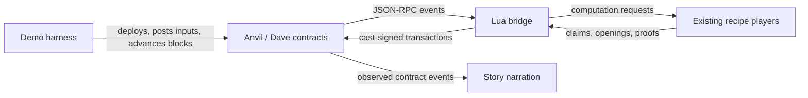

# PRT bridge implementation notes

The Docker recipe runs the two calculator epochs against Dave contracts on
Anvil, using the existing players from [prt.lua](prt.lua) and
[prt-dishonest.lua](prt-dishonest.lua). The image compiles patched contracts
during its build. Each invocation starts a fresh chain, deploys an application,
streams the two calculator epochs, settles their results, and records a story
from the contract events. Epoch zero stays empty, as in the normal Dave deployment.

These notes describe the implemented demo. The broader validator design and
contract event proposal remain in [prt-lua-bridge.md](prt-lua-bridge.md) and
[prt-lua-bridge-needs.md](prt-lua-bridge-needs.md).

## Responsibilities



The contracts own pairing, clocks, move validity, and tournament results. The
players own machine execution, computation hash trees, and proof generation.
The bridge translates contract events into player requests and transactions.
The harness owns deployment, actor selection, local mining, and narration.

| File | Responsibility |
| --- | --- |
| [Dockerfile.prt](../Dockerfile.prt) | Fetch, patch, and compile contracts; package the emulator and recipe |
| [prt-demo.sh](prt-demo.sh) | Prepare the run directory and keystores; start and stop Anvil |
| [prt-demo.lua](prt-demo.lua) | Deploy the application, deliver inputs, construct actors, drive the run, and narrate events |
| [prt-epoch.lua](prt-epoch.lua) | Deliver the ordered input stream, validate the seal, and start the dispute |
| [prt-bridge.lua](prt-bridge.lua) | Observe the dispute, derive eligible actions, call players, and submit responses |
| [prt-transactions.lua](prt-transactions.lua) | Journal signed candidates, reconcile exclusive account nonces, and replace pending transactions within fee limits |
| [prt-ethereum.lua](prt-ethereum.lua) | Decode ABI events, encode calls, translate coordinates, and serialize proofs |
| [prt-cast.lua](prt-cast.lua) | Make HTTP JSON-RPC requests and invoke cast for signing and submission |
| [prt.lua](prt.lua) | Execute inputs, build commitments and proofs, and save or load epoch checkpoints |
| [prt-dishonest.lua](prt-dishonest.lua) | Apply the existing dishonest strategies to the same player implementation |
| [prt-bridge-test.lua](prt-bridge-test.lua) | Check ABI encoding, process boundaries, event ordering, and scheduling |
| [prt-transactions-test.lua](prt-transactions-test.lua) | Exercise gas surges, dropped transactions, cancellation, journal reload, and nonce reorgs on Anvil |
| [prt-proof-test.lua](prt-proof-test.lua) | Compare native and deployed Solidity transition verification |

All actors currently run in one Lua process. Each has its own player object,
claim state, and signing account. These are the recipe players, with checkpoint
export at sealing and authenticated continuation from the previous last-output
proof. Their computation handlers are called directly, without a socket protocol
or the simulated referee's scheduling callbacks.

Each calculator epoch has eight actors: the honest player, a forger that
substitutes an input, a tamperer that corrupts execution, two fabulists that
alter claimed hashes, and three quitters that post claims and disconnect.
A separate keeper account handles cleanup and acceptance. The deployer and
input sender use account zero, players use accounts one through eight, and
the keeper uses account nine. The transaction journal has exclusive ownership
of player and keeper nonces across epochs. Only the honest
player exports a checkpoint, selected explicitly by the harness. The epoch
listener passes each actor's configured checkpoint destination to its player.

## Image build and patches

The Dockerfile fetches the Dave revision pinned by `DAVE_REF`, initializes its
`machine/step` submodule, and installs the locked Solidity dependencies. It does
not copy the separate local Dave worktree into the image.

Both patches live beside this file, in `doc/recipes/`:

- [prt-contracts.patch](prt-contracts.patch) applies to the Dave checkout. It
  contains the proposed event changes, two-level geometry, corresponding gas
  allocations and tests. Deployment uses the existing `DaveAppFactory`.
- [prt-step.patch](prt-step.patch) applies inside `machine/step`. It changes the
  generated `UARCH_PRISTINE_STATE_HASH` to match this emulator build. It changes
  no instruction semantics or verification rules.

The event proposal adds creation descriptors and bonds, ordered match
participants, computation coordinates and states, and the deadlines needed to
respond or clean up. `StandingChanged` exposes the current candidate and its
result and expiry boundaries. Gas allocations account for the changed events
and two-level geometry. The complete event diff and gas rationale are in
[the contract requirements](prt-lua-bridge-needs.md).

The build checks patch applicability with `git apply --check`, applies the
patches, records them in the container's Git checkouts, and compiles through
Dave's `just build-smart-contracts`. The final image contains the resulting
creation bytecode and ABI artifacts under `/opt/dave`, together with Foundry,
the emulator, Lua scripts, and the calculator machine snapshot. A run deploys
these packaged artifacts; it does not fetch or compile contracts at startup.

The Makefile builds the separate calibration target with the release emulator
for Dave's gas fixtures. The runtime target applies the recipe's step
patch and rebuilds the contracts against it. Calibration and recipe execution
therefore use their corresponding emulator and Solidity reset constants.

The configured root has height 62 and stride `2^30`; its leaf tournaments have
height 30 and stride 1. This matches `prt.new_geometry(10)`. The demo uses this
fixed geometry and checks creation descriptors when building claims.

The pristine-uarch patch is necessary because matching architecture IDs alone
does not guarantee matching reset states. Startup compares the deployed
verifier's pristine hash with the emulator's hash before playing.

## Deployment and InputBox

`prt-demo.sh` creates keystores from Anvil's public development mnemonic and
starts Anvil with funded accounts, the Prague hardfork, and RPC listening on
`127.0.0.1:8545` inside the container. The shell stops Anvil when the run exits.

`prt-demo.lua` reads each compiled artifact, appends ABI-encoded constructor
arguments to its creation bytecode, and submits a deployment through
`cast send --create`. It deploys:

1. The `Tournament` implementation and `CartesiStateTransition` verifier.
2. `CanonicalTournamentParametersProvider` and `MultiLevelTournamentFactory`.
3. The real Rollups `InputBox` and `ApplicationFactory`.
4. Dave's existing `DaveAppFactory`, then calls `newDaveApp`.

`newDaveApp` creates the Application and DaveConsensus, migrates the Application's
validator to that consensus, and renounces ownership in one transaction. The
harness learns both addresses from `DaveAppCreated`. There is no custom
application deployment helper. The calculator configures no withdrawals,
refund portals, or sentries; its staging period is ten blocks.

DaveConsensus immediately seals empty epoch zero. The honest bootstrap player
joins that tournament, proves its unchanged final machine and empty outputs
root, and stages the result. The keeper accepts it after the staging period.
Acceptance seals epoch one from the InputBox bounds at that moment. Every later
acceptance follows the same contract lifecycle.

## Streaming the two calculator epochs

| Dave epoch | Global input indices | Calculator payloads | New global output indices |
| --- | --- | --- | --- |
| 0 | none | empty bootstrap | none |
| 1 | 0-2 | `6*2^1024 + 3*2^512`, `invalid input`, `2^2048` | 0-1 |
| 2 | 3-5 | `(2^256 - 1) * (2^256 - 1)`, `scale=80; sqrt(2)`, `scale=100; 355/113` | 2-4 |

Each payload ends with a newline. The invalid input is rejected by the
calculator and adds no output. These are the two input groups from the README
calculator example, numbered one and two on Dave to preserve its empty epoch zero.

Before submitting a group's inputs, the harness constructs its players from
the preceding epoch's final machine and last-output proof. It submits each
payload through `InputBox.addInput(application, payload)` using the deployer
account, then waits for the input observation policy before delivering it. Inputs for epoch one arrive
while epoch zero awaits settlement; inputs for epoch two arrive while epoch one
awaits settlement. Thus input execution is complete before the corresponding
seal arrives; sealing finalizes commitments and output proofs.

The harness follows this order:

| Step | Computation and persistence | Chain progress |
| --- | --- | --- |
| Deploy | Seal the empty bootstrap player and save checkpoint 0 | DaveAppFactory creates the app and consensus; epoch 0 is sealed |
| Accumulate epoch 1 | Load checkpoint 0 and process inputs 0-2 as they become confirmed | Inputs enter InputBox while epoch 0 is unsettled |
| Settle epoch 0 | On the new seal, finalize epoch 1 and save checkpoint 1 | Stage and accept epoch 0; consensus seals epoch 1 |
| Accumulate epoch 2 | Load checkpoint 1 and process inputs 3-5 as they become confirmed | Inputs enter InputBox while epoch 1 is unsettled |
| Settle epoch 1 | On the new seal, finalize epoch 2 and save checkpoint 2 | Resolve epoch 1's disputes, stage, and accept; consensus seals epoch 2 |
| Settle epoch 2 | Check its accepted result against checkpoint 2 | Resolve epoch 2's disputes, stage, and accept; consensus seals empty epoch 3 |

The next player's execution starts from the preceding player's computed final
state before that state is accepted on-chain. The later seal must authenticate
that starting state. Accumulation and disputes overlap in the epoch lifecycle;
the demo drives their handlers synchronously in one Lua process.

`prt-epoch.lua` fetches InputBox and consensus logs through one block selected
by the input policy and
sorts them together by block and log index. For this application's `InputAdded`,
it requires consecutive global indices, writes the exact `input` bytes to a
file, and calls every player's `input_added(index - input_begin, filename)`.
The bytes include InputBox metadata. Proof encoding always uses these original
bytes, even when a dishonest player privately substitutes a forged input.

On `EpochSealed`, the listener checks the initial machine hash, preceding outputs
root, and both input bounds against its bootstrap and processed inputs. It calls
`epoch_sealed(input_count, checkpoint_directory)` on the honest player and seals
the other players without saving them. It then constructs the dispute bridge.
Logs after the seal cannot feed more inputs to that player. Repeated observations
check their already-applied prefix and never execute an input twice. A changed
input history aborts. Once sealed, the listener checks the saved seal's block
hash instead of extending its input history with later dispute events. A reorg
crossing this stronger stability boundary requires rebuilding the epoch;
ordinary dispute reorgs do not roll back the player.

## Machine and output continuation

The player owns checkpoint persistence. At sealing it stores its exact final
machine before closing execution. Each honest `epoch-N/checkpoint/` contains:

- The emulator's stored machine.
- `last-output-proof.json` when output history is nonempty.
- `epoch.json`, written last, with format version, initial and final machine
  hashes, outputs root and count, input count, and period geometry.

The last-output proof authenticates the global last leaf and lets the next
player reconstruct the output frontier. It is distinct from the machine proof
that binds the outputs root to the final machine for on-chain staging. If an
epoch produces no new outputs, it preserves the inherited last-output proof.
The empty bootstrap has no last-output proof.

`prt.load_epoch(directory)` reads and validates the manifest and output proof,
returning the arguments for `prt.new_player(dapp, label, last_output_proof)`.
Player construction loads and checks the machine hash, verifies that the proof
is the last output, and binds its root to the machine's CMIO tx buffer. A missing
proof is valid only when that buffer contains the empty output-tree root.

The bootstrap API for a saved checkpoint is:

```lua
local prt = require("prt")
local dapp, last_output_proof = prt.load_epoch(checkpoint_directory)
local player <close> = prt.new_player(dapp, "honest", last_output_proof)
```

The returned `dapp` contains the stored machine directory, its expected initial
hash, and the geometry. The bridge supplies this new epoch's global input lower
bound separately and converts incoming indices to player-local offsets.

A checkpoint initially records the player's computation. Later settlement must
agree with its final machine and outputs root. The demo checks that agreement
for every epoch. It also opens the epoch-two checkpoint in a fresh player and
seals an empty continuation, checking that the final machine and inherited proof
remain unchanged. Checkpoints bootstrap later epoch execution; they do not
restore a partially completed dispute. Signed transactions have a separate
journal described below.

## Event observation and scheduling

The bridge polls HTTP JSON-RPC. Input and dispute observation policies each
accept a nonnegative successor-block depth or the `safe`/`finalized` RPC tag.
A depth of four selects block 100 when the tip is 104. Missing consensus tags
fail rather than silently reading latest. Standalone listeners default to
`finalized` for inputs and four blocks for disputes. The Anvil recipe uses eight
and four blocks so the confirmation behavior is exercised explicitly.

Each dispute tick samples the live tip and selects its observation block,
retaining their heights separately. It requests `eth_getLogs` from block zero
through the selected observation block for the
factory, consensus, and root tournament. Each `NewInnerTournament` event adds
the child address to the set of streams fetched during the same observation.

Event signatures and layouts come from the compiled contract ABIs. The bridge
uses `cartesi.evmu` to decode indexed fields and event data, preserving full
256-bit coordinates. Its selectorless `encode_abi` and `decode_abi` operations
also encode constructor arguments and decode view results. The bridge sorts
logs by block and log index, rejects duplicate
positions. Removed logs, inconsistent block hashes, and a changed observation
hash discard the observation for retry. It also checks that the observed epoch seal binds the configured
root tournament to the expected initial machine hash.

Every tick reconstructs temporary tournament contexts, latest match events,
standings, and eligible actions from those logs. Later events replace or cancel
earlier actions. Player computations and local claims survive ticks; the
observed dispute state is reconstructed afresh. Computation caches are scoped
to the epoch's player and keyed by initial hash, base cycle, geometry, and kind.
A child recreated at the same address is bound to its replacement descriptor;
its contested states are checked again. Earlier computations remain reusable,
but an address association is dropped when the new match does not involve that
actor's parent claim.

| Observed information | Action derived by the bridge |
| --- | --- |
| Tournament creation, descriptor, and bond | Ask the player for a commitment and join |
| `MatchCreated` or `MatchAdvanced` | Request a bisection opening or divergence seal |
| `NewInnerTournament` | Build the relevant uarch commitment and join the child |
| `LeafMatchSealed` | Request and encode a state-transition proof |
| Emitted timeout boundaries | Claim a timeout win or eliminate the match |
| `StandingChanged` | Propagate a child result, stage the root result, or recover a bond |
| `MatchDeleted` | Cancel pending actions for that match |
| `EpochStaged` | Schedule acceptance after the configured staging period |
| Next `EpochSealed` | Confirm acceptance and check the stored final machine and outputs root |

The bridge uses the emitted response, timeout, result, and expiry boundaries.
Eligible windows include their start and exclude their end. Inclusion is tested
at the actual tip plus one, never at the delayed observation height plus one.
Confirmation lag consumes part of the available response window. It performs the
necessary interface translation, including selecting the responder from
bisection parity, but does not reproduce the contracts' clock discounts or
child-return refill accounting. A separate keeper account handles permissionless
cleanup without owning a player or computation claim.

## Proofs and transactions

The bridge calls the existing handlers for commitments, bisection openings,
divergence seals, transition proofs, and outputs-root proofs. `prt-ethereum.lua`
converts their results into ABI arguments and the Solidity witness format.
Transition witnesses combine input delivery when applicable, a uarch step,
and a reset at the appropriate boundary. Eight-byte accesses serialize their
complete authenticated 32-byte machine-tree leaf.

For a due action, the bridge prepares or reuses its response, rebuilds the
observation under the same policy, and requires the job and claim still to be
eligible. It rechecks the live inclusion window and the observation block hash.
`prt-transactions.lua` preflights against the current canonical execution state,
excluding its own pending transaction. It estimates gas with a 20% allowance,
bounded by the block gas limit. A call that first becomes valid in the next
block can be retried once that block arrives. `prt-cast.lua` invokes `cast mktx`
with explicit chain ID, nonce, gas, value, and both EIP-1559 fee fields, using
the actor's keystore and password file. It decodes the signed bytes with cast
and verifies the signer and every requested field before publication. Arguments
are shell-quoted; stdout and stderr are separated, and failures do not print
signer paths or endpoint configuration.

The bridge publishes at most one transaction per tick and never waits for
mining. Before each publication, the tracker writes all signed candidates,
their hashes, nonce, fee fields, job context, and observation to
`signed-transactions.json` using a temporary file and rename. It then publishes
the raw bytes with `eth_sendRawTransaction`. The journal is shared across epoch
coordinators and contains no signer credentials. Setup deployments and input
posting still use synchronous `cast send` on the separate deployer account.

The initial fee cap targets twice the current base fee plus the suggested tip,
within configured limits. The tip has a 1 gwei floor. If a transaction is still
pending after `PRT_FEE_BUMP_BLOCKS` blocks (default 3), the tracker replaces it
at the same nonce. Both fee fields increase by at least
`PRT_FEE_BUMP_PERCENT` (default 15, rounded up); current network estimates can
raise them further. `PRT_MAX_FEE_PER_GAS` defaults to 100000000000 wei (100 gwei),
and `PRT_MAX_PRIORITY_FEE_PER_GAS` to 10000000000 wei (10 gwei). These are demo
defaults, not a guarantee of timely inclusion. Hitting a ceiling reports the
blocked account while observation continues. The tracker retains the nonce and
can resume if fees fall. All four settings can be passed as Make variables.
If an affordable candidate is missing from the node at the fee ceiling, the
tracker can republish its identical signed bytes after revalidation, using the
same retry interval. This also recovers a crash before the original broadcast.

Every tick revalidates pending work against the dispute observation and actual
inclusion deadline. Useful pending work keeps its nonce; another action for
that signer cannot silently queue behind it. Obsolete work is immediately
replaced by an eligible action, or by a zero-value self-transfer cancellation.
A replacement that cannot be prepared or simulated falls back to cancellation.
Cancellation obeys the same fee ceilings and cannot revoke a transaction
already distributed to block producers. An older candidate can still win.
Signed candidates survive underpriced or ambiguous publication responses;
later attempts raise fees at the retained nonce.

Nonce reconciliation reads current chain state, independently of delayed event
observation. The journal retains a high-water nonce and every candidate even
after mining. If a reorg retreats the account nonce, every recorded nonce up to
that high-water mark must be consumed or replaced again. Future queued
candidates may race that reconciliation. The bridge does not defend a stale
claim merely because one of its own older transactions joined it.

A mined receipt suppresses duplicate publication while its event is awaiting
confirmation. The bridge checks the receipt's block hash; an orphaned receipt
releases that suppression. Completion still comes from observed events.
Anvil EVM rejections suppress an attempt only for the same live tip. A new tip
or replacement branch can make it eligible again. Other provider or transport
errors during observation, simulation, or signing abort the run; a publication
RPC rejection instead retains the signed attempt for retry. Dishonest moves can therefore
be rejected during preflight without broadcasting a reverting transaction.
Attempts and results are recorded in `transactions.jsonl`.

Transition proofs also run through the native verifier, using the emitted
agreed state and authoritative InputBox bytes. The bridge requires native
validity to agree with an `eth_call` pinned to the observed block hash. Proven
invalid witnesses are retained as invalid for that exact event and actor. A
later execution-state rejection can instead mean another actor already answered,
so it is not treated as a native/Solidity disagreement. Before the tournament, the proof
checks exercise input delivery, an ordinary step, an instruction reset, a late
period reset, and absent input. Each class also checks rejection of corrupted,
truncated, and trailing witnesses. This comparison exposed the pristine-uarch
mismatch; no verification check was removed to make resets pass.

## Mining, narration, and output

Anvil mines submitted transactions immediately. When no action is eligible,
the harness mines empty blocks so the next transaction can reach the next
emitted deadline or a receipt's observation boundary. It also mines the blocks
needed to confirm each input and epoch seal. Mining policy belongs to the
harness; the bridge never mines.

The harness narrates observed contract events into `story.txt`: joins,
pairings, child creation, isolated transitions, proof and timeout wins,
staging, acceptance, and bond recovery. Player labels are associated with their
submitted commitments; the contract events supply the outcomes and reasons.
Success requires the winning commitment to equal the honest player's claim,
the accepted machine and outputs root to match its checkpoint, and the root
bond to have been recovered. Staging alone does not complete an epoch.

Run from `machine-emulator-2`. These commands include the MacPorts path required
on Diego's macOS host and the workspace's Git environment:

```sh
PATH=/opt/local/bin:$PATH GIT_CONFIG_GLOBAL=/dev/null make -C doc build-prt-image
PATH=/opt/local/bin:$PATH GIT_CONFIG_GLOBAL=/dev/null make -C doc run-prt-bridge PRT_MODE=smoke
PATH=/opt/local/bin:$PATH GIT_CONFIG_GLOBAL=/dev/null make -C doc run-prt-bridge
```

If the matching emulator image has already been built, `EMULATOR_IMAGE_READY=yes`
on `build-prt-image` reuses it. The target still prepares uarch and builds the
docs and PRT runtime images.

The runtime image is `cartesi/machine-emulator-prt:devel`. Smoke mode uses one
honest player; the default story uses eight actors for each calculator epoch
and one honest player for bootstrap. Each run creates a fresh directory under
`doc/recipes/cache/prt-chain/`, or the absolute host path supplied through
`PRT_OUTPUT_DIR`. Top-level `story.txt` combines the three epoch stories and
`deployment.json` records deployed addresses. `signed-transactions.json` retains
the shared signer journals across epochs. Each `epoch-N/` retains its input
files, `epoch.json`, checkpoint, `story.txt`, `chain-logs.json`,
`transactions.jsonl`, and local claim artifacts. Calculator epochs also retain
`proof-vectors.json` with native/Solidity comparisons. The run also retains
`continuation-checkpoint/`, produced by reopening checkpoint 2 and sealing an
empty continuation. This is an off-chain persistence check, not another settled
epoch on Anvil.

For development, `make -C doc test-prt-bridge` mounts current recipe sources
into the existing runtime image. `run-prt-bridge` tests the packaged sources.
`make -C doc test-prt-bridge-unit` runs only the bridge fixtures.
`make -C doc test-prt-transactions` runs the controlled Anvil transaction tests;
`make -C doc run-prt-bridge PRT_MODE=transactions` runs their packaged version.

Both run targets accept `PRT_INPUT_CONFIRMATIONS` (default `8`) and
`PRT_DISPUTE_CONFIRMATIONS` (default `4`). Either also accepts `safe` or
`finalized`; depth zero explicitly uses the tip. These demo defaults are not
a quantified reorg-risk guarantee. Anvil's consensus tags do not reproduce
Ethereum's consensus process; numeric depths exercise delayed observation here.

`PRT_TEST_REORG=yes` injects a dispute reorg in epoch one. The harness snapshots
after its input context is established, waits until a child tournament is
observed (a root join in smoke mode), then restores the snapshot and mines a
replacement block. It retains the same players and bridge. The run must still
accept both calculator epochs and recover the root bonds. `epoch-1/reorg.json`
records the replaced tip and observation height.

## Validation results

On 2026-10-10, the transaction tracker passed the controlled Anvil tests in
`cache/prt-chain/run.8CLmbJ/`. The rebuilt image `81f9f42af710` passed the
same tests using its packaged scripts in `cache/prt-chain/run.Y1lMAY/`, and
its packaged two-epoch smoke story with a root-join reorg in
`cache/prt-chain/run.k09tgN/` (16, 21, and 16 observations for epochs zero,
one, and two).

The source-mounted eight-player run `cache/prt-chain/run.jgtOkG/` used input
depth eight and dispute depth four, and replaced an already-observed child
tournament in epoch one. The same players retained their computations and
both calculator epochs accepted the honest result and recovered their root
bonds. The final receipt-race and fee-ceiling refinements were separately
covered by the final Anvil fixtures and packaged smoke run.

| Epoch | Input range, end excluded | Cumulative outputs | Dispute observations | Invalid transition proofs rejected |
| --- | --- | --- | --- | --- |
| 0 | [0, 0) | 0 | 16 | 0 |
| 1 | [0, 3) | 2 | 1106 | 4 |
| 2 | [3, 6) | 5 | 819 | 4 |

All six calculator inputs waited eight blocks and were processed before their
on-chain seal. Both native/Solidity proof suites passed. Settlement matched the
checkpoint chain, and the final empty continuation retained the identical
last-output proof, final machine hash, output count, and outputs root.
Generated run directories are local artifacts, not source distribution files.

Validation also passed for:

- Five native/Solidity proof classes per calculator epoch, with corrupted,
  truncated, and trailing witnesses rejected.
- The bridge's independent Foundry ABI comparison, shell quoting and exit
  status checks, deadline boundaries, ordered input delivery, replay protection,
  mismatched seals, and changed input history.
- Confirmation depths and consensus tags without fallback, delayed replacement
  inputs, actual-tip deadline checks, receipt suppression and orphaning, retry
  after branch changes, and child replacement at the same address, including
  replacement matches in which the actor no longer participates.
- Anvil gas surges with mining disabled, same-nonce fee replacement, fee ceilings
  and subsequent recovery, dropped candidates, underpriced replacement errors,
  write-before-publication, cancellation and older-candidate races, reverted
  receipts, multi-nonce reorgs, process-crash journal reload, and identical-byte
  rebroadcast at the fee ceiling. Bridge fixtures also check that failed
  replacements do not strand obsolete work and useful pending jobs do not
  oscillate between competing actions from the same account.
- The existing PRT protocol suite, including the added checks for invalid,
  missing, or non-last continuation proofs and preservation through an empty
  epoch.
- Lua formatting and lint in the Makefile-managed toolchain, with no warnings.

To rerun the protocol suite or test edited bridge sources against the existing
image:

```sh
PATH=/opt/local/bin:$PATH GIT_CONFIG_GLOBAL=/dev/null make -C doc test-prt-protocol
PATH=/opt/local/bin:$PATH GIT_CONFIG_GLOBAL=/dev/null make -C doc test-prt-bridge
PATH=/opt/local/bin:$PATH GIT_CONFIG_GLOBAL=/dev/null make -C doc test-prt-transactions
```

## Current limits

The recipe streams and accepts the two fixed calculator groups. Accepting epoch
two also seals the normal empty epoch three; the demo stops there and shuts down
Anvil. It does not expose a persistent chain for interactive use or run an
unbounded epoch service. The configured zero-sentry settlement path waits the
full staging period; sentry-driven early acceptance is outside this demo.

The geometry, deployment, and actor population are fixed for this recipe.
Reading complete log histories is suitable for the disposable local chain;
log pagination and a general deployment-discovery interface are not implemented.
Saved claim files are diagnostic artifacts, not a complete dispute restart
protocol. The transaction tracker can reload its journal and reconcile pending
or orphaned candidates, but callers must restore the corresponding player and
observation context before submitting work. The demo does not yet implement
that complete relaunch flow. Its journal assumes one writer and process-crash
atomic rename; it does not provide an fsync-based power-loss guarantee. It keeps
all signed candidates for the bounded run, without journal compaction.
Reorgs crossing accepted input history or its seal
still fail closed. A confirmation depth is a policy, not absolute finality.

The packaged story validates the Lua players against the patched contracts. It
does not qualify the Rust node against this emulator's uarch pin; release-pinned
Rust proof fixtures require their own coordinated update.
