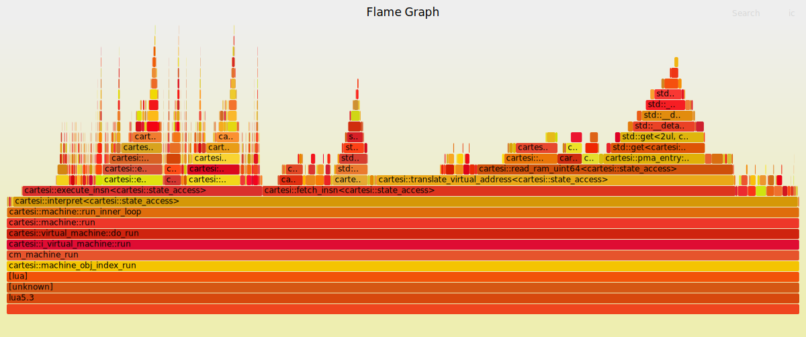
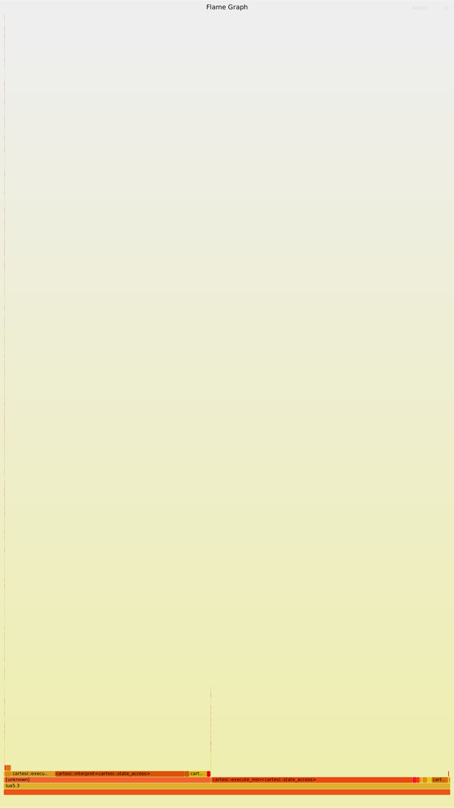

# Cartesi machine benchmarks

These benchmarks provide a general understanding of the cartesi machine performance in comparison to other emulators. The benchmarks used in the comparison are taken from [The Benchmarks Game](https://benchmarksgame-team.pages.debian.net/benchmarksgame/).

**RISC-V emulators we compare cartesi machine over**
- [tinyemu](https://bellard.org/tinyemu/)
- [qemu](https://www.qemu.org/)

**EVMs implementations we compare cartesi machine over**
- [Geth](https://github.com/ethereum/go-ethereum)
- [Openethereum](https://openethereum.org/)

**Benchmark programs used for the comparison w/ RISC-V emulators**
- [fasta](https://benchmarksgame-team.pages.debian.net/benchmarksgame/performance/fasta.html)

**Benchmarked programming languages**
- C
- Rust
- Python
- Go
- Java
- Lua
- Ruby
- NodeJS

## Quickstart

To execute the existent benchmarks you need to:

1. get necessary images
1. build benchmarks
1. put binary files inside the rootfs image
1. use the `run-comparison.py` script

### Getting images

Below you can find the links to the images necessary to execute the benchmarks. Most of them are just default cartesi images, however there are small differences between emulators. All images should be places to `/opt/cartesi/share/images`. Otherwise, you need to adjust paths in `bench.yml`.

#### Cartesi

To execute benchmarks on cartesi emulator you need:
- [rootfs](https://github.com/cartesi/image-rootfs/tags)
- [kernel with bbl](https://github.com/cartesi/image-kernel/tags)
- [rom](https://github.com/cartesi/machine-emulator-rom/tags)

**Note:** to build the kernel you may follow the [guide](https://github.com/cartesi/image-kernel#build), kernel with bbl will be called `linux-<version>-ctsi-<version>.bin`.

#### Tinyemu

To execute benchmarks on tinyemu emulator you need:
- [rootfs](https://github.com/cartesi/image-rootfs/tags)
- [kernel without bbl](https://github.com/cartesi/image-kernel/tags)
- [separate bbl image](https://bellard.org/tinyemu/jslinux-2019-12-21.tar.gz)

**Note:** to build the kernel you may follow the [guide](https://github.com/cartesi/image-kernel#build), kernel without bbl will be called `Image`.
**Note:** you need the `bbl64.bin` file from the __separate bbl image__ archive.

#### Qemu

To execute benchmarks on qemu emulator you need:
- [rootfs](https://github.com/cartesi/image-rootfs/tags)
- [kernel without bbl](https://github.com/cartesi/image-kernel/tags)

#### FP benchmarks

Some benchmarks require floating point enabled for `rom` and `kernel`. If that is the case for your benchmark, follow the instruction [here](https://github.com/cartesi/machine-emulator-sdk#building-sdk-with-support-to-float-point-emulation) to get the necessary artifacts.

#### NodeJS

NodeJS requires specific `rootfs` image that you can get [here](https://drive.google.com/drive/folders/1H1Sp7QBsg0P9cByGdCuYslXjATzJG-jh). NodeJS also requires FP images.

### Building the benchmarks

There is a Dockerfile for building the benchmarks that require compilation [here](Dockerfile).

#### C

**Note:** the `riscv64-cartesi-linux-gnu` toolchain should be in `$PATH`. You can use cartesi `toolchain` image to build this benchmark.

```bash
$ gcc fasta.c -o fasta_c
```

#### Rust

**Note:** the `riscv64-cartesi-linux-gnu` toolchain should be in `$PATH`. You can use cartesi `toolchain` image to build this benchmark.

```bash
$ export CC=riscv64-cartesi-linux-gnu-gcc
$ export CXX=riscv64-cartesi-linux-gnu-g++
$ export CFLAGS="-march=rv64ima -mabi=lp64"
$ cargo +nightly build -Z build-std=std,core,alloc,panic_abort,proc_macro --target riscv64ima-cartesi-linux-gnu.json --release
```

#### Python

No extra actions are required, the script `fasta.py` is ready to use.

#### Go

**Note:** to execute Go benchmark your rom and kernel should be compiled with floating-point support.

```bash
GOARCH=riscv64 go build fasta.go
```

#### Java

**Note:** to execute Java benchmark your rootfs should include the OpenJDK package (in the example below we used `OpenJDK 1.8`).

```bash
$ javac fasta.java -source 1.8 -target 1.8
```

#### NodeJS

No extra actions are required, the script `fasta.js` is ready to use.

### Copying binary files

```bash
$ mount -t ext2 <path to rootfs.ext2> <mount point>
$ mkdir <mount point>/benchmarks
$ cp <benchmarks that you need> <mount point>/benchmarks
```

Adjust the `bench.yml` config file in respect with the benchmark paths.

### Using the execution script

**Note:** for benchmarking you need the `hyperfine` utility to be installed on your machine.

```bash
$ ./run-comparison.py
```

## Adding new benchmarks

To add a new benchmark you need:
- compile the benchmark for risv64 (if applicable)
- copy the benchmark script/binary to the rootfs `/benchmarks` folder
- add the corresponding entry to the `bench.yml` config

When adding a new benchmark please make sure it takes at least a couple of seconds to execute. Otherwise, the results would be incorrect.

## Adding new emulators

To add a new emulator to the benchmarking process you need to:
1. make a corresponding entry in the `bench.yml` config;
1. implement `Emulator` python class.

### Adding entry

Here is an example for cartesi emulator:

```yml
emulators:
  cartesi:
    kernel: /opt/cartesi/share/images/kernel_bbl.bin
    rom: /opt/cartesi/share/images/rom.bin
    drive:/opt/cartesi/share/images/rootfs.ext2
    path: /opt/cartesi
```

You can specify any parameters, your python class will later process them.

### Implementing `Emulator` python class

There is a small python module for each benchmarked emulator. This module is reponsible for setting up the environment to execute the emulator and for processing the config entry. To add this file:

```bash
$ mkdir emulators/<emulator name>
$ touch emulators/<emulator name>/__init.py__
```

The directory name `<emulator name>` should be the same name you specified as an emulator name in the `bench.yml`.

Here is an example of `__init.py__` file for cartesi emulator:

```python
class Emulator:
    def __init__(self, config, bench_cmd):
        self.config = config
        self.bench_cmd = bench_cmd

    def build_command(self):
      return "{}/bin/cartesi-machine.lua --ram-image={} --rom-image={} --flash-drive=label:root,filename:{} -- '{}'".format(
              self.config['path'], self.config['kernel'], self.config['rom'], self.config['drive'], self.bench_cmd)

    def build_env(self):
        return {"LUA_CPATH": "{0}/lib/?.so;{0}/lib/lua/5.3/?.so;{0}/lib/lua/5.3/cartesi/?.so;".format(self.config['path']),
                "LUA_PATH": "{0}/bin/?.lua;{0}/share/lua/5.3/?.lua".format(self.config['path']),
                "LD_LIBRARY_PATH": "{}/lib/?.so".format(self.config['path'])}
```

- `config`: dictionary containing entries for the current emulator from the `build.yml`;
- `bench_cmd`: the command to be executed inside the emulator for benchmarking.

## Current results

Here you can find the current report on the cartesi machine comparison. The boot time is already substracted from the results in the table. See the spoiler below for the raw data. The benchmarks were performed on the cartesi machine with TLB support.

The machine used to execute the benchmarks: `16 cores Intel(R) Core(TM) i7-10875H CPU @ 2.30GHz, 64GB RAM`.

**Note:** no support for `rdtime` instruction in `tinyemu` and `qemu`, thus no measurements for Go benchmarks.

| **Language** | **cartesi**, s | **tinyemu**, s | **qemu**, s |
|:------------:|:--------------:|:--------------:|:-----------:|
| Java w/ JIT  | 38.0           | 19.3           | 8.5         |
| Java w/o JIT | 37.1           | 19.3           | 8.7         |
| C            | 3.2            | 1.8            | 1.9         |
| Python       | 49.1           | 26.7           | 14.3        |
| Go           | 23.1           | X              | X           |
| Rust         | 3.0            | 1.7            | 1.8         |
| Lua          | 6.0            | 3.7            | 3.5         |
| Ruby         | 77.6           | 40.2           | 17.0        |
| NodeJS       | 745.1          | 6.2            | 6.0         |

<details>
<summary>Raw data</summary>

```
Benchmark 1: cartesi: Boot time
  Time (mean ± σ):     714.2 ms ±   6.8 ms    [User: 705.1 ms, System: 8.7 ms]
  Range (min … max):   706.9 ms … 727.4 ms    10 runs
 
Benchmark 1: temu: Boot time
  Time (mean ± σ):     402.6 ms ±   2.1 ms    [User: 376.7 ms, System: 25.6 ms]
  Range (min … max):   400.9 ms … 406.7 ms    10 runs
 
Benchmark 1: qemu: Boot time
  Time (mean ± σ):     698.1 ms ±   3.2 ms    [User: 678.9 ms, System: 26.4 ms]
  Range (min … max):   693.9 ms … 704.2 ms    10 runs
 
Benchmark 1: cartesi: [fasta] Java w/ JIT
  Time (mean ± σ):     38.738 s ±  1.998 s    [User: 38.558 s, System: 0.164 s]
  Range (min … max):   37.683 s … 43.336 s    10 runs
 
Benchmark 1: temu: [fasta] Java w/ JIT
  Time (mean ± σ):     19.747 s ±  0.209 s    [User: 19.551 s, System: 0.179 s]
  Range (min … max):   19.498 s … 20.105 s    10 runs
 
Benchmark 1: qemu: [fasta] Java w/ JIT
  Time (mean ± σ):      9.268 s ±  0.135 s    [User: 8.980 s, System: 0.333 s]
  Range (min … max):    9.081 s …  9.555 s    10 runs
 
Benchmark 1: cartesi: [fasta] Java w/o JIT
  Time (mean ± σ):     37.840 s ±  1.272 s    [User: 37.627 s, System: 0.171 s]
  Range (min … max):   37.056 s … 41.370 s    10 runs
 
Benchmark 1: temu: [fasta] Java w/o JIT
  Time (mean ± σ):     19.747 s ±  0.255 s    [User: 19.562 s, System: 0.169 s]
  Range (min … max):   19.266 s … 20.185 s    10 runs
 
Benchmark 1: qemu: [fasta] Java w/o JIT
  Time (mean ± σ):      9.336 s ±  0.262 s    [User: 9.081 s, System: 0.305 s]
  Range (min … max):    9.035 s …  9.794 s    10 runs
 
Benchmark 1: cartesi: [fasta] C
  Time (mean ± σ):      3.922 s ±  0.016 s    [User: 3.801 s, System: 0.118 s]
  Range (min … max):    3.891 s …  3.944 s    10 runs
 
Benchmark 1: temu: [fasta] C
  Time (mean ± σ):      2.254 s ±  0.015 s    [User: 2.131 s, System: 0.122 s]
  Range (min … max):    2.230 s …  2.276 s    10 runs
 
Benchmark 1: qemu: [fasta] C
  Time (mean ± σ):      2.580 s ±  0.038 s    [User: 2.350 s, System: 0.227 s]
  Range (min … max):    2.521 s …  2.644 s    10 runs
 
Benchmark 1: cartesi: [fasta] Python
  Time (mean ± σ):     49.834 s ±  0.178 s    [User: 49.637 s, System: 0.129 s]
  Range (min … max):   49.568 s … 50.231 s    10 runs
 
Benchmark 1: temu: [fasta] Python
  Time (mean ± σ):     27.130 s ±  0.202 s    [User: 26.980 s, System: 0.135 s]
  Range (min … max):   26.806 s … 27.350 s    10 runs
 
Benchmark 1: qemu: [fasta] Python
  Time (mean ± σ):     15.010 s ±  0.689 s    [User: 14.785 s, System: 0.255 s]
  Range (min … max):   14.254 s … 16.236 s    10 runs
 
Benchmark 1: cartesi: [fasta] Rust
  Time (mean ± σ):      3.703 s ±  0.031 s    [User: 3.596 s, System: 0.106 s]
  Range (min … max):    3.678 s …  3.786 s    10 runs
 
Benchmark 1: temu: [fasta] Rust
  Time (mean ± σ):      2.136 s ±  0.013 s    [User: 2.004 s, System: 0.131 s]
  Range (min … max):    2.124 s …  2.166 s    10 runs
 
Benchmark 1: qemu: [fasta] Rust
  Time (mean ± σ):      2.562 s ±  0.062 s    [User: 2.338 s, System: 0.235 s]
  Range (min … max):    2.502 s …  2.692 s    10 runs
 
Benchmark 1: cartesi: [fasta] Lua
  Time (mean ± σ):     13.121 s ±  0.125 s    [User: 12.992 s, System: 0.116 s]
  Range (min … max):   13.015 s … 13.446 s    10 runs
 
Benchmark 1: temu: [fasta] Lua
  Time (mean ± σ):      6.717 s ±  0.068 s    [User: 6.570 s, System: 0.142 s]
  Range (min … max):    6.548 s …  6.796 s    10 runs
 
Benchmark 1: qemu: [fasta] Lua
  Time (mean ± σ):      4.195 s ±  0.059 s    [User: 3.976 s, System: 0.229 s]
  Range (min … max):    4.115 s …  4.278 s    10 runs
 
Benchmark 1: cartesi: [fasta] Ruby
  Time (mean ± σ):     78.347 s ±  0.524 s    [User: 78.173 s, System: 0.128 s]
  Range (min … max):   77.406 s … 79.146 s    10 runs
 
Benchmark 1: temu: [fasta] Ruby
  Time (mean ± σ):     40.609 s ±  0.307 s    [User: 40.457 s, System: 0.132 s]
  Range (min … max):   40.138 s … 41.205 s    10 runs
 
Benchmark 1: qemu: [fasta] Ruby
  Time (mean ± σ):     17.692 s ±  0.426 s    [User: 17.504 s, System: 0.235 s]
  Range (min … max):   16.998 s … 18.601 s    10 runs

Benchmark 1: cartesi: [fasta] Go
  Time (mean ± σ):     23.822 s ±  0.968 s    [User: 23.650 s, System: 0.136 s]
  Range (min … max):   23.051 s … 25.731 s    10 runs

Benchmark 1: temu: [fasta] NodeJS
  Time (mean ± σ):     18.904 s ±  0.999 s    [User: 17.700 s, System: 0.225 s]
  Range (min … max):   18.061 s … 20.869 s    10 runs
 
Benchmark 1: qemu: [fasta] NodeJS
  Time (mean ± σ):     15.976 s ±  0.353 s    [User: 14.761 s, System: 0.267 s]
  Range (min … max):   15.569 s … 16.834 s    10 runs

--------------

Benchmark 1: cartesi: Boot time
  Time (mean ± σ):     690.8 ms ±  10.5 ms    [User: 681.0 ms, System: 8.3 ms]
  Range (min … max):   682.8 ms … 716.9 ms    10 runs
 
Benchmark 1: temu: Boot time
  Time (mean ± σ):     553.5 ms ±  14.8 ms    [User: 509.9 ms, System: 40.8 ms]
  Range (min … max):   530.4 ms … 576.4 ms    10 runs
 
Benchmark 1: qemu: Boot time
  Time (mean ± σ):      1.012 s ±  0.033 s    [User: 0.966 s, System: 0.056 s]
  Range (min … max):    0.954 s …  1.057 s    10 runs
 
Benchmark 1: cartesi: [fasta] NodeJS
  Time (mean ± σ):     745.711 s ± 38.424 s    [User: 745.023 s, System: 0.042 s]
  Range (min … max):   722.532 s … 848.484 s    10 runs
 
Benchmark 1: temu: [fasta] NodeJS
  Time (mean ± σ):      6.738 s ±  0.011 s    [User: 5.649 s, System: 0.116 s]
  Range (min … max):    6.716 s …  6.751 s    10 runs
 
Benchmark 1: qemu: [fasta] NodeJS
  Time (mean ± σ):      7.083 s ±  0.008 s    [User: 5.995 s, System: 0.085 s]
  Range (min … max):    7.071 s …  7.095 s    10 runs
```
</details>

## EVM comparison

To compare cartesi machine over EVM implementations we use [blake2b hash](https://datatracker.ietf.org/doc/html/rfc7693). The data we hash is 65536 NULL's (`65536*0x0`).

| **Machine**  | **Time**, ms |
|:------------:|:------------:|
| Cartesi      | 31.5         |
| geth         | 271.9        |
| openethereum | 1649.6       |

<details>
<summary>Raw data</summary>

```
Benchmark 1: cartesi: Boot time
  Time (mean ± σ):     713.6 ms ±   3.6 ms    [User: 707.7 ms, System: 5.6 ms]
  Range (min … max):   708.6 ms … 718.4 ms    10 runs

Benchmark 1: cartesi: [blake2b] C
  Time (mean ± σ):     745.1 ms ±   9.6 ms    [User: 736.6 ms, System: 8.1 ms]
  Range (min … max):   735.6 ms … 767.9 ms    10 runs

Benchmark #1: openethereum-evm state-test /evm-benchmarks/benchmarks/micro/signextend.json (used for boot time)
  Time (mean ± σ):      16.5 ms ±   0.3 ms    [User: 9.2 ms, System: 7.3 ms]
  Range (min … max):    16.0 ms …  17.5 ms    179 runs

Benchmark #1: openethereum-evm state-test /evm-benchmarks/benchmarks/main/blake2b_shifts.json
  Time (mean ± σ):      1.920 s ±  0.029 s    [User: 1.875 s, System: 0.045 s]
  Range (min … max):    1.883 s …  1.960 s    10 runs

---- GETH
BenchmarkEVM/main/blake2b_shifts/London/3-16                   4         271922304 ns/op

---- OPENETHEREUM
Test: blake2b_shifts:london:0 (starting)
Output: 0x000000000000000000000000000000000000000000000000224bf59a700688ba000000000000000000000000000000000000000000000000a36d6ae418d9314d000000000000000000000000000000000000000000000000880adeb791ab854e000000000000000000000000000000000000000000000000bb697bc853d6f4c2000000000000000000000000000000000000000000000000faf9797b9902103f000000000000000000000000000000000000000000000000f8aa7b92b7340ec900000000000000000000000000000000000000000000000095e64259dcdb2be7000000000000000000000000000000000000000000000000ab45d93d04b14cd5
Gas used: e0d2c0f
Time: 1.649663177s
```

</details>

### Instructions to reproduce

To benchmark EVMs we used [State Transition Tests](https://buildmedia.readthedocs.org/media/pdf/ethereum-tests/latest/ethereum-tests.pdf).

#### Cartesi

[See this section](#using-the-execution-script).

#### Geth

To perform this benchmark on [Geth](https://github.com/ethereum/go-ethereum) we used the internal benchmarking tools:
```bash
$ cd <geth root>
$ go test -run - -bench='BenchmarkEVM/main/blake2b_shifts/.*' ./tests/...
```

#### Openethereum

To perform this benchmark, build the benchmark environment from the Dockerfile below, mount evm-benchmarks, then run:
```bash
/openethereum/target/x86_64-alpine-linux-musl/release/openethereum-evm state-test /evm-benchmarks/benchmarks/main/blake2b_shifts.json
```

<details>
<summary>Benchmark setup</summary>

```
FROM ethereum/solc:0.8.5-alpine as solc
FROM alpine:latest

ENV RUST_BACKTRACE 1

RUN apk add --no-cache \
    build-base \
    cargo \
    cmake \
    eudev-dev \
    linux-headers \
    perl \
    rust \
    git \
    boost-dev \
    hyperfine

RUN git clone --depth 1 https://github.com/openethereum/openethereum.git && \
    cd openethereum && \
    cargo build --release --features final --target x86_64-alpine-linux-musl --package evmbin && \
    strip target/x86_64-alpine-linux-musl/release/openethereum-evm

RUN git clone --depth 1 https://github.com/ipsilon/evm-benchmarks.git

COPY --from=solc /usr/local/bin/solc /usr/local/bin/solc
ENTRYPOINT ["/bin/ash"]

```
</details>

## Profiling

In order to help in the analyzing and optimization process, there is a possibility to build flamegraphs of the benchmarks CPU usage.

**Note:** for profiling you need the `perf` utility to be installed on your machine.  
**Note:** to enable the profiling possibility on your system you probably need to set the proper value in the `/proc/sys/kernel/perf_event_paranoid` file.

### Using the execution script

To create flamegraphs you need to use the `run-profiling.sh` script.

```bash
$ ./run-profiling.sh --kernel_bbl <path to kernel w/ bbl> --rootfs <path to the rootfs image> --rom <path to the rom image> --cartesi_path <path to the cartesi binary folder (should include the cartesi-machine.lua script as well)> --flamegraph <path to the flamegraph utility>
```

- **kernel_bbl**: kernel linked over the bbl bootloader (this is the default ctsi kernel)
- **rootfs**: the rootfs image path, the image should contain all enabled benchmarks in the `/benchmarks` folder
- **rom**: path to the rom image, remember to build it with FP support in case you need the corresponding benchmarks
- **cartesi_path**: path to the cartesi machine build folder, the benchmark script will try to find `cartesi-machine.lua` at the provided folder
- **flamegraph**: path to the [flamegraph utility](https://github.com/brendangregg/FlameGraph)

The script produces `SVG` files with the flamegraphs in the current directory.

### Adding new benchmarks

To add a new benchmark you need:
- compile the benchmark for riscv64 (if applicable)
- copy the benchmark script/binary to the rootfs `/benchmarks` folder
- add the corresponding line to the end of the `run-profiling.sh` script, e.g. `do_profile "cd /benchmarks && <benchmark execution>"`

### Current results

Here you can find the current report on the cartesi machine `fasta_c` benchmark profiling. `notlb` profiling was done for binaries w/ disabled optimizations (`-O0`), the tlb-enabled binaries were compiled with the default cartesi optimization flags (`-O2`). You can download and open these and other files to inspect them interactively [here](profiling/).

#### C w/o TLB



#### C w/ TLB


